# API Reference

<cite>
**Referenced Files in This Document**   
- [__init__.py](file://unstructured/__init__.py)
- [partition/api.py](file://unstructured/partition/api.py)
- [documents/elements.py](file://unstructured/documents/elements.py)
- [chunking/__init__.py](file://unstructured/chunking/__init__.py)
- [chunking/basic.py](file://unstructured/chunking/basic.py)
- [chunking/dispatch.py](file://unstructured/chunking/dispatch.py)
- [chunking/base.py](file://unstructured/chunking/base.py)
- [embed/__init__.py](file://unstructured/embed/__init__.py)
- [errors.py](file://unstructured/errors.py)
- [partition/text.py](file://unstructured/partition/text.py)
- [partition/pdf.py](file://unstructured/partition/pdf.py)
- [staging/base.py](file://unstructured/staging/base.py)
- [documents/mappings.py](file://unstructured/documents/mappings.py)
- [logger.py](file://unstructured/logger.py)
</cite>

## Table of Contents
1. [Introduction](#introduction)
2. [Module Structure and Import Paths](#module-structure-and-import-paths)
3. [Element Classes](#element-classes)
4. [Partitioning Functions](#partitioning-functions)
5. [Chunking Utilities](#chunking-utilities)
6. [Embedding Interfaces](#embedding-interfaces)
7. [Error Handling](#error-handling)
8. [Utility Functions](#utility-functions)
9. [Versioning and Backward Compatibility](#versioning-and-backward-compatibility)
10. [Performance Recommendations](#performance-recommendations)

## Introduction
The unstructured library provides a comprehensive API for processing and analyzing unstructured documents such as PDFs, text files, and images. This API reference documents all public modules, classes, functions, parameters, return values, and exceptions. The library focuses on three main areas: document partitioning, element classification, and text chunking. It supports various document formats and provides utilities for metadata extraction, coordinate system management, and content transformation. The API is designed to be extensible and configurable, allowing users to customize processing strategies based on their specific requirements.

## Module Structure and Import Paths
The unstructured library follows a modular structure with clearly defined import paths for different functionality areas. The main modules are organized under the `unstructured` package, with submodules for specific capabilities.

**Diagram sources** 
- [__init__.py](file://unstructured/__init__.py)
- [partition/__init__.py](file://unstructured/partition/__init__.py)
- [documents/__init__.py](file://unstructured/documents/__init__.py)
- [chunking/__init__.py](file://unstructured/chunking/__init__.py)
- [embed/__init__.py](file://unstructured/embed/__init__.py)

## Element Classes
The unstructured library defines a hierarchy of element classes that represent different types of content extracted from documents. These classes inherit from the base `Element` class and provide specific functionality for different content types.

### Element Base Class
The `Element` class is the base class for all document elements. It provides common functionality for element identification, metadata management, and coordinate system conversion.

**Diagram sources** 
- [documents/elements.py](file://unstructured/documents/elements.py#L662-L800)

### Element Metadata
The `ElementMetadata` class provides a flexible system for storing metadata associated with document elements. It supports various metadata fields and consolidation strategies for chunking operations.

```mermaid
classDiagram
class ElementMetadata {
+Optional[str] attached_to_filename
+Optional[list[str]] bcc_recipient
+Optional[int] category_depth
+Optional[list[str]] cc_recipient
+Optional[CoordinatesMetadata] coordinates
+Optional[DataSourceMetadata] data_source
+Optional[float] detection_class_prob
+Optional[str] detection_origin
+Optional[list[str]] emphasized_text_contents
+Optional[list[str]] emphasized_text_tags
+Optional[str] file_directory
+Optional[str] filename
+Optional[str] filetype
+Optional[str] header_footer_type
+Optional[str] image_base64
+Optional[str] image_mime_type
+Optional[str] image_url
+Optional[str] image_path
+Optional[bool] is_continuation
+Optional[list[str]] languages
+Optional[str] last_modified
+Optional[list[str]] link_texts
+Optional[list[str]] link_urls
+Optional[list[int]] link_start_indexes
+Optional[list[Link]] links
+Optional[str] email_message_id
+Optional[list[Element]] orig_elements
+Optional[str] page_name
+Optional[int] page_number
+Optional[str] parent_id
+Optional[list[str]] sent_from
+Optional[list[str]] sent_to
+Optional[str] signature
+Optional[str] subject
+Optional[str] text_as_html
+Optional[dict[str, str | int]] table_as_cells
+Optional[str] url
+Optional[list[FormKeyValuePair]] key_value_pairs
+FrozenSet[str] DEBUG_FIELD_NAMES
+__init__(attached_to_filename : Optional[str] = None, bcc_recipient : Optional[list[str]] = None, category_depth : Optional[int] = None, cc_recipient : Optional[list[str]] = None, coordinates : Optional[CoordinatesMetadata] = None, data_source : Optional[DataSourceMetadata] = None, detection_class_prob : Optional[float] = None, emphasized_text_contents : Optional[list[str]] = None, emphasized_text_tags : Optional[list[str]] = None, file_directory : Optional[str] = None, filename : Optional[str | pathlib.Path] = None, filetype : Optional[str] = None, header_footer_type : Optional[str] = None, image_base64 : Optional[str] = None, image_mime_type : Optional[str] = None, image_url : Optional[str] = None, image_path : Optional[str] = None, is_continuation : Optional[bool] = None, languages : Optional[list[str]] = None, last_modified : Optional[str] = None, link_start_indexes : Optional[list[int]] = None, link_texts : Optional[list[str]] = None, link_urls : Optional[list[str]] = None, links : Optional[list[Link]] = None, email_message_id : Optional[str] = None, orig_elements : Optional[list[Element]] = None, page_name : Optional[str] = None, page_number : Optional[int] = None, parent_id : Optional[str] = None, sent_from : Optional[list[str]] = None, sent_to : Optional[list[str]] = None, signature : Optional[str] = None, subject : Optional[str] = None, table_as_cells : Optional[dict[str, str | int]] = None, text_as_html : Optional[str] = None, url : Optional[str] = None)
+__eq__(other : object) -> bool
+__getattr__(attr_name : str) -> None
+__setattr__(__name : str, __value : Any) -> None
+from_dict(meta_dict : dict[str, Any]) -> ElementMetadata
+fields() -> MappingProxyType[str, Any]
+known_fields() -> MappingProxyType[str, Any]
+to_dict() -> dict[str, Any]
+update(other : ElementMetadata) -> None
}
class DataSourceMetadata {
+Optional[str] url
+Optional[str] version
+Optional[dict[str, Any]] record_locator
+Optional[str] date_created
+Optional[str] date_modified
+Optional[str] date_processed
+Optional[list[dict[str, Any]]] permissions_data
+to_dict() -> dict[str, Any]
+from_dict(input_dict : dict[str, Any]) -> DataSourceMetadata
}
class CoordinatesMetadata {
+Optional[Points] points
+Optional[CoordinateSystem] system
+__init__(points : Optional[Points], system : Optional[CoordinateSystem])
+__eq__(other : Any) -> bool
+to_dict() -> dict[str, Any]
+from_dict(input_dict : dict[str, Any]) -> CoordinatesMetadata
}
class Link {
+Optional[str] text
+str url
+int start_index
}
class FormKeyOrValue {
+str text
+Optional[str] layout_element_id
+Optional[Text] custom_element
}
class FormKeyValuePair {
+FormKeyOrValue key
+Optional[FormKeyOrValue] value
+float confidence
}
ElementMetadata <|-- DataSourceMetadata
ElementMetadata <|-- CoordinatesMetadata
ElementMetadata <|-- Link
ElementMetadata <|-- FormKeyOrValue
ElementMetadata <|-- FormKeyValuePair
```

**Diagram sources** 
- [documents/elements.py](file://unstructured/documents/elements.py#L30-L523)

### Element Type Enum
The `ElementType` class defines constants for different types of document elements. These constants are used to categorize elements and determine their processing behavior.

**Diagram sources** 
- [documents/elements.py](file://unstructured/documents/elements.py#L601-L660)

## Partitioning Functions
The partitioning functions in the unstructured library are responsible for parsing documents and extracting structured elements from unstructured content. These functions support various document formats and processing strategies.

### API Partitioning Functions
The `partition_via_api` and `partition_multiple_via_api` functions provide interfaces to the Unstructured REST API for document processing.

**Diagram sources** 
- [partition/api.py](file://unstructured/partition/api.py#L24-L342)

### Text Partitioning Function
The `partition_text` function processes plain text documents and extracts semantic elements such as titles, paragraphs, and lists.

**Diagram sources** 
- [partition/text.py](file://unstructured/partition/text.py#L42-L110)

### PDF Partitioning Function
The `partition_pdf` function processes PDF documents using various strategies including hi-res, OCR-only, and fast mode.

**Diagram sources** 
- [partition/pdf.py](file://unstructured/partition/pdf.py#L125-L248)

## Chunking Utilities
The chunking utilities in the unstructured library provide functionality for combining document elements into larger chunks for processing. These utilities support various chunking strategies and configuration options.

### Chunking Options
The `ChunkingOptions` class defines parameters for controlling the chunking behavior, including maximum chunk size, overlap, and text splitting.

**Diagram sources** 
- [chunking/base.py](file://unstructured/chunking/base.py#L54-L800)

### Basic Chunking Function
The `chunk_elements` function provides a baseline implementation of chunking that combines sequential elements into chunks based on specified text-length limits.

**Diagram sources** 
- [chunking/basic.py](file://unstructured/chunking/basic.py#L24-L92)

### Chunking Dispatch
The chunking dispatch system provides a mechanism for registering and invoking different chunking strategies by name.

```mermaid
classDiagram
class Chunker {
+__call__(elements : Iterable[Element], *, max_characters : Optional[int]) -> list[Element]
}
class add_chunking_strategy {
+add_chunking_strategy(func : Callable[_P, list[Element]]) -> Callable[_P, list[Element]]
}
class chunk {
+chunk(elements : Iterable[Element], chunking_strategy : str, **kwargs : Any) -> list[Element]
}
class register_chunking_strategy {
+register_chunking_strategy(name : str, chunker : Chunker) -> None
}
class _ChunkerSpec {
+chunker : Chunker
+kw_arg_names() -> tuple[str, ...]
}
```

**Diagram sources** 
- [chunking/dispatch.py](file://unstructured/chunking/dispatch.py#L24-L130)

## Embedding Interfaces
The embedding interfaces in the unstructured library provide a unified API for generating embeddings using various providers.

**Diagram sources** 
- [embed/__init__.py](file://unstructured/embed/__init__.py#L1-L28)

## Error Handling
The unstructured library defines custom exceptions for handling specific error conditions during document processing.

**Diagram sources** 
- [errors.py](file://unstructured/errors.py#L1-L16)

## Utility Functions
The unstructured library provides various utility functions for common operations such as metadata processing, coordinate calculations, and text analysis.

### Metadata Processing
The `process_metadata` decorator adds post-processing steps to document partitioners, including element ID assignment and metadata updates.

**Diagram sources** 
- [documents/elements.py](file://unstructured/documents/elements.py#L529-L598)

### Coordinate and Text Utilities
The library provides functions for calculating coordinate overlaps, identifying overlapping elements, and analyzing text content.

**Diagram sources** 
- [utils.py](file://unstructured/utils.py#L378-L749)

## Versioning and Backward Compatibility
The unstructured library maintains backward compatibility through careful versioning practices and deprecation warnings. The library follows semantic versioning principles, where major version increments indicate breaking changes, minor version increments indicate new features, and patch version increments indicate bug fixes.

When introducing changes that may affect backward compatibility, the library uses deprecation warnings to inform users of upcoming changes. For example, the `file_filename` parameter in the `partition_via_api` function is marked for deprecation in favor of the `metadata_filename` parameter.

The library also provides configuration options to control behavior changes, such as the `UNSTRUCTURED_INCLUDE_DEBUG_METADATA` environment variable that controls whether debug metadata fields are included in element metadata.

## Performance Recommendations
For high-throughput scenarios, the unstructured library provides several performance recommendations:

1. Use the appropriate partitioning strategy for your document type. For PDFs with extractable text, the "fast" strategy is significantly faster than the "hi_res" strategy.

2. When processing multiple documents, use batch processing functions like `partition_multiple_via_api` to reduce API overhead.

3. Configure chunking parameters appropriately for your use case. Setting `max_characters` to an appropriate value can reduce the number of chunks and improve processing efficiency.

4. Use the `include_orig_elements` parameter judiciously, as including original elements in chunk metadata increases memory usage.

5. For large documents, consider processing them in parallel using multiple threads or processes.

6. Cache frequently used models and resources to avoid repeated initialization overhead.

7. Use appropriate logging levels to minimize I/O overhead during processing.

8. When using the API, configure retry parameters appropriately to balance reliability and performance.