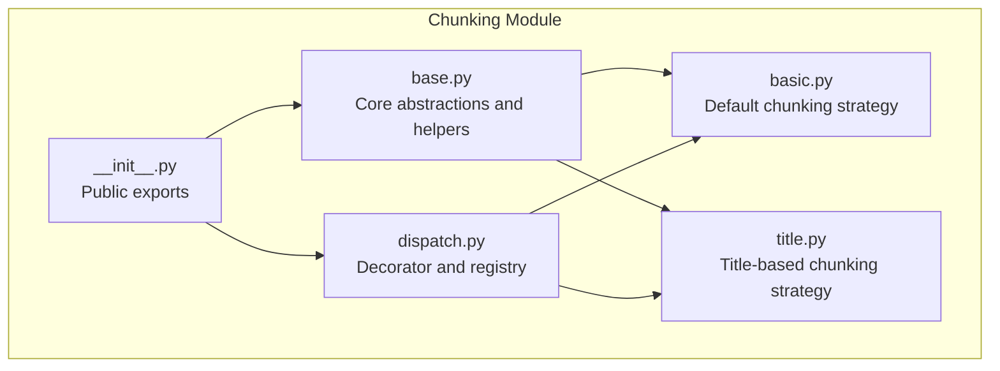
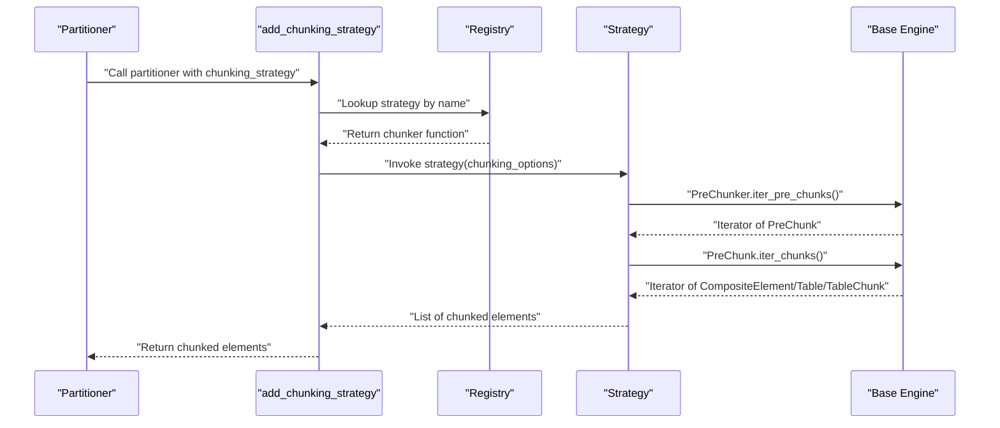
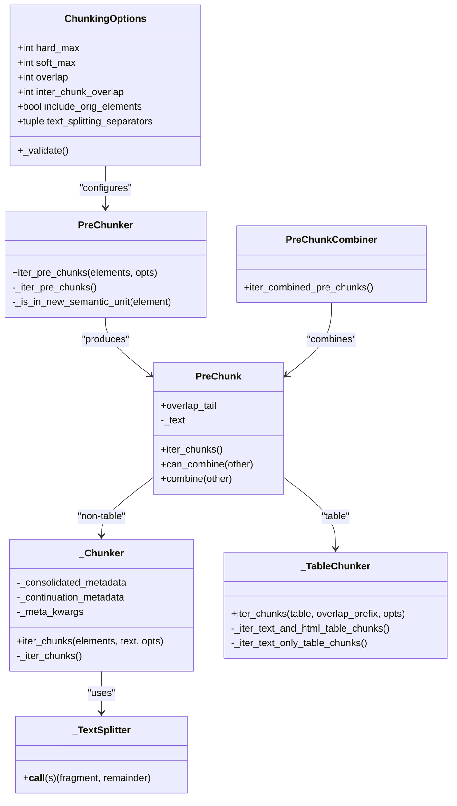
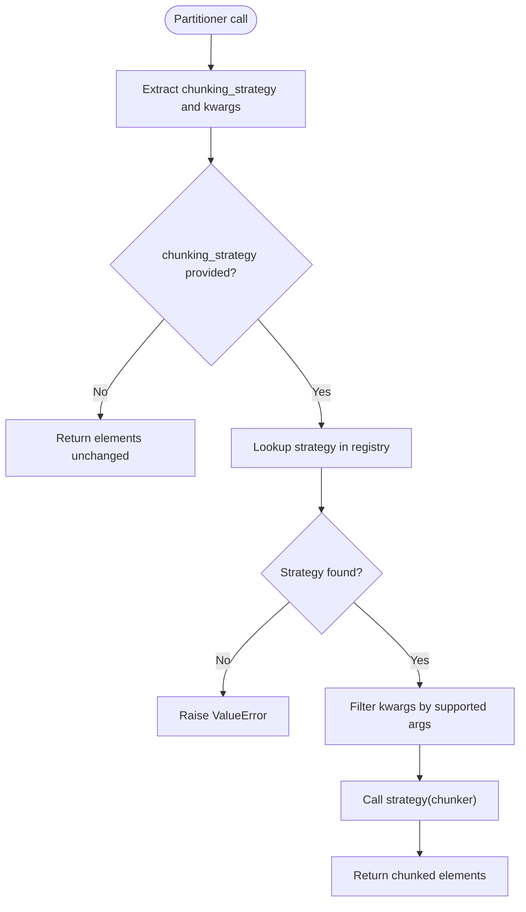
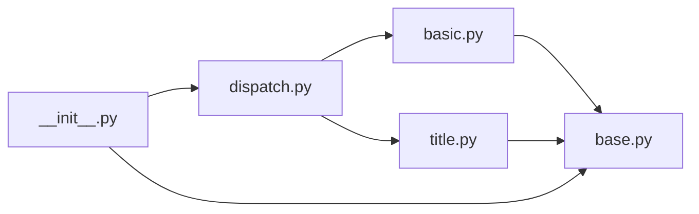

# Document Chunking

<cite>
**Referenced Files in This Document**
- [__init__.py](file://unstructured/chunking/__init__.py)
- [base.py](file://unstructured/chunking/base.py)
- [basic.py](file://unstructured/chunking/basic.py)
- [title.py](file://unstructured/chunking/title.py)
- [dispatch.py](file://unstructured/chunking/dispatch.py)
- [test_base.py](file://test_unstructured/chunking/test_base.py)
- [test_basic.py](file://test_unstructured/chunking/test_basic.py)
- [test_title.py](file://test_unstructured/chunking/test_title.py)
- [test_dispatch.py](file://test_unstructured/chunking/test_dispatch.py)
- [full_table_long_text_250.json](file://test_unstructured/testfiles/chunking/full_table_long_text_250.json)
- [long_text_table_200.json](file://test_unstructured/testfiles/chunking/long_text_table_200.json)
- [table_2000.json](file://test_unstructured/testfiles/chunking/table_2000.json)
</cite>

## Table of Contents
1. [Introduction](#introduction)
2. [Project Structure](#project-structure)
3. [Core Components](#core-components)
4. [Architecture Overview](#architecture-overview)
5. [Detailed Component Analysis](#detailed-component-analysis)
6. [Dependency Analysis](#dependency-analysis)
7. [Performance Considerations](#performance-considerations)
8. [Troubleshooting Guide](#troubleshooting-guide)
9. [Conclusion](#conclusion)
10. [Appendices](#appendices)

## Introduction
This document explains the document chunking strategies in the unstructured library. It covers the base chunking framework, the basic (default) chunking approach, and the title-based chunking strategy. It also documents the dispatch mechanism that routes chunking requests to the appropriate strategy, configuration options and parameters, return values, and practical guidance for integrating chunking into LLM workflows. Special attention is given to handling chunk boundaries, preserving context across chunks, and managing special elements like tables.

## Project Structure
The chunking subsystem is organized around a shared base with pluggable strategies and a dispatch layer:

- Base chunking engine: core abstractions, pre-chunking, text splitting, and helpers
- Basic chunking: default strategy that maximally fills chunks without enforcing semantic boundaries
- Title-based chunking: strategy that respects semantic boundaries (titles, pages) and combines small pre-chunks
- Dispatch: decorator and registry to route partitioned elements to a named chunking strategy

**Diagram sources**
- [base.py](file://unstructured/chunking/base.py#L1-L120)
- [basic.py](file://unstructured/chunking/basic.py#L1-L92)
- [title.py](file://unstructured/chunking/title.py#L1-L168)
- [dispatch.py](file://unstructured/chunking/dispatch.py#L1-L130)
- [__init__.py](file://unstructured/chunking/__init__.py#L1-L23)

**Section sources**
- [__init__.py](file://unstructured/chunking/__init__.py#L1-L23)
- [base.py](file://unstructured/chunking/base.py#L1-L120)
- [basic.py](file://unstructured/chunking/basic.py#L1-L92)
- [title.py](file://unstructured/chunking/title.py#L1-L168)
- [dispatch.py](file://unstructured/chunking/dispatch.py#L1-L130)

## Core Components
This section introduces the foundational building blocks used by all chunking strategies.

- ChunkingOptions: central configuration controlling chunk sizes, overlap, separators, and metadata handling
- PreChunker: builds pre-chunks by grouping elements while respecting semantic boundaries and size limits
- PreChunk: immutable staging unit for a chunk; exposes iteration to produce final chunks
- _Chunker and _TableChunker: transform pre-chunks into CompositeElement, Text, Table, or TableChunk outputs
- _TextSplitter: intelligent text splitter that respects separators and overlap
- HTML table splitters: synchronized text and HTML chunking for tables
- PreChunkCombiner and helpers: combine small pre-chunks under configurable thresholds

Key responsibilities:
- Respect size windows (hard and soft max)
- Preserve semantic boundaries (titles, pages) when enabled
- Minimize mid-text splits by pre-chunking
- Handle special elements (tables) with dedicated logic
- Manage overlap between chunks and metadata consolidation

**Section sources**
- [base.py](file://unstructured/chunking/base.py#L54-L214)
- [base.py](file://unstructured/chunking/base.py#L243-L303)
- [base.py](file://unstructured/chunking/base.py#L318-L422)
- [base.py](file://unstructured/chunking/base.py#L429-L520)
- [base.py](file://unstructured/chunking/base.py#L526-L688)
- [base.py](file://unstructured/chunking/base.py#L690-L802)
- [base.py](file://unstructured/chunking/base.py#L943-L1058)
- [base.py](file://unstructured/chunking/base.py#L1059-L1151)
- [base.py](file://unstructured/chunking/base.py#L1158-L1235)
- [base.py](file://unstructured/chunking/base.py#L1236-L1304)

## Architecture Overview
The chunking pipeline transforms a stream of parsed elements into a stream of chunked elements. Strategies differ in how they define semantic boundaries and combine pre-chunks.

**Diagram sources**
- [dispatch.py](file://unstructured/chunking/dispatch.py#L39-L102)
- [base.py](file://unstructured/chunking/base.py#L243-L303)
- [base.py](file://unstructured/chunking/base.py#L429-L520)

## Detailed Component Analysis

### Base Chunking Engine
The base engine defines the core chunking behavior and is reused by all strategies.

- ChunkingOptions
  - Controls hard_max (max_characters), soft_max (new_after_n_chars), overlap, overlap_all, separators, and metadata inclusion
  - Validates constraints (e.g., overlap < max_characters)
  - Provides computed properties for overlap behavior and text separators
- PreChunker
  - Iterates elements and forms pre-chunks respecting semantic boundaries and size limits
  - Honors special rules: Tables alone in a pre-chunk; oversized elements isolated; separators accounted for
- PreChunk
  - Immutable container for a group of elements with overlap handling
  - Exposes iter_chunks to produce CompositeElement, Table, or TableChunk
- _Chunker
  - Converts non-table pre-chunks into CompositeElement
  - Uses _TextSplitter to split oversized elements
  - Consolidates metadata across elements according to consolidation strategies
- _TableChunker
  - Handles table pre-chunks with specialized splitting
  - Produces Table or TableChunk depending on presence of HTML and window size
  - Synchronizes text and HTML across splits
- _TextSplitter
  - Splits text on preferred separators, falling back to arbitrary character boundaries
  - Respects overlap and ensures progress
- HTML table splitters
  - Row and cell accumulators split tables into subtables while keeping text and HTML synchronized
- PreChunkCombiner and _PreChunkAccumulator
  - Combine small pre-chunks when they fit under combine_text_under_n_chars

**Diagram sources**
- [base.py](file://unstructured/chunking/base.py#L54-L214)
- [base.py](file://unstructured/chunking/base.py#L243-L303)
- [base.py](file://unstructured/chunking/base.py#L429-L520)
- [base.py](file://unstructured/chunking/base.py#L526-L688)
- [base.py](file://unstructured/chunking/base.py#L690-L802)
- [base.py](file://unstructured/chunking/base.py#L943-L1058)
- [base.py](file://unstructured/chunking/base.py#L1158-L1235)

**Section sources**
- [base.py](file://unstructured/chunking/base.py#L54-L214)
- [base.py](file://unstructured/chunking/base.py#L243-L303)
- [base.py](file://unstructured/chunking/base.py#L318-L422)
- [base.py](file://unstructured/chunking/base.py#L429-L520)
- [base.py](file://unstructured/chunking/base.py#L526-L688)
- [base.py](file://unstructured/chunking/base.py#L690-L802)
- [base.py](file://unstructured/chunking/base.py#L943-L1058)
- [base.py](file://unstructured/chunking/base.py#L1059-L1151)
- [base.py](file://unstructured/chunking/base.py#L1158-L1235)
- [base.py](file://unstructured/chunking/base.py#L1236-L1304)

### Basic Chunking Strategy
Basic chunking is the default strategy that:
- Maximally fills each chunk with sequential elements
- Isolates oversized elements and divides them by text-splitting
- Applies overlap when requested

Key parameters:
- include_orig_elements: include original elements in chunk metadata
- max_characters: hard maximum chunk length
- new_after_n_chars: preferred soft maximum length
- overlap: overlap length for mid-text splits
- overlap_all: apply overlap between normal pre-chunk boundaries

Behavior:
- Elements are grouped into pre-chunks respecting size limits
- Oversized elements are isolated and split
- Metadata consolidation follows consolidation strategies

Integration:
- Works standalone or via the dispatch decorator

**Section sources**
- [basic.py](file://unstructured/chunking/basic.py#L1-L92)
- [test_basic.py](file://test_unstructured/chunking/test_basic.py#L1-L169)

### Title-Based Chunking Strategy
Title-based chunking adds semantic boundaries:
- Respects section boundaries indicated by Title elements
- Optionally respects page boundaries when multipage_sections is False
- Combines small pre-chunks under combine_text_under_n_chars

Key parameters:
- combine_text_under_n_chars: threshold to combine undersized pre-chunks
- include_orig_elements: include original elements in chunk metadata
- max_characters: hard maximum chunk length
- multipage_sections: allow sections to span pages
- new_after_n_chars: preferred soft maximum length
- overlap: overlap length for mid-text splits
- overlap_all: apply overlap between normal pre-chunk boundaries

Behavior:
- Uses boundary predicates (is_title, is_on_next_page) to segment pre-chunks
- Combines adjacent small pre-chunks when they fit under the threshold
- Preserves semantic boundaries across chunks
- Handles tables with specialized splitting

**Section sources**
- [title.py](file://unstructured/chunking/title.py#L1-L168)
- [test_title.py](file://test_unstructured/chunking/test_title.py#L1-L542)

### Dispatch Mechanism
The dispatch layer enables attaching chunking to partitioners via a decorator and routing by name.

- add_chunking_strategy: wraps a partitioner to conditionally chunk based on chunking_strategy
- chunk: resolves strategy name to a registered chunker and forwards only supported kwargs
- register_chunking_strategy: registers custom chunkers by name
- Registry: maps strategy names to chunker specs

**Diagram sources**
- [dispatch.py](file://unstructured/chunking/dispatch.py#L39-L102)

**Section sources**
- [dispatch.py](file://unstructured/chunking/dispatch.py#L1-L130)
- [test_dispatch.py](file://test_unstructured/chunking/test_dispatch.py#L1-L93)

## Dependency Analysis
The chunking module exhibits low coupling and high cohesion:
- Strategies depend on base abstractions (ChunkingOptions, PreChunker, PreChunk)
- Dispatch depends on strategy functions and inspects their signatures
- Tests validate behavior across strategies and integration points

**Diagram sources**
- [basic.py](file://unstructured/chunking/basic.py#L1-L92)
- [title.py](file://unstructured/chunking/title.py#L1-L168)
- [dispatch.py](file://unstructured/chunking/dispatch.py#L1-L130)
- [base.py](file://unstructured/chunking/base.py#L1-L120)
- [__init__.py](file://unstructured/chunking/__init__.py#L1-L23)

**Section sources**
- [basic.py](file://unstructured/chunking/basic.py#L1-L92)
- [title.py](file://unstructured/chunking/title.py#L1-L168)
- [dispatch.py](file://unstructured/chunking/dispatch.py#L1-L130)
- [base.py](file://unstructured/chunking/base.py#L1-L120)
- [__init__.py](file://unstructured/chunking/__init__.py#L1-L23)

## Performance Considerations
- Pre-chunking minimizes mid-text splits by measuring combined lengths and separators
- Overlap is only applied where beneficial; overlap_all increases cross-boundary contamination
- Table splitting avoids excessive fragmentation by preferring row-wise splits and synchronizing HTML
- Metadata consolidation reduces duplication and preserves only supported fields
- Separator computation accounts for inter-element spacing to avoid overestimation

[No sources needed since this section provides general guidance]

## Troubleshooting Guide
Common issues and resolutions:

- Chunk boundary determination
  - Use multipage_sections to control whether sections can span pages
  - Adjust combine_text_under_n_chars to mitigate over-chunking due to frequent titles
- Preserving context across chunks
  - Configure overlap and overlap_all appropriately; overlap applies to mid-text splits by default
  - Use include_orig_elements to retain original element provenance for debugging
- Handling special elements (tables)
  - Tables are isolated in pre-chunks; oversized tables are split into TableChunk with synchronized text and HTML
  - When max_characters is small, fallback to text-only splitting prevents excessive HTML overhead
- Validation failures
  - Ensure overlap < max_characters and new_after_n_chars >= 0
  - For title-based chunking, combine_text_under_n_chars must not exceed max_characters

**Section sources**
- [base.py](file://unstructured/chunking/base.py#L215-L237)
- [title.py](file://unstructured/chunking/title.py#L146-L168)
- [test_title.py](file://test_unstructured/chunking/test_title.py#L475-L542)

## Conclusion
The unstructured chunking subsystem provides a flexible, extensible foundation for splitting parsed document elements into manageable chunks. The base engine enforces size constraints, preserves semantic boundaries when requested, and handles special elements like tables with care. The dispatch mechanism integrates chunking seamlessly with partitioners, while configuration options allow tuning for different document types and LLM workflows.

[No sources needed since this section summarizes without analyzing specific files]

## Appendices

### Configuration Options and Parameters
- ChunkingOptions
  - max_characters: hard maximum chunk length
  - new_after_n_chars: preferred soft maximum length
  - combine_text_under_n_chars: threshold to combine small pre-chunks
  - overlap: overlap length for mid-text splits
  - overlap_all: apply overlap between normal pre-chunk boundaries
  - include_orig_elements: include original elements in chunk metadata
  - text_splitting_separators: preferred separators for text splitting
- Basic chunking
  - include_orig_elements, max_characters, new_after_n_chars, overlap, overlap_all
- Title-based chunking
  - include_orig_elements, max_characters, new_after_n_chars, overlap, overlap_all, combine_text_under_n_chars, multipage_sections

Return values:
- List of Element instances: CompositeElement, Table, or TableChunk

**Section sources**
- [base.py](file://unstructured/chunking/base.py#L54-L214)
- [basic.py](file://unstructured/chunking/basic.py#L24-L91)
- [title.py](file://unstructured/chunking/title.py#L23-L111)

### Integration with LLM Workflows
- Attach chunking to partitioners using the add_chunking_strategy decorator
- Choose strategies based on document structure:
  - Basic for uniform text documents
  - Title-based for hierarchical documents (articles, reports)
- Control chunk sizes and context preservation via max_characters and overlap
- Preserve provenance with include_orig_elements for debugging and retrieval

**Section sources**
- [dispatch.py](file://unstructured/chunking/dispatch.py#L39-L102)
- [test_basic.py](file://test_unstructured/chunking/test_basic.py#L1-L169)
- [test_title.py](file://test_unstructured/chunking/test_title.py#L1-L200)

### Handling Tables and Special Elements
- Table pre-chunks are isolated and split into TableChunk when oversized
- When HTML is available, text and HTML are kept synchronized across splits
- Small tables or combinations that fit are emitted as a single Table or CompositeElement

**Section sources**
- [base.py](file://unstructured/chunking/base.py#L690-L802)
- [test_title.py](file://test_unstructured/chunking/test_title.py#L38-L110)
- [table_2000.json](file://test_unstructured/testfiles/chunking/table_2000.json#L1-L18)
- [long_text_table_200.json](file://test_unstructured/testfiles/chunking/long_text_table_200.json#L1-L33)
- [full_table_long_text_250.json](file://test_unstructured/testfiles/chunking/full_table_long_text_250.json#L1-L33)