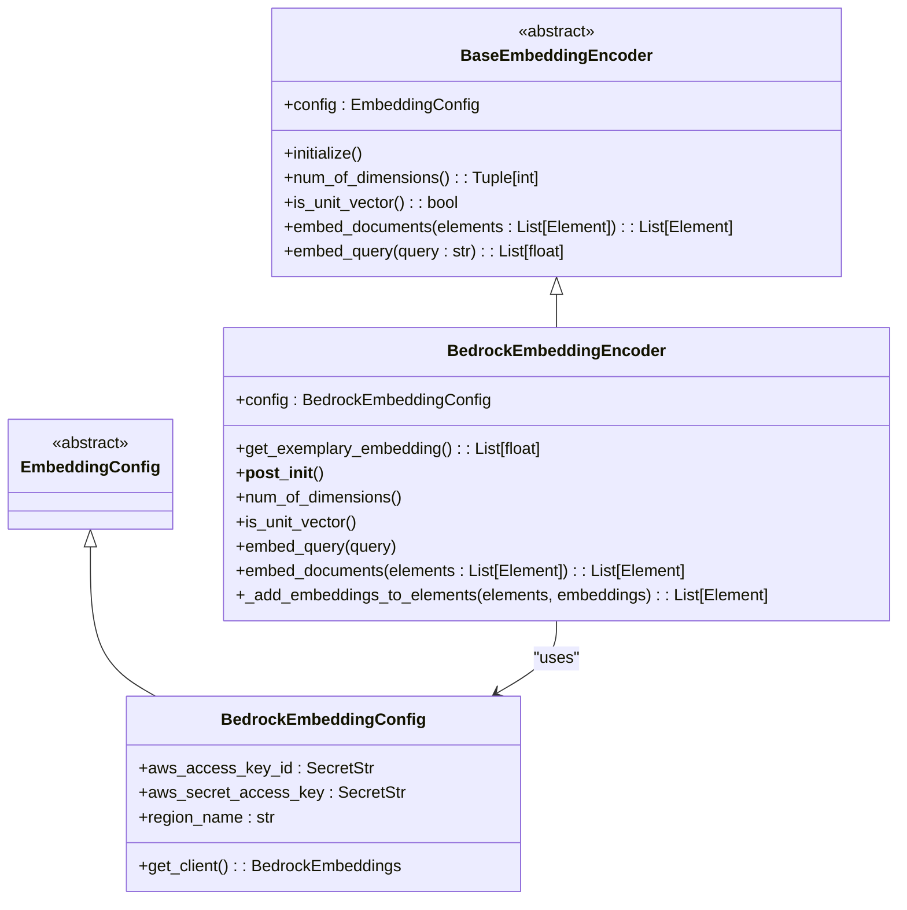
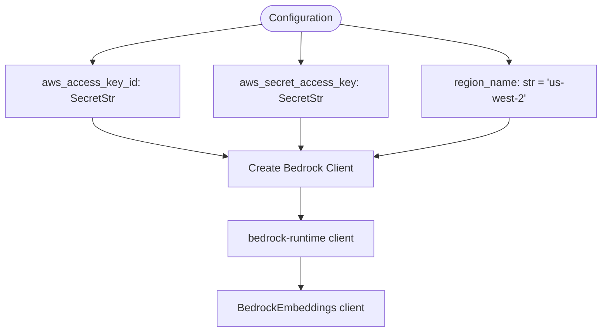
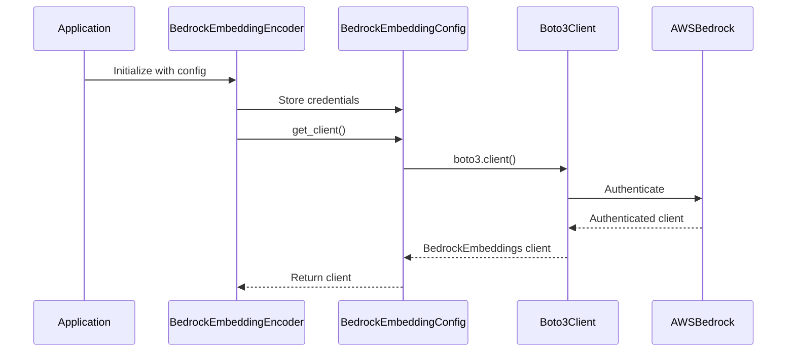
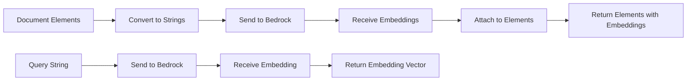
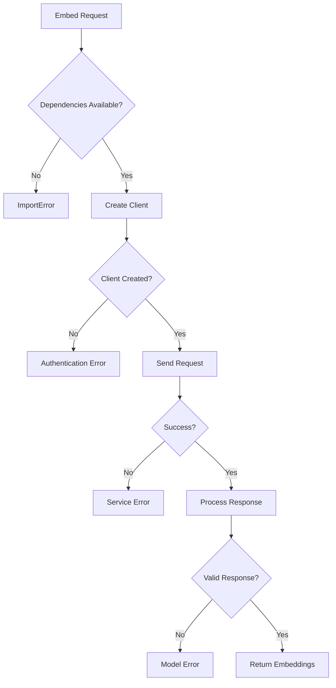

# Bedrock Embedding Integration

<cite>
**Referenced Files in This Document**   
- [bedrock.py](file://unstructured/embed/bedrock.py)
- [interfaces.py](file://unstructured/embed/interfaces.py)
- [local-embed-bedrock.sh](file://test_unstructured_ingest/src/local-embed-bedrock.sh)
- [__init__.py](file://unstructured/embed/__init__.py)
</cite>

## Table of Contents
1. [Introduction](#introduction)
2. [Core Components](#core-components)
3. [Configuration Parameters](#configuration-parameters)
4. [Authentication Methods](#authentication-methods)
5. [Request/Response Schemas](#requestresponse-schemas)
6. [Rate Limiting Considerations](#rate-limiting-considerations)
7. [Error Handling Strategies](#error-handling-strategies)
8. [Usage Examples](#usage-examples)
9. [Performance Considerations](#performance-considerations)
10. [Troubleshooting Guide](#troubleshooting-guide)
11. [Integration with AWS Infrastructure](#integration-with-aws-infrastructure)
12. [Best Practices for Production Deployment](#best-practices-for-production-deployment)

## Introduction
The unstructured library provides integration with AWS Bedrock for generating embeddings from various document types. This documentation details the implementation of the BedrockEmbeddingEncoder class, configuration options, authentication methods, and best practices for using AWS Bedrock embeddings in production environments.

## Core Components

The AWS Bedrock embedding integration in the unstructured library is implemented through two primary components: the `BedrockEmbeddingConfig` class and the `BedrockEmbeddingEncoder` class. These components work together to provide a seamless interface for generating embeddings using AWS Bedrock's foundation models.

The `BedrockEmbeddingEncoder` class implements the `BaseEmbeddingEncoder` interface, which defines the contract for all embedding providers in the unstructured library. This ensures consistency across different embedding providers while allowing for provider-specific configuration options.



**Diagram sources**
- [bedrock.py](file://unstructured/embed/bedrock.py#L17-L77)
- [interfaces.py](file://unstructured/embed/interfaces.py#L10-L40)

**Section sources**
- [bedrock.py](file://unstructured/embed/bedrock.py#L1-L77)

## Configuration Parameters

The Bedrock embedding integration supports several configuration parameters that control the behavior of the embedding process. These parameters are defined in the `BedrockEmbeddingConfig` class and include:

- **aws_access_key_id**: AWS access key ID for authentication (required)
- **aws_secret_access_key**: AWS secret access key for authentication (required)
- **region_name**: AWS region for the Bedrock service (optional, defaults to "us-west-2")

The configuration parameters are validated and used to create a Bedrock client through the `get_client()` method, which initializes a boto3 client for the Bedrock runtime service with the specified credentials and region.



**Diagram sources**
- [bedrock.py](file://unstructured/embed/bedrock.py#L17-L40)

**Section sources**
- [bedrock.py](file://unstructured/embed/bedrock.py#L17-L40)

## Authentication Methods

The unstructured library supports AWS authentication using access keys and secret access keys through the `BedrockEmbeddingConfig` class. The authentication credentials are passed as `SecretStr` objects from Pydantic to ensure they are handled securely and not accidentally exposed in logs or error messages.

When the `get_client()` method is called, it uses boto3 to create a client for the Bedrock runtime service with the provided credentials. The credentials are retrieved using the `get_secret_value()` method to ensure they remain protected.

For production deployments, it's recommended to use IAM roles with temporary credentials rather than long-term access keys. This can be achieved by configuring AWS credentials through environment variables, AWS credentials file, or IAM roles when running on AWS infrastructure.



**Diagram sources**
- [bedrock.py](file://unstructured/embed/bedrock.py#L31-L39)

**Section sources**
- [bedrock.py](file://unstructured/embed/bedrock.py#L17-L40)

## Request/Response Schemas

The Bedrock embedding integration follows a consistent request/response pattern for both document and query embeddings. When embedding documents, the system converts each document element to a string representation and sends it to the Bedrock service. The response contains the embedding vectors, which are then attached to the original elements.

For query embeddings, the input is a single string query, and the response is a single embedding vector. The embedding vectors are returned as NumPy arrays and converted to Python lists for consistency.

The request/response flow includes the following steps:
1. Document elements are converted to strings
2. Strings are sent to the Bedrock service for embedding
3. Embedding vectors are received from the service
4. Vectors are attached to the original elements
5. Elements with embeddings are returned



**Diagram sources**
- [bedrock.py](file://unstructured/embed/bedrock.py#L60-L76)

**Section sources**
- [bedrock.py](file://unstructured/embed/bedrock.py#L60-L76)

## Rate Limiting Considerations

While the unstructured library does not implement explicit rate limiting for AWS Bedrock requests, it's important to be aware of AWS Bedrock's service quotas and rate limits. AWS Bedrock has request rate limits that vary by region and model, and exceeding these limits will result in throttling errors.

To avoid rate limiting issues:
- Implement exponential backoff retry logic for failed requests
- Monitor your AWS Bedrock service quotas and request patterns
- Consider using AWS SDK's built-in retry mechanisms
- Distribute requests across multiple regions if needed
- Use asynchronous processing for large batches of documents

The library's design allows for integration with external rate limiting and retry mechanisms, making it possible to implement custom strategies based on your specific requirements.

## Error Handling Strategies

The Bedrock embedding integration includes several error handling mechanisms to ensure robust operation:

1. **Dependency validation**: The `@requires_dependencies` decorator ensures that required packages (boto3, numpy, langchain_community) are available before attempting to use the Bedrock service.

2. **Input validation**: The `_add_embeddings_to_elements` method includes an assertion to ensure that the number of elements matches the number of embeddings received from the service.

3. **Exception propagation**: Errors from the underlying AWS SDK and LangChain integration are propagated to the calling code, allowing for custom error handling strategies.

Common error scenarios and their handling:
- **Authentication errors**: Raised when invalid credentials are provided
- **Service unavailable**: Raised when the Bedrock service is unreachable
- **Rate limiting**: Raised when request limits are exceeded
- **Model errors**: Raised when the specified model is not available or encounters processing errors



**Diagram sources**
- [bedrock.py](file://unstructured/embed/bedrock.py#L22-L39)

**Section sources**
- [bedrock.py](file://unstructured/embed/bedrock.py#L22-L39)

## Usage Examples

The Bedrock embedding integration can be used with various document types supported by the unstructured library. Here are practical examples of configuring and using Bedrock embeddings:

### Basic Configuration
```python
from unstructured.embed.bedrock import BedrockEmbeddingConfig, BedrockEmbeddingEncoder

config = BedrockEmbeddingConfig(
    aws_access_key_id="your-access-key",
    aws_secret_access_key="your-secret-key",
    region_name="us-west-2"
)

encoder = BedrockEmbeddingEncoder(config=config)
```

### Embedding Documents
```python
from unstructured.partition.auto import partition

# Partition a document
elements = partition("example-docs/book-war-and-peace-1p.txt")

# Generate embeddings
elements_with_embeddings = encoder.embed_documents(elements)
```

### Embedding Queries
```python
# Generate embedding for a query
query_embedding = encoder.embed_query("What is the main theme of War and Peace?")
```

The integration supports all document types that can be processed by the unstructured library, including text files, PDFs, HTML, and various office document formats.

**Section sources**
- [bedrock.py](file://unstructured/embed/bedrock.py#L64-L76)
- [local-embed-bedrock.sh](file://test_unstructured_ingest/src/local-embed-bedrock.sh#L33-L46)

## Performance Considerations

Several performance factors should be considered when using AWS Bedrock embeddings:

### Regional Endpoint Selection
- Choose the AWS region closest to your application to minimize latency
- Consider the availability of specific foundation models in different regions
- Use the `region_name` parameter to specify the desired region

### Latency Optimization
- Batch multiple documents in a single request when possible
- Use asynchronous processing for large document collections
- Cache embeddings for frequently accessed documents
- Consider using local embeddings for development and testing

### Cost Management
- Monitor your AWS Bedrock usage and costs
- Choose appropriate models based on your accuracy and cost requirements
- Implement caching to avoid redundant embedding generation
- Use smaller models for less complex tasks

The default region is set to "us-west-2", but this can be changed based on your specific requirements and the availability of foundation models.

**Section sources**
- [bedrock.py](file://unstructured/embed/bedrock.py#L20)
- [bedrock.py](file://unstructured/embed/bedrock.py#L31-L35)

## Troubleshooting Guide

Common issues and their solutions when using AWS Bedrock embeddings:

### Permission Errors
- **Symptom**: Authentication failed or access denied errors
- **Solution**: 
  - Verify AWS credentials are correct
  - Ensure IAM policies grant necessary permissions for Bedrock
  - Check that the AWS region supports Bedrock services
  - Use IAM roles instead of access keys when possible

### Quota Limits
- **Symptom**: Throttling errors or quota exceeded messages
- **Solution**:
  - Check your AWS Bedrock service quotas
  - Implement exponential backoff retry logic
  - Request quota increases through AWS support
  - Distribute requests across multiple regions

### Network Connectivity Problems
- **Symptom**: Connection timeouts or network errors
- **Solution**:
  - Verify network connectivity to AWS endpoints
  - Check firewall and security group settings
  - Use VPC endpoints for private connectivity
  - Implement retry mechanisms with appropriate timeouts

### Model Availability Issues
- **Symptom**: Model not found or unsupported model errors
- **Solution**:
  - Verify the model is available in your selected region
  - Check AWS Bedrock documentation for supported models
  - Use alternative models if the preferred model is unavailable

**Section sources**
- [bedrock.py](file://unstructured/embed/bedrock.py#L31-L39)
- [local-embed-bedrock.sh](file://test_unstructured_ingest/src/local-embed-bedrock.sh#L1-L46)

## Integration with AWS Infrastructure

The Bedrock embedding integration can be enhanced by leveraging various AWS services and infrastructure components:

### VPC Configurations
- Use VPC endpoints for private connectivity to Bedrock services
- Configure security groups to restrict access to Bedrock endpoints
- Implement private subnets for enhanced security
- Use AWS PrivateLink for secure connections

### Security Considerations
- Use IAM roles and temporary credentials instead of long-term access keys
- Implement least privilege principles for IAM policies
- Enable AWS CloudTrail for audit logging
- Use AWS KMS for encryption of sensitive data
- Implement VPC flow logs for network monitoring

### Monitoring and Logging
- Use Amazon CloudWatch for monitoring Bedrock usage and performance
- Implement structured logging for embedding operations
- Set up alarms for error rates and latency thresholds
- Use AWS X-Ray for distributed tracing

These integration patterns help ensure secure, reliable, and scalable deployment of the Bedrock embedding functionality.

**Section sources**
- [bedrock.py](file://unstructured/embed/bedrock.py#L31-L39)
- [local-embed-bedrock.sh](file://test_unstructured_ingest/src/local-embed-bedrock.sh#L1-L46)

## Best Practices for Production Deployment

When deploying the Bedrock embedding integration in production environments, consider the following best practices:

### Security Best Practices
- Use IAM roles with temporary credentials instead of access keys
- Implement environment-specific configuration management
- Rotate credentials regularly
- Use AWS Secrets Manager for credential storage
- Enable multi-factor authentication for AWS accounts

### Performance Optimization
- Implement caching for frequently accessed embeddings
- Use connection pooling for improved throughput
- Optimize batch sizes based on your workload
- Monitor and tune latency and throughput
- Use asynchronous processing for large document collections

### Reliability and Resilience
- Implement retry logic with exponential backoff
- Use circuit breakers to prevent cascading failures
- Implement health checks for the embedding service
- Use fallback strategies for critical operations
- Monitor service health and performance metrics

### Cost Optimization
- Choose appropriate models based on accuracy requirements
- Implement usage monitoring and alerts
- Use reserved capacity if available
- Optimize request patterns to minimize costs
- Implement caching to avoid redundant processing

Following these best practices will help ensure a robust, secure, and cost-effective deployment of the AWS Bedrock embedding integration.

**Section sources**
- [bedrock.py](file://unstructured/embed/bedrock.py#L1-L77)
- [local-embed-bedrock.sh](file://test_unstructured_ingest/src/local-embed-bedrock.sh#L1-L46)