# Embedding Integration

<cite>
**Referenced Files in This Document**   
- [unstructured/embed/__init__.py](file://unstructured/embed/__init__.py)
- [unstructured/embed/interfaces.py](file://unstructured/embed/interfaces.py)
- [unstructured/embed/openai.py](file://unstructured/embed/openai.py)
- [unstructured/embed/vertexai.py](file://unstructured/embed/vertexai.py)
- [unstructured/embed/voyageai.py](file://unstructured/embed/voyageai.py)
- [unstructured/embed/mixedbreadai.py](file://unstructured/embed/mixedbreadai.py)
- [unstructured/embed/octoai.py](file://unstructured/embed/octoai.py)
- [unstructured/embed/bedrock.py](file://unstructured/embed/bedrock.py)
- [unstructured/embed/huggingface.py](file://unstructured/embed/huggingface.py)
</cite>

## Table of Contents
1. [Introduction](#introduction)
2. [Architecture Overview](#architecture-overview)
3. [Common Interface Pattern](#common-interface-pattern)
4. [Provider-Specific Implementations](#provider-specific-implementations)
   - [OpenAI](#openai)
   - [VertexAI](#vertexai)
   - [VoyageAI](#voyageai)
   - [MixedBreadAI](#mixedbreadai)
   - [OctoAI](#octoai)
   - [Bedrock](#bedrock)
   - [HuggingFace](#huggingface)
5. [Configuration and Authentication](#configuration-and-authentication)
6. [Usage Patterns](#usage-patterns)
7. [Request/Response Schemas](#requestresponse-schemas)
8. [Rate Limiting and Performance](#rate-limiting-and-performance)
9. [Error Handling Strategies](#error-handling-strategies)
10. [Provider Selection Guidance](#provider-selection-guidance)
11. [Troubleshooting Common Issues](#troubleshooting-common-issues)

## Introduction

The unstructured library provides a unified interface for integrating with various embedding providers, enabling consistent text embedding capabilities across different AI platforms. This documentation covers the architecture, implementation, and usage patterns for embedding integration with providers including OpenAI, VertexAI, VoyageAI, MixedBreadAI, OctoAI, Bedrock, and HuggingFace.

The embedding system is designed to abstract away provider-specific details while maintaining flexibility for provider-specific configurations. All embedding providers implement a common interface, allowing for consistent usage patterns regardless of the underlying provider.

**Section sources**
- [unstructured/embed/__init__.py](file://unstructured/embed/__init__.py#L1-L28)
- [unstructured/embed/interfaces.py](file://unstructured/embed/interfaces.py#L1-L40)

## Architecture Overview

The embedding integration architecture follows a provider-agnostic design pattern with a common interface that all providers implement. The system uses a factory pattern to instantiate the appropriate embedding encoder based on the provider configuration.


**Diagram sources**
- [unstructured/embed/__init__.py](file://unstructured/embed/__init__.py#L11-L19)
- [unstructured/embed/interfaces.py](file://unstructured/embed/interfaces.py#L15-L40)

## Common Interface Pattern

The embedding system uses a common interface pattern based on abstract base classes and configuration objects. All embedding providers implement the same interface, ensuring consistent usage patterns across different providers.

```mermaid
classDiagram
class BaseEmbeddingEncoder {
<<abstract>>
+config : EmbeddingConfig
+initialize() : void
+num_of_dimensions() : Tuple[int]
+is_unit_vector() : bool
+embed_documents(elements : List[Element]) : List[Element]
+embed_query(query : str) : List[float]
}
class EmbeddingConfig {
<<abstract>>
}
class OpenAIEmbeddingEncoder {
+config : OpenAIEmbeddingConfig
+get_exemplary_embedding() : List[float]
}
class VertexAIEmbeddingEncoder {
+config : VertexAIEmbeddingConfig
+get_exemplary_embedding() : List[float]
}
class VoyageAIEmbeddingEncoder {
+config : VoyageAIEmbeddingConfig
+get_exemplary_embedding() : List[float]
+count_tokens(texts : List[str]) : List[int]
+_build_batches(texts : List[str], client : Client) : Iterable[List[str]]
}
class MixedbreadAIEmbeddingEncoder {
+config : MixedbreadAIEmbeddingConfig
+get_exemplary_embedding() : List[float]
}
class OctoAIEmbeddingEncoder {
+config : OctoAiEmbeddingConfig
+get_exemplary_embedding() : List[float]
}
class BedrockEmbeddingEncoder {
+config : BedrockEmbeddingConfig
+get_exemplary_embedding() : List[float]
}
class HuggingFaceEmbeddingEncoder {
+config : HuggingFaceEmbeddingConfig
+get_exemplary_embedding() : List[float]
}
EmbeddingConfig <|-- OpenAIEmbeddingConfig
EmbeddingConfig <|-- VertexAIEmbeddingConfig
EmbeddingConfig <|-- VoyageAIEmbeddingConfig
EmbeddingConfig <|-- MixedbreadAIEmbeddingConfig
EmbeddingConfig <|-- OctoAiEmbeddingConfig
EmbeddingConfig <|-- BedrockEmbeddingConfig
EmbeddingConfig <|-- HuggingFaceEmbeddingConfig
BaseEmbeddingEncoder <|-- OpenAIEmbeddingEncoder
BaseEmbeddingEncoder <|-- VertexAIEmbeddingEncoder
BaseEmbeddingEncoder <|-- VoyageAIEmbeddingEncoder
BaseEmbeddingEncoder <|-- MixedbreadAIEmbeddingEncoder
BaseEmbeddingEncoder <|-- OctoAIEmbeddingEncoder
BaseEmbeddingEncoder <|-- BedrockEmbeddingEncoder
BaseEmbeddingEncoder <|-- HuggingFaceEmbeddingEncoder
```



**Diagram sources**
- [unstructured/embed/interfaces.py](file://unstructured/embed/interfaces.py#L15-L40)
- [unstructured/embed/openai.py](file://unstructured/embed/openai.py#L34-L68)
- [unstructured/embed/vertexai.py](file://unstructured/embed/vertexai.py#L44-L79)
- [unstructured/embed/voyageai.py](file://unstructured/embed/voyageai.py#L65-L238)
- [unstructured/embed/mixedbreadai.py](file://unstructured/embed/mixedbreadai.py#L61-L179)
- [unstructured/embed/octoai.py](file://unstructured/embed/octoai.py#L34-L70)
- [unstructured/embed/bedrock.py](file://unstructured/embed/bedrock.py#L43-L77)
- [unstructured/embed/huggingface.py](file://unstructured/embed/huggingface.py#L36-L68)

**Section sources**
- [unstructured/embed/interfaces.py](file://unstructured/embed/interfaces.py#L15-L40)

## Provider-Specific Implementations

### OpenAI

The OpenAI embedding provider uses the LangChain OpenAI integration to provide access to OpenAI's embedding models.

**Configuration Options:**
- `api_key`: OpenAI API key (required)
- `model_name`: Name of the embedding model (default: "text-embedding-ada-002")

**Key Features:**
- Uses LangChain's OpenAIEmbeddings client
- Supports all OpenAI embedding models
- Simple configuration with minimal setup

**Section sources**
- [unstructured/embed/openai.py](file://unstructured/embed/openai.py#L17-L68)

### VertexAI

The VertexAI embedding provider integrates with Google's Vertex AI platform for embedding generation.

**Configuration Options:**
- `api_key`: Google Cloud API key (required)
- `model_name`: Name of the embedding model (default: "textembedding-gecko@001")

**Key Features:**
- Requires Google Cloud application credentials
- Automatically handles credential registration
- Uses LangChain's VertexAIEmbeddings client

**Section sources**
- [unstructured/embed/vertexai.py](file://unstructured/embed/vertexai.py#L20-L79)

### VoyageAI

The VoyageAI embedding provider offers advanced features for handling large-scale embedding operations.

**Configuration Options:**
- `api_key`: VoyageAI API key (required)
- `model_name`: Name of the embedding model (required)
- `show_progress_bar`: Display progress bar during embedding (default: False)
- `batch_size`: Custom batch size (optional)
- `truncation`: Enable text truncation (optional)
- `output_dimension`: Custom output dimension (optional)

**Key Features:**
- Automatic batching based on token limits
- Token counting functionality
- Support for contextualized embeddings
- Progress bar display option
- Comprehensive model token limits


**Diagram sources**
- [unstructured/embed/voyageai.py](file://unstructured/embed/voyageai.py#L39-L238)

**Section sources**
- [unstructured/embed/voyageai.py](file://unstructured/embed/voyageai.py#L39-L238)

### MixedBreadAI

The MixedBreadAI embedding provider offers a straightforward integration with MixedBread AI's embedding services.

**Configuration Options:**
- `api_key`: MixedBread AI API key (required, can be set via MXBAI_API_KEY environment variable)
- `model_name`: Name of the embedding model (default: "mixedbread-ai/mxbai-embed-large-v1")

**Key Features:**
- Environment variable support for API key
- Default model configuration
- Built-in request options with retries and timeout
- User agent identification

**Section sources**
- [unstructured/embed/mixedbreadai.py](file://unstructured/embed/mixedbreadai.py#L25-L179)

### OctoAI

The OctoAI embedding provider uses the OpenAI SDK to connect to OctoAI's text embedding services.

**Configuration Options:**
- `api_key`: OctoAI API key (required)
- `model_name`: Name of the embedding model (default: "thenlper/gte-large")
- `base_url`: API endpoint URL (default: "https://text.octoai.run/v1")

**Key Features:**
- Uses OpenAI SDK with custom base URL
- Supports OctoAI's GTE models
- Flexible endpoint configuration

**Section sources**
- [unstructured/embed/octoai.py](file://unstructured/embed/octoai.py#L17-L70)

### Bedrock

The Bedrock embedding provider integrates with AWS Bedrock for embedding generation.

**Configuration Options:**
- `aws_access_key_id`: AWS access key ID (required)
- `aws_secret_access_key`: AWS secret access key (required)
- `region_name`: AWS region (default: "us-west-2")

**Key Features:**
- Uses AWS boto3 client
- LangChain Bedrock integration
- AWS authentication handling
- Region configuration

**Section sources**
- [unstructured/embed/bedrock.py](file://unstructured/embed/bedrock.py#L17-L77)

### HuggingFace

The HuggingFace embedding provider offers local and remote access to Hugging Face models.

**Configuration Options:**
- `model_name`: Name of the embedding model (default: "sentence-transformers/all-MiniLM-L6-v2")
- `model_kwargs`: Model configuration options (default: {"device": "cpu"})
- `encode_kwargs`: Encoding configuration options (default: {"normalize_embeddings": False})
- `cache_folder`: Model cache location (optional)

**Key Features:**
- Local model execution capability
- Device configuration (CPU/GPU)
- Embedding normalization options
- Model caching
- LangChain HuggingFace integration

**Section sources**
- [unstructured/embed/huggingface.py](file://unstructured/embed/huggingface.py#L17-L68)

## Configuration and Authentication

The embedding system uses a consistent configuration pattern across all providers, with provider-specific configuration classes that inherit from a common base.

### Authentication Methods

Each provider has its own authentication mechanism:

- **OpenAI**: API key
- **VertexAI**: Google Cloud API key and application credentials
- **VoyageAI**: API key
- **MixedBreadAI**: API key (with environment variable support)
- **OctoAI**: API key
- **Bedrock**: AWS access keys
- **HuggingFace**: No authentication required for public models

### Configuration Pattern

All providers follow the same configuration pattern using Pydantic models with SecretStr for sensitive data:

```python
class ProviderEmbeddingConfig(EmbeddingConfig):
    api_key: SecretStr
    # provider-specific options
```

The configuration is passed to the embedding encoder during initialization, ensuring secure handling of credentials.

**Section sources**
- [unstructured/embed/openai.py](file://unstructured/embed/openai.py#L17-L31)
- [unstructured/embed/vertexai.py](file://unstructured/embed/vertexai.py#L20-L30)
- [unstructured/embed/voyageai.py](file://unstructured/embed/voyageai.py#L39-L58)
- [unstructured/embed/mixedbreadai.py](file://unstructured/embed/mixedbreadai.py#L34-L58)
- [unstructured/embed/octoai.py](file://unstructured/embed/octoai.py#L18-L31)
- [unstructured/embed/bedrock.py](file://unstructured/embed/bedrock.py#L18-L26)
- [unstructured/embed/huggingface.py](file://unstructured/embed/huggingface.py#L18-L27)

## Usage Patterns

The embedding system provides a consistent usage pattern across all providers, with minor variations for provider-specific features.

### Basic Usage


**Diagram sources**
- [unstructured/embed/interfaces.py](file://unstructured/embed/interfaces.py#L34-L35)
- [unstructured/embed/openai.py](file://unstructured/embed/openai.py#L55-L59)

### Query Embedding

For embedding individual queries:

```python
embedding = encoder.embed_query("your query text")
```

### Document Embedding

For embedding multiple document elements:

```python
elements_with_embeddings = encoder.embed_documents(elements)
```

**Section sources**
- [unstructured/embed/interfaces.py](file://unstructured/embed/interfaces.py#L34-L39)
- [unstructured/embed/openai.py](file://unstructured/embed/openai.py#L55-L59)
- [unstructured/embed/vertexai.py](file://unstructured/embed/vertexai.py#L66-L70)

## Request/Response Schemas

### Input Schema

The input for embedding operations follows a consistent pattern:

- **Documents**: List of Element objects containing text content
- **Queries**: Single string for query embedding

### Output Schema

The output schema is consistent across all providers:

- **Document embedding**: Returns the same list of Element objects with embeddings added
- **Query embedding**: Returns a list of floats representing the embedding vector

### Element Structure

The Element objects have the following relevant attributes:

- `text`: The text content to be embedded
- `embeddings`: The embedding vector (added after embedding operation)

**Section sources**
- [unstructured/embed/interfaces.py](file://unstructured/embed/interfaces.py#L34-L39)
- [unstructured/documents/elements.py](file://unstructured/documents/elements.py)

## Rate Limiting and Performance

### Provider-Specific Rate Limits

Each provider has different rate limiting characteristics:

- **OpenAI**: Rate limits based on tokens per minute
- **VertexAI**: Google Cloud quota-based limits
- **VoyageAI**: Token-based limits with large quotas
- **MixedBreadAI**: Depends on subscription plan
- **OctoAI**: Depends on deployment
- **Bedrock**: AWS service quotas
- **HuggingFace**: Local execution (no rate limits) or API limits for hosted models

### Performance Optimizations

The system includes several performance optimizations:

- **VoyageAI**: Automatic batching based on token limits
- **MixedBreadAI**: Batch processing with configurable batch size
- **HuggingFace**: Local execution with device configuration
- **All providers**: Exemplary embedding for dimension detection

### Batch Processing

For providers that support batch processing, the system automatically batches requests to optimize performance:


**Section sources**
- [unstructured/embed/voyageai.py](file://unstructured/embed/voyageai.py#L88-L128)
- [unstructured/embed/mixedbreadai.py](file://unstructured/embed/mixedbreadai.py#L116-L132)

## Error Handling Strategies

The embedding system implements consistent error handling across all providers:

### Common Error Types

- **Authentication errors**: Invalid or missing credentials
- **Configuration errors**: Missing required configuration options
- **Network errors**: Connection issues with provider APIs
- **Rate limit errors**: Exceeding provider rate limits
- **Model errors**: Invalid model names or unsupported models

### Provider-Specific Error Handling

- **VertexAI**: Validates API key and registers application credentials
- **MixedBreadAI**: Validates API key during initialization
- **VoyageAI**: Handles token limit exceeded errors through batching
- **OctoAI**: Uses OpenAI SDK error handling
- **Bedrock**: Uses AWS SDK error handling
- **HuggingFace**: Handles model loading errors
- **OpenAI**: Uses LangChain error handling

### Error Recovery

The system follows these error recovery patterns:

- **Retry logic**: Implemented at the provider SDK level
- **Graceful degradation**: Returns appropriate error messages
- **Validation**: Validates configuration before making API calls
- **Fallbacks**: No built-in fallbacks between providers

**Section sources**
- [unstructured/embed/vertexai.py](file://unstructured/embed/vertexai.py#L79-L84)
- [unstructured/embed/mixedbreadai.py](file://unstructured/embed/mixedbreadai.py#L79-L84)
- [unstructured/embed/voyageai.py](file://unstructured/embed/voyageai.py#L182-L191)

## Provider Selection Guidance

### Selection Criteria

When selecting an embedding provider, consider the following factors:

| Factor | OpenAI | VertexAI | VoyageAI | MixedBreadAI | OctoAI | Bedrock | HuggingFace |
|--------|--------|--------|--------|------------|--------|--------|-----------|
| **Ease of Setup** | High | Medium | High | High | High | Medium | High |
| **Cost** | Medium | Medium | Medium | Medium | Medium | Medium | Low (local) |
| **Performance** | High | High | High | High | High | High | Variable |
| **Token Limits** | Standard | Standard | Very High | Standard | Standard | Standard | Unlimited (local) |
| **Privacy** | Cloud | Cloud | Cloud | Cloud | Cloud | Cloud | High (local) |
| **Customization** | Low | Medium | High | Medium | Medium | Medium | High |

### Use Case Recommendations

- **General purpose**: OpenAI or HuggingFace
- **Google Cloud integration**: VertexAI
- **Large documents**: VoyageAI (high token limits)
- **AWS integration**: Bedrock
- **Cost-sensitive**: HuggingFace (local execution)
- **Enterprise**: MixedBreadAI or OctoAI
- **Privacy-sensitive**: HuggingFace (local models)

### Performance Considerations

- **Latency**: Cloud providers have network latency; local models (HuggingFace) are faster
- **Throughput**: Batch processing improves throughput for large datasets
- **Scalability**: Cloud providers scale automatically; local models require infrastructure
- **Cost**: Cloud providers charge per token; local models have upfront costs

**Section sources**
- [unstructured/embed/voyageai.py](file://unstructured/embed/voyageai.py#L15-L33)
- [unstructured/embed/huggingface.py](file://unstructured/embed/huggingface.py#L18-L21)

## Troubleshooting Common Issues

### Authentication Issues

**Symptoms:**
- Authentication errors
- Invalid credentials messages
- Permission denied

**Solutions:**
- Verify API keys are correct
- Check environment variables
- For VertexAI, ensure application credentials are properly configured
- For Bedrock, verify AWS credentials and permissions

### Network Issues

**Symptoms:**
- Connection timeouts
- Network errors
- Slow response times

**Solutions:**
- Check internet connectivity
- Verify API endpoints
- Increase timeout settings if supported
- Check firewall settings

### Configuration Issues

**Symptoms:**
- Missing configuration errors
- Invalid model names
- Unexpected behavior

**Solutions:**
- Verify all required configuration options are provided
- Check model names against provider documentation
- Validate configuration with provider-specific requirements

### Performance Issues

**Symptoms:**
- Slow embedding generation
- High memory usage
- Rate limiting errors

**Solutions:**
- For large documents, use providers with high token limits (VoyageAI)
- Implement batching for large datasets
- For HuggingFace, ensure adequate hardware resources
- Monitor rate limits and adjust usage patterns

### Common Error Messages

- **"API key must be specified"**: Missing or invalid API key
- **"Model not found"**: Invalid model name
- **"Token limit exceeded"**: Text too long for model
- **"Connection failed"**: Network connectivity issues
- **"Invalid credentials"**: Authentication failure

**Section sources**
- [unstructured/embed/vertexai.py](file://unstructured/embed/vertexai.py#L79-L84)
- [unstructured/embed/mixedbreadai.py](file://unstructured/embed/mixedbreadai.py#L79-L84)
- [unstructured/embed/voyageai.py](file://unstructured/embed/voyageai.py#L182-L191)
- [unstructured/embed/octoai.py](file://unstructured/embed/octoai.py#L54-L56)