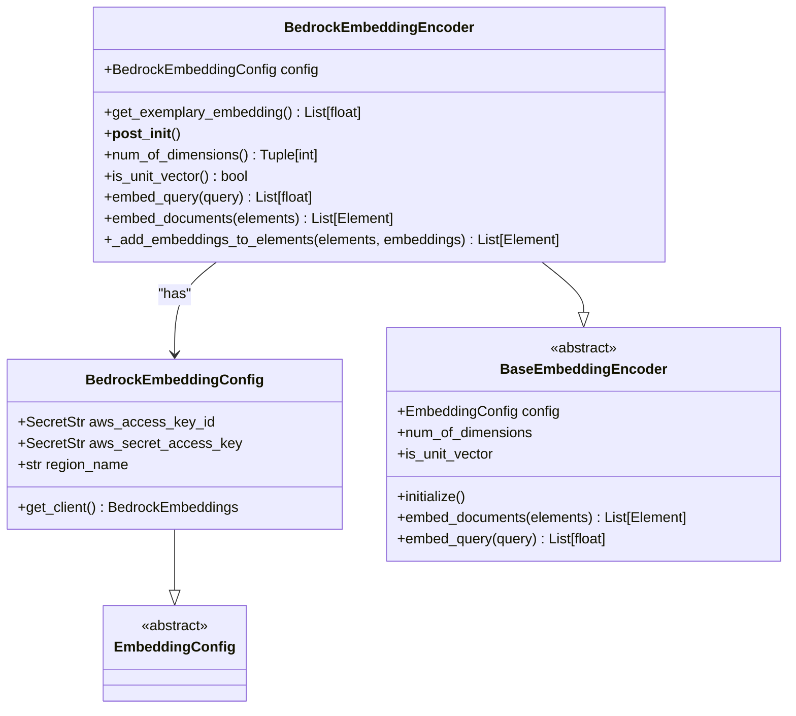
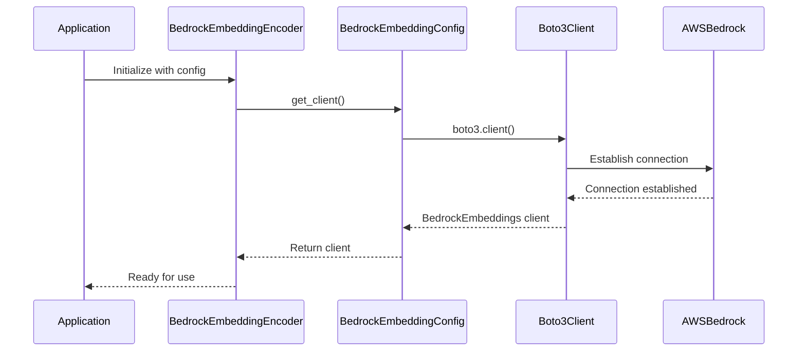
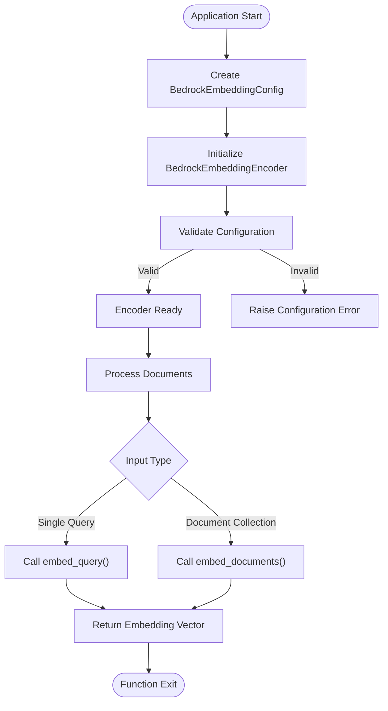

# Amazon Bedrock Embedding Provider

<cite>
**Referenced Files in This Document**   
- [bedrock.py](file://unstructured/embed/bedrock.py)
- [interfaces.py](file://unstructured/embed/interfaces.py)
- [__init__.py](file://unstructured/embed/__init__.py)
- [local-embed-bedrock.sh](file://test_unstructured_ingest/src/local-embed-bedrock.sh)
- [CHANGELOG.md](file://CHANGELOG.md)
</cite>

## Table of Contents
1. [Introduction](#introduction)
2. [Core Components](#core-components)
3. [Configuration Options](#configuration-options)
4. [Authentication Mechanisms](#authentication-mechanisms)
5. [Request and Response Processing](#request-and-response-processing)
6. [Usage Patterns](#usage-patterns)
7. [Error Handling](#error-handling)
8. [Performance Considerations](#performance-considerations)
9. [Cost Optimization and Model Selection](#cost-optimization-and-model-selection)
10. [Security Best Practices](#security-best-practices)

## Introduction
The Amazon Bedrock embedding provider implementation in the unstructured library enables integration with AWS Bedrock's foundation models for generating text embeddings. This document provides a comprehensive analysis of the BedrockEmbeddingEncoder class, its configuration, authentication methods, and integration patterns within the unstructured framework. The implementation leverages AWS Bedrock's managed infrastructure to provide scalable and secure embedding generation capabilities.

**Section sources**
- [bedrock.py](file://unstructured/embed/bedrock.py#L1-L77)

## Core Components

The Amazon Bedrock embedding provider consists of two primary components: the `BedrockEmbeddingConfig` class for configuration management and the `BedrockEmbeddingEncoder` class that implements the embedding functionality. The implementation follows the provider pattern, integrating with AWS Bedrock through the LangChain framework and boto3 SDK.

The `BedrockEmbeddingEncoder` class implements the `BaseEmbeddingEncoder` interface, ensuring consistency with other embedding providers in the ecosystem. It provides methods for embedding both individual queries and document collections, with proper handling of the embedding vectors and their association with document elements.

**Diagram sources**
- [bedrock.py](file://unstructured/embed/bedrock.py#L16-L77)

**Section sources**
- [bedrock.py](file://unstructured/embed/bedrock.py#L1-L77)
- [interfaces.py](file://unstructured/embed/interfaces.py#L1-L40)

## Configuration Options

The Bedrock embedding provider offers several configuration options through the `BedrockEmbeddingConfig` class. The primary configuration parameters include AWS credentials (access key ID and secret access key), AWS region specification, and dependency management for the required packages.

The default AWS region is set to "us-west-2", but this can be overridden to use any AWS region where Amazon Bedrock is available. The configuration class uses Pydantic's `SecretStr` type to securely handle AWS credentials, ensuring they are properly masked in logs and error messages.

The implementation includes dependency management through the `requires_dependencies` decorator, which ensures that the necessary packages (boto3, numpy, and langchain_community) are available when the Bedrock client is instantiated. This lazy loading approach minimizes startup overhead and only loads dependencies when actually needed.

**Section sources**
- [bedrock.py](file://unstructured/embed/bedrock.py#L16-L40)

## Authentication Mechanisms

The Bedrock embedding provider supports AWS authentication through access keys and secret access keys, which are passed through the `BedrockEmbeddingConfig` object. The authentication mechanism uses boto3's client configuration to establish a connection to the Bedrock Runtime service.

When the `get_client()` method is called, it creates a boto3 client for the "bedrock-runtime" service, passing the AWS credentials and region information. The credentials are securely accessed using the `get_secret_value()` method provided by Pydantic's `SecretStr` type, which helps prevent accidental exposure of sensitive information.

While the current implementation uses explicit access keys, AWS best practices recommend using IAM roles when possible, especially in production environments. The underlying boto3 client supports various AWS authentication methods, including IAM roles, environment variables, and AWS credentials file, though the current interface primarily exposes the access key method.

**Diagram sources**
- [bedrock.py](file://unstructured/embed/bedrock.py#L26-L39)

**Section sources**
- [bedrock.py](file://unstructured/embed/bedrock.py#L16-L40)

## Request and Response Processing

The Bedrock embedding provider processes embedding requests through the `embed_query` and `embed_documents` methods of the `BedrockEmbeddingEncoder` class. When a query or document collection is submitted, the encoder retrieves the Bedrock client and forwards the request to the underlying LangChain BedrockEmbeddings implementation.

For query embedding, the `embed_query` method takes a single text string and returns a numpy array containing the embedding vector. For document embedding, the `embed_documents` method processes a list of Element objects, converting each to a string representation before sending to the Bedrock service. The resulting embeddings are then associated with the original elements through the `_add_embeddings_to_elements` method.

The response processing includes validation that the number of returned embeddings matches the number of input elements, ensuring data integrity. The embedding vectors are stored directly in the Element objects' `embeddings` attribute, making them available for downstream processing and storage.

**Section sources**
- [bedrock.py](file://unstructured/embed/bedrock.py#L60-L76)

## Usage Patterns

The Bedrock embedding provider can be used in both direct programming interfaces and command-line scenarios. The primary usage pattern involves creating a `BedrockEmbeddingConfig` with the necessary AWS credentials and region, then initializing the `BedrockEmbeddingEncoder` with this configuration.

In command-line scenarios, as demonstrated in the `local-embed-bedrock.sh` script, the embedding provider is configured through environment variables and command-line arguments. The script checks for the presence of AWS_ACCESS_KEY_ID and AWS_SECRET_ACCESS_KEY environment variables before proceeding with the ingestion process.

The integration with the unstructured ingest framework allows for batch processing of documents with embedding generation, where the embedding provider is specified by the "aws-bedrock" identifier. This enables seamless integration with various data sources and output formats while maintaining consistent embedding generation across different deployment scenarios.

**Diagram sources**
- [bedrock.py](file://unstructured/embed/bedrock.py#L60-L76)
- [local-embed-bedrock.sh](file://test_unstructured_ingest/src/local-embed-bedrock.sh#L22-L40)

**Section sources**
- [bedrock.py](file://unstructured/embed/bedrock.py#L40-L77)
- [local-embed-bedrock.sh](file://test_unstructured_ingest/src/local-embed-bedrock.sh#L1-L47)

## Error Handling

The Bedrock embedding provider inherits error handling capabilities from the underlying boto3 and LangChain libraries. Common AWS-related errors such as access denied, quota limits, and region-specific availability issues are propagated through the exception hierarchy.

The implementation includes basic validation through the assertion in the `_add_embeddings_to_elements` method, which ensures that the number of embeddings matches the number of input elements. This helps catch issues where the Bedrock service might return a different number of embeddings than requested.

For authentication-related errors, the provider relies on boto3's built-in error handling, which can detect invalid credentials, expired tokens, and insufficient permissions. Network-related issues such as timeouts and connection failures are also handled by the underlying HTTP client used by boto3.

The changelog indicates that support for AWS Bedrock embeddings was added to the ingest CLI, suggesting that error handling has been enhanced to provide meaningful feedback during the ingestion process, particularly when AWS credentials are missing or invalid.

**Section sources**
- [bedrock.py](file://unstructured/embed/bedrock.py#L70-L76)
- [CHANGELOG.md](file://CHANGELOG.md#L1188-L1196)

## Performance Considerations

The performance of the Bedrock embedding provider is influenced by several factors, including network latency between the client and AWS regions, request throttling by the Bedrock service, and the computational requirements of the underlying foundation models.

The implementation uses connection reuse through the boto3 client, which helps reduce the overhead of establishing new connections for each request. However, each embedding request still incurs network latency, particularly when the client and Bedrock service are in different geographic regions.

The provider processes documents sequentially within a single call to `embed_documents`, but the unstructured framework supports parallel processing through the `num-processes` parameter, as shown in the test script. This allows for horizontal scaling of embedding generation across multiple CPU cores or machines.

Integration with other AWS services like S3 and Lambda can be optimized by deploying the embedding service in the same region as the data sources, minimizing cross-region data transfer costs and latency. The use of AWS credentials through environment variables or IAM roles also eliminates the need to transmit credentials over the network.

**Section sources**
- [local-embed-bedrock.sh](file://test_unstructured_ingest/src/local-embed-bedrock.sh#L12-L31)

## Cost Optimization and Model Selection

Cost optimization for the Bedrock embedding provider involves selecting appropriate foundation models based on the required embedding quality and budget constraints. Different foundation models may have varying pricing structures based on the number of tokens processed and the dimensionality of the resulting embeddings.

The current implementation does not expose model selection parameters directly, relying on the default model configuration in the LangChain BedrockEmbeddings class. However, extending the configuration to include model specification would enable users to choose cost-effective models for their specific use cases.

Batch processing of documents, as supported by the `embed_documents` method, can improve cost efficiency by reducing the overhead associated with individual API calls. Additionally, caching frequently used embeddings can eliminate redundant API calls and associated costs.

When integrating with other AWS services, cost optimization can be achieved by selecting appropriate instance types for compute resources and leveraging AWS pricing models such as reserved instances or spot instances for non-critical workloads.

**Section sources**
- [bedrock.py](file://unstructured/embed/bedrock.py#L64-L68)

## Security Best Practices

Security best practices for using the Bedrock embedding provider include proper management of AWS credentials, use of least-privilege IAM roles, and secure handling of sensitive data. The implementation uses Pydantic's `SecretStr` type to help protect AWS credentials from accidental exposure in logs and error messages.

Instead of using long-term access keys, AWS recommends using IAM roles with temporary credentials, particularly when running in AWS environments like EC2, Lambda, or ECS. This eliminates the need to manage and rotate access keys and reduces the risk of credential leakage.

Network security should be maintained by ensuring that connections to the Bedrock service use HTTPS, which is handled automatically by the boto3 client. For applications handling sensitive data, additional encryption of data in transit and at rest should be implemented according to organizational security policies.

Regular rotation of credentials and monitoring of AWS CloudTrail logs for unauthorized access attempts are also recommended practices to maintain the security of the embedding service.

**Section sources**
- [bedrock.py](file://unstructured/embed/bedrock.py#L18-L19)
- [local-embed-bedrock.sh](file://test_unstructured_ingest/src/local-embed-bedrock.sh#L22-L25)