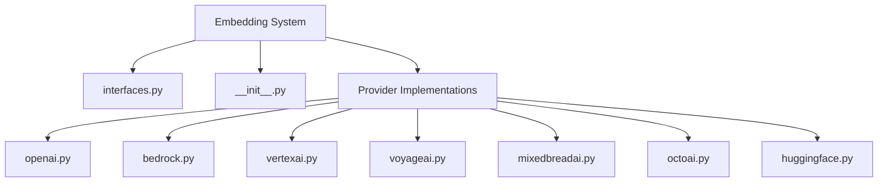
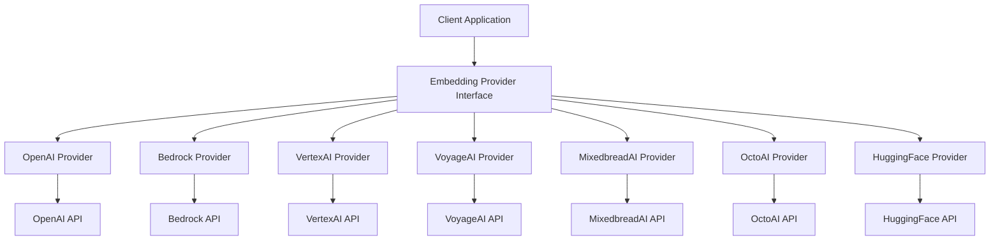
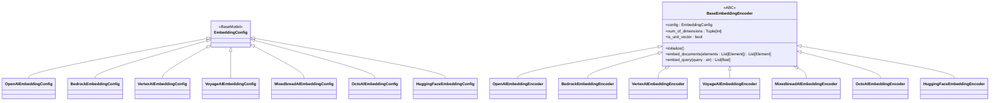
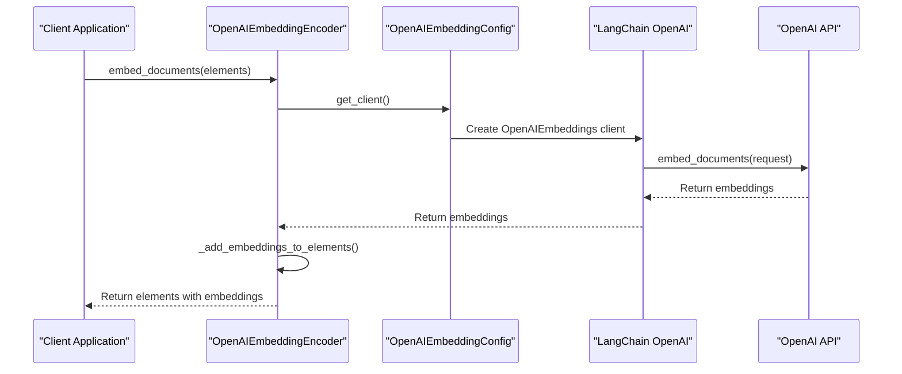
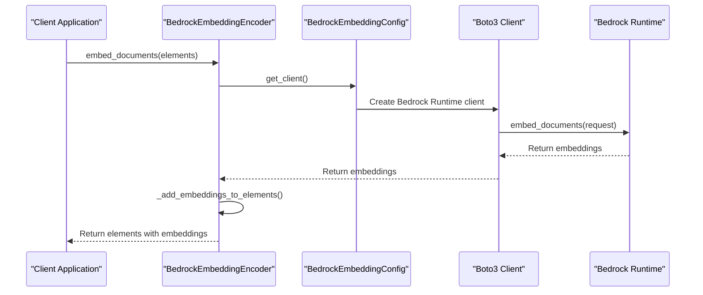
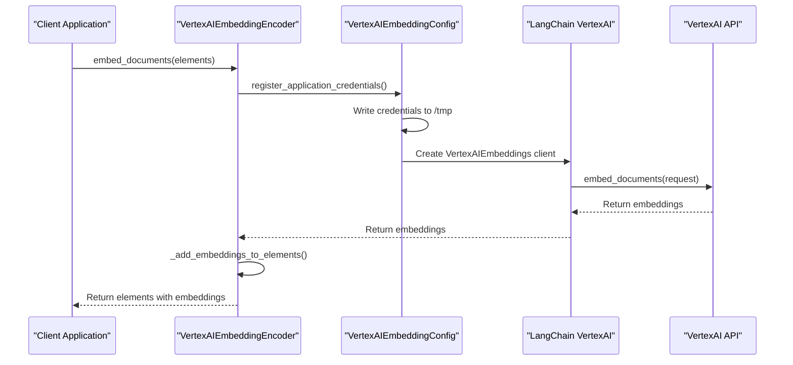
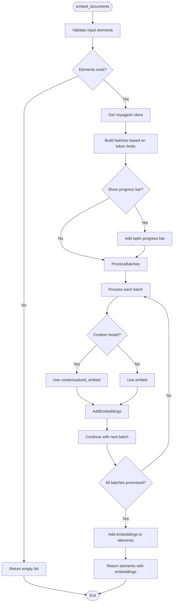
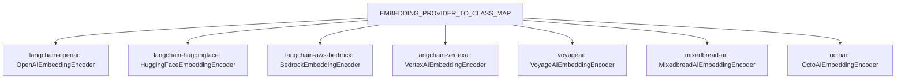

# Embedding Providers Overview

<cite>
**Referenced Files in This Document**   
- [interfaces.py](file://unstructured/embed/interfaces.py)
- [__init__.py](file://unstructured/embed/__init__.py)
- [openai.py](file://unstructured/embed/openai.py)
- [bedrock.py](file://unstructured/embed/bedrock.py)
- [vertexai.py](file://unstructured/embed/vertexai.py)
- [voyageai.py](file://unstructured/embed/voyageai.py)
- [mixedbreadai.py](file://unstructured/embed/mixedbreadai.py)
- [octoai.py](file://unstructured/embed/octoai.py)
- [huggingface.py](file://unstructured/embed/huggingface.py)
</cite>

## Table of Contents
1. [Introduction](#introduction)
2. [Project Structure](#project-structure)
3. [Core Components](#core-components)
4. [Architecture Overview](#architecture-overview)
5. [Detailed Component Analysis](#detailed-component-analysis)
6. [Dependency Analysis](#dependency-analysis)
7. [Performance Considerations](#performance-considerations)
8. [Troubleshooting Guide](#troubleshooting-guide)
9. [Conclusion](#conclusion)

## Introduction
The unstructured library provides a flexible embedding provider abstraction system that enables pluggable integration of multiple embedding providers. This documentation explains the common interface pattern, the base EmbeddingEncoder class, the factory pattern for provider instantiation, and configuration management. The system is designed to handle different authentication schemes, request/response formats, and error handling patterns across providers while maintaining a consistent API for consumers.

## Project Structure
The embedding provider system is organized within the `unstructured/embed` directory, which contains the core interface definition, provider implementations, and configuration classes. The structure follows a modular pattern where each provider has its own implementation file, and the interface is defined separately to ensure consistency across implementations.

**Diagram sources**
- [interfaces.py](file://unstructured/embed/interfaces.py)
- [__init__.py](file://unstructured/embed/__init__.py)

**Section sources**
- [interfaces.py](file://unstructured/embed/interfaces.py)
- [__init__.py](file://unstructured/embed/__init__.py)

## Core Components
The embedding provider system consists of several core components that work together to provide a consistent interface for different embedding providers. The key components include the base interface definition, provider-specific configuration classes, and the factory pattern for provider instantiation.

**Section sources**
- [interfaces.py](file://unstructured/embed/interfaces.py)
- [__init__.py](file://unstructured/embed/__init__.py)

## Architecture Overview
The embedding provider system follows a clean architecture pattern with a clear separation between the interface definition and the concrete implementations. The system uses the Strategy pattern to allow pluggable integration of different embedding providers while maintaining a consistent API for consumers.

**Diagram sources**
- [interfaces.py](file://unstructured/embed/interfaces.py)
- [__init__.py](file://unstructured/embed/__init__.py)

## Detailed Component Analysis

### Base Interface and Configuration
The embedding provider system is built around a common interface pattern defined in `interfaces.py`. This interface ensures consistency across different providers while allowing for provider-specific configurations and behaviors.

**Diagram sources**
- [interfaces.py](file://unstructured/embed/interfaces.py)

**Section sources**
- [interfaces.py](file://unstructured/embed/interfaces.py)

### Provider-Specific Implementations
Each embedding provider implementation follows the same pattern of extending the base interface and providing provider-specific configuration and behavior. The implementations handle different authentication schemes, request/response formats, and error handling patterns while maintaining a consistent API.

#### OpenAI Implementation
The OpenAI embedding provider implementation uses the LangChain OpenAI client to interact with the OpenAI API. It supports configuration of the API key and model name, with a default of "text-embedding-ada-002".

**Diagram sources**
- [openai.py](file://unstructured/embed/openai.py)

**Section sources**
- [openai.py](file://unstructured/embed/openai.py)

#### Bedrock Implementation
The Amazon Bedrock embedding provider implementation uses the LangChain Bedrock client with Boto3 for AWS authentication. It requires AWS credentials and supports configuration of the region name.

**Diagram sources**
- [bedrock.py](file://unstructured/embed/bedrock.py)

**Section sources**
- [bedrock.py](file://unstructured/embed/bedrock.py)

#### VertexAI Implementation
The Google VertexAI embedding provider implementation uses the LangChain Google VertexAI client. It has a unique authentication mechanism that requires JSON credentials to be written to a temporary file.

**Diagram sources**
- [vertexai.py](file://unstructured/embed/vertexai.py)

**Section sources**
- [vertexai.py](file://unstructured/embed/vertexai.py)

#### VoyageAI Implementation
The VoyageAI embedding provider implementation includes advanced features like automatic batching based on token limits and support for different model types (contextual vs. regular).

**Diagram sources**
- [voyageai.py](file://unstructured/embed/voyageai.py)

**Section sources**
- [voyageai.py](file://unstructured/embed/voyageai.py)

## Dependency Analysis
The embedding provider system uses a factory pattern for provider instantiation, with a mapping between provider names and their corresponding classes. This allows for easy extension and pluggable integration of new providers.

**Diagram sources**
- [__init__.py](file://unstructured/embed/__init__.py)

**Section sources**
- [__init__.py](file://unstructured/embed/__init__.py)

## Performance Considerations
The embedding provider abstraction layer introduces minimal overhead while providing significant benefits in terms of flexibility and maintainability. The performance implications vary by provider:

1. **Network Latency**: The abstraction layer adds minimal processing overhead, with most latency coming from network requests to the embedding providers.
2. **Batching**: Providers like VoyageAI implement intelligent batching based on token limits, which can significantly improve throughput.
3. **Caching**: The system does not implement caching at the abstraction layer, leaving this responsibility to the underlying providers or client applications.
4. **Error Handling**: The abstraction layer standardizes error handling patterns, making it easier to implement retry logic and fallback strategies.

Best practices for maintaining provider consistency include:
- Using the same configuration patterns across providers
- Maintaining consistent error handling and logging
- Following the same testing patterns and coverage requirements
- Documenting provider-specific limitations and requirements

## Troubleshooting Guide
When working with the embedding provider system, consider the following common issues and solutions:

1. **Authentication Errors**: Ensure provider-specific credentials are correctly configured. Some providers like VertexAI require special handling of credentials.
2. **Rate Limiting**: Implement appropriate retry logic and consider using providers with higher rate limits for production workloads.
3. **Token Limits**: Be aware of token limits for different providers, especially when processing large documents.
4. **Model Availability**: Verify that the requested model is available in the target region or account.
5. **Dependency Conflicts**: Use the appropriate extras when installing the library to ensure all required dependencies are available.

**Section sources**
- [interfaces.py](file://unstructured/embed/interfaces.py)
- [openai.py](file://unstructured/embed/openai.py)
- [bedrock.py](file://unstructured/embed/bedrock.py)
- [vertexai.py](file://unstructured/embed/vertexai.py)
- [voyageai.py](file://unstructured/embed/voyageai.py)

## Conclusion
The embedding provider abstraction system in the unstructured library provides a flexible and extensible framework for integrating multiple embedding providers. By defining a common interface and using a factory pattern for instantiation, the system enables pluggable integration while maintaining a consistent API for consumers. The design decisions behind the abstraction layer effectively handle different authentication schemes, request/response formats, and error handling patterns across providers. The system is well-tested and follows best practices for configuration management and performance optimization.