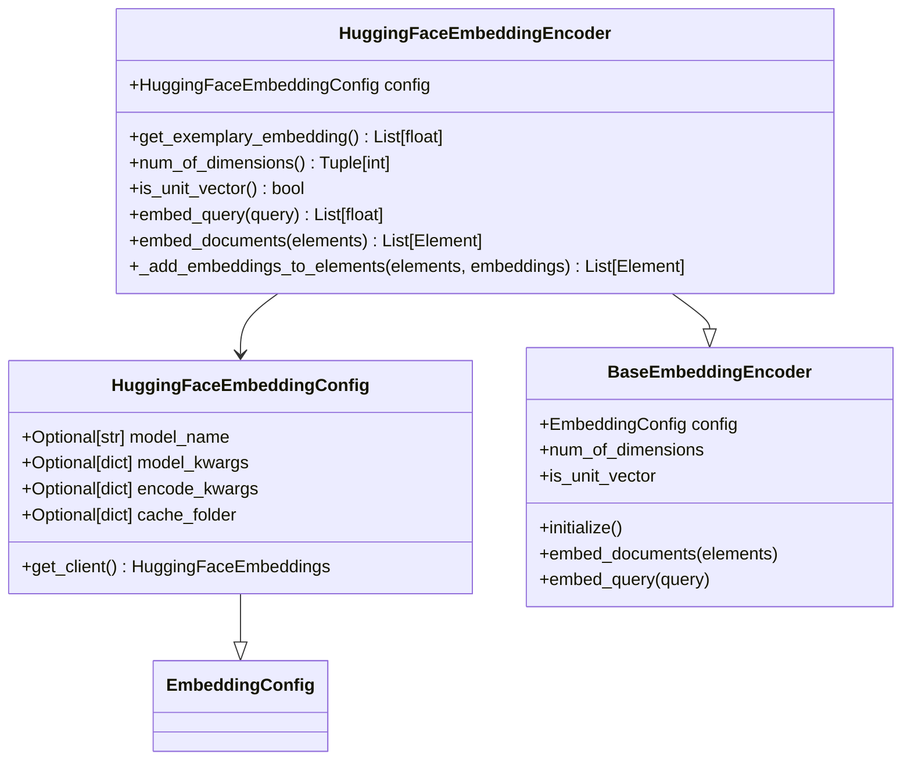
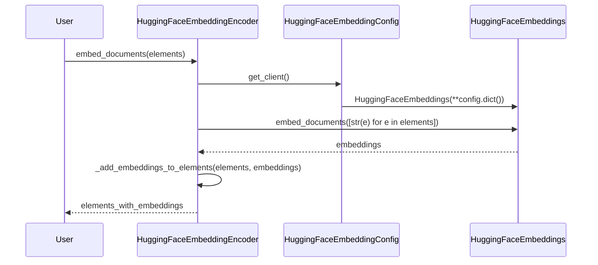
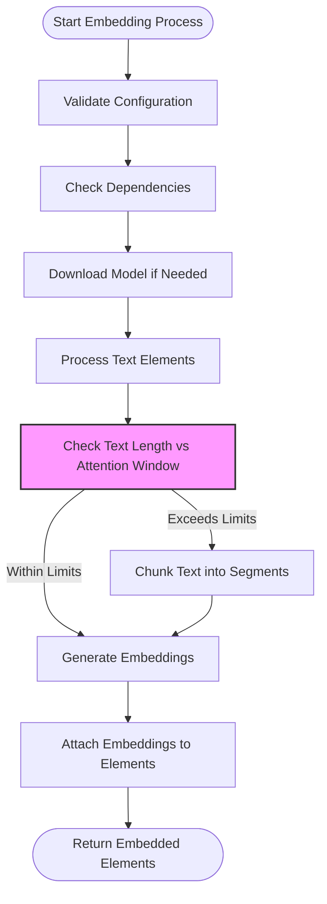

# Hugging Face Embedding Provider

<cite>
**Referenced Files in This Document**   
- [huggingface.py](file://unstructured/embed/huggingface.py)
- [interfaces.py](file://unstructured/embed/interfaces.py)
- [test_huggingface.py](file://test_unstructured/staging/test_huggingface.py)
- [huggingface.txt](file://requirements/huggingface.txt)
- [__init__.py](file://unstructured/embed/__init__.py)
</cite>

## Table of Contents
1. [Introduction](#introduction)
2. [HuggingFaceEmbeddingEncoder Architecture](#huggingfaceembeddingencoder-architecture)
3. [Configuration Options](#configuration-options)
4. [Implementation of Embedding Interface](#implementation-of-embedding-interface)
5. [Model Selection and Initialization](#model-selection-and-initialization)
6. [Performance Considerations](#performance-considerations)
7. [Error Handling and Validation](#error-handaling-and-validation)
8. [Usage Patterns](#usage-patterns)
9. [Integration with Transformers](#integration-with-transformers)

## Introduction
The Hugging Face embedding provider in the Unstructured library enables text embedding generation using models from the Hugging Face model hub. This implementation leverages LangChain's HuggingFaceEmbeddings integration to provide a consistent interface for generating embeddings from both public and private models. The system is designed to work seamlessly with the Unstructured document processing pipeline, allowing for embedding generation as part of document analysis workflows.

## HuggingFaceEmbeddingEncoder Architecture

**Diagram sources**
- [huggingface.py](file://unstructured/embed/huggingface.py#L17-L67)

**Section sources**
- [huggingface.py](file://unstructured/embed/huggingface.py#L1-L67)

## Configuration Options
The Hugging Face embedding provider offers several configuration options through the HuggingFaceEmbeddingConfig class:

- **model_name**: Specifies the Hugging Face model to use for embeddings. Defaults to "sentence-transformers/all-MiniLM-L6-v2" if not specified.
- **model_kwargs**: Dictionary of keyword arguments passed to the model initialization. The default configuration sets the device to "cpu".
- **encode_kwargs**: Dictionary of keyword arguments passed during the encoding process. The default configuration disables normalization of embeddings.
- **cache_folder**: Optional path to specify where downloaded models should be cached.

The configuration system uses Pydantic for validation and provides a get_client() method that creates and returns a LangChain HuggingFaceEmbeddings client instance with the specified configuration.

**Section sources**
- [huggingface.py](file://unstructured/embed/huggingface.py#L17-L33)

## Implementation of Embedding Interface
The HuggingFaceEmbeddingEncoder class implements the BaseEmbeddingEncoder interface, providing methods for embedding both individual queries and document elements:

- **embed_query()**: Generates an embedding for a single query string by converting it to a string and passing it to the underlying LangChain client.
- **embed_documents()**: Generates embeddings for a list of Element objects by converting each element to a string representation and processing them in batch.
- **_add_embeddings_to_elements()**: Helper method that attaches generated embeddings to the original elements while preserving their structure.

The implementation also provides utility methods for determining embedding characteristics:
- **get_exemplary_embedding()**: Generates a sample embedding using a simple query to test the embedding configuration.
- **num_of_dimensions()**: Returns the shape of the embedding vector by analyzing an exemplary embedding.
- **is_unit_vector()**: Checks if the embedding vectors are normalized by verifying if their norm is approximately 1.0.

**Diagram sources**
- [huggingface.py](file://unstructured/embed/huggingface.py#L36-L67)

**Section sources**
- [huggingface.py](file://unstructured/embed/huggingface.py#L36-L67)

## Model Selection and Initialization
The Hugging Face embedding provider supports model selection from the Hugging Face model hub, with a default configuration that uses the sentence-transformers/all-MiniLM-L6-v2 model. This model is a popular choice for sentence embedding due to its balance of performance and efficiency.

Model initialization is handled through the get_client() method, which uses the requires_dependencies decorator to ensure that the necessary LangChain Hugging Face integration package is available. When a model is first used, it is downloaded from the Hugging Face hub and cached locally according to the cache_folder configuration.

The system integrates with the broader Unstructured ecosystem through the EMBEDDING_PROVIDER_TO_CLASS_MAP in the __init__.py file, which maps provider names to their corresponding encoder classes, enabling dynamic selection of embedding providers.

**Section sources**
- [huggingface.py](file://unstructured/embed/huggingface.py#L17-L33)
- [__init__.py](file://unstructured/embed/__init__.py#L11-L19)

## Performance Considerations
The Hugging Face embedding provider has several performance characteristics to consider:

- **Model Download Times**: The first use of a model requires downloading it from the Hugging Face hub, which can be time-consuming depending on model size and network speed.
- **GPU Memory Requirements**: While the default configuration uses CPU processing, models can be configured to run on GPU by modifying the model_kwargs parameter, which can significantly improve inference speed for large models.
- **Batch Processing**: The embed_documents() method processes elements in batch, which is more efficient than individual processing.
- **Caching**: Models are cached locally after first use, eliminating download time for subsequent uses.

The system also includes functionality for handling large texts that exceed model attention windows through the staging module, which chunks text into appropriate sizes before embedding.

**Section sources**
- [huggingface.py](file://unstructured/embed/huggingface.py#L17-L67)
- [test_huggingface.py](file://test_unstructured/staging/test_huggingface.py#L1-L78)

## Error Handling and Validation
The Hugging Face embedding provider includes several error handling and validation mechanisms:

- **Dependency Validation**: The requires_dependencies decorator ensures that required packages are installed before attempting to create a client.
- **Configuration Validation**: The Pydantic-based configuration model validates input parameters.
- **Text Chunking Validation**: The chunk_by_attention_window function validates that buffer sizes are appropriate and that no individual text segment exceeds the model's attention window.
- **Dimension Validation**: The _add_embeddings_to_elements method includes an assertion that the number of elements matches the number of embeddings.

The staging module includes specific error handling for attention window management, raising ValueError exceptions when buffer sizes are invalid or when text segments exceed the maximum allowed size.

**Diagram sources**
- [test_huggingface.py](file://test_unstructured/staging/test_huggingface.py#L46-L77)

**Section sources**
- [test_huggingface.py](file://test_unstructured/staging/test_huggingface.py#L1-L78)

## Usage Patterns
The Hugging Face embedding provider can be used with both public and private models from the Hugging Face model hub. For public models, simply specify the model name in the configuration. For private models, ensure that appropriate authentication is configured in the Hugging Face environment.

Common usage patterns include:
- Using the default all-MiniLM-L6-v2 model for general-purpose embeddings
- Selecting specialized models for specific languages or domains
- Configuring GPU acceleration for improved performance
- Using custom cache locations for model storage

The provider is designed to integrate seamlessly with the Unstructured document processing pipeline, allowing embeddings to be generated as part of document analysis workflows.

**Section sources**
- [huggingface.py](file://unstructured/embed/huggingface.py#L1-L67)
- [huggingface.txt](file://requirements/huggingface.txt#L1-L113)

## Integration with Transformers
The Hugging Face embedding provider integrates with the broader Hugging Face ecosystem through several components:

- The staging module provides utilities for preparing text for transformer models, including attention window management.
- The chunk_by_attention_window function ensures that text inputs are appropriately sized for the model's context window.
- The system leverages the transformers library for tokenization and model loading.

This integration allows the embedding provider to work with any model that is compatible with the Hugging Face transformers library, providing access to thousands of pre-trained models for various languages and domains.

**Section sources**
- [huggingface.py](file://unstructured/embed/huggingface.py#L1-L67)
- [test_huggingface.py](file://test_unstructured/staging/test_huggingface.py#L1-L78)