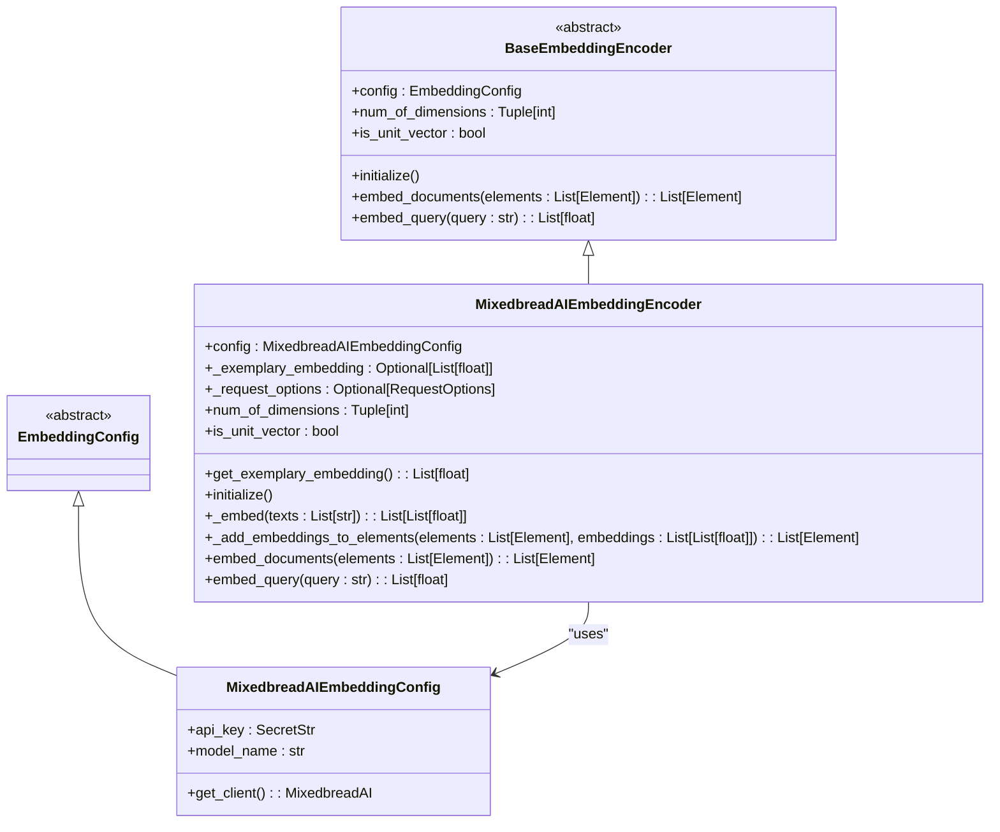
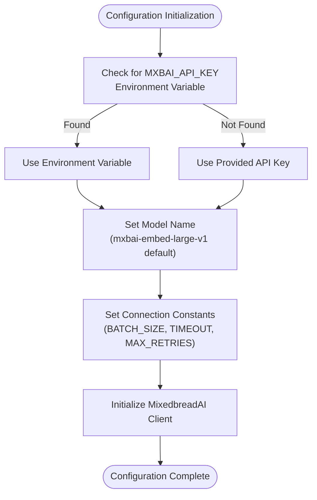
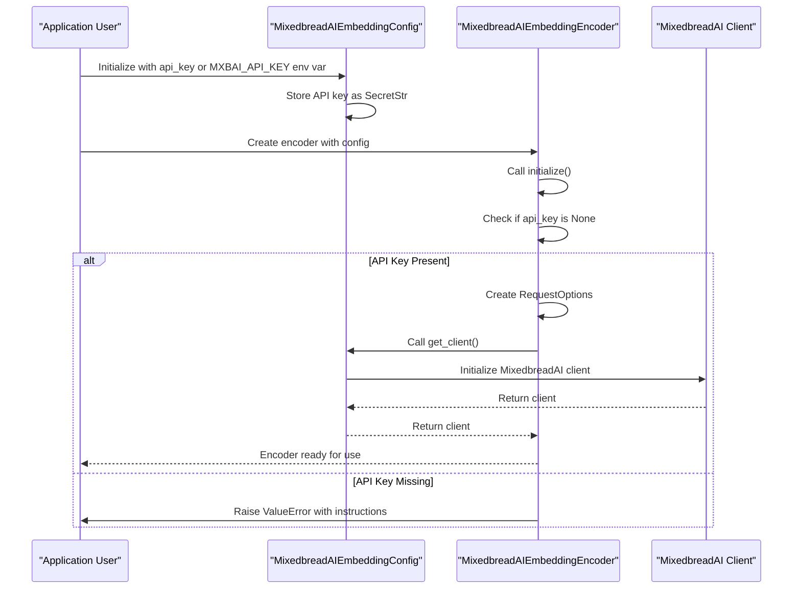
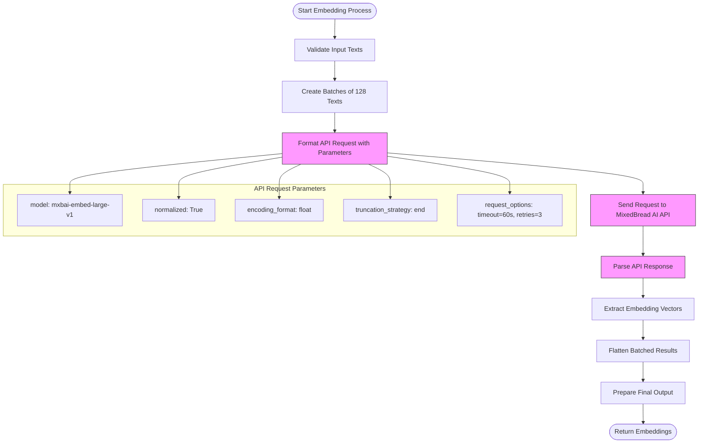
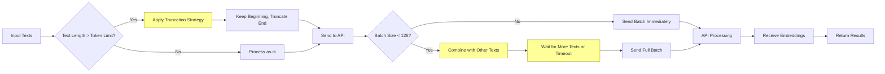
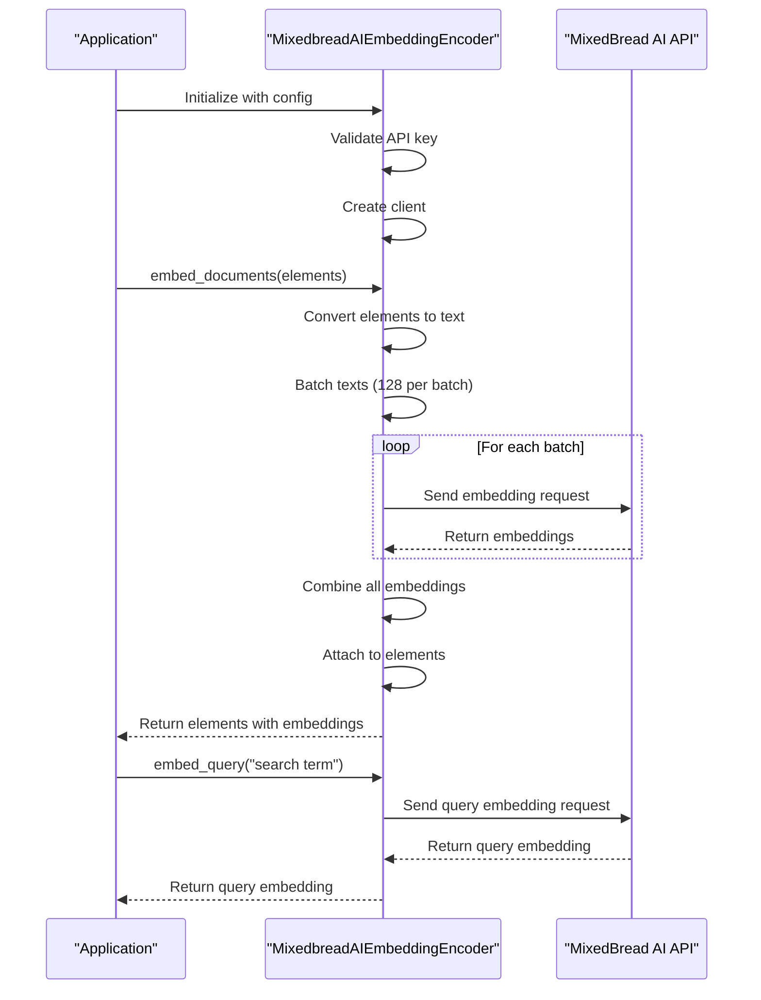

# MixedBread AI Embedding Provider

<cite>
**Referenced Files in This Document**   
- [mixedbreadai.py](file://unstructured/embed/mixedbreadai.py)
- [interfaces.py](file://unstructured/embed/interfaces.py)
- [test_mixedbreadai.py](file://test_unstructured/embed/test_mixedbreadai.py)
- [__init__.py](file://unstructured/embed/__init__.py)
- [local-embed-mixedbreadai.sh](file://test_unstructured_ingest/src/local-embed-mixedbreadai.sh)
- [setup.py](file://setup.py)
</cite>

## Table of Contents
1. [Introduction](#introduction)
2. [Core Components](#core-components)
3. [Configuration Options](#configuration-options)
4. [Authentication Mechanism](#authentication-mechanism)
5. [Request and Response Processing](#request-and-response-processing)
6. [Error Handling Strategies](#error-handling-strategies)
7. [Performance Considerations](#performance-considerations)
8. [Model Selection Guidance](#model-selection-guidance)
9. [Usage Examples](#usage-examples)

## Introduction
The MixedBread AI embedding provider implementation within the unstructured library provides a robust interface for generating text embeddings using MixedBread AI's specialized models. This documentation details the architecture, configuration, and usage patterns of the MixedBreadAIEmbeddingEncoder class, which implements the base EmbeddingEncoder interface. The implementation is designed to seamlessly integrate with document processing workflows, enabling semantic analysis and retrieval of unstructured content through high-quality vector representations.

**Section sources**
- [mixedbreadai.py](file://unstructured/embed/mixedbreadai.py#L1-L179)

## Core Components

The MixedBread AI embedding functionality is centered around two primary classes: `MixedbreadAIEmbeddingConfig` and `MixedbreadAIEmbeddingEncoder`. The configuration class extends the base `EmbeddingConfig` from the interfaces module, while the encoder class implements the `BaseEmbeddingEncoder` abstract base class. This design follows a clean separation of concerns, with configuration management isolated from the embedding logic.

The `MixedbreadAIEmbeddingEncoder` class handles the complete embedding workflow, from initialization and validation to batch processing and response parsing. It leverages the MixedBread AI client library to communicate with the API, managing request formatting, batching, and error handling. The implementation includes properties to determine embedding dimensions and whether the vectors are unit-normalized, which are essential for downstream similarity calculations.



**Diagram sources**
- [mixedbreadai.py](file://unstructured/embed/mixedbreadai.py#L25-L179)
- [interfaces.py](file://unstructured/embed/interfaces.py#L10-L40)

**Section sources**
- [mixedbreadai.py](file://unstructured/embed/mixedbreadai.py#L25-L179)
- [interfaces.py](file://unstructured/embed/interfaces.py#L10-L40)

## Configuration Options

The MixedBread AI embedding provider offers several configuration options through the `MixedbreadAIEmbeddingConfig` class. The primary configuration parameters include API key authentication, model selection, and connection settings. The configuration system supports both direct parameter passing and environment variable injection, providing flexibility for different deployment scenarios.

The default configuration uses the "mixedbread-ai/mxbai-embed-large-v1" model, which is optimized for high-quality semantic understanding across diverse text types. Users can override this default by specifying alternative models through the `model_name` parameter. The configuration also includes several constants that control the embedding process: a batch size of 128 texts, a 60-second timeout for API requests, 3 maximum retry attempts, float encoding format, and end-based truncation strategy for long texts.



**Diagram sources**
- [mixedbreadai.py](file://unstructured/embed/mixedbreadai.py#L13-L17)
- [mixedbreadai.py](file://unstructured/embed/mixedbreadai.py#L34-L40)

**Section sources**
- [mixedbreadai.py](file://unstructured/embed/mixedbreadai.py#L13-L40)

## Authentication Mechanism

The authentication mechanism for the MixedBread AI embedding provider is implemented through API key validation and secure credential management. The system supports two methods for providing the API key: direct parameter passing to the configuration constructor or through the `MXBAI_API_KEY` environment variable. This dual approach allows for secure credential management in production environments while maintaining convenience during development.

The implementation uses Pydantic's `SecretStr` type to handle the API key, ensuring that sensitive credentials are properly protected and not accidentally exposed in logs or error messages. During initialization, the encoder validates that an API key is present, raising a descriptive `ValueError` if authentication credentials are missing. This early validation prevents failed API calls later in the processing pipeline.

The authentication flow follows a clear sequence: first checking for the environment variable, then falling back to the provided parameter, and finally validating that a key is available before creating the API client. This robust authentication process ensures that the embedding service can only be initialized with proper credentials, enhancing security and reliability.



**Diagram sources**
- [mixedbreadai.py](file://unstructured/embed/mixedbreadai.py#L34-L36)
- [mixedbreadai.py](file://unstructured/embed/mixedbreadai.py#L78-L84)

**Section sources**
- [mixedbreadai.py](file://unstructured/embed/mixedbreadai.py#L34-L84)

## Request and Response Processing

The request and response processing pipeline in the MixedBread AI embedding provider is designed for efficiency and reliability. The implementation handles text batching, API communication, and response parsing through a well-structured process. Texts are processed in batches of 128 (configurable through the BATCH_SIZE constant) to optimize API usage and throughput while respecting rate limits.

When embedding texts, the system formats requests with several key parameters: the specified model name, normalized embeddings (ensuring unit vectors), float encoding format, and end-based truncation strategy for texts exceeding the model's token limit. The request includes custom headers with a user agent string "@mixedbread-ai/unstructured" to identify the client to the API service.

Response parsing is handled automatically by the MixedBread AI client library, with the embedding provider extracting the embedding vectors from the API response. The implementation flattens the batched responses into a single list of embeddings, maintaining the original order of input texts. For document elements, the embeddings are attached directly to the Element objects, preserving the relationship between content and its vector representation.



**Diagram sources**
- [mixedbreadai.py](file://unstructured/embed/mixedbreadai.py#L116-L132)
- [mixedbreadai.py](file://unstructured/embed/mixedbreadai.py#L123-L130)

**Section sources**
- [mixedbreadai.py](file://unstructured/embed/mixedbreadai.py#L116-L132)

## Error Handling Strategies

The MixedBread AI embedding provider implements comprehensive error handling strategies to ensure robust operation in production environments. The system addresses common API issues such as authentication failures, rate limiting, and model unavailability through a combination of validation, retry mechanisms, and descriptive error messages.

During initialization, the encoder performs validation to ensure that the API key is present, providing clear instructions for both constructor-based and environment variable-based authentication. This proactive validation prevents failed API calls due to missing credentials. For transient network issues and rate limiting, the implementation uses a retry mechanism with up to 3 attempts (configurable through MAX_RETRIES constant) and a 60-second timeout (configurable through TIMEOUT constant).

The error handling is integrated with the MixedBread AI client library, which manages HTTP-level errors and connection issues. The provider translates these low-level errors into meaningful exceptions that can be handled by the application. For model unavailability, the system relies on the API's response codes and messages, with the client library handling the appropriate exception raising.

```mermaid
graph TD
A[Start Embedding Request] --> B{Authentication Valid?}
B --> |No| C[Throw ValueError: API key missing]
B --> |Yes| D[Send API Request]
D --> E{Response Successful?}
E --> |Yes| F[Parse Embeddings]
E --> |No| G{Error Type}
G --> H[Rate Limiting]
G --> I[Authentication Failed]
G --> J[Model Unavailable]
G --> K[Network/Timeout]
H --> L[Wait and Retry (≤3 attempts)]
I --> M[Throw Authentication Error]
J --> N[Throw Model Error]
K --> O[Throw Connection Error]
L --> D
F --> P[Return Embeddings]
style C fill:#fdd,stroke:#f66
style M fill:#fdd,stroke:#f66
style N fill:#fdd,stroke:#f66
style O fill:#fdd,stroke:#f66
```

**Diagram sources**
- [mixedbreadai.py](file://unstructured/embed/mixedbreadai.py#L78-L84)
- [mixedbreadai.py](file://unstructured/embed/mixedbreadai.py#L88-L92)

**Section sources**
- [mixedbreadai.py](file://unstructured/embed/mixedbreadai.py#L78-L92)

## Performance Considerations

The MixedBread AI embedding provider is optimized for performance through several key design decisions. The implementation uses batching with a default size of 128 texts to maximize throughput while minimizing the number of API calls. This batching strategy reduces HTTP overhead and improves overall processing efficiency, especially when handling large documents or multiple elements.

The system is configured with a 60-second timeout and 3 retry attempts to balance responsiveness with reliability. These values can be adjusted based on network conditions and performance requirements. The use of exemplary embeddings to determine dimensions and normalization status is performed efficiently by embedding a single character ("Q"), minimizing the cost of these metadata queries.

For optimal performance, users should consider the token limits of the selected MixedBread AI model and ensure that input texts are appropriately preprocessed. Long documents should be chunked into smaller segments that fit within the model's context window. The end-based truncation strategy ensures that texts exceeding the token limit are handled gracefully by preserving the beginning of the text and truncating from the end.



**Diagram sources**
- [mixedbreadai.py](file://unstructured/embed/mixedbreadai.py#L17-L18)
- [mixedbreadai.py](file://unstructured/embed/mixedbreadai.py#L116-L117)

**Section sources**
- [mixedbreadai.py](file://unstructured/embed/mixedbreadai.py#L17-L18)
- [mixedbreadai.py](file://unstructured/embed/mixedbreadai.py#L116-L117)

## Model Selection Guidance

When selecting MixedBread AI models for embedding tasks, several factors should be considered to ensure optimal performance and accuracy for specific use cases. The default model "mixedbread-ai/mxbai-embed-large-v1" is recommended for most applications as it provides high-quality embeddings with strong semantic understanding capabilities.

For use cases requiring faster processing with slightly reduced accuracy, smaller models may be appropriate. Conversely, for applications demanding the highest possible semantic fidelity, such as legal document analysis or scientific literature processing, the large model is preferred despite its higher computational cost. The choice of model should align with the specific requirements of the application, balancing factors such as accuracy, speed, and cost.

The embedding provider's flexible configuration allows for easy model switching by simply changing the `model_name` parameter. This enables users to experiment with different models and select the one that best meets their performance requirements. When evaluating models, consider the nature of your text data, the required embedding dimensions, and whether unit vector normalization is needed for your similarity calculations.

**Section sources**
- [mixedbreadai.py](file://unstructured/embed/mixedbreadai.py#L39-L40)

## Usage Examples

The MixedBread AI embedding provider can be integrated into document processing workflows in several ways. The primary usage pattern involves creating an instance of `MixedbreadAIEmbeddingEncoder` with the appropriate configuration and using it to embed document elements or query strings. The encoder can be used directly in code or through the unstructured ingestion framework.

For direct usage, users can initialize the encoder with an API key and optional model specification. The encoder provides methods for embedding both document elements and individual query strings, making it suitable for both indexing and retrieval scenarios. When used with the unstructured ingestion framework, the embedding provider can be specified as the embedding provider in the ingestion configuration.

The implementation is also accessible through command-line scripts, such as the `local-embed-mixedbreadai.sh` script, which demonstrates how to use the embedding provider in batch processing scenarios. This script shows the complete workflow from input document processing to embedding generation and output.



**Diagram sources**
- [mixedbreadai.py](file://unstructured/embed/mixedbreadai.py#L155-L166)
- [mixedbreadai.py](file://unstructured/embed/mixedbreadai.py#L168-L178)
- [local-embed-mixedbreadai.sh](file://test_unstructured_ingest/src/local-embed-mixedbreadai.sh#L1-L35)

**Section sources**
- [mixedbreadai.py](file://unstructured/embed/mixedbreadai.py#L155-L178)
- [local-embed-mixedbreadai.sh](file://test_unstructured_ingest/src/local-embed-mixedbreadai.sh#L1-L35)