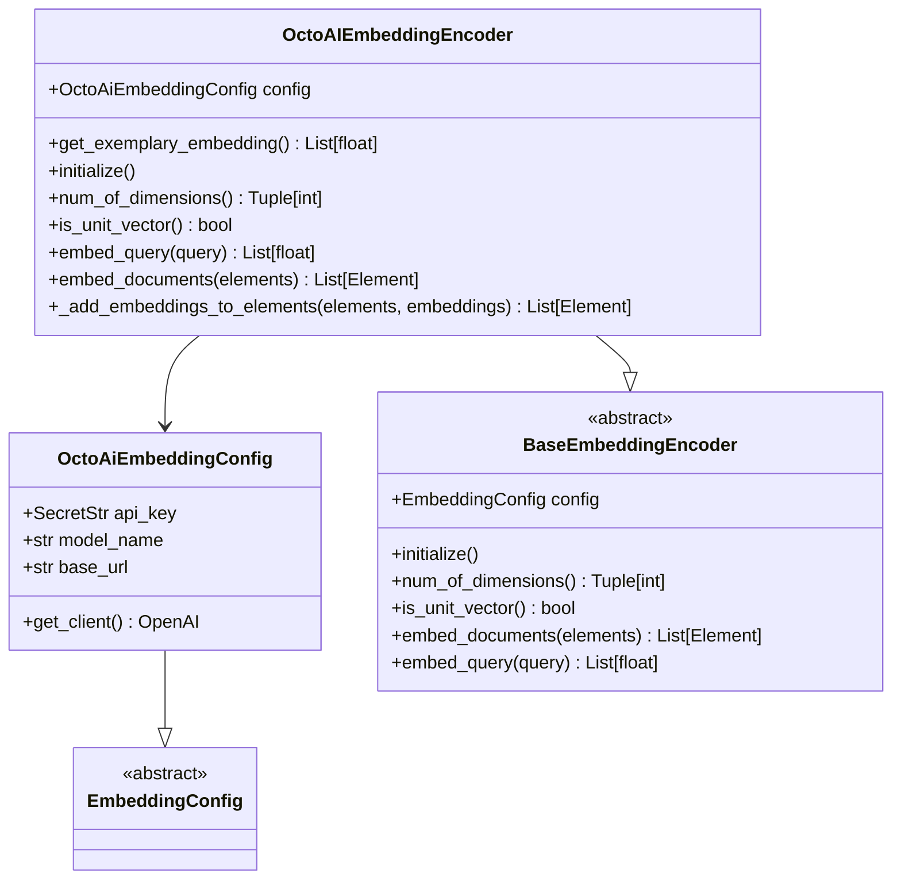
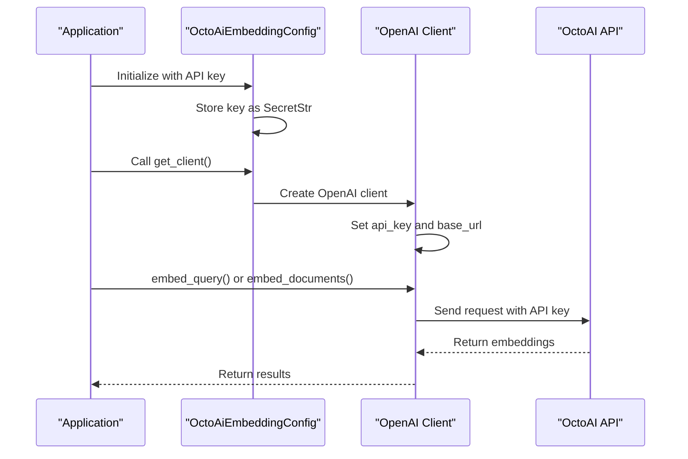
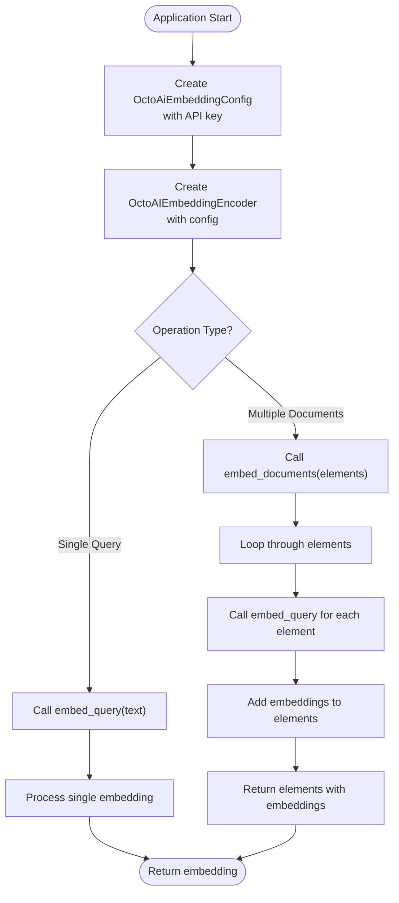
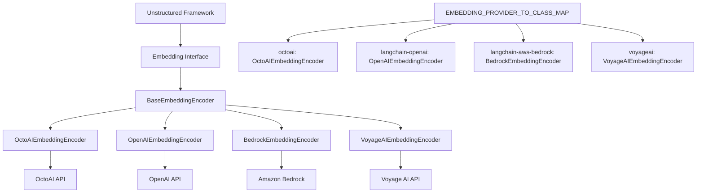

# OctoAI Embedding Provider

<cite>
**Referenced Files in This Document**   
- [octoai.py](file://unstructured/embed/octoai.py)
- [interfaces.py](file://unstructured/embed/interfaces.py)
- [test_octoai.py](file://test_unstructured/embed/test_octoai.py)
- [local-embed-octoai.sh](file://test_unstructured_ingest/src/local-embed-octoai.sh)
- [__init__.py](file://unstructured/embed/__init__.py)
</cite>

## Table of Contents
1. [Introduction](#introduction)
2. [Core Components](#core-components)
3. [Configuration Options](#configuration-options)
4. [Authentication Mechanism](#authentication-mechanism)
5. [Request and Response Processing](#request-and-response-processing)
6. [Usage Patterns](#usage-patterns)
7. [Error Handling](#error-handling)
8. [Performance Considerations](#performance-considerations)
9. [Integration with Unstructured Framework](#integration-with-unstructured-framework)

## Introduction
The OctoAI Embedding Provider enables integration with OctoAI's text embedding services through the unstructured library. This implementation allows users to generate vector embeddings for document elements using OctoAI's infrastructure, leveraging their specialized hardware acceleration and deployment options. The provider follows the standardized embedding interface used across the unstructured ecosystem while providing specific configuration options for OctoAI's API.

**Section sources**
- [octoai.py](file://unstructured/embed/octoai.py#L1-L70)

## Core Components

The OctoAI embedding implementation consists of two primary components: the `OctoAiEmbeddingConfig` class that manages configuration parameters and the `OctoAIEmbeddingEncoder` class that handles the embedding operations. The implementation leverages the OpenAI SDK to communicate with OctoAI's API endpoints, taking advantage of the compatibility between OctoAI's API and the OpenAI specification.

The `OctoAIEmbeddingEncoder` class implements the `BaseEmbeddingEncoder` interface, ensuring consistency with other embedding providers in the unstructured library. It provides methods for embedding both individual queries and collections of document elements, with automatic handling of the embedding process and integration with the document element structure.

**Diagram sources**
- [octoai.py](file://unstructured/embed/octoai.py#L17-L70)

**Section sources**
- [octoai.py](file://unstructured/embed/octoai.py#L17-L70)

## Configuration Options

The OctoAI embedding provider offers several configuration options through the `OctoAiEmbeddingConfig` class. The primary configuration parameters include the API key for authentication, the model name for specifying the embedding model to use, and the base URL for the API endpoint. By default, the provider uses the "thenlper/gte-large" model and connects to the standard OctoAI text embedding endpoint.

Users can customize the model selection based on their specific requirements, choosing from the various embedding models available through OctoAI. The configuration also supports specifying a custom base URL, which enables connection to different OctoAI deployment environments or regions. The implementation uses Pydantic's Field functionality to provide default values and validation for these configuration parameters.

**Section sources**
- [octoai.py](file://unstructured/embed/octoai.py#L17-L31)

## Authentication Mechanism

Authentication with the OctoAI API is handled through API tokens specified in the `OctoAiEmbeddingConfig`. The API key is stored as a `SecretStr` type from Pydantic, which provides built-in protection against accidental exposure of the sensitive credential. When creating the API client, the implementation uses the `get_secret_value()` method to retrieve the actual API key value while maintaining security best practices.

The authentication process occurs within the `get_client()` method of the `OctoAiEmbeddingConfig` class, which creates an OpenAI client instance with the provided API key and base URL. This approach leverages the OpenAI SDK's built-in authentication mechanisms while redirecting requests to OctoAI's endpoints. The implementation also includes dependency management through the `requires_dependencies` decorator, ensuring that the necessary packages (openai and tiktoken) are available when the client is created.

**Diagram sources**
- [octoai.py](file://unstructured/embed/octoai.py#L22-L31)

**Section sources**
- [octoai.py](file://unstructured/embed/octoai.py#L18-L31)

## Request and Response Processing

The OctoAI embedding provider formats requests according to the OpenAI embeddings API specification, which is compatible with OctoAI's implementation. When processing a query, the `embed_query` method sends the input text to the OctoAI API with the specified model name. The request is formatted to include the input text and model identifier, following the standard OpenAI embeddings API structure.

Response parsing is handled automatically by the OpenAI SDK, which returns a structured response object. The implementation extracts the embedding vector from the response data, specifically from `response.data[0].embedding`, and returns it as a list of floating-point values. For document embedding operations, the provider processes each element individually by calling `embed_query` for each element and then associates the resulting embeddings with the original document elements.

The request processing includes automatic string conversion of input queries to ensure compatibility with the API, and the response handling maintains the dimensional structure of the embedding vectors as returned by the OctoAI service.

**Section sources**
- [octoai.py](file://unstructured/embed/octoai.py#L53-L60)

## Usage Patterns

The OctoAI embedding provider can be integrated into applications through direct instantiation or through the unstructured ingest framework. The primary usage pattern involves creating an `OctoAIEmbeddingEncoder` instance with the appropriate configuration, including the API key and optional model specification.

In the unstructured ingest framework, the provider can be specified using the "octoai" identifier, with the API key provided through environment variables or command-line parameters. The shell script example demonstrates how to use the provider in a batch processing workflow, specifying the embedding provider and API key as command-line arguments to the ingest process.

The implementation supports both single query embedding and batch document embedding, with the `embed_query` method for individual text inputs and the `embed_documents` method for processing collections of document elements. The provider automatically handles the addition of embeddings to the document elements, preserving the original element structure while enriching it with vector representations.

**Diagram sources**
- [octoai.py](file://unstructured/embed/octoai.py#L53-L68)
- [local-embed-octoai.sh](file://test_unstructured_ingest/src/local-embed-octoai.sh#L37-L38)

**Section sources**
- [octoai.py](file://unstructured/embed/octoai.py#L53-L68)
- [test_octoai.py](file://test_unstructured/embed/test_octoai.py#L13-L16)
- [local-embed-octoai.sh](file://test_unstructured_ingest/src/local-embed-octoai.sh#L37-L38)

## Error Handling

The OctoAI embedding provider inherits error handling capabilities from the OpenAI SDK, which manages API communication errors, authentication failures, and service interruptions. While the implementation itself does not include explicit error handling code, it relies on the robust error handling mechanisms of the underlying OpenAI client.

Common API issues such as authentication failures (invalid API keys), model loading errors (invalid model names), and service interruptions (network issues or OctoAI service outages) are handled by the OpenAI SDK, which raises appropriate exceptions that can be caught and managed by the calling application. The provider follows a fail-fast approach, where initialization and embedding operations will raise exceptions if the API connection cannot be established or if requests fail.

The implementation assumes that error handling is the responsibility of the application using the provider, allowing for flexible error recovery strategies based on the specific use case requirements.

**Section sources**
- [octoai.py](file://unstructured/embed/octoai.py#L53-L60)

## Performance Considerations

The OctoAI embedding provider leverages OctoAI's infrastructure for high-performance embedding generation, including specialized hardware acceleration and auto-scaling capabilities. The implementation processes document embeddings sequentially by calling `embed_query` for each element, which may impact performance for large collections of documents.

Performance characteristics are influenced by several factors, including the selected embedding model, network latency to the OctoAI API endpoints, and the size of the text being embedded. The provider does not implement batching at the client level, meaning each embedding request is sent individually to the API. However, OctoAI's infrastructure handles request queuing and processing efficiently, with auto-scaling behavior that adapts to workload demands.

Cost implications are primarily determined by the number of tokens processed and the specific model selected, with larger models typically incurring higher costs. Users should consider the trade-offs between embedding quality, latency, and cost when selecting models and designing their embedding workflows.

**Section sources**
- [octoai.py](file://unstructured/embed/octoai.py#L58-L60)

## Integration with Unstructured Framework

The OctoAI embedding provider integrates seamlessly with the broader unstructured framework through the standardized embedding interface. It is registered in the `EMBEDDING_PROVIDER_TO_CLASS_MAP` dictionary in the embed module's `__init__.py` file, allowing it to be referenced by the "octoai" identifier in configuration and command-line interfaces.

This integration enables the provider to be used interchangeably with other embedding providers in the unstructured ecosystem, maintaining consistency in configuration, initialization, and usage patterns. The provider follows the same interface contract as other embedding implementations, ensuring that applications can switch between different embedding services with minimal code changes.

The implementation demonstrates the extensibility of the unstructured framework, showing how new embedding providers can be added by implementing the `BaseEmbeddingEncoder` interface and registering them in the provider map.

**Diagram sources**
- [__init__.py](file://unstructured/embed/__init__.py#L11-L18)
- [octoai.py](file://unstructured/embed/octoai.py#L33-L35)

**Section sources**
- [__init__.py](file://unstructured/embed/__init__.py#L11-L18)