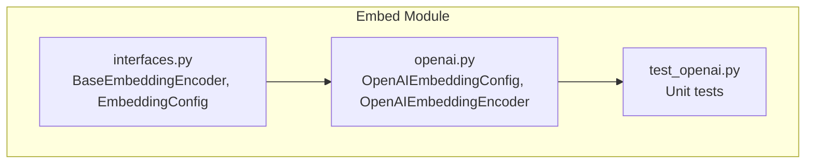
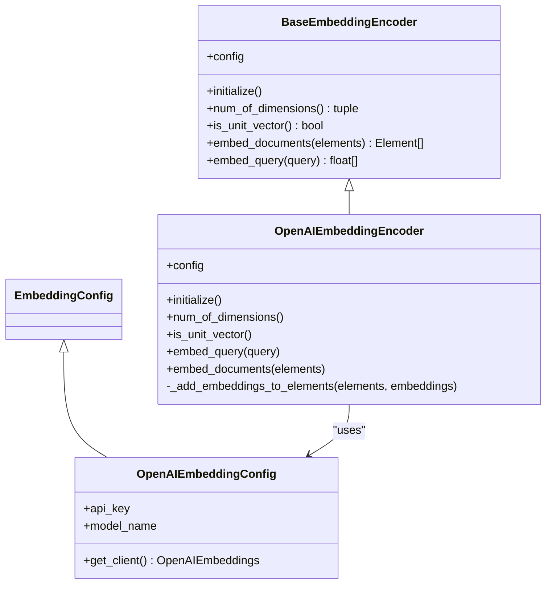
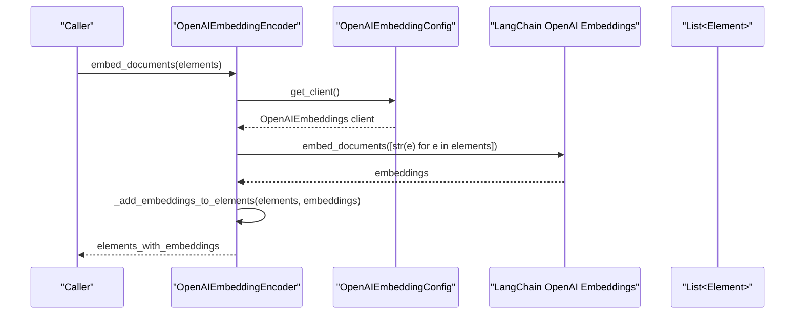
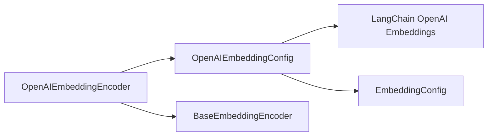

# OpenAI Embedding Provider

<cite>
**Referenced Files in This Document**
- [openai.py](file://unstructured/embed/openai.py)
- [interfaces.py](file://unstructured/embed/interfaces.py)
- [test_openai.py](file://test_unstructured/embed/test_openai.py)
- [README.md](file://unstructured/embed/README.md)
</cite>

## Table of Contents
1. [Introduction](#introduction)
2. [Project Structure](#project-structure)
3. [Core Components](#core-components)
4. [Architecture Overview](#architecture-overview)
5. [Detailed Component Analysis](#detailed-component-analysis)
6. [Dependency Analysis](#dependency-analysis)
7. [Performance Considerations](#performance-considerations)
8. [Troubleshooting Guide](#troubleshooting-guide)
9. [Conclusion](#conclusion)

## Introduction
This document explains the OpenAI embedding provider implementation in the unstructured library. It focuses on the OpenAIEmbeddingEncoder class, its configuration options, authentication, request formatting, response parsing, and how it implements the base EmbeddingEncoder interface. It also covers error handling strategies, performance considerations, batching, and guidance on model selection and cost optimization.

## Project Structure
The OpenAI embedding provider resides under the embed module and follows a consistent pattern with other providers:
- An EmbeddingConfig subclass defines provider-specific configuration (API key, model name).
- An EmbeddingEncoder subclass implements the embedding interface for the provider.
- Tests validate the integration and behavior.

**Diagram sources**
- [openai.py](file://unstructured/embed/openai.py#L1-L68)
- [interfaces.py](file://unstructured/embed/interfaces.py#L1-L40)
- [test_openai.py](file://test_unstructured/embed/test_openai.py#L1-L20)

**Section sources**
- [openai.py](file://unstructured/embed/openai.py#L1-L68)
- [interfaces.py](file://unstructured/embed/interfaces.py#L1-L40)
- [README.md](file://unstructured/embed/README.md#L1-L7)

## Core Components
- OpenAIEmbeddingConfig: Provides configuration for the OpenAI provider, including the API key and model name. It lazily constructs the underlying OpenAI client when requested.
- OpenAIEmbeddingEncoder: Implements the embedding interface for OpenAI. It exposes methods to embed queries and documents, compute dimensionality, and determine if embeddings are unit vectors.

Key responsibilities:
- Authentication: API key is passed to the OpenAI client.
- Model selection: model_name controls which OpenAI embedding model is used.
- Request formatting: Converts inputs to strings and delegates to the OpenAI client.
- Response parsing: Assigns embedding arrays to elements and returns updated elements.

**Section sources**
- [openai.py](file://unstructured/embed/openai.py#L17-L68)
- [interfaces.py](file://unstructured/embed/interfaces.py#L14-L40)

## Architecture Overview
The OpenAI provider integrates with the LangChain OpenAI embeddings client. The encoder composes a configuration object that creates the client on demand.

**Diagram sources**
- [interfaces.py](file://unstructured/embed/interfaces.py#L14-L40)
- [openai.py](file://unstructured/embed/openai.py#L17-L68)

## Detailed Component Analysis

### OpenAIEmbeddingConfig
- Purpose: Holds provider configuration and constructs the OpenAI client.
- Key fields:
  - api_key: SecretStr for secure storage.
  - model_name: Defaults to a specific OpenAI embedding model name.
- Client construction:
  - Uses a decorator to ensure the required dependency is present.
  - Creates the OpenAI client with the provided API key and model name.

Behavioral notes:
- The get_client method returns a LangChain OpenAI embeddings client instance.

**Section sources**
- [openai.py](file://unstructured/embed/openai.py#L17-L31)

### OpenAIEmbeddingEncoder
- Purpose: Implements the embedding interface for OpenAI.
- Initialization:
  - initialize is a no-op in this implementation.
- Dimensionality and normalization:
  - num_of_dimensions computes the shape of an exemplary embedding.
  - is_unit_vector checks if the exemplary embedding is normalized.
- Query embedding:
  - embed_query converts the query to a string and requests an embedding from the client.
- Document embedding:
  - embed_documents converts elements to strings, requests embeddings, and attaches them to the elements.
- Internal helper:
  - _add_embeddings_to_elements assigns embeddings to each element and returns the list.

Usage patterns:
- Typical initialization and usage involves constructing OpenAIEmbeddingConfig with an API key and model name, then passing it to OpenAIEmbeddingEncoder. The encoder’s embed_documents method returns elements enriched with embeddings.

**Section sources**
- [openai.py](file://unstructured/embed/openai.py#L33-L68)
- [test_openai.py](file://test_unstructured/embed/test_openai.py#L1-L20)

### Authentication Mechanism
- API key handling:
  - The configuration stores the API key as a SecretStr.
  - The client constructor receives the secret value to authenticate with the OpenAI service.
- Dependency gating:
  - The get_client method is decorated to ensure the required dependency is available before instantiation.

**Section sources**
- [openai.py](file://unstructured/embed/openai.py#L17-L31)

### Request Formatting and Response Parsing
- Request formatting:
  - embed_query passes a stringified query to the client.
  - embed_documents passes a list of stringified elements to the client.
- Response parsing:
  - The encoder expects the client to return embedding arrays.
  - It assigns each embedding to the corresponding element and returns the updated list.

Validation:
- A test verifies that embedding documents does not break element serialization and that elements retain their textual content.

**Section sources**
- [openai.py](file://unstructured/embed/openai.py#L51-L68)
- [test_openai.py](file://test_unstructured/embed/test_openai.py#L1-L20)

### Sequence of Embedding Documents

**Diagram sources**
- [openai.py](file://unstructured/embed/openai.py#L55-L68)

## Dependency Analysis
- External dependency:
  - LangChain OpenAI embeddings client is required for OpenAI embedding operations.
- Internal dependencies:
  - The encoder depends on the base embedding interface.
  - The configuration depends on the base embedding configuration.

**Diagram sources**
- [openai.py](file://unstructured/embed/openai.py#L17-L68)
- [interfaces.py](file://unstructured/embed/interfaces.py#L1-L40)

**Section sources**
- [openai.py](file://unstructured/embed/openai.py#L17-L31)
- [interfaces.py](file://unstructured/embed/interfaces.py#L1-L40)

## Performance Considerations
- Token counting and batching:
  - The OpenAI provider in this repository does not implement explicit token counting or batching logic. The OpenAI client is invoked directly for queries and document batches.
- Cost optimization and model selection:
  - The repository does not expose provider-specific cost or token pricing details for OpenAI. Model selection is controlled via model_name in the configuration.
- Recommendations:
  - Prefer smaller embedding models when acceptable for downstream tasks to reduce cost and latency.
  - Batch inputs when possible to minimize API round trips.
  - Monitor API quotas and adjust batch sizes accordingly.

[No sources needed since this section provides general guidance]

## Troubleshooting Guide
Common issues and strategies:
- Authentication failures:
  - Ensure the API key is set and valid. The configuration accepts a SecretStr and passes the secret value to the client.
- Rate limits and service outages:
  - The OpenAI provider does not include built-in retry or backoff logic. Consider wrapping calls with your own retry strategy if needed.
- Unexpected status or malformed responses:
  - The LangChain client may raise exceptions on API errors. Wrap encoder calls with try/except blocks and handle provider-specific exceptions as needed.
- Dimension mismatches:
  - The encoder computes dimensionality from an exemplary embedding. If the model changes, ensure downstream consumers adapt to the new dimensionality.

**Section sources**
- [openai.py](file://unstructured/embed/openai.py#L17-L31)
- [openai.py](file://unstructured/embed/openai.py#L51-L68)

## Conclusion
The OpenAI embedding provider offers a straightforward integration with the LangChain OpenAI embeddings client. It implements the base embedding interface, supports configurable model selection, and authenticates via an API key. While it does not include explicit token counting, batching, or retry logic, it provides a clear extension point for adding such features. For cost optimization and model selection, rely on external guidance and adjust model_name and batch sizes accordingly.