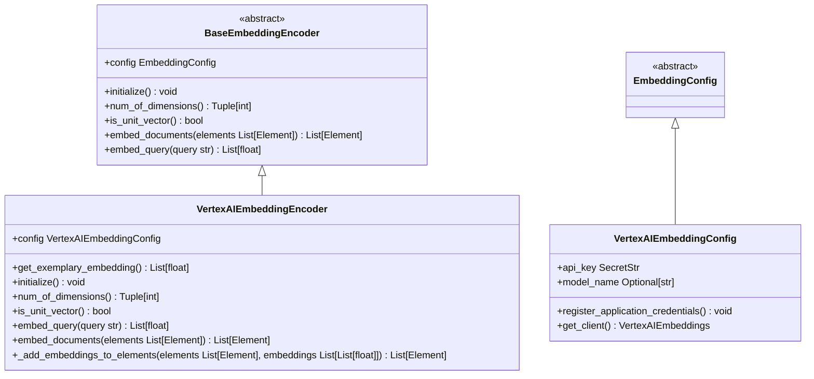
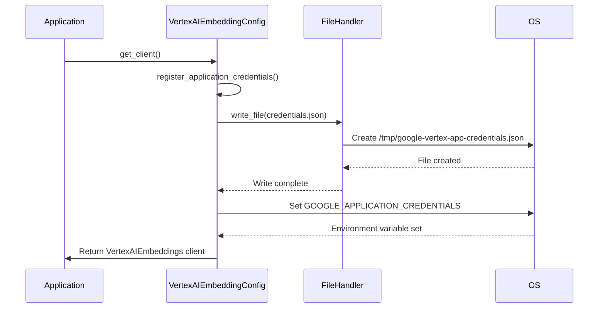
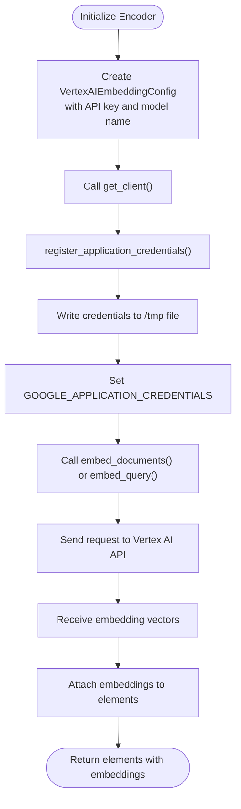

# Vertex AI Embedding Provider

<cite>
**Referenced Files in This Document**   
- [vertexai.py](file://unstructured/embed/vertexai.py)
- [interfaces.py](file://unstructured/embed/interfaces.py)
- [test_vertexai.py](file://test_unstructured/embed/test_vertexai.py)
- [local-embed-vertexai.sh](file://test_unstructured_ingest/src/local-embed-vertexai.sh)
</cite>

## Table of Contents
1. [Introduction](#introduction)
2. [Core Components](#core-components)
3. [Configuration Options](#configuration-options)
4. [Authentication Mechanism](#authentication-mechanism)
5. [API Request and Response Handling](#api-request-and-response-handling)
6. [Usage Examples](#usage-examples)
7. [Error Handling](#error-handling)
8. [Performance Considerations](#performance-considerations)
9. [Cost Management and Model Versioning](#cost-management-and-model-versioning)

## Introduction
The Vertex AI embedding provider implementation in the unstructured library enables integration with Google Cloud's Vertex AI platform for generating text embeddings. This document provides a comprehensive analysis of the VertexAIEmbeddingEncoder class, its configuration, authentication mechanisms, and integration patterns. The implementation leverages LangChain's VertexAIEmbeddings client to interface with Google's text embedding models, providing a standardized interface for embedding document elements within the unstructured processing pipeline.

**Section sources**
- [vertexai.py](file://unstructured/embed/vertexai.py#L1-L79)

## Core Components

The Vertex AI embedding provider consists of two primary components: the `VertexAIEmbeddingConfig` class that manages configuration and authentication, and the `VertexAIEmbeddingEncoder` class that implements the embedding functionality. The implementation follows the provider pattern, inheriting from the base `BaseEmbeddingEncoder` interface which ensures consistency across different embedding providers in the library.

The `VertexAIEmbeddingEncoder` class implements all required methods from the `BaseEmbeddingEncoder` interface, including `embed_documents`, `embed_query`, `num_of_dimensions`, and `is_unit_vector`. These methods provide the core functionality for generating embeddings from document elements and queries. The encoder uses a client pattern to interface with the LangChain VertexAI client, abstracting away the underlying API calls while maintaining a clean separation of concerns.

**Diagram sources**
- [vertexai.py](file://unstructured/embed/vertexai.py#L1-L79)
- [interfaces.py](file://unstructured/embed/interfaces.py#L1-L40)

**Section sources**
- [vertexai.py](file://unstructured/embed/vertexai.py#L1-L79)
- [interfaces.py](file://unstructured/embed/interfaces.py#L1-L40)

## Configuration Options

The Vertex AI embedding provider offers several configuration options through the `VertexAIEmbeddingConfig` class. The primary configuration parameters include the API key for authentication and the model name specification. The default model is set to "textembedding-gecko@001", which represents Google's text embedding model optimized for semantic similarity tasks.

The configuration system uses Pydantic's Field construct to define default values and type validation, ensuring that the configuration is both flexible and robust. The `api_key` field is defined as a `SecretStr` type, which provides built-in protection against accidental exposure of sensitive credentials in logs or error messages.

Additional configuration options could potentially include location/region specification, request timeout settings, and custom endpoint URLs, though these are not currently exposed in the implementation. The configuration pattern follows a dependency injection approach, where the configuration object is passed to the encoder during initialization, allowing for easy testing and configuration management.

**Section sources**
- [vertexai.py](file://unstructured/embed/vertexai.py#L20-L40)

## Authentication Mechanism

The authentication mechanism for the Vertex AI embedding provider is implemented through the `register_application_credentials` method in the `VertexAIEmbeddingConfig` class. This method takes the API key provided in the configuration, parses it as JSON, and writes it to a temporary file in the system's temporary directory. The path to this file is then set in the `GOOGLE_APPLICATION_CREDENTIALS` environment variable, which is the standard way for Google Cloud client libraries to locate service account credentials.

This approach allows the use of service account key JSON files for authentication, which contain the necessary credentials and project information. The implementation creates the credentials file in `/tmp/google-vertex-app-credentials.json`, ensuring that it is accessible to the LangChain VertexAI client when establishing connections to the Vertex AI API.

The authentication process is triggered automatically when the client is created through the `get_client` method, which is decorated with the `requires_dependencies` decorator to ensure that the necessary LangChain packages are available. This lazy initialization pattern ensures that authentication is only performed when actually needed, reducing overhead when the embedding functionality is not used.

**Diagram sources**
- [vertexai.py](file://unstructured/embed/vertexai.py#L24-L38)

**Section sources**
- [vertexai.py](file://unstructured/embed/vertexai.py#L24-L38)

## API Request and Response Handling

The API request and response handling in the Vertex AI embedding provider is abstracted through the LangChain VertexAI client. The `embed_query` and `embed_documents` methods in the `VertexAIEmbeddingEncoder` class serve as the primary interfaces for generating embeddings. When a query or document is passed to these methods, they delegate to the underlying LangChain client, which handles the HTTP communication with the Vertex AI API.

The request formatting follows the standard pattern for text embedding APIs, where text content is sent to the service and numerical embedding vectors are returned. For document embedding, the implementation converts each `Element` object to its string representation before sending it to the API. The response parsing is handled automatically by the LangChain client, which returns numpy arrays containing the embedding vectors.

The `_add_embeddings_to_elements` method is responsible for attaching the generated embeddings to the original document elements, preserving the relationship between the source content and its embedding representation. This method includes an assertion to ensure that the number of embeddings matches the number of input elements, preventing potential data corruption in case of API errors or response mismatches.

**Section sources**
- [vertexai.py](file://unstructured/embed/vertexai.py#L61-L78)

## Usage Examples

The Vertex AI embedding provider can be used in various scenarios, with different authentication methods and configuration options. The implementation is designed to be integrated into the unstructured ingestion pipeline, as demonstrated in the test script `local-embed-vertexai.sh`. This script shows how to configure the embedding provider with environment variables and command-line parameters.

For programmatic usage, the encoder can be initialized with a configuration object containing the API key and model name. The API key should contain the complete service account key JSON, which will be processed by the `register_application_credentials` method. Alternatively, application default credentials can be used by setting the `GOOGLE_APPLICATION_CREDENTIALS` environment variable before initializing the encoder, in which case the `api_key` parameter can be omitted.

The test file `test_vertexai.py` provides an example of how to use the embedding encoder in unit tests, using mocking to isolate the external API dependency. This pattern allows for testing the integration logic without requiring actual API calls or valid credentials.

**Diagram sources**
- [local-embed-vertexai.sh](file://test_unstructured_ingest/src/local-embed-vertexai.sh#L34-L40)
- [test_vertexai.py](file://test_unstructured/embed/test_vertexai.py#L1-L19)

**Section sources**
- [vertexai.py](file://unstructured/embed/vertexai.py#L1-L79)
- [local-embed-vertexai.sh](file://test_unstructured_ingest/src/local-embed-vertexai.sh#L34-L40)
- [test_vertexai.py](file://test_unstructured/embed/test_vertexai.py#L1-L19)

## Error Handling

The current implementation of the Vertex AI embedding provider has limited explicit error handling for common Vertex AI issues such as permission errors, quota limits, and regional availability. The error handling is primarily inherited from the underlying LangChain VertexAI client, which may throw exceptions for authentication failures, API rate limits, or service unavailability.

When permission errors occur, they are typically related to insufficient IAM roles for the service account being used. The service account should have the Vertex AI User role or equivalent permissions to access the embedding API. Quota limits are managed by Google Cloud and may require requesting higher quotas through the Google Cloud Console if the default limits are exceeded.

Regional availability issues may occur if the specified model is not available in the configured region. The implementation currently does not specify a region, relying on the default region configured in the Google Cloud project. To address regional availability, the implementation could be extended to include a location parameter in the configuration.

Network-related errors such as timeouts or connection failures are handled by the HTTP client layer in LangChain, with potential retry mechanisms depending on the specific error type. For production deployments, it is recommended to implement additional error handling and retry logic around the embedding calls to ensure robustness.

**Section sources**
- [vertexai.py](file://unstructured/embed/vertexai.py#L30-L38)

## Performance Considerations

The performance of the Vertex AI embedding provider is influenced by several factors, including network latency, request batching, and integration with other Google Cloud services. Network latency between the client and Google Cloud regions can significantly impact embedding generation time, especially for large documents or high-volume processing.

The current implementation does not explicitly implement request batching, which means that each `embed_documents` call sends all documents in a single request to the Vertex AI API. While this leverages the API's built-in batching capabilities, it may be limited by the maximum request size. For optimal performance with large document sets, implementing client-side batching with configurable batch sizes could improve throughput and reduce memory usage.

Integration with other Google Cloud services can enhance performance through reduced network latency when running in the same region. For example, when processing documents stored in Google Cloud Storage, running the unstructured processing pipeline in the same region can minimize data transfer times. The use of Google Cloud's internal networking can also improve performance compared to external internet connections.

The embedding generation process itself is compute-intensive on Google's side, but the client-side processing is relatively lightweight, primarily involving JSON serialization and deserialization. The use of numpy arrays for embedding storage ensures efficient memory usage and compatibility with downstream machine learning workflows.

**Section sources**
- [vertexai.py](file://unstructured/embed/vertexai.py#L66-L68)

## Cost Management and Model Versioning

Cost management for the Vertex AI embedding provider is primarily determined by the pricing model of the underlying Vertex AI API. The costs are typically based on the number of characters processed, with different pricing tiers for different models and volume levels. The default model "textembedding-gecko@001" has its own pricing structure, which should be considered when estimating processing costs for large document collections.

To manage costs effectively, applications should implement caching mechanisms to avoid reprocessing identical content. Since embeddings for the same text are deterministic, storing generated embeddings in a cache can significantly reduce API calls and associated costs. The implementation could be extended to include cache integration with services like Google Cloud Memorystore or Firestore.

Model versioning in Vertex AI is handled through the model name parameter, where different versions are specified by suffixes like "@001". This allows applications to pin to specific model versions for consistency, or use the latest version for improved quality. The implementation supports specifying the model name in the configuration, enabling easy migration between model versions.

For production applications, it is recommended to monitor usage patterns and costs through Google Cloud's billing and reporting tools. Setting up budget alerts can help prevent unexpected charges, especially during development and testing phases where large volumes of data might be processed.

**Section sources**
- [vertexai.py](file://unstructured/embed/vertexai.py#L22-L23)
- [local-embed-vertexai.sh](file://test_unstructured_ingest/src/local-embed-vertexai.sh#L39-L40)