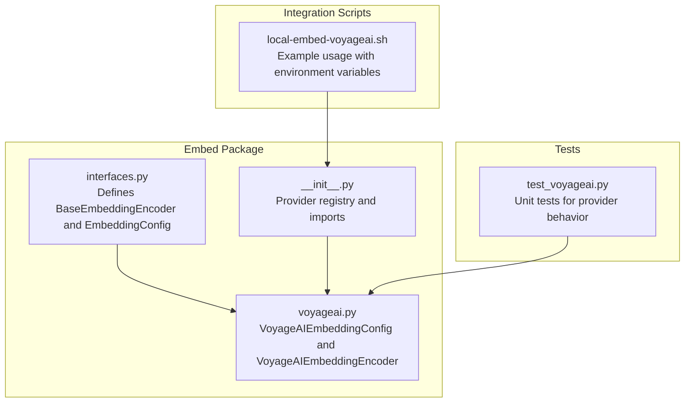
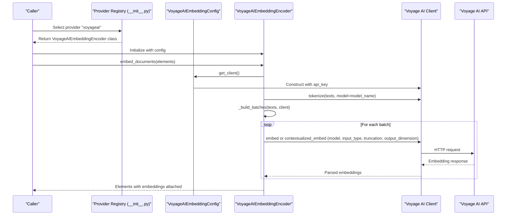
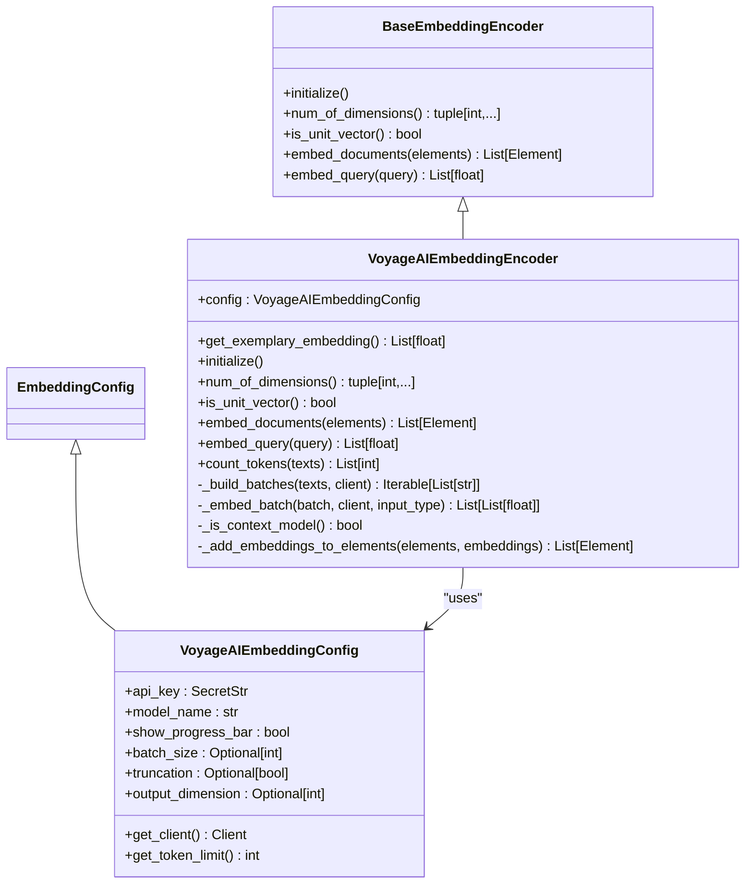
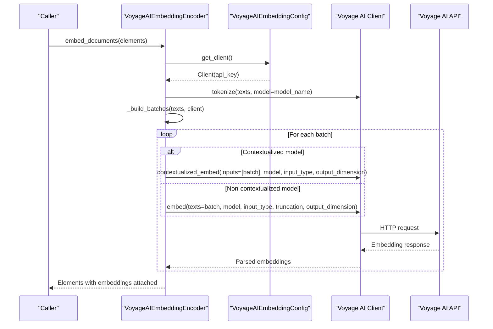
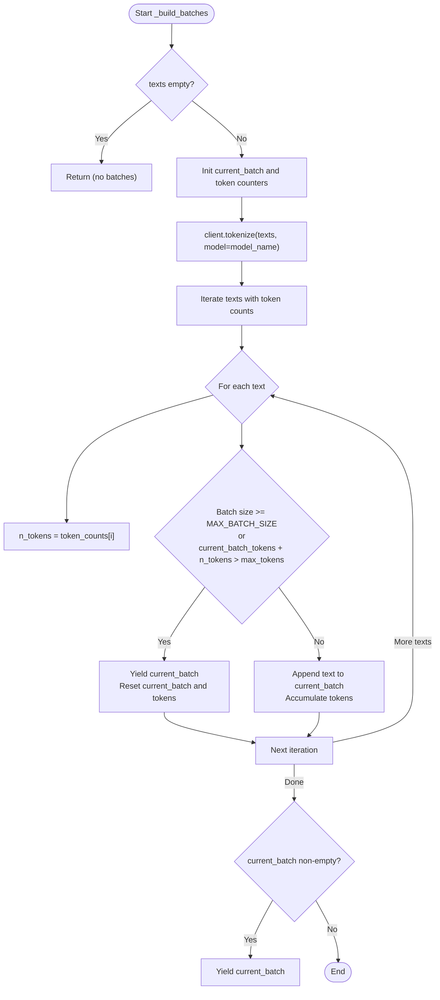
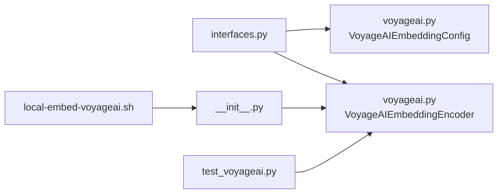

# Voyage AI Embedding Provider

<cite>
**Referenced Files in This Document**
- [voyageai.py](file://unstructured/embed/voyageai.py)
- [interfaces.py](file://unstructured/embed/interfaces.py)
- [__init__.py](file://unstructured/embed/__init__.py)
- [test_voyageai.py](file://test_unstructured/embed/test_voyageai.py)
- [local-embed-voyageai.sh](file://test_unstructured_ingest/src/local-embed-voyageai.sh)
</cite>

## Table of Contents
1. [Introduction](#introduction)
2. [Project Structure](#project-structure)
3. [Core Components](#core-components)
4. [Architecture Overview](#architecture-overview)
5. [Detailed Component Analysis](#detailed-component-analysis)
6. [Dependency Analysis](#dependency-analysis)
7. [Performance Considerations](#performance-considerations)
8. [Troubleshooting Guide](#troubleshooting-guide)
9. [Conclusion](#conclusion)
10. [Appendices](#appendices)

## Introduction
This document explains the Voyage AI embedding provider implementation in the Unstructured library. It focuses on the VoyageAIEmbeddingEncoder class, its configuration options, authentication, request formatting, response parsing, and how it implements the base EmbeddingEncoder interface. It also covers batching strategies, token limits, progress reporting, and practical guidance for selecting appropriate Voyage AI models for multilingual and domain-specific use cases.

## Project Structure
The embedding provider is implemented under the embed package and integrates with the broader embedding framework. The provider registers itself in the embedding registry and exposes a concrete encoder class that conforms to the base interface.

**Diagram sources**
- [interfaces.py](file://unstructured/embed/interfaces.py#L1-L40)
- [__init__.py](file://unstructured/embed/__init__.py#L1-L28)
- [voyageai.py](file://unstructured/embed/voyageai.py#L1-L238)
- [test_voyageai.py](file://test_unstructured/embed/test_voyageai.py#L1-L243)
- [local-embed-voyageai.sh](file://test_unstructured_ingest/src/local-embed-voyageai.sh#L1-L47)

**Section sources**
- [interfaces.py](file://unstructured/embed/interfaces.py#L1-L40)
- [__init__.py](file://unstructured/embed/__init__.py#L1-L28)
- [voyageai.py](file://unstructured/embed/voyageai.py#L1-L238)
- [test_voyageai.py](file://test_unstructured/embed/test_voyageai.py#L1-L243)
- [local-embed-voyageai.sh](file://test_unstructured_ingest/src/local-embed-voyageai.sh#L1-L47)

## Core Components
- VoyageAIEmbeddingConfig: Holds provider configuration including API key, model name, optional progress bar, batch size, truncation, and output dimension. It lazily constructs the underlying Voyage AI client and exposes token limit retrieval based on the selected model.
- VoyageAIEmbeddingEncoder: Implements the base EmbeddingEncoder interface. It supports embedding documents and queries, token counting, and dimension/unit vector inference. It automatically batches inputs respecting token limits and model-specific constraints.

Key responsibilities:
- Authentication: Uses the API key to instantiate the Voyage AI client.
- Request formatting: Chooses between contextualized and non-contextualized embedding APIs depending on the model name; passes model, input type, truncation, and output dimension.
- Response parsing: Converts provider responses into lists of float vectors and attaches them to elements.
- Batching: Computes token counts via the provider’s tokenizer and splits inputs into batches respecting both token limits and a maximum batch size.

**Section sources**
- [voyageai.py](file://unstructured/embed/voyageai.py#L1-L238)
- [interfaces.py](file://unstructured/embed/interfaces.py#L1-L40)

## Architecture Overview
The provider participates in a pluggable embedding framework. The registry maps provider names to encoder classes, enabling selection at runtime. The encoder composes a configuration object that encapsulates provider-specific settings and constructs the external client.

**Diagram sources**
- [__init__.py](file://unstructured/embed/__init__.py#L1-L28)
- [voyageai.py](file://unstructured/embed/voyageai.py#L1-L238)

## Detailed Component Analysis

### VoyageAIEmbeddingConfig
- Fields:
  - api_key: SecretStr for secure storage.
  - model_name: String identifying the Voyage AI model.
  - show_progress_bar: Boolean toggle for progress display during embedding.
  - batch_size: Optional integer to override default batching behavior.
  - truncation: Optional boolean to enable truncation for non-contextualized models.
  - output_dimension: Optional integer to downscale or align embeddings.
- Behavior:
  - get_client(): Lazily creates a Voyage AI client using the API key.
  - get_token_limit(): Returns the maximum tokens allowed per batch for the selected model, with sensible defaults for unknown models.

Implementation highlights:
- Uses a dependency guard to ensure the Voyage AI SDK is available.
- Token limits are defined for a wide range of Voyage AI models, including multilingual and specialized variants.

**Section sources**
- [voyageai.py](file://unstructured/embed/voyageai.py#L1-L84)

### VoyageAIEmbeddingEncoder
- Implements BaseEmbeddingEncoder:
  - initialize(): No-op placeholder.
  - num_of_dimensions(): Infers from a sample query embedding.
  - is_unit_vector(): Checks if the norm is approximately 1.0.
  - embed_documents(): Orchestrates batching, client creation, and embedding calls; attaches embeddings to elements.
  - embed_query(): Embeds a single query string.
  - count_tokens(): Returns token counts for provided texts.
- Batching and tokenization:
  - _build_batches(): Computes token counts for all texts in one call, then iteratively aggregates until either the maximum batch size or token budget is reached.
  - _embed_batch(): Calls contextualized_embed for models containing “context” in the name; otherwise calls embed with model, input_type, truncation, and output_dimension.
- Progress reporting:
  - When show_progress_bar is enabled, wraps batches with a progress iterator; raises a clear ImportError if tqdm is missing.

Unique features:
- Multilingual support: The model list includes dedicated multilingual models.
- Domain-specific models: Includes finance, law, code, multimodal, and instruction-tuned variants.
- Output dimension control: Supports downsampling or alignment via output_dimension.
- Truncation control: Enables truncation for non-contextualized models.

**Section sources**
- [voyageai.py](file://unstructured/embed/voyageai.py#L85-L238)

### Class Relationships

**Diagram sources**
- [interfaces.py](file://unstructured/embed/interfaces.py#L1-L40)
- [voyageai.py](file://unstructured/embed/voyageai.py#L1-L238)

### API Workflow: Embedding Documents

**Diagram sources**
- [voyageai.py](file://unstructured/embed/voyageai.py#L120-L238)

### Batching Logic

**Diagram sources**
- [voyageai.py](file://unstructured/embed/voyageai.py#L88-L129)

## Dependency Analysis
- Internal dependencies:
  - The encoder depends on the base interface and configuration classes.
  - The configuration depends on the external Voyage AI SDK and Pydantic for validation.
- External dependencies:
  - The provider requires the voyageai Python SDK.
  - Optional progress reporting depends on tqdm.
- Provider registration:
  - The registry maps the provider name "voyageai" to the encoder class, enabling dynamic selection.

**Diagram sources**
- [interfaces.py](file://unstructured/embed/interfaces.py#L1-L40)
- [voyageai.py](file://unstructured/embed/voyageai.py#L1-L238)
- [__init__.py](file://unstructured/embed/__init__.py#L1-L28)
- [test_voyageai.py](file://test_unstructured/embed/test_voyageai.py#L1-L243)
- [local-embed-voyageai.sh](file://test_unstructured_ingest/src/local-embed-voyageai.sh#L1-L47)

**Section sources**
- [__init__.py](file://unstructured/embed/__init__.py#L1-L28)
- [voyageai.py](file://unstructured/embed/voyageai.py#L1-L238)
- [interfaces.py](file://unstructured/embed/interfaces.py#L1-L40)

## Performance Considerations
- Token limits:
  - The encoder retrieves model-specific token budgets and enforces them during batching. Some models have very high limits (e.g., lite variants), while others are more constrained (e.g., contextual models).
- Batch size:
  - A maximum batch size is enforced to prevent oversized requests. The encoder computes token counts for all texts in one call to optimize throughput.
- Output dimension:
  - Downscaling via output_dimension reduces vector size and can improve downstream performance.
- Truncation:
  - Enabling truncation for non-contextualized models can reduce token usage and keep within limits.
- Progress reporting:
  - Enabling show_progress_bar adds overhead but improves visibility for long-running jobs.

Practical guidance:
- For long documents or high-token-content, prefer models with higher token limits or adjust output_dimension/truncation.
- Monitor response times and adjust batch sizes if encountering rate limits or timeouts.

**Section sources**
- [voyageai.py](file://unstructured/embed/voyageai.py#L1-L84)
- [voyageai.py](file://unstructured/embed/voyageai.py#L88-L129)
- [test_voyageai.py](file://test_unstructured/embed/test_voyageai.py#L126-L160)

## Troubleshooting Guide
Common issues and resolutions:
- Missing dependencies:
  - The provider requires the voyageai SDK. If not installed, the configuration’s get_client method will raise a dependency-related error. Install the provider extras as indicated by the dependency guard.
- Missing progress bar dependency:
  - If show_progress_bar is enabled but tqdm is not installed, an ImportError is raised with a clear message instructing to install tqdm.
- Empty inputs:
  - Both embed_documents and count_tokens handle empty lists gracefully and return empty results.
- Model availability and limits:
  - Unknown models fall back to a default token limit. Ensure the model name is correct and supported by the provider.
- Authentication failures:
  - Incorrect or missing API key will cause client instantiation to fail. Verify the API key environment variable and ensure it is set before invoking the encoder.

Validation and examples from tests:
- Token counting and batching correctness are validated in tests.
- Contextualized vs non-contextualized embedding behavior is verified.
- Output dimension and truncation parameters are passed through to the provider.

**Section sources**
- [voyageai.py](file://unstructured/embed/voyageai.py#L1-L84)
- [voyageai.py](file://unstructured/embed/voyageai.py#L120-L198)
- [test_voyageai.py](file://test_unstructured/embed/test_voyageai.py#L1-L243)

## Conclusion
The Voyage AI embedding provider offers a robust, configurable integration with the Unstructured embedding framework. It supports a broad set of Voyage AI models, including multilingual and domain-specific variants, and provides flexible controls for token limits, truncation, and output dimension. The encoder’s automatic batching and token-aware splitting help ensure efficient and reliable embedding workflows.

## Appendices

### Initialization and Usage Patterns
- Provider selection:
  - The registry maps the provider name "voyageai" to the encoder class, enabling dynamic selection.
- Example usage script:
  - An integration script demonstrates setting the API key via environment variables and invoking the provider with a specific model.

**Section sources**
- [__init__.py](file://unstructured/embed/__init__.py#L1-L28)
- [local-embed-voyageai.sh](file://test_unstructured_ingest/src/local-embed-voyageai.sh#L1-L47)

### Model Selection Guidance
- Multilingual:
  - Choose models explicitly labeled as multilingual for broader language coverage.
- Domain-specific:
  - Use finance, law, code, or multimodal models when content aligns with those domains.
- Contextualized vs non-contextualized:
  - Contextualized models may offer stronger performance for certain tasks; the encoder detects and routes requests accordingly.
- Dimension and truncation:
  - Adjust output_dimension to match downstream requirements and use truncation to fit within token limits.

**Section sources**
- [voyageai.py](file://unstructured/embed/voyageai.py#L1-L84)
- [test_voyageai.py](file://test_unstructured/embed/test_voyageai.py#L1-L243)