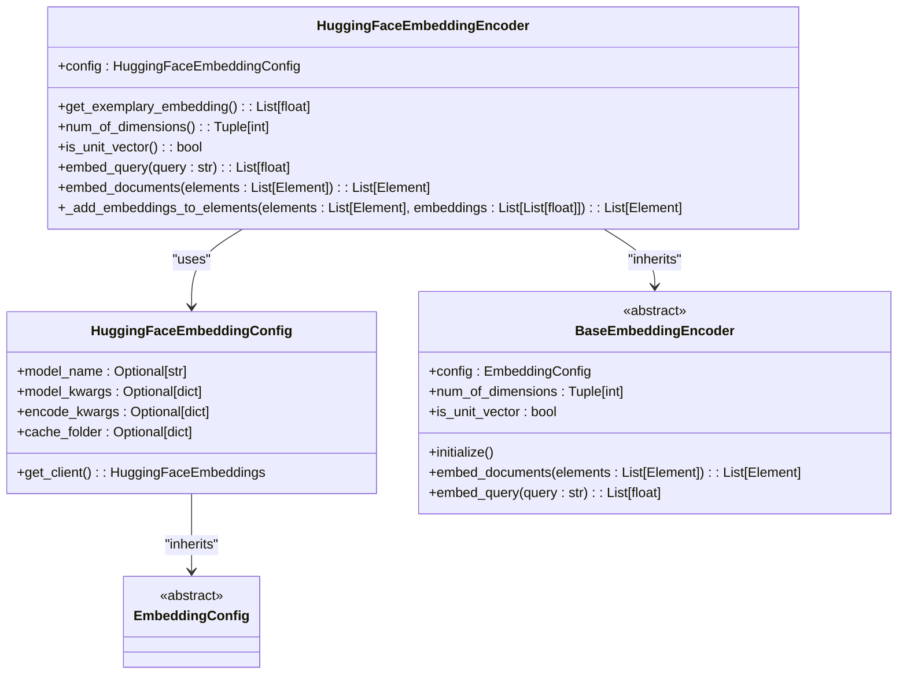
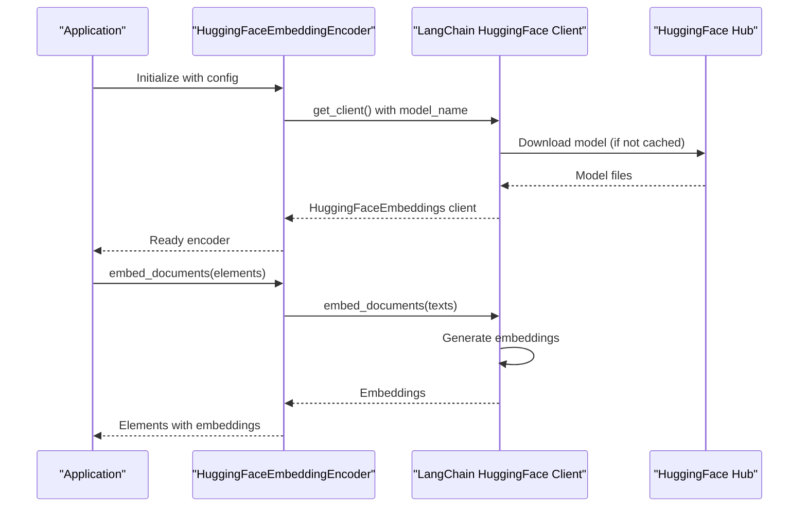
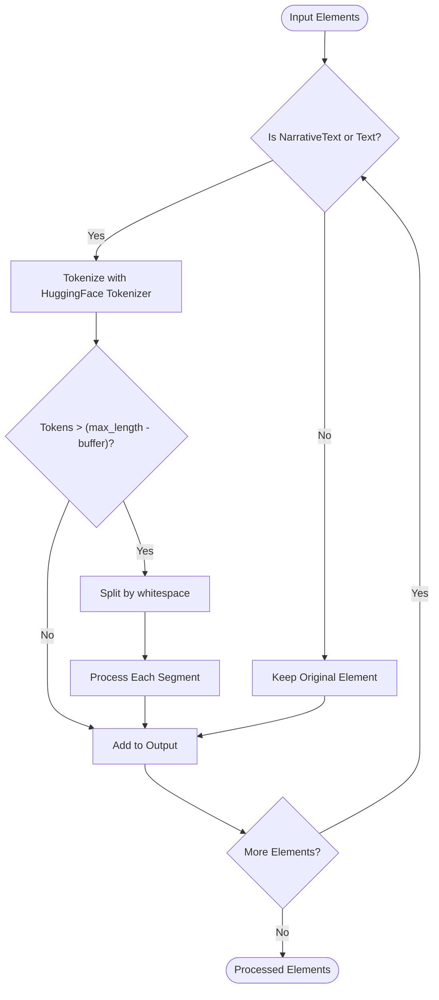

# HuggingFace Embedding Integration

<cite>
**Referenced Files in This Document**   
- [huggingface.py](file://unstructured/embed/huggingface.py)
- [huggingface.py](file://unstructured/staging/huggingface.py)
- [interfaces.py](file://unstructured/embed/interfaces.py)
- [__init__.py](file://unstructured/embed/__init__.py)
- [huggingface.txt](file://requirements/huggingface.txt)
</cite>

## Table of Contents
1. [Introduction](#introduction)
2. [HuggingFaceEmbeddingEncoder Implementation](#huggingfaceembeddingencoder-implementation)
3. [Configuration Parameters](#configuration-parameters)
4. [Authentication and Environment Setup](#authentication-and-environment-setup)
5. [Document Processing and Tokenization](#document-processing-and-tokenization)
6. [Performance Considerations](#performance-considerations)
7. [Error Handling and Troubleshooting](#error-handling-and-troubleshooting)
8. [Integration and Usage Examples](#integration-and-usage-examples)
9. [Dependencies and Installation](#dependencies-and-installation)
10. [Conclusion](#conclusion)

## Introduction
The HuggingFace embedding integration in the unstructured library provides a comprehensive solution for generating embeddings using HuggingFace models. This documentation details the implementation of the HuggingFaceEmbeddingEncoder class, configuration options, and best practices for integrating HuggingFace embeddings into document processing workflows. The integration leverages the LangChain HuggingFace embeddings interface to provide access to a wide range of open-source models for text embedding generation.

**Section sources**
- [huggingface.py](file://unstructured/embed/huggingface.py#L1-L68)

## HuggingFaceEmbeddingEncoder Implementation

The HuggingFaceEmbeddingEncoder class implements the BaseEmbeddingEncoder interface to provide HuggingFace embedding capabilities within the unstructured library. The implementation follows a modular design with clear separation between configuration and encoding logic.



**Diagram sources**
- [huggingface.py](file://unstructured/embed/huggingface.py#L1-L68)

**Section sources**
- [huggingface.py](file://unstructured/embed/huggingface.py#L1-L68)

## Configuration Parameters

The HuggingFaceEmbeddingEncoder is configured through the HuggingFaceEmbeddingConfig class, which provides several key parameters for customizing embedding generation:

### Model Configuration
The configuration supports the following parameters:

| Parameter | Default Value | Description |
|---------|-------------|-------------|
| model_name | "sentence-transformers/all-MiniLM-L6-v2" | The HuggingFace model to use for embeddings |
| model_kwargs | {"device": "cpu"} | Additional arguments passed to the model constructor |
| encode_kwargs | {"normalize_embeddings": False} | Arguments passed during the encoding process |
| cache_folder | None | Directory to cache downloaded models |

The model_name parameter allows users to specify any HuggingFace sentence transformer model, with the default being the efficient all-MiniLM-L6-v2 model. The model_kwargs parameter enables configuration of the execution environment, such as specifying GPU acceleration with {"device": "cuda"}.

**Section sources**
- [huggingface.py](file://unstructured/embed/huggingface.py#L17-L21)

## Authentication and Environment Setup

The HuggingFace embedding integration does not require API keys for model access, as it leverages open-source models hosted on the HuggingFace Hub. However, authentication may be required for private models or when rate limits are encountered.

### Environment Variables
The integration respects HuggingFace's standard environment variables:
- `HF_TOKEN`: Authentication token for accessing private models
- `HF_HOME`: Directory to store cached models and datasets
- `HF_HUB_OFFLINE`: When set to 1, forces offline mode using only cached models

For enterprise deployments, users can configure proxy settings through standard environment variables like `HTTP_PROXY` and `HTTPS_PROXY`.



**Diagram sources**
- [huggingface.py](file://unstructured/embed/huggingface.py#L27-L32)
- [huggingface.py](file://unstructured/embed/huggingface.py#L50-L58)

**Section sources**
- [huggingface.py](file://unstructured/embed/huggingface.py#L23-L32)

## Document Processing and Tokenization

The unstructured library provides specialized utilities for preparing documents for HuggingFace models, addressing the tokenization and chunking requirements of transformer models.

### Attention Window Management
The staging module includes functionality to chunk text according to model attention windows:

```python
def chunk_by_attention_window(
    text: str,
    tokenizer: PreTrainedTokenizer,
    buffer: int = 2,
    max_input_size: Optional[int] = None,
    split_function: Callable[[str], List[str]] = lambda text: text.split(" "),
    chunk_separator: str = " ",
) -> List[str]
```

This function splits text into chunks that fit within the model's attention window, with configurable buffer space for special tokens. The buffer parameter ensures that special tokens like [CLS] and [SEP] have sufficient space in the input sequence.

### Document Staging
The `stage_for_transformers` function processes unstructured elements for transformer models:

```python
def stage_for_transformers(
    elements: List[Text],
    tokenizer: PreTrainedTokenizer,
    **chunk_kwargs,
) -> List[Element]
```

This function selectively chunks narrative text and other lengthy elements while preserving structural elements like titles that typically fit within attention windows.



**Diagram sources**
- [huggingface.py](file://unstructured/staging/huggingface.py#L32-L99)
- [huggingface.py](file://unstructured/staging/huggingface.py#L9-L29)

**Section sources**
- [huggingface.py](file://unstructured/staging/huggingface.py#L1-L99)

## Performance Considerations

### Model Loading and Caching
HuggingFace models are automatically cached in the user's home directory under ~/.cache/huggingface. The first initialization may take several minutes depending on model size and network speed. Subsequent uses load from the local cache, significantly reducing startup time.

For production deployments, pre-caching models is recommended:

```bash
# Pre-download model to cache
python -c "from langchain_huggingface.embeddings import HuggingFaceEmbeddings; \
HuggingFaceEmbeddings(model_name='your-model-name')"
```

### Input Length Limits
Transformer models have fixed context window sizes, typically ranging from 512 to 8192 tokens. The unstructured library handles this through:

1. **Automatic chunking**: Long documents are split into chunks that fit within the model's context window
2. **Buffer management**: Configurable buffer space for special tokens
3. **Intelligent splitting**: Text is split at natural boundaries (spaces, punctuation) to preserve meaning

### Batching Strategies
The implementation processes documents in batches to optimize GPU utilization:

- Multiple documents are processed in parallel when possible
- Batch size is determined by available GPU memory
- CPU fallback is available for memory-constrained environments

## Error Handling and Troubleshooting

### Common Issues and Solutions

| Issue | Cause | Solution |
|------|------|---------|
| ValueError: buffer too big | Buffer exceeds model_max_length | Reduce buffer size or use smaller buffer value |
| ValueError: chunk exceeds window | Individual segment too large | Use custom split_function to break text into smaller pieces |
| Model download failures | Network connectivity or authentication | Set HF_TOKEN for private models or check network connectivity |
| CUDA out of memory | GPU memory insufficient for model | Use CPU device or smaller model |

### Validation Methods
The HuggingFaceEmbeddingEncoder provides built-in validation methods:

- `get_exemplary_embedding()`: Generates a sample embedding to verify configuration
- `num_of_dimensions()`: Returns the embedding dimensionality
- `is_unit_vector()`: Checks if embeddings are normalized

These methods are called during initialization to validate the encoder setup.

**Section sources**
- [huggingface.py](file://unstructured/embed/huggingface.py#L39-L48)
- [huggingface.py](file://unstructured/staging/huggingface.py#L57-L61)
- [huggingface.py](file://unstructured/staging/huggingface.py#L75-L82)

## Integration and Usage Examples

### Basic Usage
```python
from unstructured.embed.huggingface import HuggingFaceEmbeddingEncoder, HuggingFaceEmbeddingConfig

# Initialize with default configuration
config = HuggingFaceEmbeddingConfig()
encoder = HuggingFaceEmbeddingEncoder(config=config)

# Generate embeddings for documents
elements_with_embeddings = encoder.embed_documents(elements)
```

### Custom Model Configuration
```python
# Configure with custom model and GPU acceleration
config = HuggingFaceEmbeddingConfig(
    model_name="intfloat/e5-large-v2",
    model_kwargs={"device": "cuda"},
    encode_kwargs={"normalize_embeddings": True}
)
encoder = HuggingFaceEmbeddingEncoder(config=config)
```

### Document Processing Pipeline
```python
from transformers import AutoTokenizer
from unstructured.staging.huggingface import stage_for_transformers

# Load tokenizer for your model
tokenizer = AutoTokenizer.from_pretrained("sentence-transformers/all-MiniLM-L6-v2")

# Stage documents for transformer models
processed_elements = stage_for_transformers(
    elements, 
    tokenizer, 
    buffer=10
)

# Generate embeddings
embeddings = encoder.embed_documents(processed_elements)
```

**Section sources**
- [huggingface.py](file://unstructured/embed/huggingface.py#L50-L58)
- [huggingface.py](file://unstructured/staging/huggingface.py#L9-L29)

## Dependencies and Installation

The HuggingFace embedding integration requires specific dependencies that can be installed via pip:

```bash
# Install HuggingFace dependencies
pip install -r requirements/huggingface.txt
```

Key dependencies include:
- `transformers`: HuggingFace's transformer models library
- `torch`: PyTorch for model execution
- `sentencepiece`: Tokenization support
- `safetensors`: Secure tensor loading
- `huggingface-hub`: Model download and caching

The integration is automatically registered in the unstructured library's embedding provider map:

```python
EMBEDDING_PROVIDER_TO_CLASS_MAP = {
    "langchain-huggingface": HuggingFaceEmbeddingEncoder,
    # ... other providers
}
```

**Section sources**
- [huggingface.txt](file://requirements/huggingface.txt#L1-L113)
- [__init__.py](file://unstructured/embed/__init__.py#L11-L19)

## Conclusion
The HuggingFace embedding integration in the unstructured library provides a robust solution for generating text embeddings using state-of-the-art transformer models. By leveraging the LangChain HuggingFace interface, it offers access to thousands of open-source models while maintaining a consistent API with other embedding providers in the ecosystem. The integration includes comprehensive support for document preprocessing, attention window management, and performance optimization, making it suitable for both research and production use cases.

The modular design allows for easy customization of model parameters and processing workflows, while the built-in error handling and validation ensure reliable operation. For optimal performance, users should consider pre-caching models, selecting appropriate model sizes for their hardware constraints, and configuring batch processing parameters based on their specific use case requirements.