# MixedBreadAI Embedding Integration

<cite>
**Referenced Files in This Document**   
- [mixedbreadai.py](file://unstructured/embed/mixedbreadai.py)
- [interfaces.py](file://unstructured/embed/interfaces.py)
- [test_mixedbreadai.py](file://test_unstructured/embed/test_mixedbreadai.py)
- [local-embed-mixedbreadai.sh](file://test_unstructured_ingest/src/local-embed-mixedbreadai.sh)
</cite>

## Table of Contents
1. [Introduction](#introduction)
2. [Core Components](#core-components)
3. [Configuration Parameters](#configuration-parameters)
4. [Authentication Methods](#authentication-methods)
5. [API Request/Response Schema](#api-requestresponse-schema)
6. [Rate Limiting and Performance](#rate-limiting-and-performance)
7. [Error Handling Strategies](#error-handling-strategies)
8. [Usage Examples](#usage-examples)
9. [Performance Considerations](#performance-considerations)
10. [Troubleshooting Guide](#troubleshooting-guide)

## Introduction
The MixedBreadAI embedding integration in the unstructured library provides a robust interface for generating vector embeddings from document elements. This documentation details the implementation of the `MixedBreadAIEmbeddingEncoder` class, configuration options, authentication mechanisms, and practical usage patterns for integrating MixedBreadAI's embedding capabilities into document processing workflows.

**Section sources**
- [mixedbreadai.py](file://unstructured/embed/mixedbreadai.py#L1-L20)

## Core Components

The MixedBreadAI embedding functionality is implemented through two primary components: the `MixedbreadAIEmbeddingConfig` configuration class and the `MixedbreadAIEmbeddingEncoder` encoder class. These components work together to provide a seamless interface for generating embeddings from document elements.


**Diagram sources**
- [mixedbreadai.py](file://unstructured/embed/mixedbreadai.py#L25-L70)

**Section sources**
- [mixedbreadai.py](file://unstructured/embed/mixedbreadai.py#L25-L70)

## Configuration Parameters

The MixedBreadAI embedding integration supports several configuration parameters that control the behavior of the embedding process. These parameters are defined in the `MixedbreadAIEmbeddingConfig` class and can be customized based on specific use cases.

### Configuration Options

| Parameter | Default Value | Description |
|---------|-------------|-------------|
| api_key | Environment variable MXBAI_API_KEY | Authentication key for MixedBreadAI API access |
| model_name | mixedbread-ai/mxbai-embed-large-v1 | Name of the embedding model to use |
| batch_size | 128 | Number of texts to process in a single API request |
| timeout | 60 seconds | Request timeout duration |
| max_retries | 3 | Maximum number of retry attempts for failed requests |
| encoding_format | float | Format for the embedding vector encoding |
| truncation_strategy | end | Strategy for handling text that exceeds model limits |

**Section sources**
- [mixedbreadai.py](file://unstructured/embed/mixedbreadai.py#L13-L17)
- [mixedbreadai.py](file://unstructured/embed/mixedbreadai.py#L34-L40)

## Authentication Methods

The MixedBreadAI embedding integration supports multiple authentication methods for accessing the MixedBreadAI API. These methods ensure secure access to the embedding services while providing flexibility in configuration.

### Environment Variable Usage

The integration automatically checks for the `MXBAI_API_KEY` environment variable as the default source for the API key. This approach simplifies deployment and enhances security by avoiding hardcoded credentials.


**Diagram sources**
- [mixedbreadai.py](file://unstructured/embed/mixedbreadai.py#L34-L36)

### Constructor-Based Authentication

Alternatively, the API key can be provided directly through the constructor, allowing for programmatic configuration and dynamic key management.

```python
config = MixedbreadAIEmbeddingConfig(
    api_key="your-api-key-here",
    model_name="mixedbread-ai/mxbai-embed-large-v1"
)
```

**Section sources**
- [mixedbreadai.py](file://unstructured/embed/mixedbreadai.py#L80-L84)

## API Request/Response Schema

The MixedBreadAI embedding integration follows a standardized request/response pattern when communicating with the MixedBreadAI API. Understanding this schema is essential for effective integration and troubleshooting.

### Request Structure

When making embedding requests, the integration constructs requests with the following parameters:


**Diagram sources**
- [mixedbreadai.py](file://unstructured/embed/mixedbreadai.py#L123-L130)

### Response Processing

The response from the MixedBreadAI API is processed to extract embedding vectors and associate them with the original document elements.

**Section sources**
- [mixedbreadai.py](file://unstructured/embed/mixedbreadai.py#L132-L133)

## Rate Limiting and Performance

The MixedBreadAI embedding integration includes built-in mechanisms to handle rate limiting and optimize performance for large-scale document processing.

### Batching Strategy

The integration automatically batches requests to optimize API usage and minimize latency. With a default batch size of 128 texts per request, the system efficiently processes large volumes of content while respecting API rate limits.

```mermaid
flowchart LR
Texts[Texts to embed] --> Splitter["Split into batches<br/>of 128 texts"]
Splitter --> Batch1["Batch 1: 128 texts"]
Splitter --> Batch2["Batch 2: 128 texts"]
Splitter --> BatchN["Batch N: ≤128 texts"]
Batch1 --> API["MixedBreadAI API"]
Batch2 --> API
BatchN --> API
API --> Merger["Merge responses"]
Merger --> Embeddings["Return embeddings"]
```



**Diagram sources**
- [mixedbreadai.py](file://unstructured/embed/mixedbreadai.py#L116-L117)

### Request Configuration

The integration configures each request with optimal settings for reliability and performance:

- **Max retries**: 3 attempts for failed requests
- **Timeout**: 60 seconds per request
- **User-Agent**: Custom header for identification
- **Normalized embeddings**: Enabled by default

**Section sources**
- [mixedbreadai.py](file://unstructured/embed/mixedbreadai.py#L88-L92)

## Error Handling Strategies

The MixedBreadAI embedding integration implements comprehensive error handling to ensure robust operation in various scenarios.

### Initialization Validation

During initialization, the system validates that required configuration parameters are present, providing clear error messages when authentication is missing.

```mermaid
flowchart TD
Initialize[initialize()] --> CheckAPIKey{"API key exists?"}
CheckAPIKey --> |No| RaiseError["Raise ValueError<br/>with instructions"]
CheckAPIKey --> |Yes| CreateOptions["Create RequestOptions"]
CreateOptions --> Complete["Initialization complete"]
RaiseError --> Complete
```

**Diagram sources**
- [mixedbreadai.py](file://unstructured/embed/mixedbreadai.py#L78-L84)

### Error Messages

The integration provides descriptive error messages that guide users on how to resolve common issues, particularly authentication problems.

**Section sources**
- [mixedbreadai.py](file://unstructured/embed/mixedbreadai.py#L80-L84)

## Usage Examples

The MixedBreadAI embedding integration can be used in various scenarios to enhance document processing workflows.

### Basic Document Embedding

```python
from unstructured.embed.mixedbreadai import MixedbreadAIEmbeddingConfig, MixedbreadAIEmbeddingEncoder
from unstructured.documents.elements import Text

# Configure the embedding encoder
config = MixedbreadAIEmbeddingConfig(
    api_key="your-api-key",
    model_name="mixedbread-ai/mxbai-embed-large-v1"
)

# Create the encoder
encoder = MixedbreadAIEmbeddingEncoder(config=config)

# Embed document elements
elements = [Text("This is sentence 1"), Text("This is sentence 2")]
embedded_elements = encoder.embed_documents(elements)
```

**Section sources**
- [test_mixedbreadai.py](file://test_unstructured/embed/test_mixedbreadai.py#L28-L36)

### Query Embedding

For search and retrieval applications, individual queries can be embedded:

```python
# Embed a single query
query_embedding = encoder.embed_query("What is the meaning of life?")
```

**Section sources**
- [mixedbreadai.py](file://unstructured/embed/mixedbreadai.py#L168-L178)

### Command Line Integration

The integration can also be used through command-line interfaces, as demonstrated in the test script:

```bash
unstructured-ingest local \
  --input-path example-docs/book-war-and-peace-1p.txt \
  --embedding-provider "mixedbread-ai" \
  --embedding-api-key "$MXBAI_API_KEY" \
  --embedding-model-name "mixedbread-ai/mxbai-embed-large-v1"
```

**Section sources**
- [local-embed-mixedbreadai.sh](file://test_unstructured_ingest/src/local-embed-mixedbreadai.sh#L35-L37)

## Performance Considerations

The MixedBreadAI embedding integration is designed with performance optimization in mind, addressing key factors that impact embedding generation efficiency.

### Input Length Limits

The integration handles text inputs of varying lengths by leveraging the MixedBreadAI API's built-in truncation capabilities with the "end" strategy, ensuring consistent processing of long documents.

### Latency Optimization

Several factors contribute to latency optimization:

- **Batching**: Processing multiple texts in parallel requests
- **Caching**: Exemplary embeddings are cached for dimension detection
- **Connection reuse**: The MixedBreadAI client manages connection pooling

### Dimension Detection

The system automatically detects embedding dimensions by generating an exemplary embedding:

```python
@property
def num_of_dimensions(self):
    """Get the number of dimensions for the embeddings."""
    exemplary_embedding = self.get_exemplary_embedding()
    return np.shape(exemplary_embedding)
```

**Section sources**
- [mixedbreadai.py](file://unstructured/embed/mixedbreadai.py#L95-L98)

## Troubleshooting Guide

This section addresses common issues encountered when using the MixedBreadAI embedding integration.

### Authentication Failures

**Symptoms**: ValueError with message "The Mixedbread AI API key must be specified."

**Solutions**:
1. Set the MXBAI_API_KEY environment variable
2. Pass the API key directly in the configuration constructor
3. Verify the API key format and validity

**Section sources**
- [mixedbreadai.py](file://unstructured/embed/mixedbreadai.py#L80-L84)

### Rate Limit Exceeded

**Symptoms**: API requests failing after multiple attempts

**Solutions**:
1. Implement exponential backoff in addition to the built-in retry mechanism
2. Reduce batch size to decrease request frequency
3. Monitor usage against MixedBreadAI API rate limits

### Network Timeouts

**Symptoms**: Requests failing after 60 seconds

**Solutions**:
1. Check network connectivity to the MixedBreadAI API endpoints
2. Verify firewall rules allow outbound connections
3. Consider increasing timeout settings if supported by the API

### Model Compatibility Issues

**Symptoms**: Unexpected embedding dimensions or errors related to model names

**Solutions**:
1. Verify the model name is correctly specified
2. Check MixedBreadAI documentation for supported models
3. Use the default model if encountering compatibility issues

**Section sources**
- [mixedbreadai.py](file://unstructured/embed/mixedbreadai.py#L38-L40)