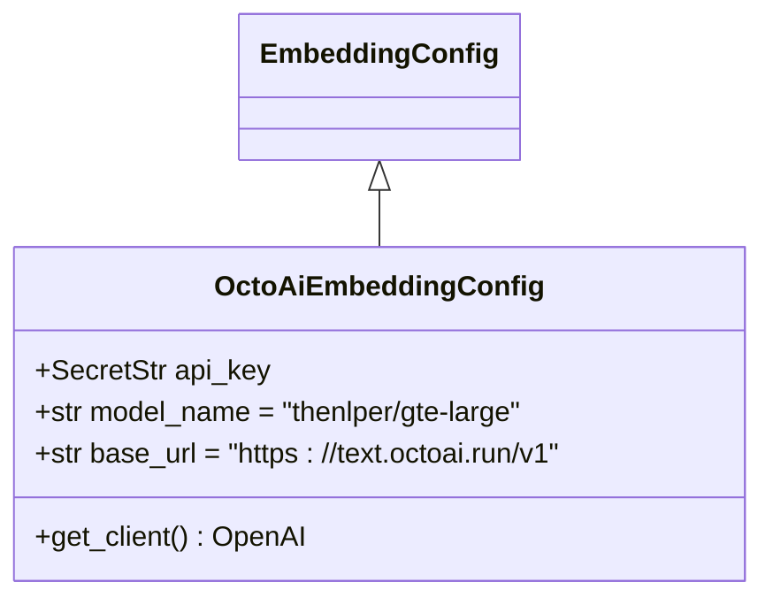
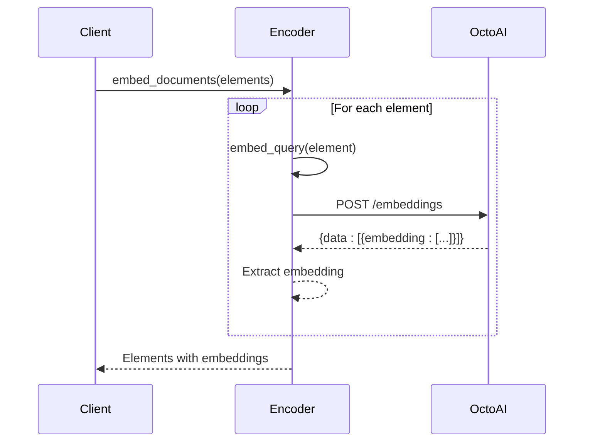

# OctoAI Embedding Integration

<cite>
**Referenced Files in This Document**   
- [octoai.py](file://unstructured/embed/octoai.py)
- [interfaces.py](file://unstructured/embed/interfaces.py)
- [test_octoai.py](file://test_unstructured/embed/test_octoai.py)
</cite>

## Table of Contents
1. [Introduction](#introduction)
2. [Configuration Parameters](#configuration-parameters)
3. [Authentication Methods](#authentication-methods)
4. [API Request/Response Schema](#api-requestresponse-schema)
5. [Performance Considerations](#performance-considerations)
6. [Error Handling Strategies](#error-handling-strategies)
7. [Usage Examples](#usage-examples)
8. [Troubleshooting Guide](#troubleshooting-guide)
9. [Version Compatibility](#version-compatibility)
10. [Unique Features](#unique-features)

## Introduction
The OctoAI embedding integration in the unstructured library provides a seamless way to generate embeddings for document elements using OctoAI's text embedding service. The implementation leverages the OpenAI SDK to communicate with OctoAI's API endpoint, allowing users to take advantage of high-quality embedding models for various document processing tasks. This integration follows the same interface pattern as other embedding providers in the library, ensuring consistency across different embedding services.

**Section sources**
- [octoai.py](file://unstructured/embed/octoai.py#L1-L70)

## Configuration Parameters
The OctoAI embedding integration is configured through the `OctoAiEmbeddingConfig` class, which extends the base `EmbeddingConfig` class. Key configuration parameters include:

- **api_key**: Required authentication credential for accessing the OctoAI API, stored as a `SecretStr` for security
- **model_name**: Specifies the embedding model to use, defaulting to "thenlper/gte-large"
- **base_url**: The API endpoint URL, defaulting to "https://text.octoai.run/v1"

The configuration class provides a `get_client()` method that creates and returns an OpenAI client instance configured with the provided API key and base URL. This implementation allows for easy customization of the embedding model and endpoint while maintaining secure handling of authentication credentials.



**Diagram sources**
- [octoai.py](file://unstructured/embed/octoai.py#L17-L31)

**Section sources**
- [octoai.py](file://unstructured/embed/octoai.py#L17-L31)

## Authentication Methods
Authentication for the OctoAI embedding service is handled through API key authentication. The API key must be provided when creating an instance of `OctoAiEmbeddingConfig`. The key is stored as a `SecretStr` from Pydantic to ensure secure handling and prevent accidental exposure in logs or error messages.

The implementation requires the `openai` and `tiktoken` packages, which are specified as dependencies with the "embed-octoai" extras requirement. When the `get_client()` method is called, it extracts the secret value from the `SecretStr` and passes it to the OpenAI client constructor along with the base URL. This approach ensures that the API key is only exposed when necessary for API communication while maintaining security throughout the rest of the application.

**Section sources**
- [octoai.py](file://unstructured/embed/octoai.py#L17-L31)

## API Request/Response Schema
The OctoAI embedding API follows the OpenAI embeddings API schema, with requests and responses structured accordingly. When making an embedding request:

- **Request**: The input text is sent to the API with the specified model name. The request is made through the OpenAI client's `embeddings.create()` method, passing the input text and model parameters.
- **Response**: The API returns a response object containing the generated embeddings. The implementation extracts the first embedding from the response data array (`response.data[0].embedding`).

The `embed_query()` method handles single text inputs, while `embed_documents()` processes multiple document elements by calling `embed_query()` for each element. The response schema is consistent with OpenAI's embedding API, ensuring compatibility with existing tooling and workflows that expect this format.



**Diagram sources**
- [octoai.py](file://unstructured/embed/octoai.py#L53-L61)

**Section sources**
- [octoai.py](file://unstructured/embed/octoai.py#L53-L61)

## Performance Considerations
The current implementation of the OctoAI embedding encoder processes documents sequentially, with each element being embedded individually through separate API calls. This approach has several performance implications:

- **Input Length Limits**: The implementation does not currently implement batching of multiple texts in a single API request, which could improve efficiency for large numbers of small texts.
- **Latency**: Each document element requires a separate round-trip to the API, potentially increasing overall processing time for documents with many elements.
- **Rate Limiting**: The sequential processing model helps avoid hitting rate limits, but could be optimized with more sophisticated batching and retry strategies.

The encoder determines the number of dimensions by generating an exemplary embedding using a simple query ("Q") and examining its shape. It also checks if embeddings are unit vectors by calculating the norm of the exemplary embedding. These operations add minimal overhead but ensure compatibility with downstream applications that may have specific requirements for embedding properties.

**Section sources**
- [octoai.py](file://unstructured/embed/octoai.py#L39-L51)

## Error Handling Strategies
The OctoAI embedding integration inherits its error handling from the underlying OpenAI client and implements several strategies to ensure robust operation:

- **Dependency Management**: The `@requires_dependencies` decorator ensures that required packages (`openai` and `tiktoken`) are available before attempting to create a client, providing clear error messages if dependencies are missing.
- **API Communication**: Errors from the OctoAI API are handled by the OpenAI client, which raises appropriate exceptions that can be caught and handled by the calling application.
- **Data Integrity**: The `_add_embeddings_to_elements` method includes an assertion to ensure that the number of elements matches the number of embeddings, preventing data corruption.

The implementation does not include specific retry logic or circuit breaker patterns, relying instead on the OpenAI client's built-in retry mechanisms. Applications using this integration should implement additional error handling as needed for their specific use cases, particularly for handling network timeouts and rate limiting.

**Section sources**
- [octoai.py](file://unstructured/embed/octoai.py#L22-L25)

## Usage Examples
To use the OctoAI embedding integration, create an instance of `OctoAIEmbeddingEncoder` with the appropriate configuration:

```python
from unstructured.embed.octoai import OctoAIEmbeddingEncoder, OctoAiEmbeddingConfig
from unstructured.documents.elements import Text

# Configure the encoder with your API key
config = OctoAiEmbeddingConfig(api_key="your-api-key-here")
encoder = OctoAIEmbeddingEncoder(config=config)

# Create document elements to embed
elements = [
    Text("This is the first sentence."),
    Text("This is the second sentence.")
]

# Generate embeddings
embedded_elements = encoder.embed_documents(elements)
```

For environment variable usage, you can modify the implementation to check for an `OCTOAI_API_KEY` environment variable, though this is not currently implemented in the base class. Users can extend the configuration class to add this functionality if desired.

**Section sources**
- [octoai.py](file://unstructured/embed/octoai.py#L33-L69)
- [test_octoai.py](file://test_unstructured/embed/test_octoai.py#L1-L19)

## Troubleshooting Guide
Common issues when using the OctoAI embedding integration and their solutions:

- **Authentication Failures**: Ensure the API key is correctly specified in the configuration. Verify that the key has the necessary permissions to access the embedding service.
- **Missing Dependencies**: Install the required dependencies using `pip install "unstructured[embed-octoai]"` to ensure both `openai` and `tiktoken` packages are available.
- **Network Timeouts**: Implement retry logic in your application code to handle transient network issues. Consider increasing timeout settings if processing large documents.
- **Rate Limits**: Monitor your usage against OctoAI's rate limits. Implement exponential backoff in your application if you encounter rate limiting errors.
- **SSL/TLS Errors**: Ensure your environment has up-to-date SSL certificates and can establish secure connections to the OctoAI endpoint.

When troubleshooting, enable verbose logging to see detailed information about API requests and responses. This can help identify issues with request formatting or unexpected responses from the API.

**Section sources**
- [octoai.py](file://unstructured/embed/octoai.py#L22-L31)

## Version Compatibility
The OctoAI embedding integration is designed to maintain compatibility with both the unstructured library and the underlying OpenAI SDK. Key compatibility considerations:

- **unstructured Library**: The implementation follows the `BaseEmbeddingEncoder` interface, ensuring compatibility with the library's embedding system. This allows the OctoAI encoder to be used interchangeably with other embedding providers.
- **OpenAI SDK**: The integration uses the OpenAI SDK to communicate with OctoAI's API, leveraging the compatibility between OctoAI's OpenAI-compatible endpoint and the official SDK.
- **Breaking Changes**: Any breaking changes to the `BaseEmbeddingEncoder` interface would require updates to this implementation. Similarly, major version changes to the OpenAI SDK might require updates to maintain compatibility.

The integration is registered in the `EMBEDDING_PROVIDER_TO_CLASS_MAP` with the key "octoai", allowing it to be referenced by name in configuration and initialization code. This registration ensures that the encoder can be instantiated through the library's standard embedding provider mechanism.

**Section sources**
- [octoai.py](file://unstructured/embed/octoai.py#L33-L35)
- [__init__.py](file://unstructured/embed/__init__.py#L11-L18)

## Unique Features
The OctoAI embedding integration offers several unique features and advantages:

- **OpenAI Compatibility**: By using the OpenAI SDK, the integration benefits from the robustness and feature completeness of the official client library while targeting OctoAI's service.
- **Secure Credential Handling**: The use of Pydantic's `SecretStr` ensures that API keys are handled securely throughout the application lifecycle.
- **Flexible Model Selection**: While "thenlper/gte-large" is the default model, users can specify alternative models supported by OctoAI through the `model_name` parameter.
- **Seamless Integration**: As part of the unstructured library's embedding system, the OctoAI encoder can be easily swapped with other providers, allowing users to experiment with different embedding services without changing their application code.

The integration leverages OctoAI's infrastructure to provide reliable and scalable embedding generation, with the performance characteristics of the underlying models optimized for various text embedding tasks. This makes it suitable for applications ranging from semantic search to document clustering and classification.

**Section sources**
- [octoai.py](file://unstructured/embed/octoai.py#L17-L31)