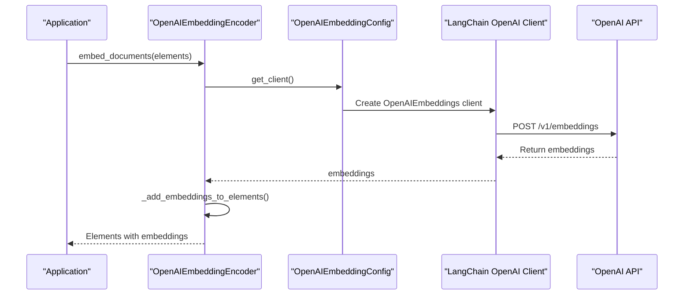

# OpenAI Embedding Integration

<cite>
**Referenced Files in This Document**   
- [openai.py](file://unstructured/embed/openai.py)
- [interfaces.py](file://unstructured/embed/interfaces.py)
- [elements.py](file://unstructured/documents/elements.py)
- [test_openai.py](file://test_unstructured/embed/test_openai.py)
</cite>

## Table of Contents
1. [Introduction](#introduction)
2. [Core Components](#core-components)
3. [Configuration Parameters](#configuration-parameters)
4. [Authentication Methods](#authentication-methods)
5. [API Request/Response Flow](#api-requestresponse-flow)
6. [Error Handling Strategies](#error-handling-strategies)
7. [Performance Considerations](#performance-considerations)
8. [Usage Examples](#usage-examples)
9. [Troubleshooting Guide](#troubleshooting-guide)

## Introduction
The OpenAI embedding integration in the unstructured library provides a robust interface for generating vector embeddings from document elements using OpenAI's embedding models. This documentation details the implementation of the `OpenAIEmbeddingEncoder` class, which serves as a bridge between the unstructured document processing pipeline and OpenAI's embedding API. The integration enables users to transform unstructured text elements into high-dimensional vector representations that can be used for semantic search, clustering, and other machine learning applications. The implementation follows a modular design pattern with clear separation between configuration, encoding logic, and API interaction layers.

## Core Components

The OpenAI embedding integration consists of two primary components: the `OpenAIEmbeddingConfig` class that manages configuration parameters and authentication, and the `OpenAIEmbeddingEncoder` class that handles the actual embedding generation process. The `OpenAIEmbeddingConfig` class inherits from `EmbeddingConfig` and provides a method to instantiate a LangChain OpenAI client with the specified API credentials and model parameters. The `OpenAIEmbeddingEncoder` class implements the `BaseEmbeddingEncoder` interface, providing methods to embed both individual queries and collections of document elements. The encoder converts document elements to strings and passes them to the OpenAI API for embedding generation, then attaches the resulting embeddings back to the original elements. This design allows for seamless integration with the unstructured library's document processing pipeline while maintaining compatibility with OpenAI's API requirements.

**Section sources**
- [openai.py](file://unstructured/embed/openai.py#L1-L68)
- [interfaces.py](file://unstructured/embed/interfaces.py#L1-L40)

## Configuration Parameters

The OpenAI embedding integration supports several configuration parameters that control the behavior of the embedding process. The primary parameters are defined in the `OpenAIEmbeddingConfig` class and include:

- **api_key**: A required parameter that provides authentication to the OpenAI API. This should be a valid OpenAI API key with appropriate permissions for embedding generation.
- **model_name**: An optional parameter that specifies which OpenAI embedding model to use. The default value is "text-embedding-ada-002", which is currently OpenAI's most capable embedding model. Alternative models like "text-embedding-3-small" or "text-embedding-3-large" can also be specified to balance performance and cost requirements.

These parameters are validated and processed through Pydantic's Field system, ensuring type safety and proper default values. The configuration system is designed to be extensible, allowing for additional parameters to be added in the future as OpenAI's API evolves. The `get_client()` method uses these configuration parameters to instantiate a LangChain OpenAIEmbeddings client, which handles the underlying HTTP communication with the OpenAI API.

**Section sources**
- [openai.py](file://unstructured/embed/openai.py#L17-L30)

## Authentication Methods

The OpenAI embedding integration supports multiple authentication methods for accessing the OpenAI API. The primary method is through the `api_key` parameter in the `OpenAIEmbeddingConfig` class, which accepts a SecretStr type to ensure secure handling of sensitive credentials. While the current implementation requires the API key to be provided directly in the configuration, best practices suggest using environment variables to manage API keys in production environments. This approach prevents credentials from being hardcoded in source code or configuration files. The integration relies on LangChain's OpenAI client, which follows standard OpenAI authentication patterns. Users should ensure their API key has the necessary permissions for embedding generation and monitor usage to avoid unexpected charges. For enhanced security, consider using API key rotation and restricting keys to specific IP addresses or referrers when possible.

**Section sources**
- [openai.py](file://unstructured/embed/openai.py#L18-L20)

## API Request/Response Flow



**Diagram sources**
- [openai.py](file://unstructured/embed/openai.py#L51-L59)

The API request/response flow begins when a user calls the `embed_documents()` method on an `OpenAIEmbeddingEncoder` instance with a list of document elements. The encoder retrieves a client instance through the configuration object's `get_client()` method, which creates a LangChain OpenAIEmbeddings client with the specified API key and model parameters. This client sends a POST request to OpenAI's `/v1/embeddings` endpoint with the document text content. OpenAI processes the request and returns the generated embeddings, which are then attached to the original document elements using the `_add_embeddings_to_elements()` method. The entire process is designed to be synchronous, with the method returning only after all embeddings have been successfully generated and attached. This flow ensures that document elements maintain their original structure and metadata while gaining vector representations for downstream applications.

## Error Handling Strategies

The OpenAI embedding integration inherits error handling capabilities from the underlying LangChain OpenAI client and OpenAI API. While the current implementation does not include explicit error handling within the `OpenAIEmbeddingEncoder` class itself, it relies on LangChain's robust error handling mechanisms. Common errors that may occur include authentication failures (401 Unauthorized), rate limit exceeded errors (429 Too Many Requests), and model not found errors (404 Not Found). These errors are raised as exceptions that can be caught and handled by the calling application. Network-related errors such as timeouts or connection failures are also possible and should be handled appropriately. Applications using this integration should implement retry logic with exponential backoff for transient errors, particularly for rate limiting scenarios. Additionally, proper error logging and monitoring should be implemented to detect and respond to issues promptly.

**Section sources**
- [openai.py](file://unstructured/embed/openai.py#L51-L59)

## Performance Considerations

When using the OpenAI embedding integration, several performance considerations should be taken into account. The `text-embedding-ada-002` model has a maximum context length of 8,191 tokens, so documents exceeding this limit must be chunked into smaller segments before embedding. The cost of embedding generation is based on the number of tokens processed, so optimizing text content to remove unnecessary whitespace or boilerplate can reduce costs. For large batches of documents, consider implementing batching strategies to balance API call efficiency with rate limits. OpenAI applies rate limits based on requests per minute and tokens per minute, so applications should monitor their usage patterns and implement appropriate throttling when necessary. The embedding generation process involves network latency, so applications should be designed to handle variable response times. For high-throughput scenarios, consider implementing asynchronous processing or queuing mechanisms to improve overall system performance.

**Section sources**
- [openai.py](file://unstructured/embed/openai.py#L51-L59)

## Usage Examples

```mermaid
flowchart TD
Start([Start]) --> Load[Load Document]
Load --> Partition[Partition into Elements]
Partition --> Configure[Configure OpenAIEmbeddingConfig]
Configure --> Create[Create OpenAIEmbeddingEncoder]
Create --> Embed[Call embed_documents()]
Embed --> Process[Process Elements with Embeddings]
Process --> End([End])
```

**Diagram sources**
- [openai.py](file://unstructured/embed/openai.py#L55-L59)
- [test_openai.py](file://test_unstructured/embed/test_openai.py#L5-L20)

The following example demonstrates how to use the OpenAI embedding integration with different document types:

1. For text documents: Load the text file, partition it into elements using the unstructured library's partitioning functions, then pass the elements to the `embed_documents()` method.
2. For PDF documents: Use the PDF partitioner to extract text and structure, then apply the embedding encoder to the resulting elements.
3. For HTML documents: Parse the HTML to extract semantic elements, then generate embeddings for each element to preserve document structure in the vector space.

The integration works with any document type that can be processed by the unstructured library, making it versatile for various unstructured data sources. After embedding, the elements can be stored in vector databases, used for semantic search, or fed into machine learning models for further analysis.

**Section sources**
- [openai.py](file://unstructured/embed/openai.py#L55-L59)
- [test_openai.py](file://test_unstructured/embed/test_openai.py#L5-L20)

## Troubleshooting Guide

Common issues with the OpenAI embedding integration and their solutions include:

- **Authentication failures**: Verify that the API key is correct and has the necessary permissions. Check for typos or extra whitespace in the key value. Ensure the key has not been revoked or expired.
- **Rate limit errors**: Implement exponential backoff retry logic in your application. Monitor your usage through the OpenAI dashboard and consider upgrading your plan if you consistently hit rate limits.
- **Network timeouts**: Check your internet connection and firewall settings. Ensure that your application can reach api.openai.com on port 443. Consider increasing timeout settings if network latency is high.
- **Model not found errors**: Verify that the model name is spelled correctly and that your account has access to the specified model. Some newer models may require special access.
- **Token limit exceeded**: Split large documents into smaller chunks before embedding. Use the unstructured library's chunking utilities to divide text into segments under the model's token limit.
- **Unexpected response formats**: Ensure you are using compatible versions of the unstructured library and LangChain. Check the OpenAI API documentation for any recent changes to the response format.

For persistent issues, consult the OpenAI API status page to check for service outages and review the detailed error messages returned by the API for specific troubleshooting guidance.

**Section sources**
- [openai.py](file://unstructured/embed/openai.py#L51-L59)