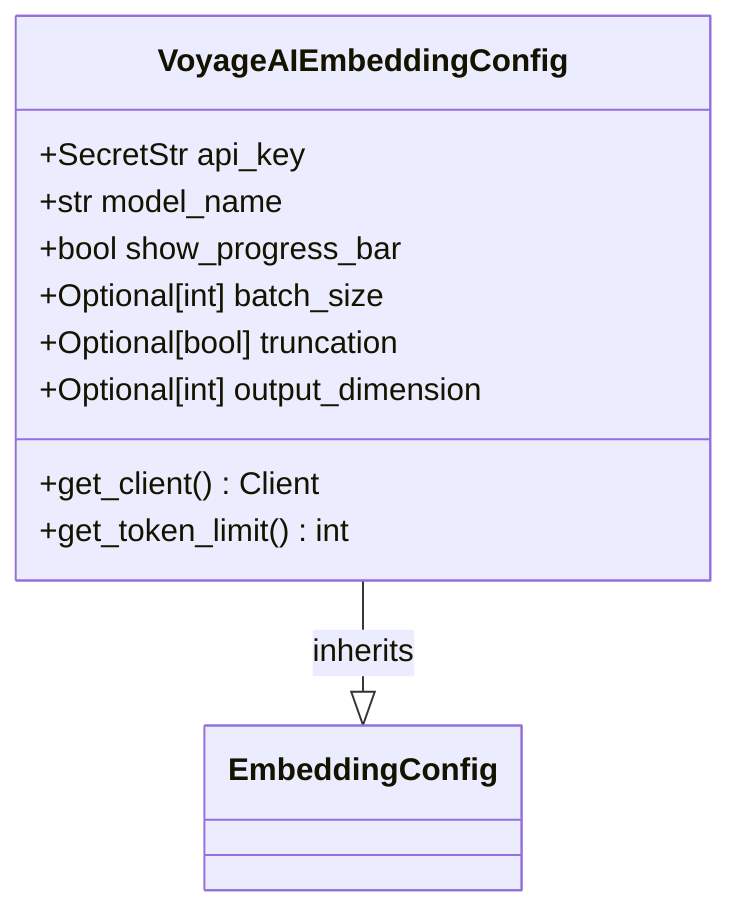
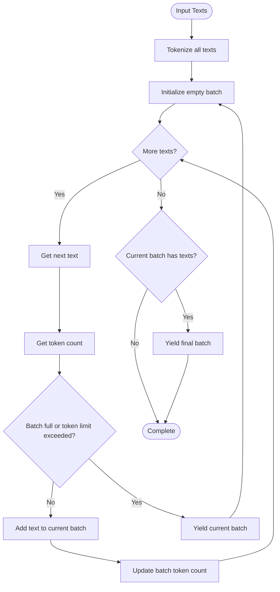

# VoyageAI Embedding Integration

<cite>
**Referenced Files in This Document**   
- [voyageai.py](file://unstructured/embed/voyageai.py)
- [interfaces.py](file://unstructured/embed/interfaces.py)
- [test_voyageai.py](file://test_unstructured/embed/test_voyageai.py)
</cite>

## Table of Contents
1. [Introduction](#introduction)
2. [Configuration Parameters](#configuration-parameters)
3. [Authentication and Environment Variables](#authentication-and-environment-variables)
4. [Request/Response Schema](#requestresponse-schema)
5. [Rate Limiting Considerations](#rate-limiting-considerations)
6. [Error Handling Strategies](#error-handling-strategies)
7. [Performance Considerations](#performance-considerations)
8. [Practical Usage Examples](#practical-usage-examples)
9. [Troubleshooting Guide](#troubleshooting-guide)
10. [Version Compatibility](#version-compatibility)
11. [Unique Features](#unique-features)

## Introduction
The VoyageAI embedding integration in the unstructured library provides a robust interface for generating vector embeddings from various document types. This implementation leverages the VoyageAI API to convert text content into high-dimensional vectors suitable for semantic search, clustering, and other machine learning applications. The integration follows a modular design pattern with clear separation between configuration, encoding logic, and API interaction.

The core components consist of the `VoyageAIEmbeddingConfig` class for configuration management and the `VoyageAIEmbeddingEncoder` class for implementing the embedding functionality. These components work together to handle document preprocessing, batching, API communication, and result processing while abstracting away the complexities of direct API interaction.

**Section sources**
- [voyageai.py](file://unstructured/embed/voyageai.py#L1-L238)

## Configuration Parameters
The VoyageAI embedding integration exposes several configuration parameters through the `VoyageAIEmbeddingConfig` class, which extends the base `EmbeddingConfig` class. These parameters control various aspects of the embedding process, from authentication to performance optimization.

### Core Configuration Parameters
The following table outlines the key configuration parameters available for the VoyageAI embedding integration:

| Parameter | Type | Default Value | Description |
|---------|------|-------------|-------------|
| api_key | SecretStr | Required | Authentication key for accessing the VoyageAI API |
| model_name | str | Required | Specifies which VoyageAI model to use for embedding generation |
| show_progress_bar | bool | False | Enables/disables progress visualization during batch processing |
| batch_size | Optional[int] | None | Controls the number of documents processed in each API request |
| truncation | Optional[bool] | None | Determines whether input text should be truncated if it exceeds model limits |
| output_dimension | Optional[int] | None | Specifies the desired dimensionality of the output embeddings |

**Section sources**
- [voyageai.py](file://unstructured/embed/voyageai.py#L39-L46)

## Authentication and Environment Variables
The VoyageAI embedding integration implements secure authentication practices using API keys managed through the `SecretStr` type from Pydantic. This ensures that sensitive credentials are properly protected and not accidentally exposed in logs or error messages.

Authentication is handled through the `get_client()` method in the `VoyageAIEmbeddingConfig` class, which creates a VoyageAI client instance using the provided API key. The method is decorated with `@requires_dependencies` to ensure the necessary `voyageai` package is available, with the specific extra dependency `embed-voyageai` required for installation.

While the API key must be explicitly provided in the configuration, the integration follows standard patterns for environment variable usage in the broader unstructured library. Users can set the `VOYAGE_API_KEY` environment variable as an alternative to passing the key directly, though this specific implementation requires explicit configuration.



**Diagram sources**
- [voyageai.py](file://unstructured/embed/voyageai.py#L39-L58)

**Section sources**
- [voyageai.py](file://unstructured/embed/voyageai.py#L39-L58)
- [interfaces.py](file://unstructured/embed/interfaces.py#L10-L11)

## Request/Response Schema
The VoyageAI embedding integration follows a well-defined request/response pattern for communicating with the VoyageAI API. The schema varies depending on whether a standard or contextualized embedding model is being used.

### Standard Embedding Schema
For standard models, the integration uses the `embed()` method with the following request parameters:
- texts: List of text strings to be embedded
- model: Model identifier (e.g., "voyage-3.5")
- input_type: Classification of input as "document" or "query"
- truncation: Boolean flag for text truncation
- output_dimension: Target dimensionality for embeddings

The response contains a list of embedding vectors, where each vector corresponds to the input text at the same position in the request.

### Contextualized Embedding Schema
For contextualized models (identified by "context" in the model name), the integration uses the `contextualized_embed()` method with a slightly different schema:
- inputs: List containing a single list of text strings
- model: Contextual model identifier (e.g., "voyage-context-3")
- input_type: Input classification
- output_dimension: Target embedding dimensionality

The response structure differs, with embeddings nested within a results array, requiring additional processing to extract the final vectors.

The integration automatically selects the appropriate method based on the configured model name, ensuring seamless operation across different VoyageAI model types.

**Section sources**
- [voyageai.py](file://unstructured/embed/voyageai.py#L130-L161)

## Rate Limiting Considerations
The VoyageAI embedding integration implements sophisticated batching strategies to respect API rate limits and optimize performance. Rather than relying solely on external rate limiting, the integration proactively manages request volume through intelligent batch creation based on token limits and maximum batch sizes.

### Token-Based Batching
The integration uses token counting to ensure requests stay within model-specific limits. The `_build_batches()` method tokenizes all input texts in a single API call using the `client.tokenize()` method, then distributes texts across batches based on:
- Model-specific token limits defined in `VOYAGE_TOTAL_TOKEN_LIMITS`
- Maximum batch size of 1,000 documents
- Individual text token counts

This approach prevents individual batches from exceeding the API's token limits, which vary significantly across different VoyageAI models (from 32,000 tokens for "voyage-context-3" to 1,000,000 tokens for "voyage-3.5-lite").

### Batch Size Management
The integration enforces a maximum batch size of 1,000 documents regardless of token count, providing an additional safeguard against overly large requests. This limit is defined by the `MAX_BATCH_SIZE` constant and applies to all models uniformly.

The batching process is streaming in nature, yielding batches as they are constructed rather than storing all batches in memory simultaneously. This reduces memory overhead when processing large document collections.



**Diagram sources**
- [voyageai.py](file://unstructured/embed/voyageai.py#L88-L128)

**Section sources**
- [voyageai.py](file://unstructured/embed/voyageai.py#L88-L128)
- [voyageai.py](file://unstructured/embed/voyageai.py#L34-L36)

## Error Handling Strategies
The VoyageAI embedding integration implements comprehensive error handling strategies to ensure robust operation in various failure scenarios. The approach combines defensive programming, graceful degradation, and informative error reporting.

### Dependency Management
The integration uses the `@requires_dependencies` decorator to manage external package dependencies. This decorator ensures the `voyageai` package is available before attempting to create a client instance, providing clear error messages when dependencies are missing. Users are directed to install the required package with the specific extra `embed-voyageai`.

### Progress Bar Dependencies
When the `show_progress_bar` option is enabled, the integration attempts to import `tqdm.auto`. If this import fails, a clear `ImportError` is raised with specific installation instructions, preventing silent failures and guiding users toward resolution.

### Input Validation
The integration includes several validation checks:
- Empty input lists return empty results without making API calls
- Text tokenization occurs before batching to prevent oversized requests
- Batch construction validates token limits before yielding batches
- Element count consistency is verified when adding embeddings

The `count_tokens()` method provides a dedicated interface for token counting, allowing users to validate input sizes before initiating embedding requests. This method handles empty input lists gracefully by returning an empty list.

**Section sources**
- [voyageai.py](file://unstructured/embed/voyageai.py#L182-L191)
- [voyageai.py](file://unstructured/embed/voyageai.py#L213-L228)
- [test_voyageai.py](file://test_unstructured/embed/test_voyageai.py#L114-L123)

## Performance Considerations
The VoyageAI embedding integration incorporates several performance optimizations to maximize efficiency and minimize latency when processing large document collections.

### Input Length Limits
The integration respects model-specific token limits through the `VOYAGE_TOTAL_TOKEN_LIMITS` dictionary, which maps model names to their maximum token capacities. This prevents API errors due to oversized inputs and ensures optimal performance by avoiding truncated responses.

Different models have varying token limits:
- "voyage-context-3": 32,000 tokens
- "voyage-3.5-lite": 1,000,000 tokens
- "voyage-3.5": 320,000 tokens
- Most other models: 120,000 tokens

### Batching Strategies
The integration employs an optimized batching strategy that balances API efficiency with memory usage:
- All texts are tokenized in a single API call to minimize round trips
- Batches are constructed based on both token count and document count
- Maximum batch size is capped at 1,000 documents
- Batches are yielded incrementally to reduce memory footprint

This approach ensures that the integration can handle large document collections efficiently without excessive memory consumption.

### Latency Optimization
Several features contribute to reduced latency:
- Tokenization of all texts in a single call rather than individual requests
- Streaming batch generation to minimize memory overhead
- Direct mapping of input texts to output embeddings
- Efficient error handling that avoids unnecessary retries

The `show_progress_bar` option provides visual feedback during processing, which can be valuable for long-running operations while adding minimal overhead.

**Section sources**
- [voyageai.py](file://unstructured/embed/voyageai.py#L14-L33)
- [voyageai.py](file://unstructured/embed/voyageai.py#L88-L128)

## Practical Usage Examples
The VoyageAI embedding integration can be used with various document types through the unstructured library's element processing pipeline. The following examples demonstrate common usage patterns.

### Basic Document Embedding
```python
from unstructured.embed.voyageai import VoyageAIEmbeddingConfig, VoyageAIEmbeddingEncoder
from unstructured.documents.elements import Text

# Configure the embedding client
config = VoyageAIEmbeddingConfig(
    api_key="your-api-key",
    model_name="voyage-3.5"
)

# Create the encoder
encoder = VoyageAIEmbeddingEncoder(config=config)

# Create sample elements
elements = [
    Text("This is the first document"),
    Text("This is the second document"),
    Text("This is the third document")
]

# Generate embeddings
embedded_elements = encoder.embed_documents(elements)
```

### Query Embedding
For retrieval applications, individual queries can be embedded using the `embed_query()` method:

```python
# Embed a single query
query_embedding = encoder.embed_query("What is the capital of France?")
```

### Custom Output Dimensions
Some applications may require specific embedding dimensions:

```python
# Configure with custom output dimension
config = VoyageAIEmbeddingConfig(
    api_key="your-api-key",
    model_name="voyage-3.5",
    output_dimension=512
)
```

### Progress Monitoring
For large document collections, progress can be monitored:

```python
# Enable progress bar
config = VoyageAIEmbeddingConfig(
    api_key="your-api-key",
    model_name="voyage-3.5",
    show_progress_bar=True
)
```

The integration automatically handles document type conversion by converting elements to strings via `str(e)` before embedding, making it compatible with all element types supported by the unstructured library.

**Section sources**
- [voyageai.py](file://unstructured/embed/voyageai.py#L162-L197)
- [voyageai.py](file://unstructured/embed/voyageai.py#L199-L211)
- [test_voyageai.py](file://test_unstructured/embed/test_voyageai.py#L190-L208)

## Troubleshooting Guide
This section addresses common issues encountered when using the VoyageAI embedding integration and provides solutions for resolution.

### Authentication Failures
**Symptoms**: `AuthenticationError` or `401 Unauthorized` responses
**Causes**: 
- Invalid or missing API key
- API key not properly formatted
- Environment variable not set correctly

**Solutions**:
- Verify the API key is correct and has not expired
- Ensure the API key is passed as a string to `SecretStr`
- Check for typos in the API key
- Validate the key has appropriate permissions

### Rate Limit Exceeded
**Symptoms**: `RateLimitError` or `429 Too Many Requests` responses
**Causes**:
- Exceeding API request limits
- Sending batches that are too large
- Insufficient delay between requests

**Solutions**:
- Implement exponential backoff in client code
- Reduce batch sizes below the 1,000 document limit
- Monitor token usage and stay below model limits
- Consider upgrading to a higher-tier plan if limits are consistently reached

### Network Timeouts
**Symptoms**: `TimeoutError` or connection failures
**Causes**:
- Unstable network connection
- Server-side processing delays
- Large payloads exceeding timeout thresholds

**Solutions**:
- Implement retry logic with exponential backoff
- Reduce batch sizes to decrease processing time
- Ensure stable internet connection
- Check VoyageAI status page for service outages

### Missing Dependencies
**Symptoms**: `ImportError` for `voyageai` module
**Causes**:
- Package not installed
- Incorrect installation command

**Solutions**:
- Install with `pip install "unstructured[embed-voyageai]"`
- Verify installation with `pip show voyageai`
- Check Python environment if using virtual environments

**Section sources**
- [voyageai.py](file://unstructured/embed/voyageai.py#L47-L58)
- [voyageai.py](file://unstructured/embed/voyageai.py#L182-L191)
- [test_voyageai.py](file://test_unstructured/embed/test_voyageai.py#L1-L243)

## Version Compatibility
The VoyageAI embedding integration maintains compatibility across different versions of the VoyageAI API and models. The implementation is designed to handle both current and future model variants through flexible configuration.

### Breaking Changes
The integration has evolved from earlier versions, with the most significant change being the refactoring to use the official `voyageai` package directly. This change, noted in the changelog, enables access to additional features and ensures compatibility with the latest API updates.

### Migration Path
When migrating between versions:
1. Update the unstructured library to the latest version
2. Install the required extras: `pip install "unstructured[embed-voyageai]"`
3. Update configuration to use the current `VoyageAIEmbeddingConfig` interface
4. Verify model names are correctly specified

The integration maintains backward compatibility with existing model names while supporting new models through the extensible `VOYAGE_TOTAL_TOKEN_LIMITS` dictionary.

**Section sources**
- [CHANGELOG.md](file://CHANGELOG.md#L980-L985)
- [voyageai.py](file://unstructured/embed/voyageai.py#L14-L33)

## Unique Features
The VoyageAI embedding integration offers several unique features that distinguish it from other embedding providers in the unstructured library.

### Multilingual Support
VoyageAI models, particularly "voyage-multilingual-2", are optimized for multilingual text processing. This enables the integration to generate high-quality embeddings for documents in various languages without requiring language-specific preprocessing.

### Domain-Specific Optimizations
The integration supports specialized models tailored for specific domains:
- "voyage-finance-2": Optimized for financial documents and terminology
- "voyage-law-2": Designed for legal texts and contracts
- "voyage-code-3": Specialized for source code and technical documentation
- "voyage-medical-2": Optimized for medical and scientific literature

These domain-specific models provide superior performance for specialized content compared to general-purpose embedding models.

### Contextualized Embeddings
The integration supports contextualized embedding models like "voyage-context-3", which consider the broader context of text rather than treating each document in isolation. This capability is particularly valuable for applications requiring deep semantic understanding of document relationships.

### Variable Output Dimensions
The integration allows specification of custom output dimensions through the `output_dimension` parameter. This flexibility enables users to balance between embedding quality and storage/computational requirements based on their specific use case.

**Section sources**
- [voyageai.py](file://unstructured/embed/voyageai.py#L14-L33)
- [voyageai.py](file://unstructured/embed/voyageai.py#L144-L151)