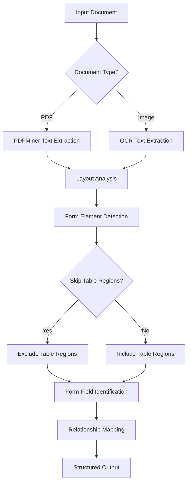

# Form Extraction

<cite>
**Referenced Files in This Document**   
- [pdf.py](file://unstructured/partition/pdf.py#L834-L842)
- [form_extraction.py](file://unstructured/partition/pdf_image/form_extraction.py#L1-L15)
- [elements.py](file://unstructured/documents/elements.py#L1022-L1054)
- [config.py](file://unstructured/partition/utils/config.py#L141-L143)
- [ontology.py](file://unstructured/documents/ontology.py#L502-L535)
</cite>

## Table of Contents
1. [Introduction](#introduction)
2. [Form Extraction Implementation](#form-extraction-implementation)
3. [Form Field Detection and Analysis Pipeline](#form-field-detection-and-analysis-pipeline)
4. [Form Data Structure and Relationships](#form-data-structure-and-relationships)
5. [Configuration Options](#configuration-options)
6. [Challenges and Best Practices](#challenges-and-best-practices)
7. [Performance Considerations](#performance-considerations)
8. [Conclusion](#conclusion)

## Introduction
The unstructured library provides capabilities for extracting form data from PDF and image documents, identifying form elements and their relationships within document layouts. This documentation details the implementation of form extraction, covering the analysis pipeline, data structure, configuration options, and performance characteristics. The system is designed to process various document types and extract structured form data while preserving the relationships between labels and values.

## Form Extraction Implementation

The form extraction functionality in the unstructured library is designed to identify and extract form elements from PDF and image documents. The implementation is integrated into the PDF partitioning process, where form extraction can be enabled through configuration parameters. When enabled, the system processes document layouts to identify form elements such as text fields, checkboxes, and radio buttons.

The form extraction process is triggered by the `extract_forms` parameter in the partitioning functions. When this parameter is set to `True`, the system invokes the `run_form_extraction` function to process the document elements and identify form components. The implementation currently raises a `NotImplementedError`, indicating that form extraction is not yet available, but the framework is in place for future implementation.

Form elements are represented using specific element types in the system, including `FormFieldValue`, `Checkbox`, and `RadioButton`, which inherit from the base `OntologyElement` class. These element types are designed to capture the semantic meaning of form components and preserve their attributes and relationships within the document structure.

**Section sources**
- [pdf.py](file://unstructured/partition/pdf.py#L834-L842)
- [form_extraction.py](file://unstructured/partition/pdf_image/form_extraction.py#L1-L15)
- [ontology.py](file://unstructured/documents/ontology.py#L502-L535)

## Form Field Detection and Analysis Pipeline

The analysis pipeline for form extraction processes document layouts to identify form elements through a multi-stage approach. The pipeline begins with document parsing, where the input PDF or image is processed to extract layout elements and text content. For PDF documents, this involves using PDFMiner to extract text and layout information, while image documents are processed using OCR techniques.

The pipeline then applies layout analysis to identify potential form regions within the document. This involves detecting elements that exhibit characteristics of form components, such as proximity to labels, specific visual patterns, or structural arrangements typical of forms. The system uses coordinate-based analysis to determine the spatial relationships between elements, helping to identify form fields and their associated labels.

For image-based documents, OCR is employed to extract text content from the image, which is then analyzed to identify form elements. The OCR process converts visual text into machine-readable text, which is subsequently processed to detect form fields and their values. The system supports multiple OCR agents, allowing for flexibility in text extraction accuracy and performance.

The analysis pipeline also incorporates table detection and processing, with the option to skip table regions during form extraction. This is controlled by the `form_extraction_skip_tables` parameter, which determines whether regions designated as tables should be ignored during form extraction. This feature helps prevent interference between table data and form data extraction.

**Diagram sources **
- [pdf.py](file://unstructured/partition/pdf.py#L834-L842)
- [pdfminer_processing.py](file://unstructured/partition/pdf_image/pdfminer_processing.py#L446-L454)

## Form Data Structure and Relationships

Form data in the unstructured library is structured to preserve the relationships between labels and values, ensuring that the semantic meaning of form elements is maintained in the output. The system uses a hierarchical data structure to represent form components, with each form field containing information about its label, value, and metadata.

The output structure includes form key-value pairs, where each pair consists of a key element (typically a label) and a value element (the form field content). This structure allows for clear mapping between form labels and their corresponding values, even in complex layouts where visual proximity might not directly indicate semantic relationships.

Form elements are represented with specific metadata that captures their characteristics and relationships. For example, text fields are identified with the `FormFieldValue` type, checkboxes with the `Checkbox` type, and radio buttons with the `RadioButton` type. Each element type includes metadata fields that preserve attributes such as name, value, and state (for checkboxes and radio buttons).

The system also supports nested form structures, allowing for complex forms with multiple sections or repeating elements. This is achieved through the hierarchical organization of form elements, where parent-child relationships are maintained in the data structure. The output format ensures that the logical grouping of form elements is preserved, making it easier to process and interpret the extracted data.

**Section sources**
- [elements.py](file://unstructured/documents/elements.py#L1022-L1054)
- [ontology.py](file://unstructured/documents/ontology.py#L502-L535)

## Configuration Options

The form extraction functionality in the unstructured library provides several configuration options to control sensitivity and accuracy. These options allow users to customize the extraction process based on their specific requirements and document characteristics.

The primary configuration parameters for form extraction are:
- `extract_forms`: A boolean flag that enables or disables form extraction. When set to `True`, the system processes the document to identify and extract form elements.
- `form_extraction_skip_tables`: A boolean flag that determines whether table regions should be skipped during form extraction. When set to `True`, regions designated as tables are excluded from form element detection.

Additional configuration options that indirectly affect form extraction include:
- `hi_res_model_name`: Specifies the layout detection model used for high-resolution processing, which can impact the accuracy of form element detection.
- `ocr_languages`: Defines the languages present in the document, which affects OCR accuracy and, consequently, form text extraction.
- `pdfminer_line_margin`, `pdfminer_char_margin`, `pdfminer_word_margin`: Parameters that control text extraction behavior from PDFs, influencing how text is grouped and processed.

These configuration options can be set programmatically when calling the partitioning functions or through environment variables. The system provides default values for all parameters, allowing for straightforward usage while still offering flexibility for advanced customization.

**Section sources**
- [pdf.py](file://unstructured/partition/pdf.py#L141-L143)
- [config.py](file://unstructured/partition/utils/config.py#L141-L143)

## Challenges and Best Practices

Extracting forms from complex layouts presents several challenges that require careful consideration and best practices for optimal results. One of the primary challenges is accurately identifying form elements in documents with intricate designs or non-standard layouts. Forms with overlapping elements, complex positioning, or unconventional formatting can be difficult to parse correctly.

Another challenge is preserving the correct relationships between form labels and values, especially in cases where visual proximity does not indicate semantic association. This is particularly problematic in multi-column layouts or forms with irregular spacing. The system addresses this by using coordinate-based analysis and layout understanding to determine the most likely relationships between elements.

Best practices for optimizing form extraction results include:
- Using high-resolution images for better OCR accuracy
- Preprocessing documents to enhance contrast and remove noise
- Carefully selecting the appropriate partitioning strategy based on document characteristics
- Fine-tuning configuration parameters for specific document types
- Validating extraction results and adjusting parameters as needed

For complex forms, it may be beneficial to combine multiple extraction strategies or use post-processing techniques to refine the results. Additionally, understanding the specific characteristics of the forms being processed can help in selecting the most appropriate configuration and improving extraction accuracy.

**Section sources**
- [pdf.py](file://unstructured/partition/pdf.py#L834-L842)
- [form_extraction.py](file://unstructured/partition/pdf_image/form_extraction.py#L1-L15)

## Performance Considerations

The form extraction implementation in the unstructured library has several performance considerations that affect processing speed and resource utilization. The choice of partitioning strategy significantly impacts performance, with the "hi_res" strategy typically being more resource-intensive but potentially more accurate than the "fast" or "ocr_only" strategies.

OCR processing, particularly for image-based documents, can be computationally expensive and time-consuming. The performance of OCR depends on factors such as image resolution, text complexity, and language support. Higher resolution images generally yield better OCR accuracy but require more processing time and memory.

Memory usage is another important consideration, especially when processing large documents or batches of documents. The system may need to load entire documents into memory for processing, which can be challenging for very large files. Additionally, the extraction of images and other embedded elements can significantly increase memory requirements.

The current implementation of form extraction is marked as not yet available, which suggests that performance optimization is an ongoing process. Future improvements may include more efficient algorithms, better resource management, and enhanced parallel processing capabilities to improve throughput and reduce processing time.

**Section sources**
- [pdf.py](file://unstructured/partition/pdf.py#L834-L842)
- [ocr.py](file://unstructured/partition/pdf_image/ocr.py#L66-L99)

## Conclusion

The form extraction capabilities in the unstructured library provide a framework for identifying and extracting form data from PDF and image documents. While the current implementation is not yet available, the system is designed with a comprehensive approach to form field detection, relationship preservation, and configurable extraction parameters.

The analysis pipeline processes document layouts to identify form elements, using a combination of layout analysis and OCR techniques to extract structured data. The output preserves relationships between labels and values through a hierarchical data structure, ensuring that the semantic meaning of forms is maintained.

Configuration options allow users to control form extraction sensitivity and accuracy, with parameters for enabling extraction and managing table region processing. Best practices for optimizing results include careful parameter selection and document preprocessing.

Performance considerations highlight the trade-offs between accuracy and processing speed, particularly with regard to OCR and high-resolution processing. As the implementation evolves, ongoing optimization will be essential for handling complex forms and large document volumes efficiently.