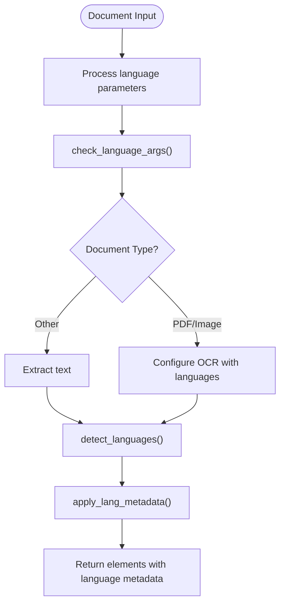
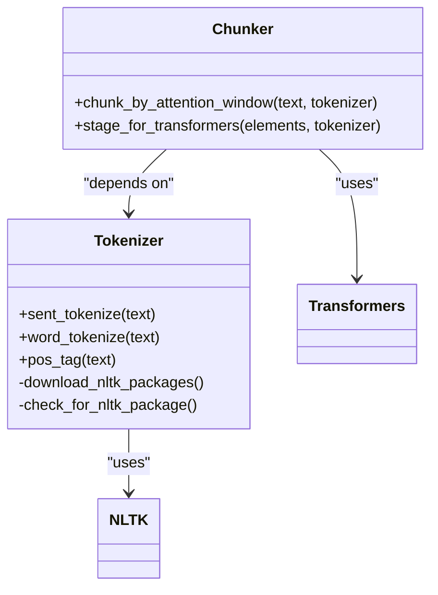

# Multi-language Support

<cite>
**Referenced Files in This Document**   
- [lang.py](file://unstructured/partition/common/lang.py)
- [translate.py](file://unstructured/cleaners/translate.py)
- [tokenize.py](file://unstructured/nlp/tokenize.py)
- [huggingface.py](file://unstructured/staging/huggingface.py)
- [auto.py](file://unstructured/partition/auto.py)
</cite>

## Table of Contents
1. [Introduction](#introduction)
2. [Language Detection Implementation](#language-detection-implementation)
3. [Translation Capabilities](#translation-capabilities)
4. [Document Processing Pipeline Integration](#document-processing-pipeline-integration)
5. [NLP Components for Language-Specific Processing](#nlp-components-for-language-specific-processing)
6. [Handling Non-Latin Scripts](#handling-non-latin-scripts)
7. [Performance Considerations](#performance-considerations)
8. [Best Practices for Internationalization](#best-practices-for-internationalization)

## Introduction
The unstructured library provides comprehensive multi-language support for document processing, enabling users to handle documents in various languages and scripts. This documentation details the implementation of language detection, translation capabilities, and integration with document processing pipelines. The system supports a wide range of languages through various detection methods and translation services, with special considerations for non-Latin scripts and performance optimization.

## Language Detection Implementation
The language detection system in the unstructured library employs multiple strategies to identify the language of document content. The primary implementation is located in the `lang.py` module, which provides functions for detecting languages in text content.

The core language detection functionality is implemented through the `detect_languages` function, which uses the `langdetect` library to identify languages in text. When the "auto" option is specified in the languages parameter, the system automatically detects languages present in the document text. For short text containing only ASCII characters with fewer than five words, the system defaults to English to avoid unreliable detection results.

The system supports both ISO 639-2 and ISO 639-3 language codes, converting between different language code standards as needed. The implementation includes special handling for Chinese language variants (zh-cn, zh-tw, zh-hk), normalizing them to a single "zh" code for consistency in processing. The language detection process is deterministic, with a fixed seed value set for the detector to ensure consistent results across multiple runs.

For OCR-based document processing (PDFs and images), the system integrates with Tesseract OCR, supporting a comprehensive list of language packs. The `prepare_languages_for_tesseract` function converts language codes into the format expected by Tesseract, handling special cases like Chinese variants that have multiple Tesseract models (simplified, traditional, vertical).

**Section sources**
- [lang.py](file://unstructured/partition/common/lang.py#L380-L459)

## Translation Capabilities
The translation functionality in the unstructured library is implemented through the `translate.py` module, which provides a cleaner for translating text between languages. The system uses the Helsinki-NLP/opus-mt models from the Transformers library, specifically the MarianMT models for machine translation.

The translation process is implemented in the `translate_text` function, which accepts text input along with source and target language parameters. When the source language is not specified, the function automatically detects it using the same language detection system described earlier. The target language defaults to English ("en") if not specified.

The translation system handles several special cases:
- Empty text is returned unchanged
- When source and target languages are identical, the original text is returned without translation
- Chinese language variants are normalized to "zh" before translation
- Text is chunked using attention windows to fit within model constraints

The system constructs the model name dynamically based on source and target language codes using the `_get_opus_mt_model_name` function, following the pattern "Helsinki-NLP/opus-mt-{source_lang}-{target_lang}". If the requested language combination is not supported, an appropriate error message is raised.

**Section sources**
- [translate.py](file://unstructured/cleaners/translate.py#L24-L72)

## Document Processing Pipeline Integration
The multi-language support is deeply integrated into the document processing pipeline, particularly through the main `partition` function in `auto.py`. This function serves as the entry point for document processing and coordinates language-related functionality across different document types.

Language parameters are processed through the `check_language_args` function, which handles the transition from the deprecated `ocr_languages` parameter to the current `languages` parameter. This function ensures backward compatibility while guiding users toward the preferred approach. When both parameters are provided, the `languages` parameter takes precedence, and a warning is issued about the deprecation of `ocr_languages`.

For document types that require OCR (PDFs and images), language information is passed to the appropriate partitioning functions (`partition_pdf` and `partition_image`). These functions use the language codes to configure Tesseract OCR with the correct language packs. For non-OCR document types, language detection is performed on the extracted text using the `langdetect` library.

The system applies language metadata to document elements through the `apply_lang_metadata` function, which can operate at both the document level and element level. When `detect_language_per_element` is set to True, the system detects languages for each individual element rather than for the entire document.

**Diagram sources **
- [auto.py](file://unstructured/partition/auto.py#L150-L151)
- [lang.py](file://unstructured/partition/common/lang.py#L462-L509)

**Section sources**
- [auto.py](file://unstructured/partition/auto.py#L150-L151)
- [lang.py](file://unstructured/partition/common/lang.py#L462-L509)

## NLP Components for Language-Specific Processing
The unstructured library includes specialized NLP components to support language-specific processing, particularly in the `tokenize.py` module. These components provide essential text processing functionality that is optimized for different languages.

The tokenization system is built on NLTK (Natural Language Toolkit) and includes three primary functions:
- `sent_tokenize`: Sentence tokenizer with LRU caching for improved performance
- `word_tokenize`: Word tokenizer with LRU caching
- `pos_tag`: Part-of-speech tagger with LRU caching

These functions are wrapped with LRU (Least Recently Used) caching to improve performance when processing multiple documents or repeated text segments. The cache size is configurable through the `CACHE_MAX_SIZE` constant, which defaults to 128 items.

The system automatically downloads required NLTK packages when needed, controlled by the `AUTO_DOWNLOAD_NLTK` environment variable (defaulting to "True"). The required packages include "averaged_perceptron_tagger_eng" for part-of-speech tagging and "punkt_tab" for sentence tokenization.

For transformer-based models, the `chunk_by_attention_window` function in `huggingface.py` provides text chunking functionality that respects model attention window limits. This function splits text into chunks that fit within the model's maximum input size, with configurable buffer space for special tokens. The chunking process uses a specified split function (defaulting to sentence tokenization) to determine natural breaking points in the text.

**Diagram sources **
- [tokenize.py](file://unstructured/nlp/tokenize.py#L50-L71)
- [huggingface.py](file://unstructured/staging/huggingface.py#L32-L98)

**Section sources**
- [tokenize.py](file://unstructured/nlp/tokenize.py#L50-L71)
- [huggingface.py](file://unstructured/staging/huggingface.py#L32-L98)

## Handling Non-Latin Scripts
The unstructured library provides specific support for processing documents with non-Latin scripts, addressing the unique challenges associated with these writing systems. The implementation includes special handling for various script families, including CJK (Chinese, Japanese, Korean), Arabic, Cyrillic, and Indic scripts.

For CJK scripts, the system normalizes different Chinese variants (zh-cn, zh-tw, zh-hk) to a single "zh" code, recognizing that they share the same fundamental translation model despite regional differences. The Tesseract OCR integration supports both simplified and traditional Chinese models, as well as vertical text orientation variants.

The language detection system is designed to handle mixed-language documents, which is common in multilingual environments. When processing text containing multiple languages, the system can identify the primary languages present and handle them appropriately. This is particularly important for documents that contain Latin script text mixed with non-Latin scripts, such as technical documents with English terminology alongside native language content.

For scripts with complex text layout requirements (such as Arabic with its right-to-left writing direction and contextual letter forms), the system relies on the underlying OCR engine (Tesseract) to handle the rendering and recognition. The unstructured library focuses on the higher-level processing of the recognized text rather than the low-level rendering details.

The translation system supports a wide range of language pairs involving non-Latin scripts, leveraging the Helsinki-NLP models which have strong coverage for many language combinations. However, users should be aware that translation quality may vary depending on the specific language pair and the availability of training data for that combination.

**Section sources**
- [lang.py](file://unstructured/partition/common/lang.py#L442-L453)
- [translate.py](file://unstructured/cleaners/translate.py#L41-L47)

## Performance Considerations
Enabling translation features in the unstructured library has significant performance implications that users should consider when processing documents at scale. The translation process involves several resource-intensive operations that can impact processing speed and memory usage.

The primary performance considerations include:
- Model loading time: MarianMT translation models are large and require significant time to load into memory
- Memory consumption: Translation models require substantial RAM, particularly when processing multiple documents concurrently
- Processing speed: Text translation is computationally intensive, especially for longer documents
- Network bandwidth: When models are not cached locally, they must be downloaded from Hugging Face

To optimize performance, the system implements several strategies:
- LRU caching for tokenization functions to avoid redundant processing
- Text chunking to manage attention window limits and prevent memory overflow
- Deterministic language detection with a fixed seed for consistent results
- Efficient parameter handling to minimize unnecessary operations

For production environments, it is recommended to:
- Pre-load translation models to avoid repeated loading
- Process documents in batches to amortize model loading costs
- Use appropriate hardware with sufficient RAM and GPU acceleration when available
- Cache frequently used language models locally to reduce network dependencies

The chunking strategy is particularly important for performance, as it prevents the system from attempting to process excessively long text sequences that would exceed model limitations. The `chunk_by_attention_window` function ensures that text is divided into manageable segments that fit within the model's constraints.

**Section sources**
- [translate.py](file://unstructured/cleaners/translate.py#L66-L72)
- [huggingface.py](file://unstructured/staging/huggingface.py#L63-L98)

## Best Practices for Internationalization
To effectively use the multi-language support in the unstructured library, consider the following best practices for internationalization:

1. **Language Specification**: When the document language is known, explicitly specify it using the `languages` parameter rather than relying on automatic detection. This improves accuracy and processing speed.

2. **Error Handling**: Implement robust error handling for cases where language detection fails or translation models are unavailable. The system may return None for language detection in cases of insufficient text or detection failures.

3. **Resource Management**: For applications processing multiple documents, consider the memory implications of loading translation models. Reuse model instances when possible rather than loading them repeatedly.

4. **Testing**: Test your implementation with representative samples of the languages you expect to process, paying particular attention to edge cases like mixed-language documents or documents with specialized terminology.

5. **Fallback Strategies**: Implement fallback strategies for cases where translation is not possible, such as maintaining the original text or using alternative processing methods.

6. **Performance Monitoring**: Monitor processing times and resource usage when enabling translation features, especially when scaling to large document volumes.

7. **Model Caching**: Cache frequently used translation models locally to reduce network dependencies and improve startup times.

8. **Language Support Verification**: Verify that the specific language pairs you need are supported by the Helsinki-NLP models before implementing translation functionality.

By following these best practices, users can effectively leverage the multi-language capabilities of the unstructured library while maintaining optimal performance and reliability.

**Section sources**
- [lang.py](file://unstructured/partition/common/lang.py#L380-L459)
- [translate.py](file://unstructured/cleaners/translate.py#L24-L72)