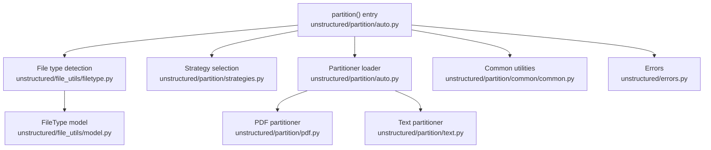
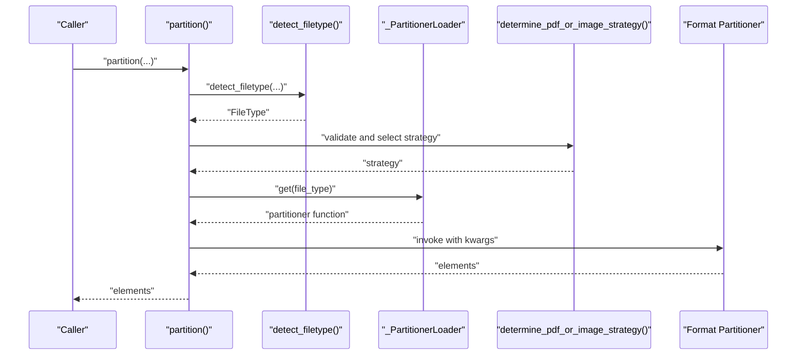
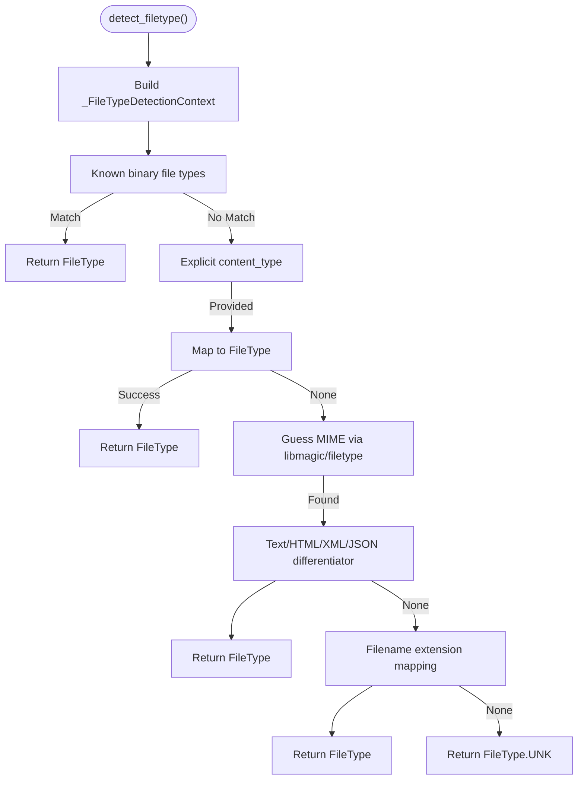
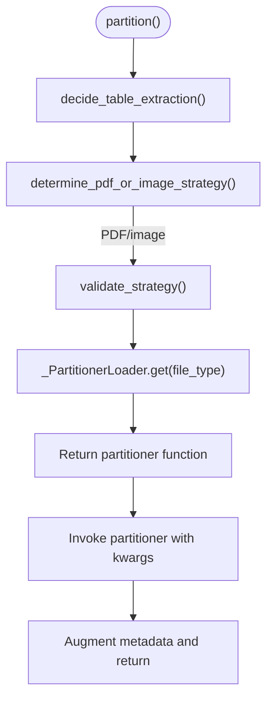
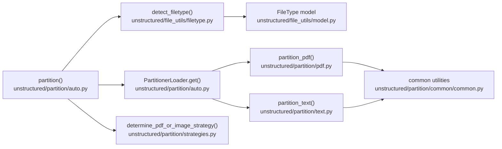

# Automatic Partitioning

<cite>
**Referenced Files in This Document**
- [partition.py](file://unstructured/nlp/partition.py)
- [auto.py](file://unstructured/partition/auto.py)
- [filetype.py](file://unstructured/file_utils/filetype.py)
- [model.py](file://unstructured/file_utils/model.py)
- [strategies.py](file://unstructured/partition/strategies.py)
- [pdf.py](file://unstructured/partition/pdf.py)
- [text.py](file://unstructured/partition/text.py)
- [common.py](file://unstructured/partition/common/common.py)
- [errors.py](file://unstructured/errors.py)
- [test_auto.py](file://test_unstructured/partition/test_auto.py)
- [test_filetype.py](file://test_unstructured/file_utils/test_filetype.py)
</cite>

## Table of Contents
1. [Introduction](#introduction)
2. [Project Structure](#project-structure)
3. [Core Components](#core-components)
4. [Architecture Overview](#architecture-overview)
5. [Detailed Component Analysis](#detailed-component-analysis)
6. [Dependency Analysis](#dependency-analysis)
7. [Performance Considerations](#performance-considerations)
8. [Troubleshooting Guide](#troubleshooting-guide)
9. [Conclusion](#conclusion)

## Introduction
This document explains the automatic partitioning system that detects file types and routes inputs to the correct partitioner. It focuses on the partition() function as the main entry point, detailing file type detection logic, strategy routing, and error handling. It also covers how the system interacts with the file_utils filetype detection and the strategy selection mechanism, and provides troubleshooting guidance for common issues like incorrect MIME type detection.

## Project Structure
The automatic partitioning system spans several modules:
- Entry point and routing: unstructured/partition/auto.py
- File type detection: unstructured/file_utils/filetype.py
- File type model: unstructured/file_utils/model.py
- Strategy selection: unstructured/partition/strategies.py
- Format-specific partitioners: unstructured/partition/pdf.py, unstructured/partition/text.py, and others
- Shared utilities and errors: unstructured/partition/common/common.py, unstructured/errors.py
- Tests: test_unstructured/partition/test_auto.py, test_unstructured/file_utils/test_filetype.py

**Diagram sources**
- [auto.py](file://unstructured/partition/auto.py#L30-L294)
- [filetype.py](file://unstructured/file_utils/filetype.py#L63-L110)
- [model.py](file://unstructured/file_utils/model.py#L45-L200)
- [strategies.py](file://unstructured/partition/strategies.py#L8-L110)
- [pdf.py](file://unstructured/partition/pdf.py#L123-L200)
- [text.py](file://unstructured/partition/text.py#L40-L109)
- [common.py](file://unstructured/partition/common/common.py#L1-L200)
- [errors.py](file://unstructured/errors.py#L1-L16)

**Section sources**
- [auto.py](file://unstructured/partition/auto.py#L30-L294)
- [filetype.py](file://unstructured/file_utils/filetype.py#L63-L110)
- [model.py](file://unstructured/file_utils/model.py#L45-L200)
- [strategies.py](file://unstructured/partition/strategies.py#L8-L110)
- [pdf.py](file://unstructured/partition/pdf.py#L123-L200)
- [text.py](file://unstructured/partition/text.py#L40-L109)
- [common.py](file://unstructured/partition/common/common.py#L1-L200)
- [errors.py](file://unstructured/errors.py#L1-L16)

## Core Components
- partition(): Main entry point that accepts filename, file-like object, URL, and content_type, then detects file type and routes to the appropriate partitioner.
- detect_filetype(): Determines file type using multiple strategies: explicit content_type, libmagic/filetype-based MIME guessing, filename extension, and specialized detectors for binary formats.
- _PartitionerLoader: Lazily loads and validates partitioners by file type, raising helpful errors when dependencies are missing.
- determine_pdf_or_image_strategy(): Validates and selects a strategy for PDFs/images based on availability and parameters.
- Format-specific partitioners: partition_pdf(), partition_text(), and others implement parsing logic for specific formats.

**Section sources**
- [auto.py](file://unstructured/partition/auto.py#L30-L294)
- [filetype.py](file://unstructured/file_utils/filetype.py#L63-L110)
- [strategies.py](file://unstructured/partition/strategies.py#L8-L110)
- [pdf.py](file://unstructured/partition/pdf.py#L123-L200)
- [text.py](file://unstructured/partition/text.py#L40-L109)

## Architecture Overview
The system orchestrates detection, strategy selection, and delegation to format-specific partitioners.

**Diagram sources**
- [auto.py](file://unstructured/partition/auto.py#L30-L294)
- [filetype.py](file://unstructured/file_utils/filetype.py#L63-L110)
- [strategies.py](file://unstructured/partition/strategies.py#L8-L110)

## Detailed Component Analysis

### partition() function
- Accepts filename, file-like object, URL, encoding, content_type, and numerous strategy and metadata parameters.
- Validates mutual exclusivity of inputs (exactly one of filename, file, url).
- Handles URL input by fetching bytes and detecting type from response headers and body.
- Detects file type via detect_filetype().
- Special-cases: PDF, image, JSON, NDJSON, EMPTY.
- Delegates to _PartitionerLoader.get(file_type) to obtain the correct partitioner.
- Applies post-processing to attach metadata (filetype, URL, data_source).
- Returns a list of Element objects.

Key behaviors:
- URL handling: file_and_type_from_url() reads response content and sets encoding from response.headers.get("Content-Type").
- Strategy selection: decide_table_extraction() and determine_pdf_or_image_strategy() influence behavior for PDFs/images.
- Error handling: UnsupportedFileFormatError raised when file_type.is_partitionable is false.

**Section sources**
- [auto.py](file://unstructured/partition/auto.py#L30-L294)

### File type detection in file_utils
- detect_filetype() builds a context and delegates to _FileTypeDetector.file_type().
- Strategies (in order):
  1) Known binary file types (OLE/Compound File Binary Format and ZIP differentiation).
  2) Explicit content_type (when provided).
  3) MIME guess via libmagic or fallback package.
  4) Filename extension mapping.
- Edge cases:
  - JSON vs NDJSON disambiguation using content inspection.
  - Rule-out content types that conflict with binary detection.
  - Source code MIME types mapped to TXT.
  - HTML/XML ambiguity resolved by extension.
  - Empty file mapped to FileType.EMPTY.

**Diagram sources**
- [filetype.py](file://unstructured/file_utils/filetype.py#L63-L110)
- [filetype.py](file://unstructured/file_utils/filetype.py#L153-L269)
- [filetype.py](file://unstructured/file_utils/filetype.py#L270-L384)
- [filetype.py](file://unstructured/file_utils/filetype.py#L385-L535)

**Section sources**
- [filetype.py](file://unstructured/file_utils/filetype.py#L63-L110)
- [filetype.py](file://unstructured/file_utils/filetype.py#L153-L269)
- [filetype.py](file://unstructured/file_utils/filetype.py#L270-L384)
- [filetype.py](file://unstructured/file_utils/filetype.py#L385-L535)

### Strategy selection and routing
- determine_pdf_or_image_strategy() validates strategy and chooses among FAST, HI_RES, OCR_ONLY for PDFs/images, with fallbacks when dependencies are missing.
- validate_strategy() ensures the strategy is valid and not incompatible with the input type.
- _PartitionerLoader.get() verifies dependencies and returns the partitioner function for the given file type.

**Diagram sources**
- [auto.py](file://unstructured/partition/auto.py#L296-L384)
- [strategies.py](file://unstructured/partition/strategies.py#L8-L110)

**Section sources**
- [strategies.py](file://unstructured/partition/strategies.py#L8-L110)
- [auto.py](file://unstructured/partition/auto.py#L296-L384)

### Format-specific partitioners
- partition_pdf(): Implements PDF parsing with multiple strategies (FAST, HI_RES, OCR_ONLY), table inference, image extraction, and metadata handling.
- partition_text(): Parses text files, groups paragraphs, and classifies elements (Title, NarrativeText, ListItem, etc.).

**Section sources**
- [pdf.py](file://unstructured/partition/pdf.py#L123-L200)
- [text.py](file://unstructured/partition/text.py#L40-L109)

### Error handling for unsupported formats and corrupted files
- UnsupportedFileFormatError: Raised by _PartitionerLoader.get() when a file type is not partitionable.
- JSON/NDJSON validation: partition() checks is_json_processable()/is_ndjson_processable() and raises ValueError for non-conforming content.
- EMPTY: partition() returns [] for empty files.
- PageCountExceededError: Raised when PDF page count exceeds limits during HI_RES processing.
- Incorrect MIME type detection: Tests demonstrate fallbacks to extension mapping and content inspection to mitigate incorrect headers.

**Section sources**
- [auto.py](file://unstructured/partition/auto.py#L296-L384)
- [auto.py](file://unstructured/partition/auto.py#L250-L276)
- [errors.py](file://unstructured/errors.py#L1-L16)
- [test_filetype.py](file://test_unstructured/file_utils/test_filetype.py#L100-L128)
- [test_filetype.py](file://test_unstructured/file_utils/test_filetype.py#L180-L206)
- [test_filetype.py](file://test_unstructured/file_utils/test_filetype.py#L329-L361)
- [test_filetype.py](file://test_unstructured/file_utils/test_filetype.py#L390-L429)

## Dependency Analysis
- partition() depends on detect_filetype() and _PartitionerLoader.get().
- detect_filetype() depends on FileType.from_mime_type(), FileType.from_extension(), and specialized detectors (OLE, ZIP).
- determine_pdf_or_image_strategy() depends on dependency_exists() to check for unstructured_inference and pytesseract.
- Partitioners depend on shared utilities in common.py and model metadata from model.py.

**Diagram sources**
- [auto.py](file://unstructured/partition/auto.py#L30-L294)
- [filetype.py](file://unstructured/file_utils/filetype.py#L63-L110)
- [model.py](file://unstructured/file_utils/model.py#L45-L200)
- [strategies.py](file://unstructured/partition/strategies.py#L8-L110)
- [pdf.py](file://unstructured/partition/pdf.py#L123-L200)
- [text.py](file://unstructured/partition/text.py#L40-L109)
- [common.py](file://unstructured/partition/common/common.py#L1-L200)

**Section sources**
- [auto.py](file://unstructured/partition/auto.py#L30-L294)
- [filetype.py](file://unstructured/file_utils/filetype.py#L63-L110)
- [model.py](file://unstructured/file_utils/model.py#L45-L200)
- [strategies.py](file://unstructured/partition/strategies.py#L8-L110)
- [pdf.py](file://unstructured/partition/pdf.py#L123-L200)
- [text.py](file://unstructured/partition/text.py#L40-L109)
- [common.py](file://unstructured/partition/common/common.py#L1-L200)

## Performance Considerations
- Large file processing:
  - PDFs: HI_RES and OCR_ONLY strategies can be resource-intensive; consider FAST when text is extractable to reduce overhead.
  - Images: HI_RES is default for images; ensure adequate memory for layout inference.
  - Memory usage patterns: Partitioners may load entire files into memory (e.g., BytesIO for URLs). For very large files, prefer streaming approaches where supported and consider chunking strategies.
- Strategy selection:
  - determine_pdf_or_image_strategy() falls back gracefully when dependencies are missing, avoiding expensive retries.
- Metadata augmentation:
  - Augmenting metadata occurs after partitioning; keep metadata minimal to reduce memory overhead.
- Encoding detection:
  - When encoding is not provided, UTF-8 is assumed; incorrect assumptions can cause decoding errors and retries.

[No sources needed since this section provides general guidance]

## Troubleshooting Guide
Common issues and resolutions:
- Incorrect MIME type detection:
  - If content_type is incorrect, the system falls back to libmagic/filetype-based guessing and filename extension mapping. Tests show fallbacks to extension-based detection when MIME guessing fails.
  - For source code files incorrectly identified as text/plain, the system maps them to TXT.
- Unsupported file format:
  - If a file type has no partitioner, UnsupportedFileFormatError is raised. Install the required extras (e.g., unstructured[docx]) to enable partitioning.
- JSON/NDJSON validation failures:
  - partition() checks is_json_processable()/is_ndjson_processable() and raises ValueError for non-conforming content.
- Empty files:
  - partition() returns [] for EMPTY files.
- Strategy errors:
  - validate_strategy() and determine_pdf_or_image_strategy() raise ValueError for invalid combinations or missing dependencies. Install unstructured_inference or pytesseract as needed.
- URL content type:
  - When using URL, content_type is parsed from response headers; if absent, libmagic/filetype is used to guess MIME type.

**Section sources**
- [filetype.py](file://unstructured/file_utils/filetype.py#L153-L269)
- [filetype.py](file://unstructured/file_utils/filetype.py#L270-L384)
- [auto.py](file://unstructured/partition/auto.py#L250-L276)
- [auto.py](file://unstructured/partition/auto.py#L296-L384)
- [strategies.py](file://unstructured/partition/strategies.py#L8-L110)
- [test_filetype.py](file://test_unstructured/file_utils/test_filetype.py#L100-L128)
- [test_filetype.py](file://test_unstructured/file_utils/test_filetype.py#L180-L206)
- [test_filetype.py](file://test_unstructured/file_utils/test_filetype.py#L329-L361)
- [test_filetype.py](file://test_unstructured/file_utils/test_filetype.py#L390-L429)

## Conclusion
The automatic partitioning system provides a robust pipeline for detecting file types, selecting appropriate strategies, and delegating to format-specific partitioners. It includes comprehensive error handling, graceful fallbacks for MIME type issues, and safeguards for unsupported formats and empty files. By understanding the detection strategies and strategy selection logic, users can diagnose issues quickly and optimize performance for large files.