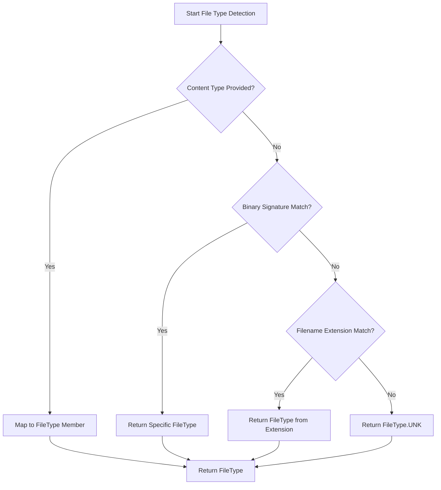
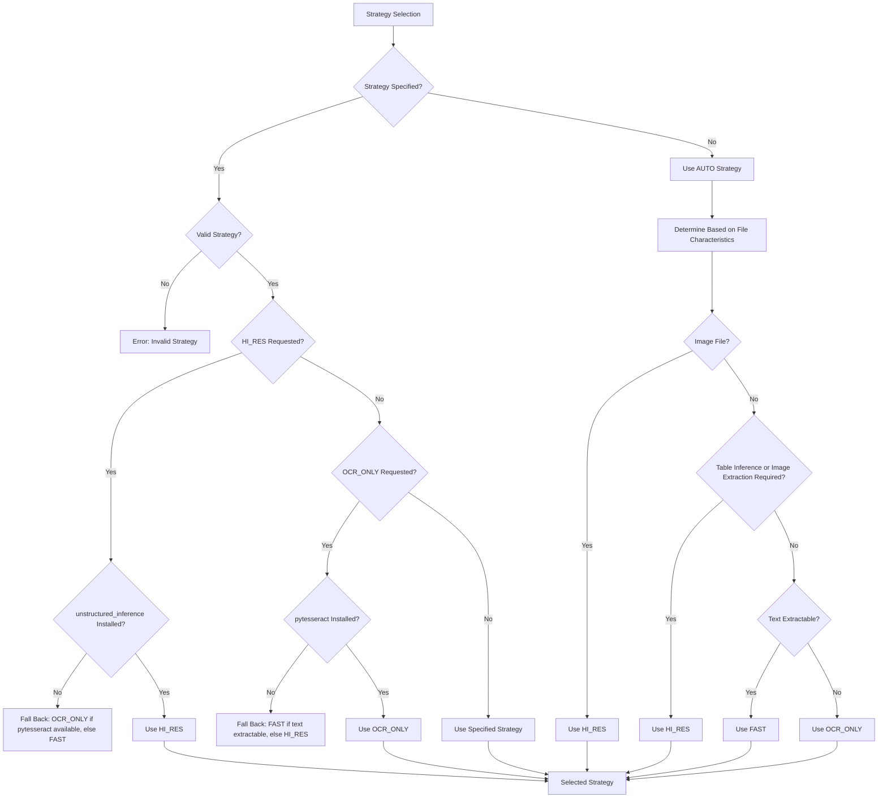
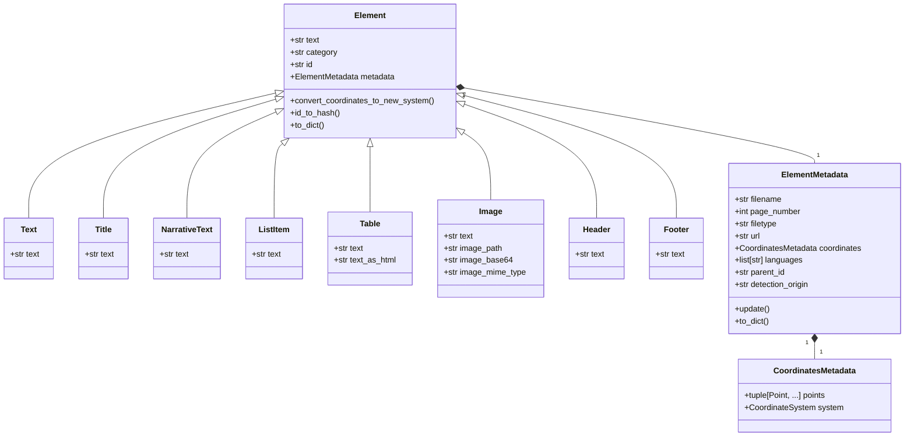
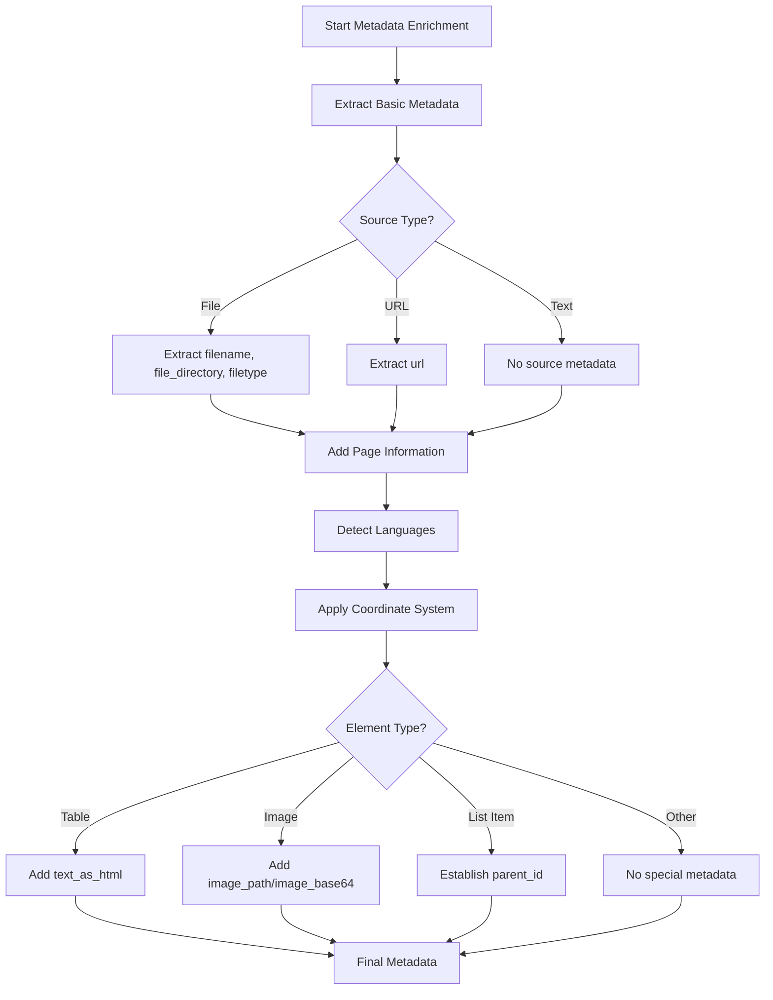
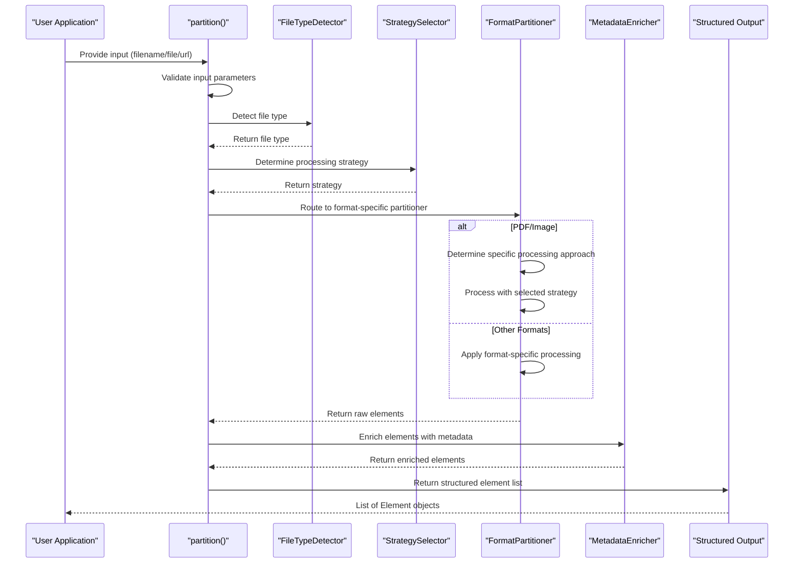
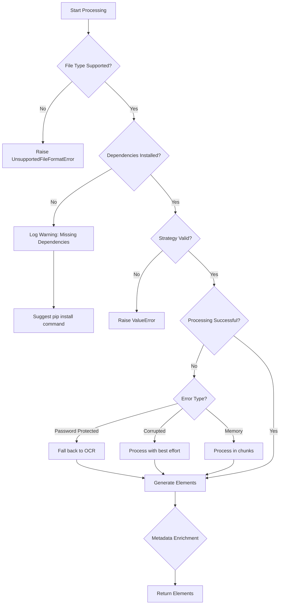

# Core Functionality

<cite>
**Referenced Files in This Document**   
- [auto.py](file://unstructured/partition/auto.py)
- [strategies.py](file://unstructured/partition/strategies.py)
- [filetype.py](file://unstructured/file_utils/filetype.py)
- [model.py](file://unstructured/file_utils/model.py)
- [elements.py](file://unstructured/documents/elements.py)
- [common.py](file://unstructured/partition/common/common.py)
- [pdf.py](file://unstructured/partition/pdf.py)
- [text.py](file://unstructured/partition/text.py)
- [constants.py](file://unstructured/partition/utils/constants.py)
- [metadata.py](file://unstructured/partition/common/metadata.py)
</cite>

## Table of Contents
1. [Automatic File Type Detection](#automatic-file-type-detection)
2. [Processing Strategy Selection](#processing-strategy-selection)
3. [Element Classification System](#element-classification-system)
4. [Metadata Enrichment Process](#metadata-enrichment-process)
5. [Partitioning Pipeline](#partitioning-pipeline)
6. [Common Issues and Error Handling](#common-issues-and-error-handling)
7. [Performance Considerations](#performance-considerations)

## Automatic File Type Detection

The document partitioning system employs a sophisticated multi-strategy approach to automatically detect file types based on the content of the input file. The detection process follows a sequence of strategies, with the first strategy to confidently determine a file type returning that value. The system uses the `_FileTypeDetector` class to implement three primary detection strategies in order of precedence:

1. **MIME-type assertion**: Uses the content type asserted by the caller in the `content_type` argument
2. **Binary signature detection**: Guesses a MIME-type using libmagic (with fallback to the `filetype` package when libmagic is unavailable)
3. **Filename extension mapping**: Maps filename extensions to file type members

The detection process begins with binary types, which can be detected with 100% accuracy, before considering an asserted content type. For binary formats like Microsoft Compound File Binary Format (CFB), the system checks for specific magic numbers and storage contents to differentiate between formats like DOC, PPT, XLS, and MSG files. For ZIP archives, the system examines specific file patterns within the archive to identify formats like DOCX, XLSX, and PPTX.

When libmagic is not available, the system falls back to the `filetype` package, though this approach has limitations with textual file types. The system also includes specialized differentiators for ambiguous or frequently misidentified MIME types, such as the `_TextFileDifferentiator` which refines textual file types by examining file content patterns.

**Diagram sources**
- [filetype.py](file://unstructured/file_utils/filetype.py#L1-L835)
- [model.py](file://unstructured/file_utils/model.py#L1-L535)

**Section sources**
- [filetype.py](file://unstructured/file_utils/filetype.py#L1-L835)
- [model.py](file://unstructured/file_utils/model.py#L1-L535)

## Processing Strategy Selection

The system implements a flexible strategy selection mechanism that determines the optimal processing approach based on file type, content characteristics, and user configuration. The available strategies are defined in the `PartitionStrategy` enum with four options: AUTO, FAST, OCR_ONLY, and HI_RES.

The strategy selection process is governed by the `determine_pdf_or_image_strategy` function, which accounts for dependency availability and fallback logic. For PDF and image files, the system evaluates several factors to determine the appropriate strategy:

- **Dependency availability**: Checks for required packages like `unstructured_inference` and `unstructured_pytesseract`
- **Text extractability**: Determines if text can be extracted directly from PDFs
- **Feature requirements**: Considers whether table structure inference or image extraction is needed

When the AUTO strategy is selected, the system applies specific logic for different file types:
- For images: Defaults to HI_RES since images are typically single-page
- For PDFs: Uses HI_RES if table structure inference or image extraction is required; otherwise uses FAST if text is extractable, falling back to OCR_ONLY if not

The system includes robust fallback mechanisms when dependencies are missing. If HI_RES is requested but `unstructured_inference` is not installed, the system falls back to OCR_ONLY if `pytesseract` is available, otherwise to FAST. Similarly, if OCR_ONLY is requested but `pytesseract` is not installed, the system falls back to FAST if text is extractable, otherwise to HI_RES.

**Diagram sources**
- [strategies.py](file://unstructured/partition/strategies.py#L1-L110)
- [auto.py](file://unstructured/partition/auto.py#L1-L384)

**Section sources**
- [strategies.py](file://unstructured/partition/strategies.py#L1-L110)
- [constants.py](file://unstructured/partition/utils/constants.py#L1-L208)

## Element Classification System

The element classification system categorizes document content into semantically meaningful components based on content analysis and layout detection. The system uses the `ElementType` enum to define various element types including Title, Text, NarrativeText, BulletedText, Table, Image, and others.

For text-based documents, the classification process uses linguistic patterns and heuristics to determine element types. The `element_from_text` function in the text partitioner applies a series of checks in a specific order:

1. **Header/Footer detection**: Uses coordinate-based positioning to identify elements in header (top 7%) or footer (bottom 7%) regions
2. **List detection**: Identifies bulleted text using Unicode bullet patterns and numbered lists using pattern matching
3. **Special content detection**: Recognizes email addresses and US city-state-zip patterns
4. **Text type classification**: Uses NLP patterns to distinguish between narrative text, titles, and plain text

For PDF and image documents processed with the HI_RES strategy, the system uses a layout detection model to identify document elements. The model outputs layout elements that are then normalized to unstructured elements using the `normalize_layout_element` function. This process preserves coordinates, detection probabilities, and other metadata while converting to the appropriate element type.

The system also handles list elements by splitting them into individual list items when appropriate. The `layout_list_to_list_items` function uses regular expressions to split text based on enumerated or Unicode bullets, creating separate ListItem elements for each item.

**Diagram sources**
- [elements.py](file://unstructured/documents/elements.py#L1-L1067)
- [text.py](file://unstructured/partition/text.py#L1-L217)
- [common.py](file://unstructured/partition/common/common.py#L1-L461)

**Section sources**
- [elements.py](file://unstructured/documents/elements.py#L1-L1067)
- [text.py](file://unstructured/partition/text.py#L1-L217)

## Metadata Enrichment Process

The metadata enrichment process adds contextual information to document elements, enhancing their utility for downstream applications. The system uses the `ElementMetadata` class to store various metadata fields that provide context about the source document and processing.

Key metadata fields include:
- **Source information**: filename, file_directory, filetype (MIME type), and url
- **Document structure**: page_number, page_name (for worksheets), and parent_id (for hierarchical relationships)
- **Content characteristics**: languages, category_depth, and detection_class_prob (confidence score)
- **Link information**: link_urls, link_texts, and link_start_indexes
- **Image information**: image_path, image_base64, and image_mime_type for extracted images
- **Table information**: text_as_html (HTML representation of table structure)
- **Temporal information**: last_modified, date_created, and date_processed

The metadata enrichment process occurs through several mechanisms:
1. **Automatic extraction**: File type, page number, and other basic metadata are automatically extracted during processing
2. **Language detection**: The system detects languages present in the document using naive Bayesian filtering via `langdetect`
3. **Hierarchical structuring**: Parent-child relationships are established based on element categories and depths
4. **Coordinate preservation**: Spatial information is preserved when available, with coordinates mapped to a coordinate system

The `add_element_metadata` function is responsible for adding document metadata to elements, while the `apply_metadata` decorator ensures consistent metadata application across partitioners. The system also supports ad-hoc metadata fields, allowing users to add arbitrary metadata through direct assignment.

**Diagram sources**
- [elements.py](file://unstructured/documents/elements.py#L1-L1067)
- [metadata.py](file://unstructured/partition/common/metadata.py#L1-L286)
- [common.py](file://unstructured/partition/common/common.py#L1-L461)

**Section sources**
- [elements.py](file://unstructured/documents/elements.py#L1-L1067)
- [metadata.py](file://unstructured/partition/common/metadata.py#L1-L286)

## Partitioning Pipeline

The document partitioning pipeline processes input documents through a series of stages from initial detection to structured output. The pipeline begins with the `partition` function in `auto.py`, which serves as the main entry point for document partitioning.

The pipeline follows these key stages:
1. **Input validation**: Ensures exactly one of filename, file, or url is provided
2. **File type detection**: Uses the automatic detection system to determine the document type
3. **Strategy determination**: Selects the appropriate processing strategy based on file type and parameters
4. **Format-specific processing**: Routes the document to the appropriate partitioner based on file type
5. **Element generation**: Creates structured elements from the document content
6. **Metadata enrichment**: Adds contextual metadata to each element
7. **Output formatting**: Returns a list of enriched elements

For PDF and image files, the pipeline includes additional complexity due to the multiple processing strategies available. The system first checks if text extraction is possible, then determines the appropriate strategy based on user preferences and document characteristics. The `partition_pdf_or_image` function coordinates this process, delegating to specialized functions for each strategy.

The pipeline also handles special cases like JSON and NDJSON files, which are processed differently from typical document formats. These files are validated to ensure they conform to the Unstructured schema before processing.

**Diagram sources**
- [auto.py](file://unstructured/partition/auto.py#L1-L384)
- [pdf.py](file://unstructured/partition/pdf.py#L1-L1290)
- [text.py](file://unstructured/partition/text.py#L1-L217)

**Section sources**
- [auto.py](file://unstructured/partition/auto.py#L1-L384)
- [pdf.py](file://unstructured/partition/pdf.py#L1-L1290)

## Common Issues and Error Handling

The system includes comprehensive error handling to address common issues that may arise during document partitioning. Key error conditions and their handling mechanisms include:

**File Type Detection Issues**
- **Unknown file types**: When automatic detection fails, the system returns `FileType.UNK` rather than raising an error, allowing downstream processes to handle unknown types gracefully
- **Incorrect MIME types**: The system validates asserted content types against binary signatures and filename extensions, ignoring incorrect assertions
- **Empty files**: Files with no content are detected and handled as `FileType.EMPTY`, returning an empty list of elements

**Strategy Selection Issues**
- **Missing dependencies**: When required packages are not installed, the system provides clear error messages indicating which extra dependencies need to be installed (e.g., "pip install 'unstructured[image]'")
- **Invalid strategy combinations**: The system validates strategy parameters and raises descriptive errors for invalid combinations (e.g., FAST strategy for image files)
- **Fallback logic**: When preferred strategies cannot be used due to missing dependencies, the system implements intelligent fallbacks to alternative strategies

**Processing Errors**
- **Password-protected PDFs**: When text extraction fails on password-protected PDFs, the system falls back to OCR-based processing
- **Corrupted files**: The system attempts to process files even when minor corruption is detected, providing best-effort results
- **Memory limitations**: Large files are processed in chunks to avoid memory issues

The error handling system uses Python exceptions for critical errors and logging for warnings and informational messages. The `UnsupportedFileFormatError` is raised when partitioning is not supported for a file type, while `ValueError` is used for parameter validation errors.

**Section sources**
- [auto.py](file://unstructured/partition/auto.py#L1-L384)
- [strategies.py](file://unstructured/partition/strategies.py#L1-L110)
- [pdf.py](file://unstructured/partition/pdf.py#L1-L1290)

## Performance Considerations

The system offers different processing strategies with varying performance characteristics to accommodate different use cases and resource constraints. The performance profile of each strategy is as follows:

**FAST Strategy**
- **Speed**: Fastest processing time
- **Accuracy**: Lower accuracy for complex layouts
- **Resource usage**: Low CPU and memory usage
- **Best for**: Large volumes of simple documents where speed is critical
- **Limitations**: Cannot extract table structures or images

**OCR_ONLY Strategy**
- **Speed**: Moderate processing time (depends on document complexity)
- **Accuracy**: High accuracy for text extraction
- **Resource usage**: Moderate CPU usage, requires OCR engine
- **Best for**: Scanned documents or PDFs with non-extractable text
- **Limitations**: Cannot preserve original formatting or extract table structures

**HI_RES Strategy**
- **Speed**: Slowest processing time
- **Accuracy**: Highest accuracy for complex layouts
- **Resource usage**: High CPU and memory usage, requires layout detection model
- **Best for**: Documents requiring high-fidelity extraction of tables, images, and complex layouts
- **Limitations**: Requires significant computational resources

The system includes several performance optimization features:
- **Caching**: OCR agents are cached to avoid repeated initialization
- **Parallel processing**: Documents can be processed in parallel when using batch operations
- **Memory management**: Large files are processed in chunks to minimize memory footprint
- **Configuration options**: Various environment variables allow tuning of performance parameters

For optimal performance, users should:
1. Use the FAST strategy when document text is extractable and layout preservation is not critical
2. Reserve the HI_RES strategy for documents requiring table structure extraction or image preservation
3. Install only the required dependencies to minimize package size and initialization time
4. Use batch processing for large volumes of documents to maximize throughput

**Section sources**
- [strategies.py](file://unstructured/partition/strategies.py#L1-L110)
- [pdf.py](file://unstructured/partition/pdf.py#L1-L1290)
- [config.py](file://unstructured/partition/utils/config.py#L1-L234)