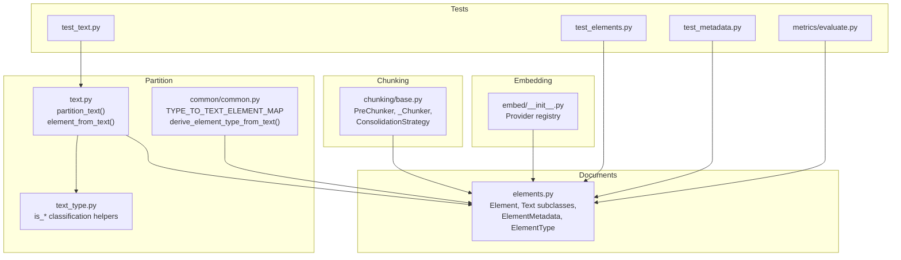
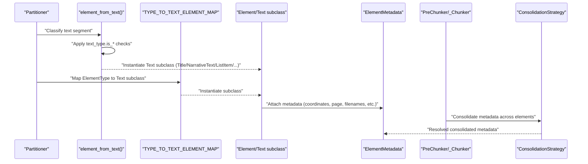
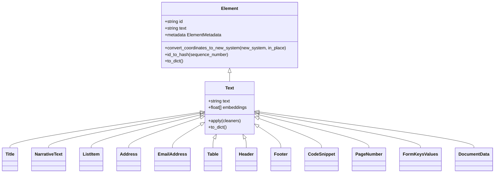
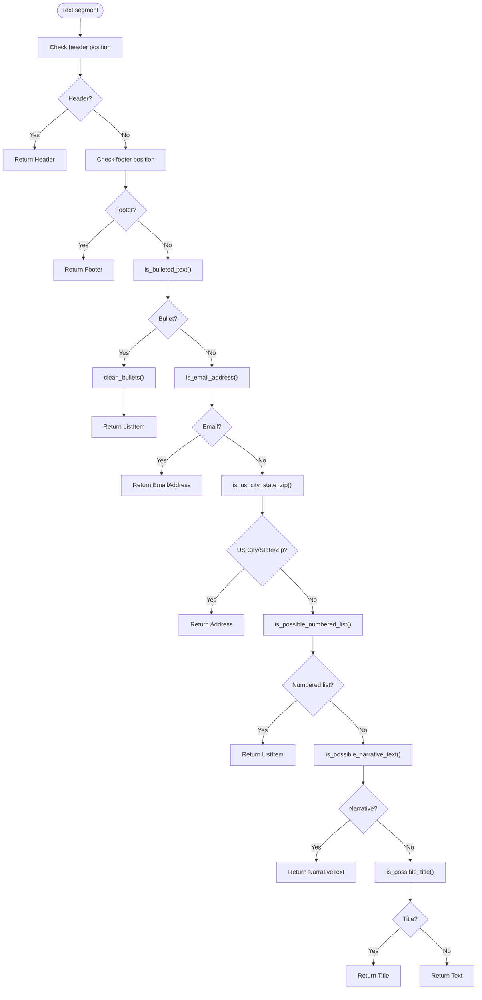
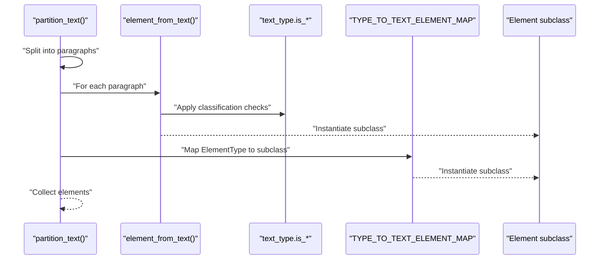
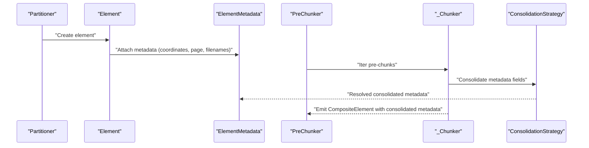
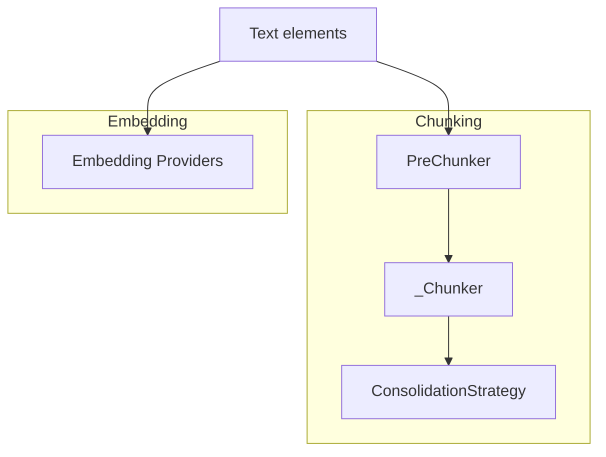
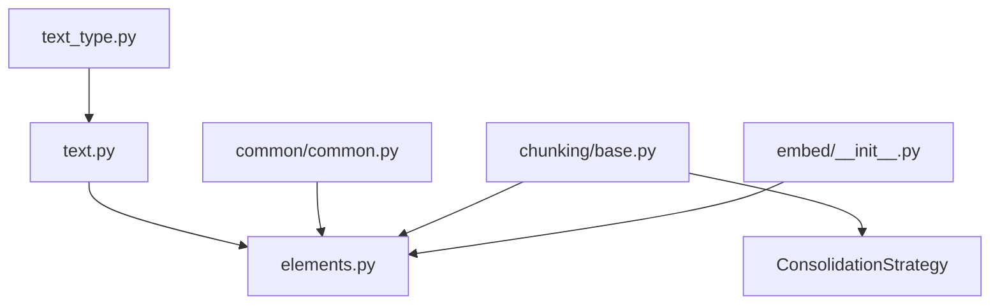

# Element Classification

<cite>
**Referenced Files in This Document**
- [elements.py](file://unstructured/documents/elements.py)
- [text_type.py](file://unstructured/partition/text_type.py)
- [text.py](file://unstructured/partition/text.py)
- [common.py](file://unstructured/partition/common/common.py)
- [base.py](file://unstructured/chunking/base.py)
- [__init__.py](file://unstructured/embed/__init__.py)
- [test_elements.py](file://test_unstructured/documents/test_elements.py)
- [test_text.py](file://test_unstructured/partition/test_text.py)
- [test_metadata.py](file://test_unstructured/partition/common/test_metadata.py)
- [evaluate.py](file://unstructured/metrics/evaluate.py)
</cite>

## Table of Contents
1. [Introduction](#introduction)
2. [Project Structure](#project-structure)
3. [Core Components](#core-components)
4. [Architecture Overview](#architecture-overview)
5. [Detailed Component Analysis](#detailed-component-analysis)
6. [Dependency Analysis](#dependency-analysis)
7. [Performance Considerations](#performance-considerations)
8. [Troubleshooting Guide](#troubleshooting-guide)
9. [Conclusion](#conclusion)

## Introduction
This document explains the element classification system used by the unstructured library. It focuses on the Element base class and its concrete subclasses (Text, Title, ListItem, Table, etc.), the text_type classification logic that drives partitioning decisions, and how metadata is attached to elements. It also covers how element types influence downstream processing such as chunking and embedding, common classification issues, and performance considerations.

## Project Structure
The element classification system spans several modules:
- Element model and metadata: unstructured/documents/elements.py
- Text classification helpers: unstructured/partition/text_type.py
- Partition-time element creation: unstructured/partition/text.py
- Element mapping and common utilities: unstructured/partition/common/common.py
- Chunking and consolidation: unstructured/chunking/base.py
- Embedding providers: unstructured/embed/__init__.py
- Tests validating behavior: test_unstructured/* directories

**Diagram sources**
- [elements.py](file://unstructured/documents/elements.py#L601-L1067)
- [text_type.py](file://unstructured/partition/text_type.py#L1-L322)
- [text.py](file://unstructured/partition/text.py#L1-L217)
- [common.py](file://unstructured/partition/common/common.py#L72-L111)
- [base.py](file://unstructured/chunking/base.py#L1-L800)
- [__init__.py](file://unstructured/embed/__init__.py#L1-L28)
- [test_elements.py](file://test_unstructured/documents/test_elements.py#L1-L200)
- [test_text.py](file://test_unstructured/partition/test_text.py#L372-L446)
- [test_metadata.py](file://test_unstructured/partition/common/test_metadata.py#L264-L295)
- [evaluate.py](file://unstructured/metrics/evaluate.py#L437-L510)

**Section sources**
- [elements.py](file://unstructured/documents/elements.py#L601-L1067)
- [text_type.py](file://unstructured/partition/text_type.py#L1-L322)
- [text.py](file://unstructured/partition/text.py#L1-L217)
- [common.py](file://unstructured/partition/common/common.py#L72-L111)
- [base.py](file://unstructured/chunking/base.py#L1-L800)
- [__init__.py](file://unstructured/embed/__init__.py#L1-L28)
- [test_elements.py](file://test_unstructured/documents/test_elements.py#L1-L200)
- [test_text.py](file://test_unstructured/partition/test_text.py#L372-L446)
- [test_metadata.py](file://test_unstructured/partition/common/test_metadata.py#L264-L295)
- [evaluate.py](file://unstructured/metrics/evaluate.py#L437-L510)

## Core Components
- Element: Base abstract class for all document elements. It ensures IDs, lazy UUID assignment, and a text attribute. It also supports coordinate conversion and deterministic hashing.
- Text subclasses: Specializations of Text for specific content types (Title, NarrativeText, ListItem, Address, EmailAddress, Table, Header, Footer, CodeSnippet, PageNumber, FormKeysValues, DocumentData, etc.). Each sets a category string used for classification.
- ElementMetadata: Dynamic metadata container with known fields, serialization/deserialization, and consolidation strategies for downstream chunking.
- ElementType: Enum-like class holding canonical element type strings used across the system.
- TYPE_TO_TEXT_ELEMENT_MAP: Mapping from ElementType strings to Text subclasses used by partitioners to instantiate the correct element type.
- ConsolidationStrategy: Defines how metadata fields are consolidated across chunks.

**Section sources**
- [elements.py](file://unstructured/documents/elements.py#L662-L1067)

## Architecture Overview
The classification pipeline operates at partition time and downstream processing time:

- Partition-time classification:
  - Partitioners split raw content into candidate segments.
  - element_from_text() selects a Text subclass based on text characteristics and spatial hints.
  - TYPE_TO_TEXT_ELEMENT_MAP maps ElementType strings to Text subclasses for layout-based partitioners.

- Downstream processing:
  - Chunking groups elements into pre-chunks respecting semantic boundaries and sizes, then consolidates metadata using ConsolidationStrategy.
  - Embedding providers can attach embeddings to Text elements.

**Diagram sources**
- [text.py](file://unstructured/partition/text.py#L111-L167)
- [common.py](file://unstructured/partition/common/common.py#L72-L111)
- [elements.py](file://unstructured/documents/elements.py#L989-L1028)
- [base.py](file://unstructured/chunking/base.py#L526-L688)

## Detailed Component Analysis

### Element Base Class and Subclasses
- Element:
  - Ensures a lazily assigned UUID when accessed.
  - Supports deterministic hashing via id_to_hash().
  - Provides coordinate conversion and serialization.
- Text subclasses:
  - Title, NarrativeText, ListItem, Address, EmailAddress, Table, Header, Footer, CodeSnippet, PageNumber, FormKeysValues, DocumentData, etc.
  - Each defines a category string used for classification and JSON serialization.
- ElementType:
  - Canonical strings for element types used across partitioners and mapping.
- TYPE_TO_TEXT_ELEMENT_MAP:
  - Maps ElementType strings to Text subclasses, enabling layout-based partitioners to create the correct element type.

**Diagram sources**
- [elements.py](file://unstructured/documents/elements.py#L662-L1067)

**Section sources**
- [elements.py](file://unstructured/documents/elements.py#L662-L1067)

### Text Classification Logic (text_type.py)
The text_type module provides functions to classify text segments into categories such as:
- is_possible_title(): Validates title-like characteristics (word count, non-alpha ratio, sentence count, language checks).
- is_possible_narrative_text(): Checks narrative characteristics (capitalization ratio, non-alpha ratio, verb presence, language checks).
- is_bulleted_text(): Detects bullet markers.
- is_email_address(): Matches email patterns.
- is_us_city_state_zip(): Matches US city/state/zip patterns.
- is_possible_numbered_list(): Detects numbered list patterns.

These functions are used by partitioners to select the appropriate Text subclass.

**Diagram sources**
- [text.py](file://unstructured/partition/text.py#L111-L167)
- [text_type.py](file://unstructured/partition/text_type.py#L1-L322)

**Section sources**
- [text_type.py](file://unstructured/partition/text_type.py#L1-L322)
- [text.py](file://unstructured/partition/text.py#L111-L167)

### Element Creation During Partitioning
- partition_text() splits text into paragraphs and calls element_from_text() to classify each segment.
- element_from_text() uses spatial hints (header/footer thresholds) and text_type checks to instantiate the correct Text subclass.
- Layout-based partitioners use TYPE_TO_TEXT_ELEMENT_MAP to map ElementType strings to Text subclasses.

**Diagram sources**
- [text.py](file://unstructured/partition/text.py#L111-L167)
- [common.py](file://unstructured/partition/common/common.py#L72-L111)

**Section sources**
- [text.py](file://unstructured/partition/text.py#L111-L167)
- [common.py](file://unstructured/partition/common/common.py#L72-L111)

### Metadata Attachment and Consolidation
- ElementMetadata stores known fields (coordinates, page_number, filenames, languages, links, etc.) and supports serialization/deserialization.
- ConsolidationStrategy defines how metadata fields are consolidated across elements during chunking (e.g., first value, list concatenation, unique list, string concatenation, drop).
- Chunking consolidates metadata from pre-chunks into CompositeElement chunks using these strategies.

**Diagram sources**
- [elements.py](file://unstructured/documents/elements.py#L149-L524)
- [base.py](file://unstructured/chunking/base.py#L526-L688)

**Section sources**
- [elements.py](file://unstructured/documents/elements.py#L149-L524)
- [base.py](file://unstructured/chunking/base.py#L526-L688)

### Relationship Between Element Types and Downstream Processing
- Chunking:
  - PreChunker separates elements by semantic boundaries (e.g., Title) and size constraints.
  - _Chunker emits CompositeElement for non-Table text elements and handles oversized elements by text-splitting.
  - ConsolidationStrategy resolves metadata across elements to produce coherent chunk metadata.
- Embedding:
  - Embedding providers can attach embeddings to Text elements; Text supports an embeddings attribute.
  - Tests demonstrate assigning deterministic IDs and JSON serialization for Text elements.

**Diagram sources**
- [base.py](file://unstructured/chunking/base.py#L243-L800)
- [__init__.py](file://unstructured/embed/__init__.py#L1-L28)
- [test_text.py](file://test_unstructured/partition/test_text.py#L372-L446)

**Section sources**
- [base.py](file://unstructured/chunking/base.py#L243-L800)
- [__init__.py](file://unstructured/embed/__init__.py#L1-L28)
- [test_text.py](file://test_unstructured/partition/test_text.py#L372-L446)

## Dependency Analysis
- Partition-time dependencies:
  - text.py depends on text_type.py for classification and on elements.py for Text subclasses.
  - common.py maps ElementType strings to Text subclasses for layout-based partitioners.
- Chunking dependencies:
  - base.py depends on elements.py for Element types and ConsolidationStrategy for metadata consolidation.
- Embedding dependencies:
  - embed/__init__.py provides provider classes; Text supports embeddings.

**Diagram sources**
- [text_type.py](file://unstructured/partition/text_type.py#L1-L322)
- [text.py](file://unstructured/partition/text.py#L1-L217)
- [common.py](file://unstructured/partition/common/common.py#L72-L111)
- [elements.py](file://unstructured/documents/elements.py#L601-L1067)
- [base.py](file://unstructured/chunking/base.py#L1-L800)
- [__init__.py](file://unstructured/embed/__init__.py#L1-L28)

**Section sources**
- [text_type.py](file://unstructured/partition/text_type.py#L1-L322)
- [text.py](file://unstructured/partition/text.py#L1-L217)
- [common.py](file://unstructured/partition/common/common.py#L72-L111)
- [elements.py](file://unstructured/documents/elements.py#L601-L1067)
- [base.py](file://unstructured/chunking/base.py#L1-L800)
- [__init__.py](file://unstructured/embed/__init__.py#L1-L28)

## Performance Considerations
- Classification accuracy vs. speed:
  - Language checks and POS tagging improve accuracy but add overhead. Environment variables allow toggling language checks and thresholds to balance speed and correctness.
  - Tests show language detection can be enabled per element or globally.
- Deterministic IDs:
  - Unique element IDs can be disabled to use deterministic hashes, improving reproducibility and reducing storage overhead.
- Chunking window sizing:
  - Larger max_characters reduces chunk count but increases memory and potential context loss. Smaller windows increase granularity but may fragment content.
- Consolidation strategies:
  - Some strategies drop fields to reduce metadata overhead; others concatenate lists or strings. Choose strategies aligned with downstream needs.

[No sources needed since this section provides general guidance]

## Troubleshooting Guide
Common issues and resolutions:
- Incorrect element classification:
  - Verify text_type thresholds (e.g., UNSTRUCTURED_TITLE_MAX_WORD_LENGTH, UNSTRUCTURED_TITLE_NON_ALPHA_THRESHOLD, UNSTRUCTURED_LANGUAGE_CHECKS) and adjust to match document characteristics.
  - Ensure spatial hints (header/footer thresholds) are appropriate for the document layout.
- Missing metadata:
  - Confirm ElementMetadata fields are populated during partitioning and that serialization/deserialization paths are exercised.
  - Use tests as references for expected metadata fields and equality behavior.
- Chunking anomalies:
  - Adjust chunking options (max_characters, new_after_n_chars, overlap) to balance chunk size and semantic coherence.
  - Validate consolidation strategies align with downstream expectations.

Evidence and references:
- ElementMetadata behavior and consolidation strategies:
  - [elements.py](file://unstructured/documents/elements.py#L149-L524)
  - [test_elements.py](file://test_unstructured/documents/test_elements.py#L413-L480)
  - [test_elements.py](file://test_unstructured/documents/test_elements.py#L508-L636)
- Deterministic IDs and JSON serialization:
  - [test_text.py](file://test_unstructured/partition/test_text.py#L372-L446)
  - [test_metadata.py](file://test_unstructured/partition/common/test_metadata.py#L264-L295)
- Element equality and consolidation coverage:
  - [test_elements.py](file://test_unstructured/documents/test_elements.py#L635-L666)
- Element type accuracy metrics:
  - [evaluate.py](file://unstructured/metrics/evaluate.py#L437-L510)

**Section sources**
- [elements.py](file://unstructured/documents/elements.py#L149-L524)
- [test_elements.py](file://test_unstructured/documents/test_elements.py#L413-L480)
- [test_elements.py](file://test_unstructured/documents/test_elements.py#L508-L636)
- [test_text.py](file://test_unstructured/partition/test_text.py#L372-L446)
- [test_metadata.py](file://test_unstructured/partition/common/test_metadata.py#L264-L295)
- [evaluate.py](file://unstructured/metrics/evaluate.py#L437-L510)

## Conclusion
The element classification system integrates text classification logic, element instantiation, and robust metadata handling. Partitioners use text_type checks and spatial cues to instantiate the correct Text subclass, while downstream chunking consolidates metadata according to well-defined strategies. Proper tuning of classification thresholds and chunking parameters yields both accuracy and performance. Tests provide reliable references for expected behavior and help diagnose common issues.