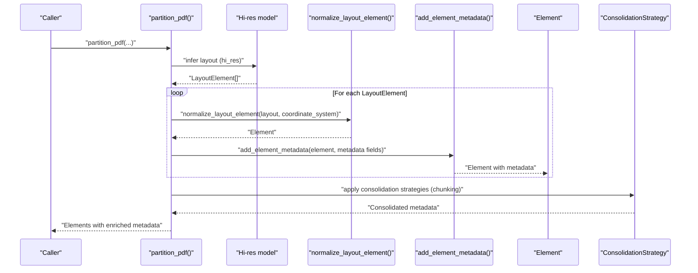
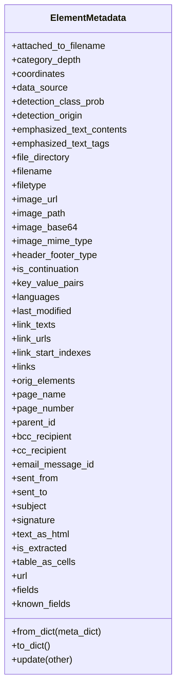
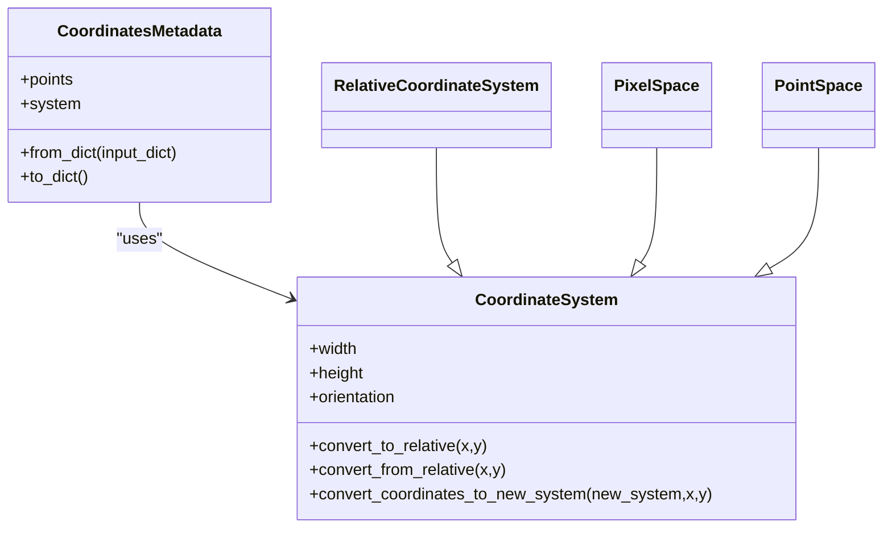
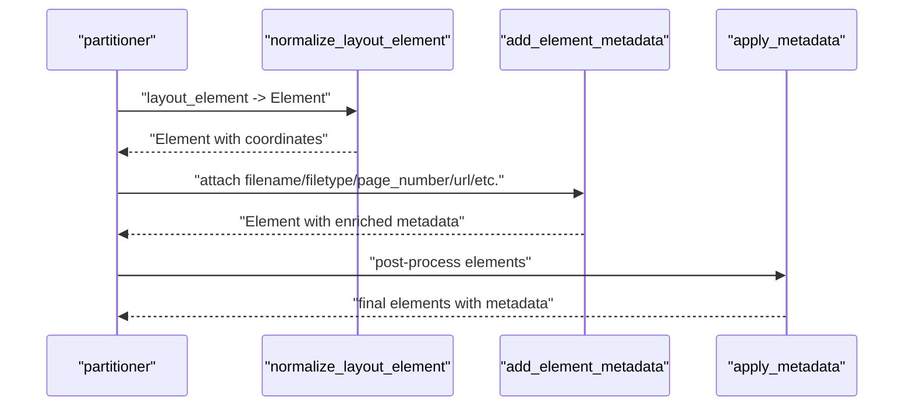
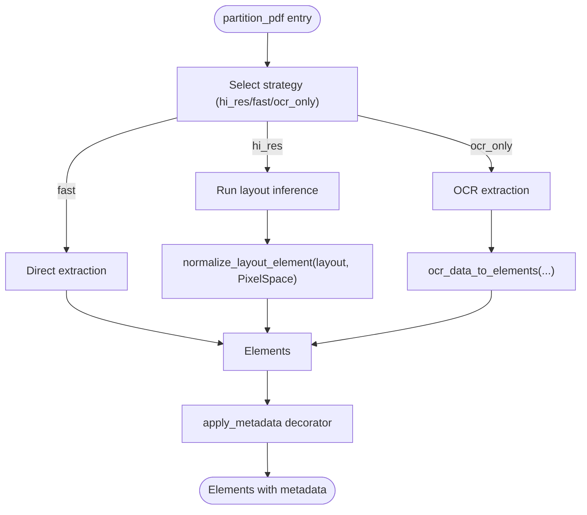
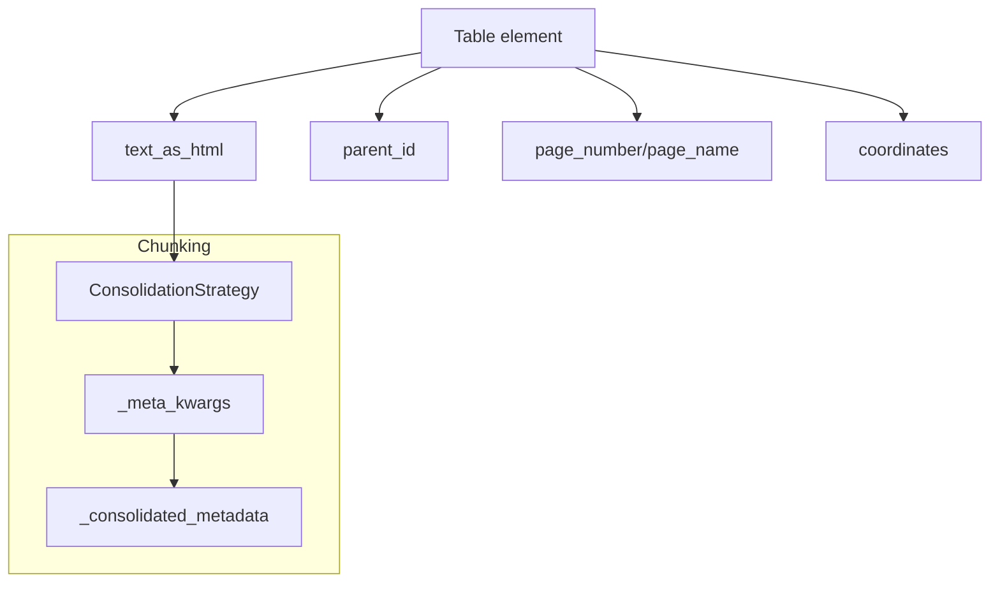
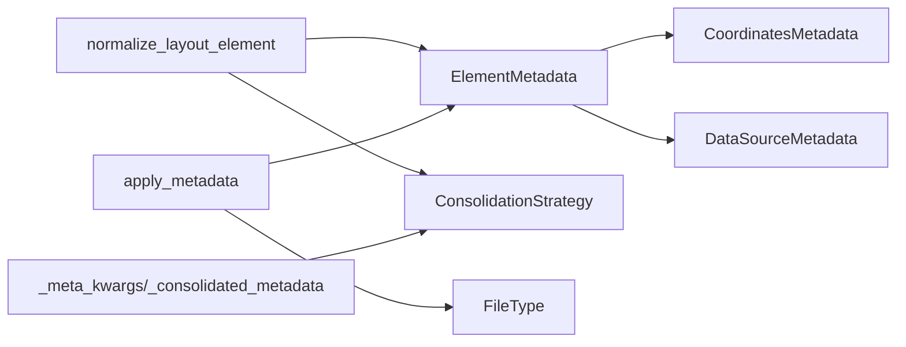

# Metadata Enrichment

<cite>
**Referenced Files in This Document**
- [elements.py](file://unstructured/documents/elements.py)
- [coordinates.py](file://unstructured/documents/coordinates.py)
- [common.py](file://unstructured/partition/common/common.py)
- [metadata.py](file://unstructured/partition/common/metadata.py)
- [pdf.py](file://unstructured/partition/pdf.py)
- [base.py](file://unstructured/chunking/base.py)
- [test_elements.py](file://test_unstructured/documents/test_elements.py)
- [test_coordinates.py](file://test_unstructured/documents/test_coordinates.py)
- [test_metadata.py](file://test_unstructured/partition/common/test_metadata.py)
- [test_sorting.py](file://test_unstructured/partition/utils/test_sorting.py)
- [elasticsearch_elements_mappings.json](file://scripts/elasticsearch-test-helpers/destination_connector/elasticsearch_elements_mappings.json)
- [opensearch_elements_mappings.json](file://scripts/opensearch-test-helpers/destination_connector/opensearch_elements_mappings.json)
- [elements.json](file://scripts/weaviate-test-helpers/elements.json)
</cite>

## Table of Contents
1. [Introduction](#introduction)
2. [Project Structure](#project-structure)
3. [Core Components](#core-components)
4. [Architecture Overview](#architecture-overview)
5. [Detailed Component Analysis](#detailed-component-analysis)
6. [Dependency Analysis](#dependency-analysis)
7. [Performance Considerations](#performance-considerations)
8. [Troubleshooting Guide](#troubleshooting-guide)
9. [Conclusion](#conclusion)
10. [Appendices](#appendices)

## Introduction
This document explains the metadata enrichment process in the repository, focusing on the ElementMetadata class and its components, how spatial metadata is captured during processing (especially for PDFs with layout detection), and how metadata is attached by partitioners. It also covers the relationship between metadata and advanced features such as table structure preservation and document reconstruction, common issues like missing coordinate data or incorrect page numbering, and performance considerations for metadata storage and retrieval.

## Project Structure
The metadata enrichment pipeline spans several modules:
- Documents and elements: ElementMetadata, CoordinatesMetadata, and related data structures
- Partition common helpers: normalization, metadata attachment, and OCR conversion
- PDF partitioner: strategy selection, layout detection, and metadata propagation
- Chunking: consolidation strategies for metadata across pre-chunks
- Tests and mappings: validation of metadata shape and persistence targets

```mermaid
graph TB
subgraph "Documents"
E["ElementMetadata<br/>CoordinatesMetadata<br/>DataSourceMetadata"]
C["CoordinateSystem<br/>RelativeCoordinateSystem<br/>PixelSpace<br/>PointSpace"]
end
subgraph "Partition Common"
NC["normalize_layout_element<br/>add_element_metadata<br/>ocr_data_to_elements"]
NM["apply_metadata decorator<br/>set_element_hierarchy"]
end
subgraph "PDF"
PDF["partition_pdf<br/>strategy selection<br/>layout detection"]
end
subgraph "Chunking"
CB["ConsolidationStrategy<br/>_meta_kwargs<br/>_consolidated_metadata"]
end
E --> NC
C --> NC
NC --> PDF
NM --> PDF
PDF --> CB
```

**Diagram sources**
- [elements.py](file://unstructured/documents/elements.py#L29-L127)
- [coordinates.py](file://unstructured/documents/coordinates.py#L1-L114)
- [common.py](file://unstructured/partition/common/common.py#L157-L242)
- [metadata.py](file://unstructured/partition/common/metadata.py#L119-L243)
- [pdf.py](file://unstructured/partition/pdf.py#L123-L200)
- [base.py](file://unstructured/chunking/base.py#L588-L663)

**Section sources**
- [elements.py](file://unstructured/documents/elements.py#L29-L127)
- [coordinates.py](file://unstructured/documents/coordinates.py#L1-L114)
- [common.py](file://unstructured/partition/common/common.py#L157-L242)
- [metadata.py](file://unstructured/partition/common/metadata.py#L119-L243)
- [pdf.py](file://unstructured/partition/pdf.py#L123-L200)
- [base.py](file://unstructured/chunking/base.py#L588-L663)

## Core Components
- ElementMetadata: The central metadata container for each element. It supports dynamic fields, known-field consolidation strategies, and serialization to/from dictionaries.
- CoordinatesMetadata: Encodes spatial geometry with a coordinate system and bounding points.
- CoordinateSystem family: Defines spatial contexts (relative, pixel, point) and conversions between them.
- Partition helpers: Normalize layout elements, attach metadata, and convert OCR data to elements.
- PDF partitioner: Orchestrates strategy selection and propagates metadata (including coordinates) to elements.
- Chunking consolidation: Applies strategies to combine metadata across pre-chunks.

**Section sources**
- [elements.py](file://unstructured/documents/elements.py#L148-L448)
- [elements.py](file://unstructured/documents/elements.py#L53-L125)
- [coordinates.py](file://unstructured/documents/coordinates.py#L1-L114)
- [common.py](file://unstructured/partition/common/common.py#L157-L242)
- [pdf.py](file://unstructured/partition/pdf.py#L123-L200)
- [base.py](file://unstructured/chunking/base.py#L588-L663)

## Architecture Overview
The enrichment pipeline integrates layout detection, coordinate assignment, and metadata propagation across partitioners and chunking.



**Diagram sources**
- [pdf.py](file://unstructured/partition/pdf.py#L123-L200)
- [common.py](file://unstructured/partition/common/common.py#L157-L242)
- [elements.py](file://unstructured/documents/elements.py#L148-L448)
- [base.py](file://unstructured/chunking/base.py#L588-L663)

## Detailed Component Analysis

### ElementMetadata: Structure and Behavior
- Known fields: filename, file_directory, filetype, page_number, page_name, url, data_source, coordinates, languages, text_as_html, table_as_cells, links, and more.
- Dynamic ad-hoc fields: Additional fields can be assigned at runtime; equality and serialization ignore unknown fields at the top level.
- Serialization: to_dict() excludes None values and serializes sub-objects (coordinates, data_source, orig_elements).
- Equality: Compares the “fields” snapshot, including known and ad-hoc fields.
- Consolidation strategies: Defined for known fields to govern how metadata is merged across pre-chunks.



**Diagram sources**
- [elements.py](file://unstructured/documents/elements.py#L148-L448)

**Section sources**
- [elements.py](file://unstructured/documents/elements.py#L148-L448)
- [test_elements.py](file://test_unstructured/documents/test_elements.py#L236-L658)

### CoordinatesMetadata and Coordinate Systems
- CoordinatesMetadata holds points and a coordinate system; both must be present or both absent.
- CoordinateSystem defines width, height, orientation, and conversion utilities.
- RelativeCoordinateSystem: normalized 0..1 scale.
- PixelSpace: image/pixel-based origin at top-left.
- PointSpace: PDF point-based origin at bottom-left.



**Diagram sources**
- [elements.py](file://unstructured/documents/elements.py#L53-L125)
- [coordinates.py](file://unstructured/documents/coordinates.py#L1-L114)

**Section sources**
- [elements.py](file://unstructured/documents/elements.py#L53-L125)
- [coordinates.py](file://unstructured/documents/coordinates.py#L1-L114)
- [test_coordinates.py](file://test_unstructured/documents/test_coordinates.py#L37-L73)

### Metadata Attachment in Partitioners
- normalize_layout_element converts layout elements to internal Element types and attaches coordinates and detection metadata when available.
- add_element_metadata composes a metadata object from filename, filetype, page_number, URL, text_as_html, links, emphasis tags, and languages, then updates element.metadata.
- apply_metadata decorator post-processes partitioned elements: unique-ifies instances, applies language metadata, sets filetype/filename/last_modified/url, computes hash IDs, and assigns parent_id hierarchy.



**Diagram sources**
- [common.py](file://unstructured/partition/common/common.py#L157-L242)
- [metadata.py](file://unstructured/partition/common/metadata.py#L119-L243)

**Section sources**
- [common.py](file://unstructured/partition/common/common.py#L157-L242)
- [metadata.py](file://unstructured/partition/common/metadata.py#L119-L243)
- [test_metadata.py](file://test_unstructured/partition/common/test_metadata.py#L214-L246)

### Spatial Metadata Capture in PDFs with Layout Detection
- partition_pdf orchestrates strategy selection and layout detection.
- OCR path: ocr_data_to_elements builds a coordinate system from image size and normalizes layout elements with coordinates.
- Fast/hi_res path: coordinates are attached via normalize_layout_element when a coordinate system is provided.
- PDF-specific metadata: page_number, page_name, languages, and filename are propagated via apply_metadata.



**Diagram sources**
- [pdf.py](file://unstructured/partition/pdf.py#L123-L200)
- [common.py](file://unstructured/partition/common/common.py#L435-L461)

**Section sources**
- [pdf.py](file://unstructured/partition/pdf.py#L123-L200)
- [common.py](file://unstructured/partition/common/common.py#L435-L461)
- [test_unstructured/partition/pdf_image/test_pdf.py](file://test_unstructured/partition/pdf_image/test_pdf.py#L707-L746)

### Relationship Between Metadata and Advanced Features
- Table structure preservation: Table elements carry text_as_html to preserve rows and cells; chunking consolidates metadata across pre-chunks, and strategies like STRING_CONCATENATE and LIST_UNIQUE are applied.
- Document reconstruction: parent_id hierarchy is computed by set_element_hierarchy; page_number and page_name help maintain ordering; coordinates enable spatial sorting and layout-aware operations.



**Diagram sources**
- [elements.py](file://unstructured/documents/elements.py#L148-L448)
- [base.py](file://unstructured/chunking/base.py#L588-L663)
- [metadata.py](file://unstructured/partition/common/metadata.py#L63-L112)

**Section sources**
- [base.py](file://unstructured/chunking/base.py#L588-L663)
- [metadata.py](file://unstructured/partition/common/metadata.py#L63-L112)
- [test_unstructured/partition/test_docx.py](file://test_unstructured/partition/test_docx.py#L1167-L1194)

## Dependency Analysis
- ElementMetadata depends on CoordinatesMetadata and DataSourceMetadata for sub-object serialization.
- normalize_layout_element depends on CoordinateSystem to attach coordinates and detection metadata.
- apply_metadata depends on ElementMetadata and FileType to set standardized metadata fields.
- Chunking consolidation depends on ConsolidationStrategy to merge metadata across pre-chunks.



**Diagram sources**
- [elements.py](file://unstructured/documents/elements.py#L29-L125)
- [common.py](file://unstructured/partition/common/common.py#L157-L242)
- [metadata.py](file://unstructured/partition/common/metadata.py#L119-L243)
- [base.py](file://unstructured/chunking/base.py#L588-L663)

**Section sources**
- [elements.py](file://unstructured/documents/elements.py#L29-L125)
- [common.py](file://unstructured/partition/common/common.py#L157-L242)
- [metadata.py](file://unstructured/partition/common/metadata.py#L119-L243)
- [base.py](file://unstructured/chunking/base.py#L588-L663)

## Performance Considerations
- Metadata serialization: to_dict() excludes None values and serializes sub-objects; avoid storing unnecessary fields to reduce payload size.
- Coordinate conversions: convert_coordinates_to_new_system performs per-point conversions; batch operations where possible.
- Chunking consolidation: ConsolidationStrategy minimizes memory overhead by dropping non-essential fields and concatenating lists efficiently.
- Storage indexing: Elasticsearch/OpenSearch mappings define coordinates as nested objects with system, layout_width, layout_height, and points; Weaviate defines nested properties for coordinates; ensure indices align with query patterns.

**Section sources**
- [elements.py](file://unstructured/documents/elements.py#L386-L417)
- [coordinates.py](file://unstructured/documents/coordinates.py#L61-L83)
- [base.py](file://unstructured/chunking/base.py#L642-L663)
- [elasticsearch_elements_mappings.json](file://scripts/elasticsearch-test-helpers/destination_connector/elasticsearch_elements_mappings.json#L50-L96)
- [opensearch_elements_mappings.json](file://scripts/opensearch-test-helpers/destination_connector/opensearch_elements_mappings.json#L48-L88)
- [elements.json](file://scripts/weaviate-test-helpers/elements.json#L189-L222)

## Troubleshooting Guide
- Missing coordinate data:
  - Ensure both points and system are provided to CoordinatesMetadata; otherwise a validation error is raised.
  - When coordinates are absent, sorting and spatial operations may fall back to text-based ordering.
- Incorrect page numbering:
  - Verify metadata_filename and metadata_last_modified are applied via apply_metadata; confirm partitioner passes page_number consistently.
- Serialization anomalies:
  - Unknown fields at the ElementMetadata top level are tolerated; sub-object fields are strictly validated.
- Sorting without coordinates:
  - sort_page_elements returns original list when coordinates are invalid or missing; ensure coordinate validity.

**Section sources**
- [elements.py](file://unstructured/documents/elements.py#L53-L125)
- [test_sorting.py](file://test_unstructured/partition/utils/test_sorting.py#L37-L78)
- [metadata.py](file://unstructured/partition/common/metadata.py#L191-L221)
- [test_elements.py](file://test_unstructured/documents/test_elements.py#L236-L658)

## Conclusion
The metadata enrichment pipeline provides robust, extensible metadata for elements, with strong support for spatial metadata and advanced features like table structure preservation and document reconstruction. By leveraging known-field consolidation strategies, standardized decorators, and coordinate system conversions, the system ensures reliable, efficient, and interoperable metadata across diverse document formats and processing strategies.

## Appendices

### Appendix A: Metadata Fields Reference
- Known fields include filename, file_directory, filetype, page_number, page_name, url, data_source, coordinates, languages, text_as_html, table_as_cells, and more. See ElementMetadata for the complete list and behavior.

**Section sources**
- [elements.py](file://unstructured/documents/elements.py#L148-L448)

### Appendix B: Coordinate System Mappings
- RelativeCoordinateSystem: normalized 0..1 scale.
- PixelSpace: image/pixel-based origin at top-left.
- PointSpace: PDF point-based origin at bottom-left.

**Section sources**
- [coordinates.py](file://unstructured/documents/coordinates.py#L1-L114)

### Appendix C: Consolidation Strategies
- Strategies include DROP, FIRST, STRING_CONCATENATE, LIST_CONCATENATE, LIST_UNIQUE. Applied during chunking to combine metadata across pre-chunks.

**Section sources**
- [elements.py](file://unstructured/documents/elements.py#L452-L523)
- [base.py](file://unstructured/chunking/base.py#L588-L663)