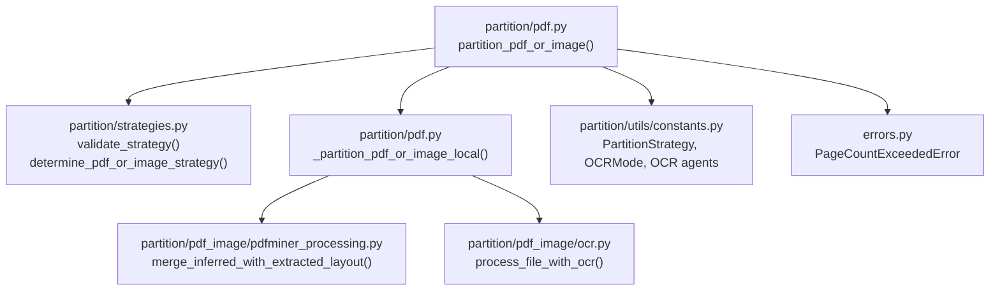
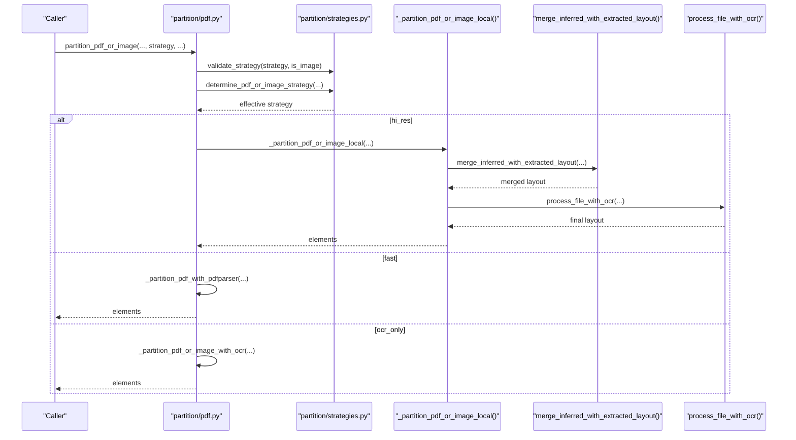
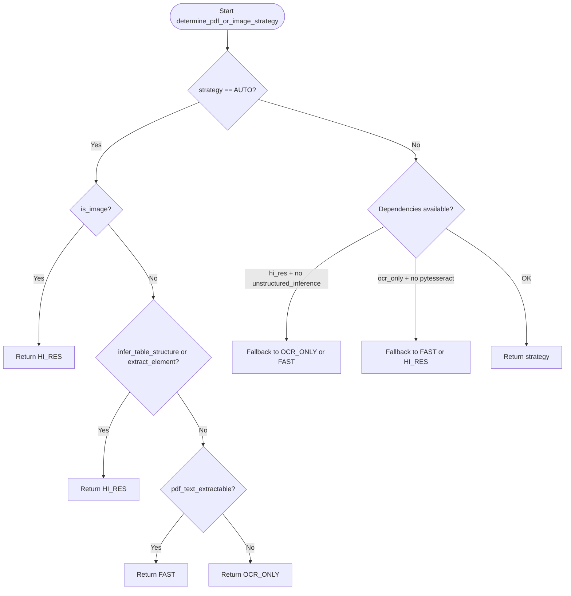
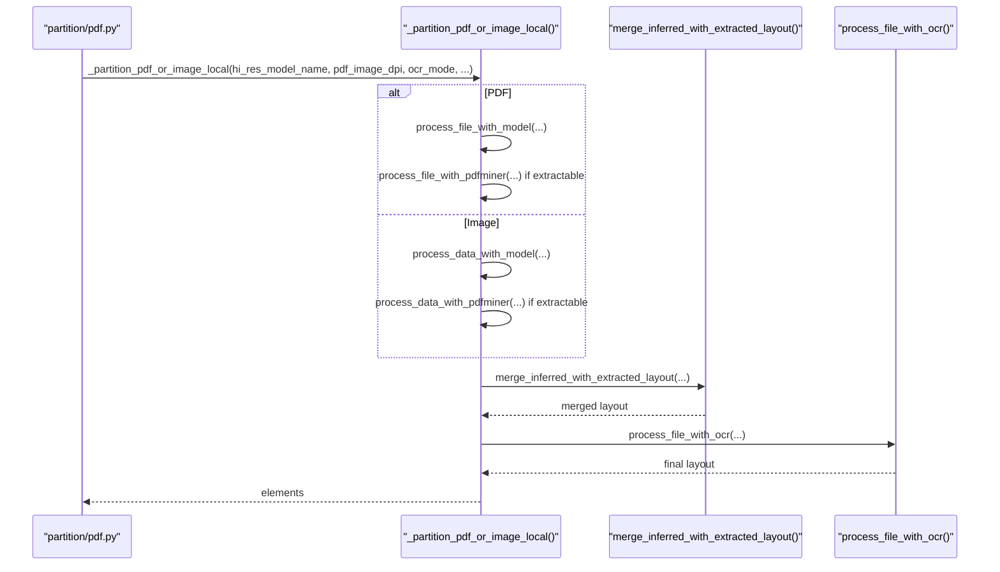
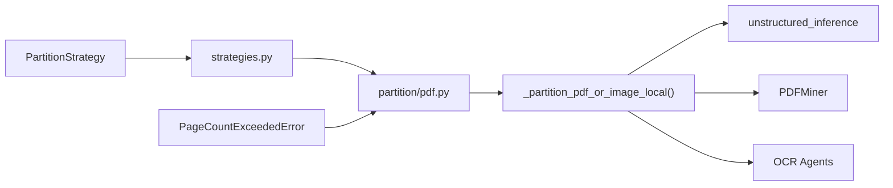

# Processing Strategies

<cite>
**Referenced Files in This Document**
- [strategies.py](file://unstructured/partition/strategies.py)
- [constants.py](file://unstructured/partition/utils/constants.py)
- [pdf.py](file://unstructured/partition/pdf.py)
- [pdfminer_processing.py](file://unstructured/partition/pdf_image/pdfminer_processing.py)
- [ocr.py](file://unstructured/partition/pdf_image/ocr.py)
- [errors.py](file://unstructured/errors.py)
- [test_strategies.py](file://test_unstructured/partition/test_strategies.py)
- [test_pdf.py](file://test_unstructured/partition/pdf_image/test_pdf.py)
- [test_image.py](file://test_unstructured/partition/pdf_image/test_image.py)
</cite>

## Table of Contents
1. [Introduction](#introduction)
2. [Project Structure](#project-structure)
3. [Core Components](#core-components)
4. [Architecture Overview](#architecture-overview)
5. [Detailed Component Analysis](#detailed-component-analysis)
6. [Dependency Analysis](#dependency-analysis)
7. [Performance Considerations](#performance-considerations)
8. [Troubleshooting Guide](#troubleshooting-guide)
9. [Conclusion](#conclusion)

## Introduction
This document explains the processing strategies for PDF and image documents: hi_res, fast, and ocr_only. It covers how each strategy is selected, configured, and executed, including model loading for hi_res and OCR engine selection. It also documents trade-offs among accuracy, speed, and resource usage, and provides guidance for common issues such as OCR accuracy and model loading failures. Concrete examples from the test suite illustrate strategy selection and usage.

## Project Structure
The strategy selection and execution logic spans several modules:
- Strategy selection and validation live in strategies.py.
- Constants and enums (including PartitionStrategy) live in utils/constants.py.
- PDF and image partitioning orchestration is in partition/pdf.py.
- Hi-res pipeline integration and OCR are implemented in pdfminer_processing.py and pdf_image/ocr.py.
- Error types are defined in errors.py.
- Tests in test_unstructured/partition demonstrate strategy behavior and examples.

**Diagram sources**
- [pdf.py](file://unstructured/partition/pdf.py#L250-L449)
- [strategies.py](file://unstructured/partition/strategies.py#L1-L110)
- [pdfminer_processing.py](file://unstructured/partition/pdf_image/pdfminer_processing.py#L623-L700)
- [ocr.py](file://unstructured/partition/pdf_image/ocr.py#L104-L200)
- [constants.py](file://unstructured/partition/utils/constants.py#L17-L45)
- [errors.py](file://unstructured/errors.py#L1-L16)

**Section sources**
- [pdf.py](file://unstructured/partition/pdf.py#L250-L449)
- [strategies.py](file://unstructured/partition/strategies.py#L1-L110)
- [constants.py](file://unstructured/partition/utils/constants.py#L17-L45)

## Core Components
- PartitionStrategy enum defines the four strategies: auto, fast, ocr_only, hi_res.
- Strategy selection logic:
  - validate_strategy ensures the strategy is valid and not misapplied to images with fast.
  - determine_pdf_or_image_strategy chooses the effective strategy based on availability of dependencies and input characteristics (e.g., PDF text extractability, table structure inference, image extraction).
- Hi-res pipeline:
  - _partition_pdf_or_image_local orchestrates layout inference, PDFMiner extraction, merging, and OCR.
  - merge_inferred_with_extracted_layout merges detected layout with extracted text regions.
  - process_file_with_ocr performs OCR and integrates results into the layout.
- OCR engines and modes:
  - OCR_MODE options include entire_page and individual_blocks.
  - OCR agent selection via constants and environment configuration.

**Section sources**
- [constants.py](file://unstructured/partition/utils/constants.py#L17-L45)
- [strategies.py](file://unstructured/partition/strategies.py#L1-L110)
- [pdf.py](file://unstructured/partition/pdf.py#L586-L749)
- [pdfminer_processing.py](file://unstructured/partition/pdf_image/pdfminer_processing.py#L623-L700)
- [ocr.py](file://unstructured/partition/pdf_image/ocr.py#L104-L200)

## Architecture Overview
The strategy selection and processing pipeline:

**Diagram sources**
- [pdf.py](file://unstructured/partition/pdf.py#L250-L449)
- [strategies.py](file://unstructured/partition/strategies.py#L1-L110)
- [pdfminer_processing.py](file://unstructured/partition/pdf_image/pdfminer_processing.py#L623-L700)
- [ocr.py](file://unstructured/partition/pdf_image/ocr.py#L104-L200)

## Detailed Component Analysis

### Strategy Selection Logic
- Validation:
  - validate_strategy rejects invalid strategies and disallows fast for images.
- Auto selection:
  - determine_pdf_or_image_strategy returns hi_res when infer_table_structure or extract_images_in_pdf is set.
  - For PDFs, if text is extractable, fast is chosen; otherwise ocr_only is chosen.
  - For images, hi_res is defaulted.
  - Fallback logic handles missing dependencies:
    - hi_res falls back to ocr_only if pytesseract is available, otherwise to fast.
    - ocr_only falls back to fast if PDF text is extractable, otherwise to hi_res.
  - Raises a descriptive error if neither unstructured_inference nor pytesseract is available and the PDF text is not extractable.

**Diagram sources**
- [strategies.py](file://unstructured/partition/strategies.py#L24-L110)

**Section sources**
- [strategies.py](file://unstructured/partition/strategies.py#L1-L110)
- [test_strategies.py](file://test_unstructured/partition/test_strategies.py#L80-L131)

### Strategy: hi_res
- Purpose: High-accuracy layout inference with optional table structure extraction and image block extraction. Uses unstructured_inference model for detection and merges with PDFMiner text extraction and OCR.
- Key parameters:
  - hi_res_model_name: Model identifier for layout inference. Defaults to environment-configured model if not provided.
  - pdf_image_dpi: DPI for PDF rasterization; defaults to 200.
  - ocr_agent, table_ocr_agent: OCR engine selection.
  - ocr_mode: "entire_page" or "individual_blocks".
  - infer_table_structure: Enables table extraction during OCR.
  - extract_images_in_pdf, extract_image_block_types, extract_image_block_output_dir, extract_image_block_to_payload: Controls image extraction.
  - pdf_hi_res_max_pages: Page count limit enforced before processing.
- Implementation highlights:
  - _partition_pdf_or_image_local orchestrates:
    - Layout inference via unstructured_inference.
    - PDFMiner extraction when text is extractable.
    - merge_inferred_with_extracted_layout to integrate text regions.
    - process_file_with_ocr to augment layout with OCR results.
  - merge_inferred_with_extracted_layout merges detected and extracted text regions and aggregates embedded text.
  - process_file_with_ocr converts PDFs to images (or iterates frames for multi-page images), applies OCR, and merges results.
- Trade-offs:
  - Accuracy: Highest among the three strategies due to layout inference and OCR augmentation.
  - Speed: Slowest due to model inference, PDF rasterization, and OCR.
  - Resource usage: Highest memory and compute; subject to pdf_hi_res_max_pages limits.

**Diagram sources**
- [pdf.py](file://unstructured/partition/pdf.py#L586-L749)
- [pdfminer_processing.py](file://unstructured/partition/pdf_image/pdfminer_processing.py#L623-L700)
- [ocr.py](file://unstructured/partition/pdf_image/ocr.py#L104-L200)

**Section sources**
- [pdf.py](file://unstructured/partition/pdf.py#L586-L749)
- [pdfminer_processing.py](file://unstructured/partition/pdf_image/pdfminer_processing.py#L623-L700)
- [ocr.py](file://unstructured/partition/pdf_image/ocr.py#L104-L200)
- [test_pdf.py](file://test_unstructured/partition/pdf_image/test_pdf.py#L985-L995)
- [test_pdf.py](file://test_unstructured/partition/pdf_image/test_pdf.py#L1011-L1020)

### Strategy: fast
- Purpose: Fast parsing using PDFMiner extraction without layout inference or OCR.
- Key parameters:
  - Uses PDFMiner configuration (line/char margins, word margin).
  - Works only for PDFs; raises an error when applied to images.
- Implementation highlights:
  - _partition_pdf_with_pdfparser is invoked for fast processing.
  - No OCR or layout inference; relies solely on PDFMiner text extraction.
- Trade-offs:
  - Accuracy: Lower than hi_res; may miss layout and OCR-corrected text.
  - Speed: Fastest.
  - Resource usage: Lowest.

**Section sources**
- [strategies.py](file://unstructured/partition/strategies.py#L1-L23)
- [pdf.py](file://unstructured/partition/pdf.py#L369-L395)

### Strategy: ocr_only
- Purpose: OCR-based parsing for non-extractable PDFs or images; optionally uses PDFMiner text extraction when available.
- Key parameters:
  - OCR agent selection (OCR agent constants).
  - OCR languages and modes.
  - Table OCR agent for table extraction.
- Implementation highlights:
  - _partition_pdf_or_image_with_ocr is used to apply OCR to the entire document or page blocks.
  - _process_uncategorized_text_elements post-processes OCR results.
- Trade-offs:
  - Accuracy: Moderate to high depending on OCR quality and languages.
  - Speed: Medium; slower than fast, faster than hi_res.
  - Resource usage: Medium-high; OCR is computationally intensive.

**Section sources**
- [strategies.py](file://unstructured/partition/strategies.py#L72-L83)
- [pdf.py](file://unstructured/partition/pdf.py#L378-L395)
- [ocr.py](file://unstructured/partition/pdf_image/ocr.py#L104-L200)

### Configuration Options and Parameters
- Strategy selection:
  - strategy: auto, fast, ocr_only, hi_res.
  - is_image: toggles image vs PDF processing.
  - infer_table_structure: enables table structure extraction in hi_res.
  - extract_images_in_pdf, extract_image_block_types: controls image extraction in hi_res.
- Hi-res model loading:
  - hi_res_model_name: Model name for layout inference; defaults to environment-configured model.
  - pdf_image_dpi: DPI for PDF rasterization.
  - pdf_hi_res_max_pages: Page limit enforced before hi_res processing.
- OCR engine selection:
  - ocr_agent, table_ocr_agent: Select OCR backend via constants and environment configuration.
  - ocr_mode: entire_page or individual_blocks.
  - ocr_languages: Languages for OCR; validated to avoid auto in certain contexts.

**Section sources**
- [pdf.py](file://unstructured/partition/pdf.py#L250-L449)
- [pdf.py](file://unstructured/partition/pdf.py#L586-L749)
- [constants.py](file://unstructured/partition/utils/constants.py#L17-L45)
- [ocr.py](file://unstructured/partition/pdf_image/ocr.py#L104-L200)

### Concrete Examples from the Codebase
- Strategy selection examples:
  - Auto strategy selects hi_res when infer_table_structure or extract_images_in_pdf is set; selects fast when PDF text is extractable; otherwise ocr_only.
  - Auto strategy for images defaults to hi_res.
- Hi-res model name defaults:
  - default_hi_res_model reads from environment variable UNSTRUCTURED_HI_RES_MODEL_NAME or falls back to a default from unstructured_inference.
- Image partitioning with hi_res:
  - Tests demonstrate hi_res strategy on images and validation of OCR modes and table extraction.

**Section sources**
- [test_strategies.py](file://test_unstructured/partition/test_strategies.py#L80-L131)
- [test_pdf.py](file://test_unstructured/partition/pdf_image/test_pdf.py#L985-L995)
- [test_pdf.py](file://test_unstructured/partition/pdf_image/test_pdf.py#L1011-L1020)
- [test_image.py](file://test_unstructured/partition/pdf_image/test_image.py#L276-L292)
- [test_image.py](file://test_unstructured/partition/pdf_image/test_image.py#L516-L560)

## Dependency Analysis
- PartitionStrategy enum centralizes strategy names.
- Strategy selection depends on:
  - Availability of unstructured_inference (hi_res).
  - Availability of pytesseract (ocr_only).
  - PDF text extractability (fast).
- Hi-res pipeline depends on:
  - unstructured_inference for layout detection.
  - PDFMiner for text extraction.
  - OCR agents for text augmentation.
- Fallback logic prevents runtime errors by switching strategies when dependencies are missing.

**Diagram sources**
- [constants.py](file://unstructured/partition/utils/constants.py#L17-L22)
- [strategies.py](file://unstructured/partition/strategies.py#L1-L110)
- [pdf.py](file://unstructured/partition/pdf.py#L586-L749)
- [errors.py](file://unstructured/errors.py#L1-L16)

**Section sources**
- [constants.py](file://unstructured/partition/utils/constants.py#L17-L22)
- [strategies.py](file://unstructured/partition/strategies.py#L1-L110)
- [pdf.py](file://unstructured/partition/pdf.py#L586-L749)
- [errors.py](file://unstructured/errors.py#L1-L16)

## Performance Considerations
- GPU vs CPU:
  - The hi_res pipeline uses unstructured_inference for layout detection. Performance depends on the underlying model and device. If GPU acceleration is available in the OCR engine stack, hi_res may benefit from GPU; otherwise it runs on CPU.
- Memory requirements:
  - Hi-res processing involves:
    - Loading and running layout inference models.
    - Converting PDFs to images (dpi affects memory).
    - Performing OCR on potentially many pages.
  - The codebase includes a page count limit (pdf_hi_res_max_pages) to prevent excessive memory usage.
- Speed trade-offs:
  - fast: Fastest, minimal overhead.
  - ocr_only: Moderate speed, OCR cost.
  - hi_res: Slowest, due to inference, merging, and OCR.

[No sources needed since this section provides general guidance]

## Troubleshooting Guide
- OCR accuracy issues:
  - Verify OCR agent selection and languages. Ensure OCR agent is whitelisted and loadable.
  - Adjust OCR mode (entire_page vs individual_blocks) based on document structure.
  - Increase pdf_image_dpi for better OCR resolution when text is faint.
- Model loading failures:
  - hi_res requires unstructured_inference. If unavailable, the system falls back to ocr_only (if pytesseract is available) or fast.
  - Confirm UNSTRUCTURED_HI_RES_MODEL_NAME environment variable if a custom model is desired.
- Page count exceeded:
  - If pdf_hi_res_max_pages is set and the document exceeds the limit, a PageCountExceededError is raised.
- Invalid strategy:
  - fast cannot be used with images; validate_strategy enforces this.
  - auto selection may fall back if dependencies are missing; confirm environment and installation.

**Section sources**
- [strategies.py](file://unstructured/partition/strategies.py#L58-L83)
- [pdf.py](file://unstructured/partition/pdf.py#L572-L584)
- [errors.py](file://unstructured/errors.py#L1-L16)
- [test_pdf.py](file://test_unstructured/partition/pdf_image/test_pdf.py#L1011-L1020)

## Conclusion
The hi_res, fast, and ocr_only strategies offer different balances of accuracy, speed, and resource usage. hi_res prioritizes accuracy with layout inference and OCR, at the cost of speed and memory. fast is the fastest but least accurate, relying purely on PDFMiner extraction. ocr_only bridges the gap, using OCR to improve accuracy while remaining faster than hi_res. Strategy selection logic automatically adapts to dependencies and input characteristics, with clear fallbacks and error handling to keep processing robust.