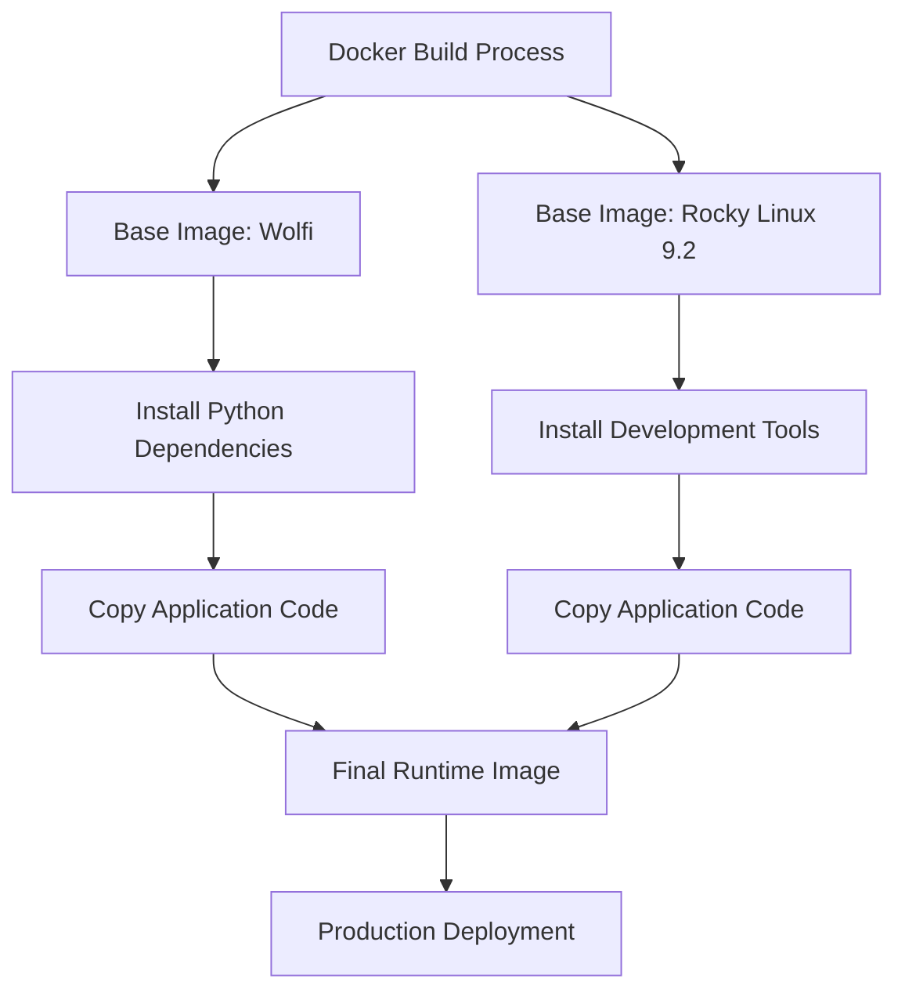
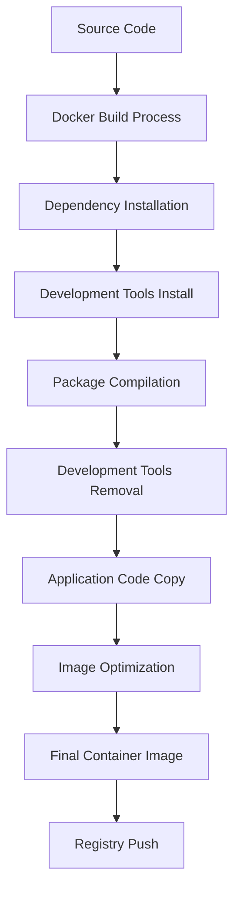
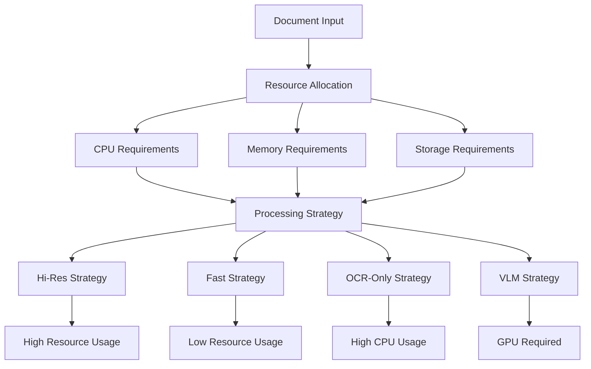
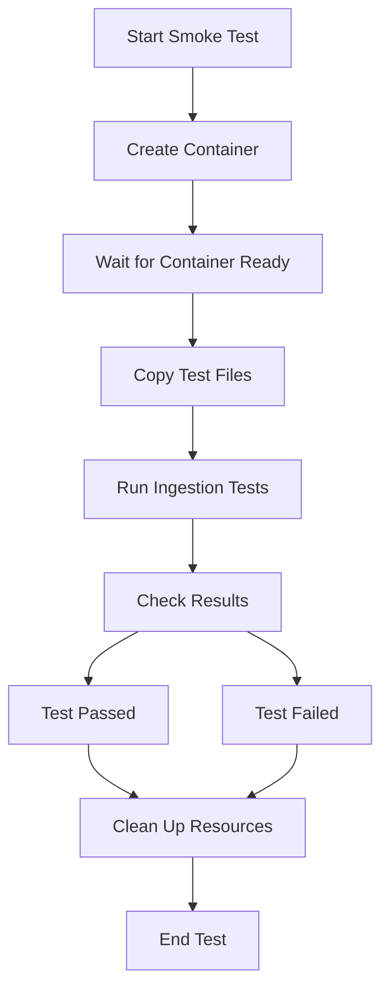
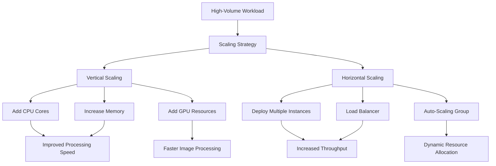
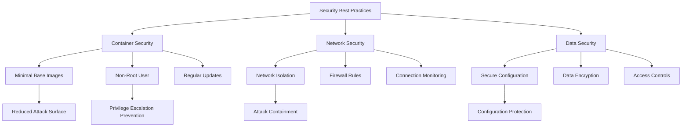
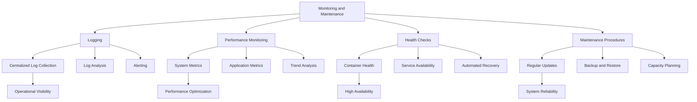

# Deployment and Operations

<cite>
**Referenced Files in This Document**   
- [Dockerfile](file://Dockerfile)
- [docker/rockylinux-9.2/Dockerfile](file://docker/rockylinux-9.2/Dockerfile)
- [scripts/docker-build.sh](file://scripts/docker-build.sh)
- [scripts/docker-build-ubuntu.sh](file://scripts/docker-build-ubuntu.sh)
- [scripts/docker-smoke-test.sh](file://scripts/docker-smoke-test.sh)
- [scripts/performance/benchmark.sh](file://scripts/performance/benchmark.sh)
- [scripts/performance/README.md](file://scripts/performance/README.md)
- [requirements/base.txt](file://requirements/base.txt)
- [requirements/ingest/ingest.txt](file://requirements/ingest/ingest.txt)
- [Makefile](file://Makefile)
- [unstructured/partition/api.py](file://unstructured/partition/api.py)
- [unstructured/logger.py](file://unstructured/logger.py)
</cite>

## Table of Contents
1. [Introduction](#introduction)
2. [Docker-Based Deployment Options](#docker-based-deployment-options)
3. [Build Process and Image Optimization](#build-process-and-image-optimization)
4. [Production Considerations](#production-considerations)
5. [Smoke Testing Procedure](#smoke-testing-procedure)
6. [Scalability for High-Volume Processing](#scalability-for-high-volume-processing)
7. [Security Best Practices](#security-best-practices)
8. [Monitoring and Maintenance](#monitoring-and-maintenance)

## Introduction
This document provides comprehensive guidance on deploying and operating the Unstructured document processing system in production environments. The system offers Docker-based deployment options with both standard and Rocky Linux images, supporting various deployment scenarios from development to high-volume production workloads. This documentation covers the complete deployment lifecycle, including build processes, optimization techniques, production considerations, testing procedures, scalability options, security practices, and monitoring strategies.

## Docker-Based Deployment Options
The Unstructured system provides multiple Docker-based deployment options to accommodate different production requirements and infrastructure preferences. The primary deployment options include the standard Wolfi-based image and the Rocky Linux 9.2 image, each optimized for specific use cases and security requirements.

The standard Docker image, defined in the root-level Dockerfile, is based on the Wolfi base image from the Chainguard repository. This image is designed for security-conscious deployments, leveraging the minimal Wolfi base that includes only essential packages and security-hardened components. The image uses a multi-stage build process that separates dependency installation from application code, reducing the final image size and attack surface.

**Diagram sources**
- [Dockerfile](file://Dockerfile)
- [docker/rockylinux-9.2/Dockerfile](file://docker/rockylinux-9.2/Dockerfile)

The Rocky Linux 9.2 deployment option, located in the docker/rockylinux-9.2 directory, provides a more traditional Linux distribution base for environments that require compatibility with RHEL-based systems. This image includes the Development Tools group during the build phase to ensure all compilation requirements are met, then removes these tools in the final image to minimize the runtime footprint. The Rocky Linux image is particularly suitable for enterprise environments with established RHEL-based infrastructure and compliance requirements.

Both deployment options follow the principle of least privilege by creating a dedicated notebook-user with UID 1000, avoiding the use of root privileges in the runtime container. The images are configured with appropriate environment variables for Python path, NLTK data storage, and Tesseract data, ensuring consistent behavior across different deployment environments.

**Section sources**
- [Dockerfile](file://Dockerfile)
- [docker/rockylinux-9.2/Dockerfile](file://docker/rockylinux-9.2/Dockerfile)

## Build Process and Image Optimization
The build process for the Unstructured system is designed to produce optimized container images while maintaining reproducibility and security. The process leverages Docker BuildKit features and multi-stage builds to create lean, efficient images suitable for production deployment.

The primary build process is orchestrated through the docker-build.sh script, which utilizes Docker Buildx to enable cross-platform builds and advanced caching features. The script configures build arguments for pip version specification and enables build-time caching to accelerate subsequent builds. Key optimization techniques include:

- **Layer caching**: The build process uses Docker's cache-from and cache-to directives to leverage layer caching, significantly reducing build times for incremental changes.
- **Minimal base images**: Both deployment options use minimal base images (Wolfi and Rocky Linux minimal) to reduce the attack surface and image size.
- **Development tool removal**: In the Rocky Linux build, development tools are installed temporarily for package compilation but removed before the final image creation.
- **Dependency consolidation**: Python dependencies are installed in a single layer to minimize the number of filesystem layers and reduce image size.

**Diagram sources**
- [scripts/docker-build.sh](file://scripts/docker-build.sh)
- [docker/rockylinux-9.2/Dockerfile](file://docker/rockylinux-9.2/Dockerfile)

The build process also incorporates security best practices such as upgrading pip to address known vulnerabilities (CVE-2025-8869) and pinning dependency versions through constraint files. The Makefile provides convenient targets for different build scenarios, including docker-build for standard builds and docker-build-ubuntu for Ubuntu-specific deployments.

Image optimization extends beyond the build process to include runtime considerations. The images are configured with appropriate environment variables to optimize performance, including NLTK data location and Hugging Face Hub offline mode. The final images exclude development tools and unnecessary packages, resulting in a minimal runtime footprint that reduces both attack surface and resource consumption.

**Section sources**
- [scripts/docker-build.sh](file://scripts/docker-build.sh)
- [scripts/docker-build-ubuntu.sh](file://scripts/docker-build-ubuntu.sh)
- [Makefile](file://Makefile)

## Production Considerations
Deploying the Unstructured system in production requires careful consideration of resource requirements, monitoring, and logging to ensure reliable and performant operation. The system's resource consumption varies significantly based on document type, processing strategy, and document complexity, necessitating appropriate resource allocation and monitoring.

Resource requirements are primarily driven by the document processing workload. CPU-intensive operations include text extraction, OCR processing, and machine learning model inference. Memory requirements depend on document size and complexity, with large PDFs containing images or complex layouts requiring substantial memory. The system should be deployed with adequate CPU and memory resources, with recommendations varying based on expected workload:

- **Light workload** (primarily text documents): 2 CPU cores, 4GB RAM
- **Medium workload** (mixed document types): 4 CPU cores, 8GB RAM
- **Heavy workload** (image-heavy PDFs, OCR processing): 8+ CPU cores, 16GB+ RAM

The system supports various processing strategies that impact resource consumption:
- **Hi-res strategy**: Higher accuracy but increased CPU and memory usage
- **Fast strategy**: Optimized for speed with reduced resource consumption
- **OCR-only strategy**: CPU-intensive due to image processing requirements
- **VLM strategy**: Requires GPU resources for optimal performance

Monitoring and logging are critical for maintaining production stability. The system includes comprehensive logging through the unstructured.logger module, which provides structured logging with different verbosity levels. The logger supports both standard logging and detailed trace logging for debugging purposes. Log output should be directed to centralized logging systems for analysis and alerting.

**Diagram sources**
- [unstructured/partition/api.py](file://unstructured/partition/api.py)
- [unstructured/logger.py](file://unstructured/logger.py)

The system also includes retry mechanisms for API operations, with configurable retry intervals and exponential backoff to handle transient failures. Production deployments should configure appropriate retry parameters based on network conditions and service availability requirements.

**Section sources**
- [unstructured/partition/api.py](file://unstructured/partition/api.py)
- [unstructured/logger.py](file://unstructured/logger.py)

## Smoke Testing Procedure
The smoke testing procedure validates the correct deployment and basic functionality of the Unstructured system. The process is automated through the docker-smoke-test.sh script, which creates a container, runs basic ingestion tests, and verifies the results.

The smoke test procedure follows these steps:
1. Start a container from the specified Docker image
2. Wait for the container to become ready
3. Copy test files and requirements into the container
4. Run local ingestion tests
5. Report test results and clean up resources

The test uses a trap to ensure container cleanup regardless of test outcome, preventing resource leaks. The test specifically validates the local ingestion functionality by running the local.sh script from the test_unstructured_ingest package. This ensures that core document processing capabilities are functioning correctly after deployment.

**Diagram sources**
- [scripts/docker-smoke-test.sh](file://scripts/docker-smoke-test.sh)

The smoke test provides a quick validation of deployment integrity and can be integrated into CI/CD pipelines to ensure deployment quality. For comprehensive testing, additional test suites should be run, but the smoke test serves as an essential first check for deployment correctness.

**Section sources**
- [scripts/docker-smoke-test.sh](file://scripts/docker-smoke-test.sh)

## Scalability for High-Volume Processing
The Unstructured system supports scalability for high-volume processing through both vertical and horizontal scaling strategies. The system's architecture allows for efficient resource utilization and can be deployed in clustered configurations to handle large document processing workloads.

Vertical scaling is achieved by allocating additional CPU, memory, and storage resources to individual instances. The system benefits from additional CPU cores for parallel processing of document elements and increased memory for handling large documents. For GPU-accelerated processing (VLM strategy), adding GPU resources significantly improves processing speed for image-heavy documents.

Horizontal scaling is supported through deployment of multiple instances behind a load balancer. Each instance operates independently, allowing for linear scaling of processing capacity. The system's stateless design facilitates horizontal scaling, as no shared state needs to be maintained between instances.

Performance benchmarking tools, located in the scripts/performance directory, enable measurement of system throughput and identification of bottlenecks. The benchmark.sh script automates performance testing across different document types and processing strategies, providing metrics for informed scaling decisions. Key performance metrics include:

- Processing time per document
- CPU and memory utilization
- Throughput (documents processed per unit time)
- Error rates under load

**Diagram sources**
- [scripts/performance/benchmark.sh](file://scripts/performance/benchmark.sh)
- [scripts/performance/README.md](file://scripts/performance/README.md)

The system also supports batch processing of multiple documents through the partition_multiple_via_api function, which can improve throughput by reducing per-request overhead. For extremely high-volume scenarios, consider implementing queuing systems to manage document processing workflows and prevent overload.

**Section sources**
- [scripts/performance/benchmark.sh](file://scripts/performance/benchmark.sh)
- [unstructured/partition/api.py](file://unstructured/partition/api.py)

## Security Best Practices
Deploying the Unstructured system securely requires adherence to container security best practices and proper configuration of system components. The deployment strategy should incorporate multiple layers of security controls to protect against potential threats.

Container security begins with the choice of base images. The Wolfi-based image provides enhanced security through its minimal footprint and Chainguard's security-focused build process. The Rocky Linux image benefits from RHEL's long-standing security track record and enterprise support. Both images follow the principle of least privilege by running as a non-root user (notebook-user) in the runtime container.

Key security practices include:
- **Image integrity**: Use signed images and verify image digests to prevent tampering
- **Minimal privileges**: Run containers with minimal required privileges and capabilities
- **Network isolation**: Deploy containers in isolated network segments with restricted external access
- **Dependency management**: Regularly update dependencies and scan for vulnerabilities
- **Environment variables**: Securely manage sensitive configuration through environment variables or secrets management systems

The system includes built-in security features such as the ability to operate in offline mode (HF_HUB_OFFLINE=1) to prevent unauthorized external connections. The test-outbound-connectivity.sh script demonstrates how to validate network connectivity and ensure the system behaves as expected in restricted network environments.

**Diagram sources**
- [Dockerfile](file://Dockerfile)
- [docker/rockylinux-9.2/Dockerfile](file://docker/rockylinux-9.2/Dockerfile)
- [scripts/image/test-outbound-connectivity.sh](file://scripts/image/test-outbound-connectivity.sh)

Production deployments should also implement additional security measures such as:
- Regular vulnerability scanning of container images
- Runtime security monitoring for anomalous behavior
- Secure secret management for API keys and credentials
- Regular security audits and penetration testing
- Compliance with relevant regulatory requirements

**Section sources**
- [Dockerfile](file://Dockerfile)
- [scripts/image/test-outbound-connectivity.sh](file://scripts/image/test-outbound-connectivity.sh)

## Monitoring and Maintenance
Effective monitoring and maintenance are essential for ensuring the reliability and performance of production Unstructured deployments. The system provides multiple monitoring points and maintenance procedures to support operational excellence.

The unstructured.logger module provides comprehensive logging capabilities with multiple verbosity levels, including a custom DETAIL level for granular operational insights. Log output should be collected and analyzed using centralized logging solutions to enable proactive issue detection and troubleshooting. Key log data includes:
- Document processing status and duration
- Error and exception information
- Resource utilization metrics
- API request and response details

Performance monitoring should track both system-level metrics (CPU, memory, disk I/O) and application-specific metrics (documents processed per minute, average processing time, error rates). The performance benchmarking tools can be adapted for continuous monitoring by periodically running test workloads and tracking performance trends.

**Diagram sources**
- [unstructured/logger.py](file://unstructured/logger.py)
- [scripts/performance/benchmark.sh](file://scripts/performance/benchmark.sh)

Maintenance procedures should include:
- Regular updates of container images and dependencies
- Periodic performance testing and capacity planning
- Backup of configuration and critical data
- Documentation of operational procedures and runbooks
- Regular security patching and vulnerability management

The system's modular design facilitates maintenance by allowing components to be updated independently. The use of containerization enables rolling updates with minimal downtime. Monitoring alerts should be configured to notify operations teams of potential issues, allowing for proactive intervention before service degradation occurs.

**Section sources**
- [unstructured/logger.py](file://unstructured/logger.py)
- [scripts/performance/benchmark.sh](file://scripts/performance/benchmark.sh)