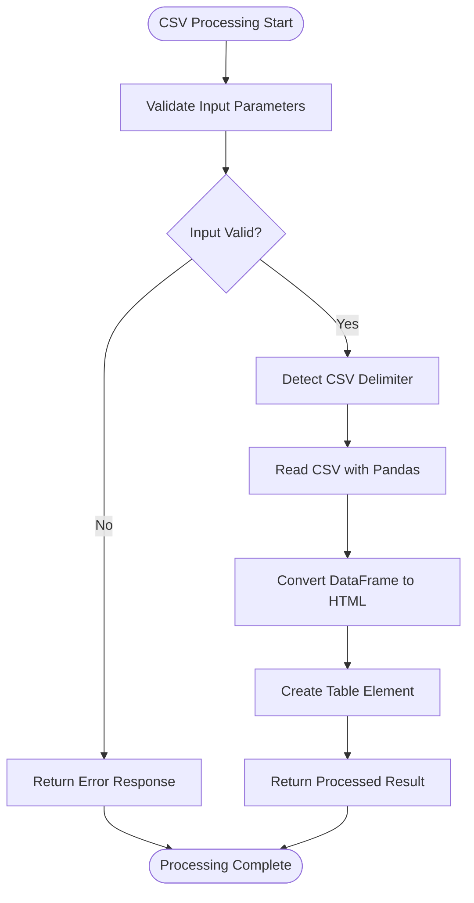
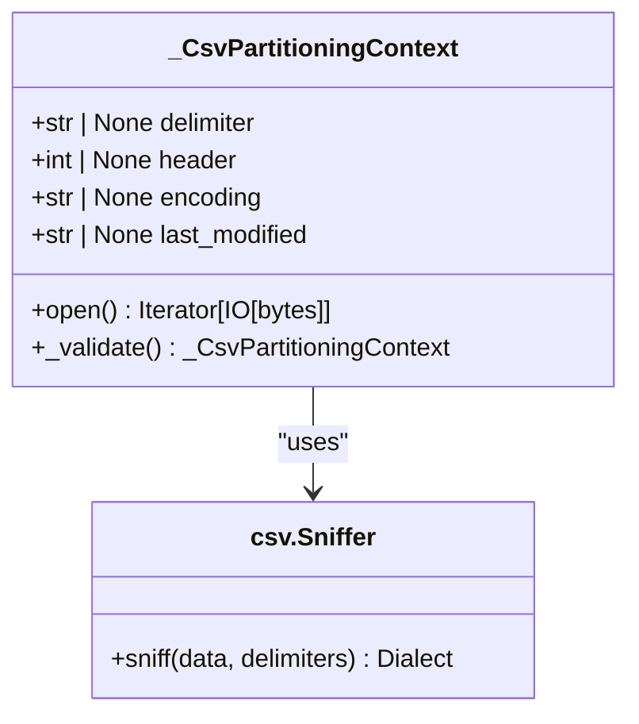
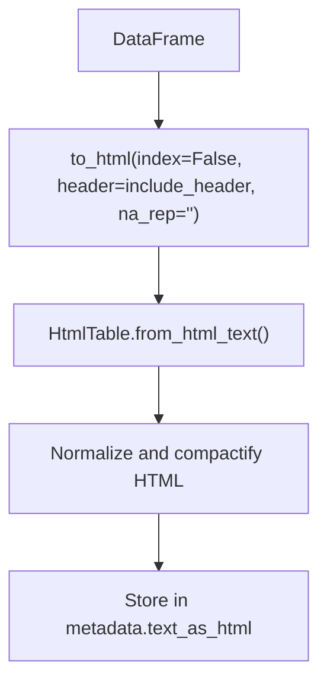
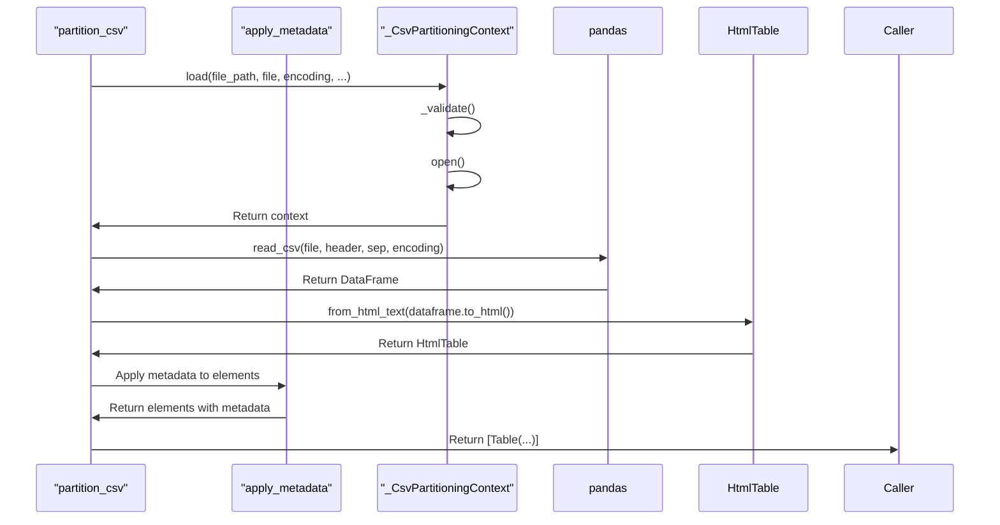

# CSV Processing

<cite>
**Referenced Files in This Document**   
- [csv.py](file://unstructured/partition/csv.py)
- [html_table.py](file://unstructured/common/html_table.py)
- [metadata.py](file://unstructured/partition/common/metadata.py)
- [base.py](file://unstructured/chunking/base.py)
- [tsv.py](file://unstructured/partition/tsv.py)
</cite>

## Table of Contents
1. [Introduction](#introduction)
2. [CSV Parsing with Pandas](#csv-parsing-with-pandas)
3. [Delimiter and Encoding Handling](#delimiter-and-encoding-handling)
4. [Table Structure Preservation](#table-structure-preservation)
5. [Metadata Extraction](#metadata-extraction)
6. [Large CSV File Handling](#large-csv-file-handling)
7. [Configuration Options](#configuration-options)
8. [Edge Case Handling](#edge-case-handling)
9. [Performance Optimization](#performance-optimization)
10. [TSV Processing](#tsv-processing)

## Introduction
The CSV processing functionality in this library provides a comprehensive solution for parsing CSV files and extracting structured data. The implementation leverages pandas for CSV parsing while preserving table structure and metadata. This document details the various aspects of CSV processing, including delimiter detection, encoding handling, table structure preservation, metadata extraction, and optimization techniques for handling large files.

## CSV Parsing with Pandas
The library uses pandas as the primary engine for CSV parsing, providing robust functionality for reading and processing CSV files. The `partition_csv` function serves as the main entry point for CSV processing, orchestrating the parsing workflow and returning structured elements.



**Diagram sources**
- [csv.py](file://unstructured/partition/csv.py#L20-L73)

The CSV parsing process begins with input validation to ensure either a filename or file-like object is provided. Once validated, the system reads the CSV file using pandas' `read_csv` function, which handles the actual parsing of the CSV data into a DataFrame. This approach leverages pandas' optimized C implementations for efficient CSV parsing.

**Section sources**
- [csv.py](file://unstructured/partition/csv.py#L20-L73)

## Delimiter and Encoding Handling
The library automatically detects CSV delimiters and handles various encodings to ensure proper parsing of CSV files with different formats.

### Delimiter Detection
The system uses Python's built-in `csv.Sniffer` class to automatically detect the delimiter used in a CSV file. This allows the library to handle CSV files with different delimiters such as commas, semicolons, or pipes.



**Diagram sources**
- [csv.py](file://unstructured/partition/csv.py#L114-L134)

The delimiter detection process reads a sample of the CSV file (up to 64KB) and uses the `csv.Sniffer` to analyze the data and determine the most likely delimiter. The system specifically looks for common delimiters like comma, semicolon, and pipe characters. For single-column CSV files, the delimiter is set to `None` since no delimiter is needed.

### Encoding Support
The library supports various text encodings for CSV files, with UTF-8 as the default encoding when none is specified.

```python
def partition_csv(
    filename: str | None = None,
    *,
    file: IO[bytes] | None = None,
    encoding: str | None = None,
    # ... other parameters
) -> list[Element]:
    """
    Parameters
    ----------
    encoding
        The encoding method used to decode the text input. If None, utf-8 will be used.
    """
```

When processing CSV files, the specified encoding is passed directly to pandas' `read_csv` function, which handles the decoding of the file content. This allows the library to support any encoding that pandas supports, including UTF-16, Latin-1, and other common encodings.

**Section sources**
- [csv.py](file://unstructured/partition/csv.py#L25-L27)
- [csv.py](file://unstructured/partition/csv.py#L140-L144)

## Table Structure Preservation
The library preserves the table structure of CSV files by converting the parsed data into HTML table format, maintaining the original row and column structure.

### HTML Table Conversion
After parsing the CSV file into a pandas DataFrame, the library converts the DataFrame to an HTML table representation using the `to_html` method.



**Diagram sources**
- [csv.py](file://unstructured/partition/csv.py#L60-L64)
- [html_table.py](file://unstructured/common/html_table.py#L52-L166)

The HTML table conversion process removes unnecessary attributes and standardizes table elements to ensure consistent representation. The resulting HTML table preserves the original structure of the CSV data, including rows, columns, and cell boundaries.

### HTML Table Processing
The `HtmlTable` class handles the processing and normalization of HTML table content, ensuring consistent representation across different CSV files.

```python
class HtmlTable:
    """A `<table>` element."""
    
    def __init__(self, table: HtmlElement):
        self._table = table
    
    @classmethod
    def from_html_text(cls, html_text: str) -> HtmlTable:
        # Parse HTML text and extract table element
        # Normalize and compactify the HTML
        return cls(table)
    
    @lazyproperty
    def html(self) -> str:
        """The HTML-fragment for this `<table>` element, all on one line."""
        return etree.tostring(self._table, encoding=str)
    
    @lazyproperty
    def text(self) -> str:
        """The clean, concatenated, text for this table."""
        table_text = " ".join(self._table.itertext())
        return " ".join(table_text.split())
```

The HTML table processing removes noise elements like `<thead>`, `<tbody>`, and `<tfoot>`, strips all attributes from elements, and normalizes whitespace in the content. This results in a compact, standardized HTML representation that maximizes semantic content in a given space.

**Section sources**
- [html_table.py](file://unstructured/common/html_table.py#L52-L114)

## Metadata Extraction
The library extracts and preserves various metadata elements from CSV files, providing additional context and information about the processed data.

### Metadata Fields
The following metadata fields are extracted and preserved during CSV processing:

<table>
  <tr>
    <th>Field Name</th>
    <th>Description</th>
    <th>Source</th>
  </tr>
  <tr>
    <td>filename</td>
    <td>The name of the source file</td>
    <td>Input parameter or file path</td>
  </tr>
  <tr>
    <td>last_modified</td>
    <td>The last modified date of the file</td>
    <td>Filesystem metadata</td>
  </tr>
  <tr>
    <td>filetype</td>
    <td>The MIME type of the file (text/csv)</td>
    <td>FileType.CSV constant</td>
  </tr>
  <tr>
    <td>text_as_html</td>
    <td>HTML representation of the table structure</td>
    <td>Converted from DataFrame</td>
  </tr>
  <tr>
    <td>languages</td>
    <td>Detected language(s) of the content</td>
    <td>Language detection model</td>
  </tr>
  <tr>
    <td>detection_origin</td>
    <td>Source of the detection ("csv")</td>
    <td>DETECTION_ORIGIN constant</td>
  </tr>
</table>

### Metadata Processing
Metadata extraction is handled through the `apply_metadata` decorator, which processes and applies common metadata fields to the extracted elements.



**Diagram sources**
- [csv.py](file://unstructured/partition/csv.py#L20-L73)
- [metadata.py](file://unstructured/partition/common/metadata.py#L119-L242)

The metadata processing pipeline handles various aspects including language detection, file type assignment, filename handling, and last modified date extraction. The system also supports overriding metadata values through function parameters.

**Section sources**
- [csv.py](file://unstructured/partition/csv.py#L66-L70)
- [metadata.py](file://unstructured/partition/common/metadata.py#L119-L242)

## Large CSV File Handling
The library includes specific mechanisms to handle large CSV files efficiently, addressing memory and performance considerations.

### Memory Management
To prevent memory issues when processing large CSV files, the library sets a field size limit for the CSV parser:

```python
CSV_FIELD_LIMIT = 10 * 1048576  # 10MiB

# Set the field size limit before parsing
csv.field_size_limit(CSV_FIELD_LIMIT)
```

This limit prevents the CSV parser from consuming excessive memory when encountering very large fields in CSV files. The 10MB limit provides a reasonable balance between supporting large fields and preventing memory exhaustion.

### Processing Strategy
For large CSV files, the library processes the data in a single pass, converting the entire CSV file into a single `Table` element:

```python
def partition_csv(
    # ... parameters
) -> list[Element]:
    # ... parsing logic
    return [Table(text=html_table.text, metadata=metadata, detection_origin=DETECTION_ORIGIN)]
```

This approach minimizes memory usage by avoiding the creation of multiple intermediate objects. The entire CSV content is processed and stored as a single table element, reducing memory overhead.

**Section sources**
- [csv.py](file://unstructured/partition/csv.py#L17-L18)
- [csv.py](file://unstructured/partition/csv.py#L58)
- [csv.py](file://unstructured/partition/csv.py#L72-L73)

## Configuration Options
The CSV processing functionality provides several configuration options to customize the parsing behavior according to specific requirements.

### Main Configuration Parameters
The `partition_csv` function accepts the following configuration parameters:

<table>
  <tr>
    <th>Parameter</th>
    <th>Type</th>
    <th>Default</th>
    <th>Description</th>
  </tr>
  <tr>
    <td>filename</td>
    <td>str | None</td>
    <td>None</td>
    <td>Path to the CSV file</td>
  </tr>
  <tr>
    <td>file</td>
    <td>IO[bytes] | None</td>
    <td>None</td>
    <td>File-like object containing CSV data</td>
  </tr>
  <tr>
    <td>encoding</td>
    <td>str | None</td>
    <td>None</td>
    <td>Text encoding of the CSV file (UTF-8 default)</td>
  </tr>
  <tr>
    <td>include_header</td>
    <td>bool</td>
    <td>False</td>
    <td>Include header row in text output</td>
  </tr>
  <tr>
    <td>infer_table_structure</td>
    <td>bool</td>
    <td>True</td>
    <td>Preserve table structure in HTML format</td>
  </tr>
</table>

### Header Handling
The `include_header` parameter controls whether the header row is included in the text output:

```python
@lazyproperty
def header(self) -> int | None:
    """Identifies the header row, if any, to Pandas, by idx."""
    return 0 if self._include_header else None
```

When `include_header=True`, the first row of the CSV file is treated as a header row and is included in both the text and HTML representations. When `False`, the first row is treated as regular data.

### Table Structure Inference
The `infer_table_structure` parameter determines whether to preserve the table structure in the output:

```python
metadata = ElementMetadata(
    filename=filename,
    last_modified=ctx.last_modified,
    text_as_html=html_table.html if infer_table_structure else None,
)
```

When `True`, the table structure is preserved in the `text_as_html` metadata field, allowing downstream applications to render the data in its original tabular format. When `False`, only the plain text content is preserved.

**Section sources**
- [csv.py](file://unstructured/partition/csv.py#L23-L30)
- [csv.py](file://unstructured/partition/csv.py#L136-L138)
- [csv.py](file://unstructured/partition/csv.py#L69-L70)

## Edge Case Handling
The library includes specific handling for various edge cases that may occur in CSV files.

### Single Column CSV Files
For CSV files with only a single column, the library handles the absence of a delimiter:

```python
def delimiter(self) -> str | None:
    """The CSV delimiter, nominally a comma \",\".
    
    `None` for a single-column CSV file which naturally has no delimiter.
    """
    try:
        return sniffer.sniff(data, delimiters=",;|").delimiter
    except csv.Error:
        # -- sniffing will fail on single-column csv as no default can be assumed --
        return None
```

When a CSV file contains only a single column, the delimiter detection will fail, and the system returns `None` as the delimiter. This ensures proper handling of single-column CSV files without attempting to split on a non-existent delimiter.

### Quoted Fields
The library relies on pandas' CSV parsing capabilities to handle quoted fields correctly. Pandas automatically handles quoted fields, including those containing delimiter characters or line breaks within quotes. The underlying CSV parser used by pandas properly respects quote boundaries, ensuring that fields containing commas within quotes are not incorrectly split.

### Empty and Missing Values
The library handles empty and missing values through pandas' NA representation:

```python
dataframe.to_html(index=False, header=include_header, na_rep="")
```

When converting the DataFrame to HTML, the `na_rep=""` parameter specifies that missing values should be represented as empty strings in the HTML output. This ensures consistent handling of missing data across different CSV files.

**Section sources**
- [csv.py](file://unstructured/partition/csv.py#L129-L133)
- [csv.py](file://unstructured/partition/csv.py#L63)

## Performance Optimization
The library includes several optimization techniques to improve performance when processing CSV files.

### Field Size Limit
Setting a reasonable field size limit improves performance and prevents memory issues:

```python
CSV_FIELD_LIMIT = 10 * 1048576  # 10MiB
csv.field_size_limit(CSV_FIELD_LIMIT)
```

This limit prevents the CSV parser from spending excessive time processing extremely large fields, which could degrade performance or cause memory issues.

### Efficient HTML Generation
The library optimizes HTML generation by minimizing character overhead:

```python
def htmlify_matrix_of_cell_texts(matrix: Sequence[Sequence[str]]) -> str:
    """Form an HTML table from "rows" and "columns" of `matrix`.
    
    Character overhead is minimized:
    - No whitespace padding is added for human readability
    - No newlines ("\n") are added
    - No `<thead>`, `<tbody>`, or `<tfoot>` elements are used
    """
```

By eliminating unnecessary whitespace, newlines, and structural elements, the HTML output is made as compact as possible, reducing storage and transmission overhead.

### Lazy Property Evaluation
The library uses lazy property evaluation to defer expensive computations until they are actually needed:

```python
@lazyproperty
def delimiter(self) -> str | None:
    # Expensive delimiter detection logic
    pass
```

This optimization ensures that expensive operations like delimiter detection are only performed when the result is actually required, improving overall performance.

**Section sources**
- [csv.py](file://unstructured/partition/csv.py#L17)
- [html_table.py](file://unstructured/common/html_table.py#L20-L49)
- [csv.py](file://unstructured/partition/csv.py#L114)

## TSV Processing
The library also supports TSV (Tab-Separated Values) files through a dedicated `partition_tsv` function.

### TSV Implementation
The TSV processing implementation is similar to CSV processing but with a fixed tab delimiter:

```python
def partition_tsv(
    filename: Optional[str] = None,
    *,
    file: Optional[IO[bytes]] = None,
    include_header: bool = False,
    **kwargs: Any,
) -> list[Element]:
    """Partitions TSV files into document elements."""
    exactly_one(filename=filename, file=file)
    
    header = 0 if include_header else None
    
    if filename:
        dataframe = pd.read_csv(filename, sep="\t", header=header)
    else:
        f = spooled_to_bytes_io_if_needed(file)
        dataframe = pd.read_csv(f, sep="\t", header=header)
    
    # ... rest of processing
```

The main differences from CSV processing are:
1. The delimiter is fixed as a tab character (`\t`)
2. The detection origin is set to "tsv"
3. The file type is set to FileType.TSV

The rest of the processing pipeline (HTML conversion, metadata extraction, etc.) is identical to CSV processing, ensuring consistent behavior across both formats.

**Section sources**
- [tsv.py](file://unstructured/partition/tsv.py#L22-L65)