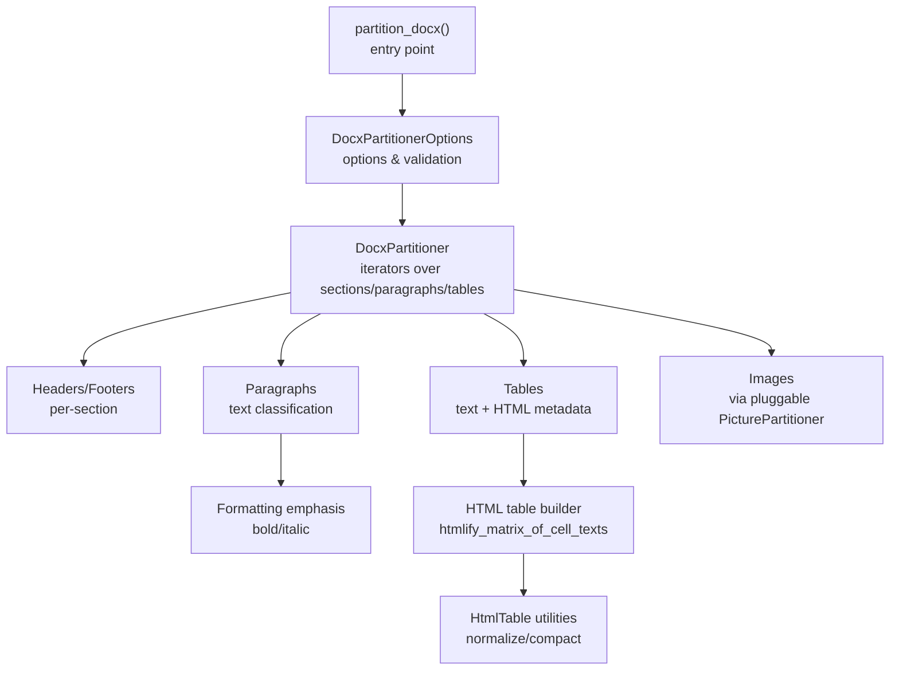
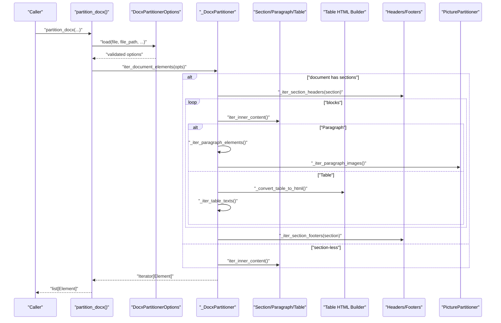
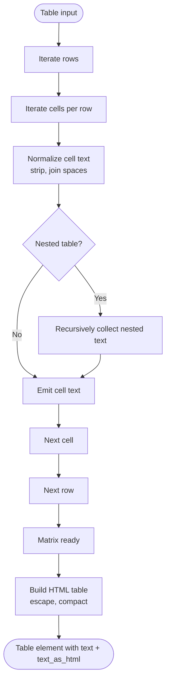
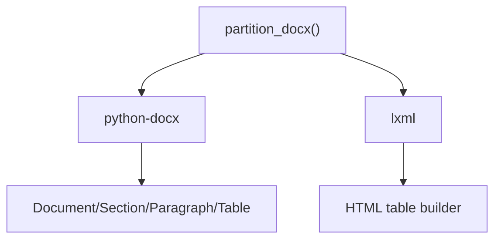

# DOCX Processing

<cite>
**Referenced Files in This Document**
- [docx.py](file://unstructured/partition/docx.py)
- [test_docx.py](file://test_unstructured/partition/test_docx.py)
- [html_table.py](file://unstructured/common/html_table.py)
- [metadata.py](file://unstructured/partition/common/metadata.py)
- [extra-docx.txt](file://requirements/extra-docx.txt)
- [doc.py](file://unstructured/partition/doc.py)
- [odt.py](file://unstructured/partition/odt.py)
</cite>

## Table of Contents
1. [Introduction](#introduction)
2. [Project Structure](#project-structure)
3. [Core Components](#core-components)
4. [Architecture Overview](#architecture-overview)
5. [Detailed Component Analysis](#detailed-component-analysis)
6. [Dependency Analysis](#dependency-analysis)
7. [Performance Considerations](#performance-considerations)
8. [Troubleshooting Guide](#troubleshooting-guide)
9. [Conclusion](#conclusion)
10. [Appendices](#appendices)

## Introduction
This document explains how the library parses Microsoft Word (.docx) documents using the python-docx library. It covers:
- How the parser extracts tables and preserves structure
- How formatting is captured and exposed
- How images are handled and extracted
- How headers and footers are processed
- How metadata such as author and creation date are extracted
- Best practices for different DOCX document structures
- Common issues and solutions for complex tables, embedded objects, and formatting preservation
- Guidance for password-protected documents and performance considerations for large files

## Project Structure
The DOCX processing pipeline centers on a partitioner that reads a .docx file, iterates sections/paragraphs/tables, and emits structured elements with metadata. The implementation relies on python-docx and lxml for HTML table rendering.

**Diagram sources**
- [docx.py](file://unstructured/partition/docx.py#L100-L170)
- [docx.py](file://unstructured/partition/docx.py#L339-L420)
- [docx.py](file://unstructured/partition/docx.py#L449-L509)
- [html_table.py](file://unstructured/common/html_table.py#L20-L166)

**Section sources**
- [docx.py](file://unstructured/partition/docx.py#L100-L170)
- [docx.py](file://unstructured/partition/docx.py#L339-L420)

## Core Components
- partition_docx(): Public entry point that validates inputs, constructs options, and yields elements.
- DocxPartitionerOptions: Encapsulates options, validation, lazy-loading of the underlying python-docx Document, and metadata helpers.
- _DocxPartitioner: Core iterator that walks sections, paragraphs, tables, headers, footers, and images; classifies text; computes emphasis; builds HTML tables; and tracks page numbers.

Key responsibilities:
- Iteration order: sections → headers → blocks (paragraphs or tables) → footers
- Classification: Detects list items, styles, and narrative text; emits corresponding element types
- Tables: Produces plain text and optional HTML metadata for structure preservation
- Headers/Footers: Extracts text and table cell content; supports primary, first-page, and even-page variants
- Images: Delegates to a pluggable PicturePartitioner; default does not extract images
- Formatting: Emits emphasized text contents/tags for paragraphs and tables
- Metadata: Applies filename, last modified, page number, languages, and element hierarchy

**Section sources**
- [docx.py](file://unstructured/partition/docx.py#L100-L170)
- [docx.py](file://unstructured/partition/docx.py#L152-L337)
- [docx.py](file://unstructured/partition/docx.py#L339-L750)

## Architecture Overview
The partitioner composes multiple iterators to produce a single element stream. It handles both sectioned and section-less documents and supports optional HTML table metadata.

**Diagram sources**
- [docx.py](file://unstructured/partition/docx.py#L100-L170)
- [docx.py](file://unstructured/partition/docx.py#L339-L420)
- [docx.py](file://unstructured/partition/docx.py#L449-L509)
- [docx.py](file://unstructured/partition/docx.py#L620-L660)

## Detailed Component Analysis

### Table Extraction and Structure Preservation
- Plain text: Produced by concatenating cell texts, preserving order and dropping empty strings.
- HTML metadata: When enabled, the partitioner builds an HTML table from normalized cell texts and escapes special characters. It preserves row/column alignment and nested tables by depth-first traversal.
- Emphasis: Emphasized text contents and tags are collected from paragraphs within tables and exposed in metadata.

Common scenarios covered by tests:
- Simple tables and nested tables
- Tables with incomplete rows (start late, end early)
- Merged cells: Only the first occurrence appears in plain text; HTML preserves structure

**Diagram sources**
- [docx.py](file://unstructured/partition/docx.py#L449-L509)
- [html_table.py](file://unstructured/common/html_table.py#L20-L166)

**Section sources**
- [docx.py](file://unstructured/partition/docx.py#L449-L509)
- [test_docx.py](file://test_unstructured/partition/test_docx.py#L1005-L1074)
- [test_docx.py](file://test_unstructured/partition/test_docx.py#L1073-L1106)

### Formatting Preservation (Bold, Italic)
- Paragraph emphasis: The partitioner scans runs and emits emphasis metadata as pairs of text contents and tags.
- Table emphasis: Emphasis is aggregated across rows/cells/paragraphs and exposed in metadata.

Tests demonstrate emphasis detection for bold and italic runs and absence for empty or normal text.

**Section sources**
- [docx.py](file://unstructured/partition/docx.py#L609-L626)
- [docx.py](file://unstructured/partition/docx.py#L751-L763)
- [test_docx.py](file://test_unstructured/partition/test_docx.py#L274-L343)

### Image Extraction and Handling of Shapes
- Default behavior: No images are emitted. A pluggable PicturePartitioner can be registered to extract images from paragraphs.
- Inline vs floating shapes: Text inside inline shapes is considered; floating shapes’ text is intentionally ignored.
- Registration: Use the provided registration function to supply a custom PicturePartitioner.

Tests show:
- Default: No Image elements
- After registration: Each paragraph with pictures yields Image elements

**Section sources**
- [docx.py](file://unstructured/partition/docx.py#L618-L641)
- [docx.py](file://unstructured/partition/docx.py#L63-L93)
- [test_docx.py](file://test_unstructured/partition/test_docx.py#L585-L619)
- [test_docx.py](file://test_unstructured/partition/test_docx.py#L571-L580)

### Headers and Footers
- Headers/Footers are extracted per section, including primary, first-page, and even-page variants.
- Text includes paragraph text and flattened table cell content; empty content is omitted.
- Tests confirm nested tables and merged cells are included in header/footer text.

**Section sources**
- [docx.py](file://unstructured/partition/docx.py#L525-L554)
- [docx.py](file://unstructured/partition/docx.py#L627-L660)
- [docx.py](file://unstructured/partition/docx.py#L661-L689)
- [test_docx.py](file://test_unstructured/partition/test_docx.py#L121-L156)
- [test_docx.py](file://test_unstructured/partition/test_docx.py#L1245-L1277)

### Metadata Extraction (Author, Creation Date, Last Modified)
- Filename: Applied from the provided path or file object; can be overridden via metadata_filename.
- Last Modified: Retrieved from the filesystem when available; can be overridden via metadata_last_modified.
- Languages: Detected per element or globally; exposed in metadata.
- Filetype: Applied by the decorator; DOCX MIME type is used.
- Page Numbers: Determined by rendered page breaks; metadata.page_number is None when not present.

Tests demonstrate:
- Filename and last modified behavior
- Language detection and chunking strategy integration

**Section sources**
- [docx.py](file://unstructured/partition/docx.py#L220-L247)
- [metadata.py](file://unstructured/partition/common/metadata.py#L191-L221)
- [metadata.py](file://unstructured/partition/common/metadata.py#L246-L286)
- [test_docx.py](file://test_unstructured/partition/test_docx.py#L214-L269)
- [test_docx.py](file://test_unstructured/partition/test_docx.py#L441-L462)

### Optimal Usage Patterns
- Basic partitioning: Call partition_docx with filename or file-like object.
- Enable HTML table metadata: Set infer_table_structure=True to include text_as_html.
- Include page breaks: Set include_page_breaks=True to emit PageBreak elements; otherwise page numbers still appear in metadata.
- Chunking: Use chunking_strategy to group by titles or customize chunk sizes.
- Language detection: Supply languages or enable detect_language_per_element for multilingual documents.
- Image extraction: Register a PicturePartitioner to extract images from paragraphs.

**Section sources**
- [docx.py](file://unstructured/partition/docx.py#L100-L170)
- [test_docx.py](file://test_unstructured/partition/test_docx.py#L414-L439)
- [test_docx.py](file://test_unstructured/partition/test_docx.py#L441-L462)

### Handling Password-Protected Documents
- The DOCX partitioner does not support password-protected .docx files directly.
- Workaround: Convert the protected document to .docx using external tools (e.g., pandoc) and then partition the converted file.
- Example: The ODT partitioner demonstrates converting to .docx using pandoc, which can be adapted for protected DOCX workflows.

**Section sources**
- [odt.py](file://unstructured/partition/odt.py#L94-L113)
- [doc.py](file://unstructured/partition/doc.py#L87-L103)

## Dependency Analysis
External dependencies for DOCX processing:
- python-docx: Reads and navigates the .docx DOM
- lxml: Builds and manipulates HTML fragments for table rendering

**Diagram sources**
- [docx.py](file://unstructured/partition/docx.py#L13-L25)
- [html_table.py](file://unstructured/common/html_table.py#L11-L13)
- [extra-docx.txt](file://requirements/extra-docx.txt#L7-L12)

**Section sources**
- [extra-docx.txt](file://requirements/extra-docx.txt#L7-L12)

## Performance Considerations
- Large files: The partitioner streams elements via generators, minimizing memory overhead compared to building intermediate lists.
- HTML table metadata: Enabling infer_table_structure adds processing time due to HTML construction; disable if not needed.
- Page breaks: Determining page numbers is best-effort; rendered page breaks are not always present, especially in converted documents.
- Image extraction: Enabling image extraction adds overhead; register a lightweight PicturePartitioner if needed.
- Chunking: Applying chunking strategies increases processing time but improves downstream usability.

[No sources needed since this section provides general guidance]

## Troubleshooting Guide
Common issues and resolutions:
- Complex tables with merged or malformed cells: The partitioner catches exceptions and logs warnings; merged cells appear only once in plain text; HTML preserves structure.
- Incomplete rows: Tables that start late or end early are supported; ensure infer_table_structure is enabled to capture HTML layout.
- Floating shapes: Text inside floating shapes is not included; only inline shapes are considered.
- Headers/Footers with tables: Nested tables and merged cells are included in header/footer text.
- Page numbers: When rendered page breaks are missing, page_number metadata may be None; include_page_breaks controls emission of PageBreak elements.
- Language detection: Supply languages or enable detect_language_per_element to improve accuracy.
- Password-protected DOCX: Not supported directly; convert to DOCX using external tools first.

**Section sources**
- [docx.py](file://unstructured/partition/docx.py#L495-L507)
- [docx.py](file://unstructured/partition/docx.py#L755-L763)
- [test_docx.py](file://test_unstructured/partition/test_docx.py#L571-L580)
- [test_docx.py](file://test_unstructured/partition/test_docx.py#L121-L156)
- [test_docx.py](file://test_unstructured/partition/test_docx.py#L1073-L1106)

## Conclusion
The DOCX partitioner provides robust extraction of paragraphs, tables, headers/footers, and formatting metadata. It supports optional HTML table metadata, emphasis tagging, and extensible image extraction via a pluggable PicturePartitioner. For complex documents, enable infer_table_structure and chunking as needed, and consider external conversion for password-protected files.

[No sources needed since this section summarizes without analyzing specific files]

## Appendices

### API Surface and Options
- partition_docx(): filename, file, include_page_breaks, infer_table_structure, starting_page_number, strategy, metadata_filename, metadata_last_modified, languages, detect_language_per_element, and chunking_strategy
- DocxPartitionerOptions: Validates inputs, loads the Document lazily, computes page numbers, and exposes metadata helpers
- register_picture_partitioner(): Registers a custom PicturePartitioner

**Section sources**
- [docx.py](file://unstructured/partition/docx.py#L100-L170)
- [docx.py](file://unstructured/partition/docx.py#L152-L219)
- [docx.py](file://unstructured/partition/docx.py#L63-L93)