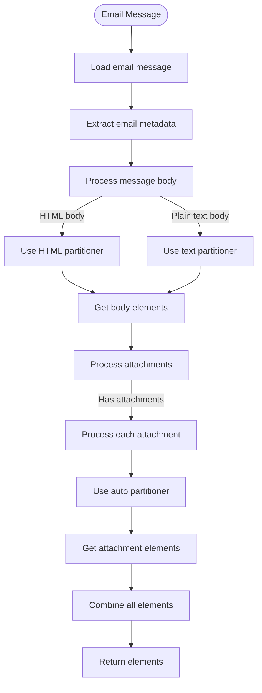

# Document Type Specific Processing

<cite>
**Referenced Files in This Document**   
- [pdf.py](file://unstructured/partition/pdf.py)
- [docx.py](file://unstructured/partition/docx.py)
- [text.py](file://unstructured/partition/text.py)
- [html/partition.py](file://unstructured/partition/html/partition.py)
- [csv.py](file://unstructured/partition/csv.py)
- [email.py](file://unstructured/partition/email.py)
- [encoding.py](file://unstructured/file_utils/encoding.py)
- [config.py](file://unstructured/partition/utils/config.py)
- [metadata.py](file://unstructured/partition/common/metadata.py)
</cite>

## Table of Contents
1. [Introduction](#introduction)
2. [PDF Processing](#pdf-processing)
3. [DOCX Processing](#docx-processing)
4. [Text Processing](#text-processing)
5. [HTML Processing](#html-processing)
6. [CSV Processing](#csv-processing)
7. [Email Processing](#email-processing)
8. [Metadata Handling](#metadata-handling)
9. [Performance Optimization](#performance-optimization)
10. [Common Issues and Solutions](#common-issues-and-solutions)

## Introduction
This document provides comprehensive guidance on document type specific processing within the unstructured framework. It covers the major file formats supported: PDF, DOCX, text, HTML, CSV, and email. For each format, we explain the unique processing challenges and solutions, document format-specific configuration options and performance characteristics, and provide practical examples from the codebase showing optimal usage patterns. We also address how metadata is handled differently across formats, common issues like encoding problems in text files or complex layouts in PDFs, and provide performance optimization tips for each format.

## PDF Processing

PDF processing in the unstructured framework is handled by the `partition_pdf` function in `pdf.py`. The framework offers multiple strategies for PDF processing, each with different trade-offs between accuracy and performance.

The primary processing strategies are:
- **hi_res**: Uses a layout detection model to identify document elements with high accuracy
- **fast**: Extracts text directly from the PDF structure for maximum speed
- **ocr_only**: Uses OCR to extract text, suitable for scanned documents
- **auto**: Automatically determines the best strategy based on document characteristics

**Diagram sources**
- [pdf.py](file://unstructured/partition/pdf.py#L124-L248)

The `partition_pdf` function supports numerous configuration options:

**PDF Processing Configuration Options**
| Parameter | Description | Default Value | Performance Impact |
|---------|-------------|-------------|-------------------|
| strategy | Processing strategy to use | "auto" | hi_res: slower, more accurate; fast: faster, less accurate |
| infer_table_structure | Whether to infer table structure and create HTML representation | False | Increases processing time significantly |
| ocr_languages | Languages to use for OCR processing | None | Affects OCR accuracy and speed |
| extract_images_in_pdf | Whether to extract images from the PDF | False | Increases memory usage and processing time |
| extract_image_block_types | Types of elements to extract as images | None | Specific to use case |
| extract_image_block_output_dir | Directory to save extracted images | None | Affects I/O performance |
| extract_image_block_to_payload | Whether to include images in the payload as base64 | False | Increases memory usage |
| pdfminer_line_margin | Margin for determining if lines are part of the same paragraph | None | Affects text extraction accuracy |
| pdfminer_char_margin | Margin for determining if characters are part of the same line | None | Affects text extraction accuracy |
| pdfminer_line_overlap | Overlap threshold for characters on the same line | None | Affects text extraction accuracy |
| pdfminer_word_margin | Margin for determining if characters are separate words | 0.185 | Affects text spacing in output |

The framework handles complex PDF layouts by combining multiple approaches. For documents with extractable text, it uses PDFMiner to extract text and layout information. For scanned documents or those with complex layouts, it uses a layout detection model to identify document elements. The system can also perform OCR on specific regions or the entire document when needed.

**Section sources**
- [pdf.py](file://unstructured/partition/pdf.py#L124-L248)

## DOCX Processing

DOCX processing is handled by the `partition_docx` function in `docx.py`. The framework uses the python-docx library to parse DOCX files and extract their content.

**Diagram sources**
- [docx.py](file://unstructured/partition/docx.py#L103-L149)

The DOCX processor handles various document elements:

**DOCX Element Processing**
| Element Type | Processing Method | Metadata Included |
|------------|------------------|-------------------|
| Paragraphs | Extract text and classify by style or content | Page number, detection origin |
| Tables | Extract cell contents and generate HTML representation | Text as HTML, page number |
| Headers | Extract text from header sections | Header type (primary, first_page, even_page) |
| Footers | Extract text from footer sections | Footer type (primary, first_page, even_page) |
| List items | Detect bulleted or numbered lists and clean formatting | Cleaned text without bullets |
| Page breaks | Detect explicit page breaks in the document | Page break elements when enabled |

The framework handles DOCX-specific challenges such as:
- Complex table structures with merged cells
- Multiple header and footer types (primary, first-page, even-page)
- Section breaks that may require multiple page breaks
- Floating and inline images
- Style-based element classification

Configuration options for DOCX processing include:
- `include_page_breaks`: Whether to include PageBreak elements in the output
- `infer_table_structure`: Whether to generate HTML representation of tables
- `starting_page_number`: The page number to assign to the first page
- `strategy`: Processing strategy (currently only "hi_res" is supported)

**Section sources**
- [docx.py](file://unstructured/partition/docx.py#L103-L149)

## Text Processing

Text processing is handled by the `partition_text` function in `text.py`. This function processes plain text files and converts them into structured elements.

**Diagram sources**
- [text.py](file://unstructured/partition/text.py#L42-L108)

The text processor uses several heuristics to classify text elements:

**Text Element Classification Rules**
| Element Type | Detection Criteria |
|-------------|-------------------|
| ListItem | Text starts with a bullet character or appears to be a numbered list |
| EmailAddress | Text matches email address pattern |
| Address | Text matches US city, state, and ZIP code pattern |
| NarrativeText | Text appears to be a narrative paragraph (multiple sentences, reasonable length) |
| Title | Text appears to be a title (short, capitalized, followed by paragraph) |
| Header | Text positioned in top 7% of page |
| Footer | Text positioned in bottom 93% of page |

The framework handles text encoding through the `encoding.py` module, which automatically detects the encoding of text files using charset-normalizer. If automatic detection fails, it falls back to trying common encodings.

Configuration options for text processing include:
- `encoding`: The encoding to use when reading the file (auto-detected if not specified)
- `paragraph_grouper`: Function to group paragraphs that are split by line breaks for formatting
- `detection_origin`: Identifier for the source of detection (defaults to "text")

The text processor also handles special cases like empty bullet points and combines short paragraphs when appropriate.

**Section sources**
- [text.py](file://unstructured/partition/text.py#L42-L108)

## HTML Processing

HTML processing is handled by the `partition_html` function in `html/partition.py`. The framework supports multiple methods for parsing HTML content.

**Diagram sources**
- [html/partition.py](file://unstructured/partition/html/partition.py#L27-L95)

The HTML processor supports multiple input sources:
- Local files (specified by filename)
- File-like objects
- Raw HTML text
- URLs (fetched via HTTP)

It also supports two parsing versions:
- **v1**: Traditional HTML parsing that converts HTML elements to unstructured elements
- **v2**: Ontology-based parsing that follows a specific schema for element types

Configuration options for HTML processing include:
- `skip_headers_and_footers`: Whether to exclude content within header and footer tags
- `html_parser_version`: Which parser version to use ("v1" or "v2")
- `image_alt_mode`: How to handle image alt text (currently "to_text" to include it in output)
- `extract_image_block_to_payload`: Whether to include extracted images in the payload
- `extract_image_block_types`: Types of elements to extract as images

The framework handles HTML-specific challenges such as:
- Malformed HTML that needs to be repaired
- Encoding declarations within UTF-8 encoded strings
- Script and style elements that should be removed
- Main content detection to focus on relevant content
- Image alt text inclusion when configured

**Section sources**
- [html/partition.py](file://unstructured/partition/html/partition.py#L27-L95)

## CSV Processing

CSV processing is handled by the `partition_csv` function in `csv.py`. Unlike other formats, CSV files are treated as single-table documents.

**Diagram sources**
- [csv.py](file://unstructured/partition/csv.py#L22-L73)

The CSV processor uses pandas to read and process CSV files, which provides robust handling of various CSV formats and encodings.

Key characteristics of CSV processing:
- Single table output: Each CSV file produces exactly one Table element
- Automatic delimiter detection: Uses csv.Sniffer to detect the delimiter
- Header handling: Can include or exclude header information
- HTML representation: Generates an HTML table for structure preservation

Configuration options for CSV processing include:
- `include_header`: Whether to include header information in the text and HTML representation
- `infer_table_structure`: Whether to generate an HTML representation of the table
- `encoding`: The encoding to use when reading the file

The framework handles CSV-specific challenges such as:
- Detecting the correct delimiter in files without a standard delimiter
- Handling files with inconsistent row lengths
- Properly encoding special characters
- Managing large fields (with a 10MiB field limit)

**Section sources**
- [csv.py](file://unstructured/partition/csv.py#L22-L73)

## Email Processing

Email processing is handled by the `partition_email` function in `email.py`. The framework supports processing .eml files, which are standard email message files.

**Diagram sources**
- [email.py](file://unstructured/partition/email.py#L30-L75)

The email processor handles both the message body and any attachments:

**Email Element Processing**
| Element Type | Processing Method | Metadata Included |
|------------|------------------|-------------------|
| Message body | Processed with HTML or text partitioner | Email metadata (from, to, subject, etc.) |
| Attachments | Processed with auto partitioner | Attached to filename, original attachment name |
| Email metadata | Extracted from email headers | BCC recipients, CC recipients, message ID, sent from, sent to, subject |

Configuration options for email processing include:
- `content_source`: Preferred message body format ("text/html" or "text/plain")
- `process_attachments`: Whether to process attachments in addition to the message body
- `metadata_filename`: Filename to use for metadata purposes
- `metadata_last_modified`: Last modified date to use for metadata

The framework handles email-specific challenges such as:
- Multiple body formats (HTML and plain text)
- Attachment processing with various file types
- Email header parsing and metadata extraction
- Message ID and date handling
- Address formatting and parsing

When processing attachments, the framework uses the auto partitioner to handle different file types, allowing for recursive processing of complex email messages.

**Section sources**
- [email.py](file://unstructured/partition/email.py#L30-L75)

## Metadata Handling

Metadata handling is a critical aspect of document processing in the unstructured framework. Different document types have different metadata characteristics and requirements.

The framework uses a consistent metadata structure across all document types, with the `ElementMetadata` class providing a standard interface for metadata storage and access.

**Diagram sources**
- [elements.py](file://unstructured/documents/elements.py)
- [metadata.py](file://unstructured/partition/common/metadata.py)

The metadata system handles format-specific metadata through several mechanisms:

**Format-Specific Metadata Handling**
| Format | Special Metadata Handling |
|-------|--------------------------|
| PDF | Page numbers, coordinates, links, form data |
| DOCX | Headers, footers, section information, table structure |
| Text | Position-based header/footer detection, paragraph structure |
| HTML | URL source, HTML-specific elements, image alt text |
| CSV | Table structure, delimiter information |
| Email | Email headers, attachment information, message metadata |

The framework applies metadata through the `apply_metadata` decorator, which handles several key functions:
- Hash element IDs when requested
- Set element hierarchy based on category and depth
- Apply language metadata
- Set filetype, filename, and last modified metadata
- Handle URL metadata

Metadata is processed in a specific order to ensure consistency:
1. Unique-ify elements and metadata
2. Apply language metadata
3. Apply filetype, filename, last_modified, and URL metadata
4. Compute hash IDs (if requested)
5. Assign parent IDs based on hierarchy

The system also handles special metadata cases like:
- Attached files having their own metadata processing
- Elements with coordinates and spatial relationships
- Table elements with HTML representations
- Images with base64 encoding
- Links within text elements

**Section sources**
- [metadata.py](file://unstructured/partition/common/metadata.py#L119-L243)

## Performance Optimization

Performance optimization is critical for efficient document processing. The unstructured framework provides several mechanisms for optimizing performance across different document types.

### General Performance Considerations

The framework uses several general performance optimization techniques:

**Diagram sources**
- [chunking.py](file://unstructured/chunking/base.py)
- [strategies.py](file://unstructured/partition/strategies.py)

### Format-Specific Optimization Tips

**PDF Optimization**
- Use "fast" strategy for text-based PDFs without complex layouts
- Use "hi_res" strategy only when layout preservation is critical
- Limit page processing with `pdf_hi_res_max_pages` for large documents
- Adjust OCR parameters based on document quality
- Disable image extraction when not needed

**DOCX Optimization**
- Disable page break detection when not needed (`include_page_breaks=False`)
- Disable table structure inference when HTML representation is not required
- Use appropriate starting page numbers to avoid recalculation

**Text Optimization**
- Provide encoding when known to avoid detection overhead
- Disable paragraph grouping when text is already properly formatted
- Use appropriate language settings for text classification

**HTML Optimization**
- Use "v1" parser for simple HTML processing
- Skip headers and footers when they contain irrelevant content
- Disable image extraction when not needed
- Provide encoding when known

**CSV Optimization**
- Disable table structure inference when HTML representation is not needed
- Provide delimiter when known to avoid detection overhead
- Use appropriate encoding to avoid detection time

**Email Optimization**
- Disable attachment processing when attachments are not needed
- Use appropriate content source to avoid unnecessary processing
- Provide metadata directly when available to avoid extraction

### Configuration-Based Optimization

The framework provides several configuration options for performance tuning:

**Performance Configuration Options**
| Configuration | Location | Purpose | Performance Impact |
|--------------|---------|--------|-------------------|
| OCR_AGENT | env_config.OCR_AGENT | OCR engine to use | Affects OCR speed and accuracy |
| OCR_AGENT_CACHE_SIZE | env_config.OCR_AGENT_CACHE_SIZE | Number of OCR agents to cache | Reduces initialization overhead |
| GLOBAL_WORKING_DIR_ENABLED | env_config.GLOBAL_WORKING_DIR_ENABLED | Enable global working directory | Affects temporary file handling |
| ANALYSIS_DUMP_OD_SKIP | env_config.ANALYSIS_DUMP_OD_SKIP | Skip analysis dump | Reduces I/O operations |
| IMAGE_CROP_PAD | env_config.IMAGE_CROP_PAD | Padding around image elements | Affects image processing size |
| TABLE_IMAGE_CROP_PAD | env_config.TABLE_IMAGE_CROP_PAD | Padding around table elements | Affects table processing size |

### Best Practices for Optimal Performance

1. **Choose the right strategy**: Select the most appropriate processing strategy for your use case
2. **Provide known information**: Supply encoding, language, and other known metadata to avoid detection overhead
3. **Disable unnecessary features**: Turn off table structure inference, image extraction, and other features when not needed
4. **Use appropriate chunking**: Apply chunking strategies for large documents
5. **Leverage caching**: Use cached OCR agents and other resources when processing multiple documents
6. **Monitor resource usage**: Be aware of memory and CPU usage, especially with large documents
7. **Process in batches**: When possible, process documents in batches to amortize initialization costs

**Section sources**
- [config.py](file://unstructured/partition/utils/config.py)
- [strategies.py](file://unstructured/partition/strategies.py)

## Common Issues and Solutions

This section addresses common issues encountered when processing different document types and provides solutions.

### Encoding Problems

Encoding issues are common when processing text files. The framework handles encoding through automatic detection, but issues can still occur.

**Common Encoding Issues and Solutions**
| Issue | Symptoms | Solution |
|------|---------|----------|
| Incorrect encoding detection | Garbled text, mojibake | Specify encoding explicitly using the `encoding` parameter |
| Mixed encodings | Some text is readable, other parts are garbled | Convert file to consistent encoding before processing |
| Missing encoding declaration | Errors when reading file | Add encoding declaration or specify encoding explicitly |
| Non-standard encodings | Characters not displayed correctly | Install appropriate language packs or use Unicode |

The framework uses charset-normalizer for encoding detection, which is generally reliable but can be fooled by short or unusual text samples. When encoding issues occur, the best solution is to specify the encoding explicitly.

### Complex Layouts in PDFs

PDFs with complex layouts can be challenging to process correctly.

**PDF Layout Issues and Solutions**
| Issue | Symptoms | Solution |
|------|---------|----------|
| Text extraction fails | No text elements returned | Use "hi_res" or "ocr_only" strategy instead of "fast" |
| Poor text ordering | Text elements in wrong order | Ensure proper coordinate system and sorting |
| Missing content | Some content not extracted | Check for content in annotations or form fields |
| Table structure lost | Tables appear as plain text | Enable `infer_table_structure` and use "hi_res" strategy |
| Image content missing | Images not extracted | Enable image extraction options |

For complex PDF layouts, the "hi_res" strategy with a layout detection model generally provides the best results, though it is slower than other strategies.

### HTML Processing Challenges

HTML documents present several processing challenges.

**HTML Issues and Solutions**
| Issue | Symptoms | Solution |
|------|---------|----------|
| Malformed HTML | Parsing errors | Use lenient parsing mode or repair HTML before processing |
| Dynamic content | Missing content that was loaded via JavaScript | Process the final rendered HTML, not the source |
| Complex layouts | Content extraction incorrect | Use main content detection or CSS selectors |
| Encoding issues | Garbled text | Specify encoding or ensure proper HTTP headers |
| Large files | Memory issues | Process in chunks or use streaming |

When processing HTML from URLs, ensure that the content type is text/html and that SSL verification is handled appropriately.

### CSV Processing Issues

CSV files can have various issues that affect processing.

**CSV Issues and Solutions**
| Issue | Symptoms | Solution |
|------|---------|----------|
| Incorrect delimiter | Data split incorrectly | Allow automatic detection or specify delimiter |
| Quoting issues | Fields split incorrectly | Ensure proper quoting in CSV file |
| Encoding problems | Garbled text | Specify encoding explicitly |
| Large files | Memory issues | Process in chunks or use streaming |
| Inconsistent rows | Errors during processing | Clean data before processing |

The framework uses pandas for CSV processing, which is robust but can be affected by malformed CSV files.

### Email Processing Problems

Email messages can present several challenges.

**Email Issues and Solutions**
| Issue | Symptoms | Solution |
|------|---------|----------|
| Attachment processing fails | Attachments not processed | Ensure auto partitioner supports the attachment type |
| Body content missing | No body elements returned | Check content source and ensure body part exists |
| Metadata extraction fails | Missing email metadata | Verify email format and header structure |
| Large messages | Memory issues | Process attachments separately or in chunks |
| Encoding issues | Garbled text | Specify encoding or ensure proper MIME encoding |

When processing emails, ensure that the file is a valid .eml file and that all required headers are present.

### General Troubleshooting Tips

1. **Start with the simplest case**: Test with a simple document of the same type before processing complex ones
2. **Check file format**: Ensure the file is actually the format you think it is
3. **Verify dependencies**: Ensure all required dependencies are installed
4. **Monitor logs**: Check logging output for warnings and errors
5. **Use appropriate strategies**: Select the right processing strategy for your document type and content
6. **Provide known information**: Supply encoding, language, and other metadata when known
7. **Test incrementally**: Add features and options one at a time to isolate issues

**Section sources**
- [encoding.py](file://unstructured/file_utils/encoding.py)
- [pdf.py](file://unstructured/partition/pdf.py)
- [html/partition.py](file://unstructured/partition/html/partition.py)
- [csv.py](file://unstructured/partition/csv.py)
- [email.py](file://unstructured/partition/email.py)