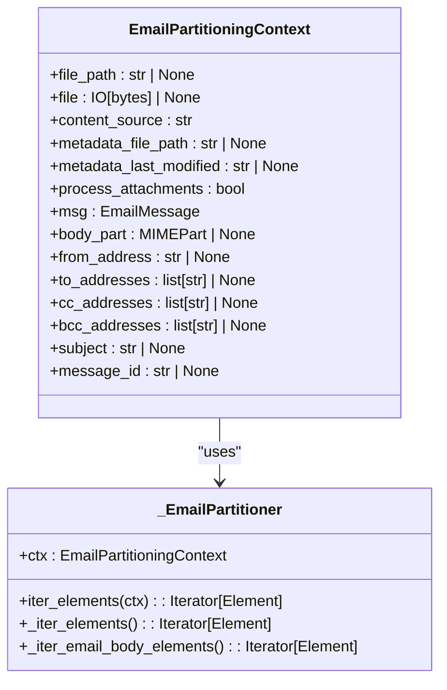
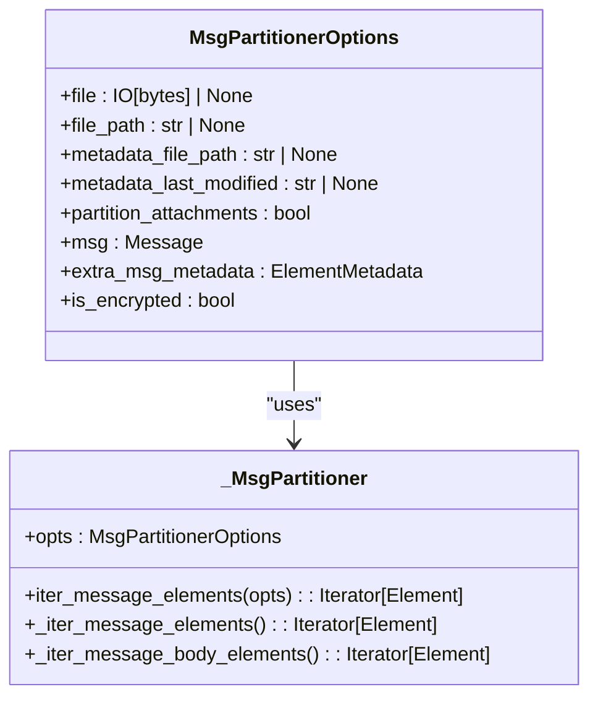
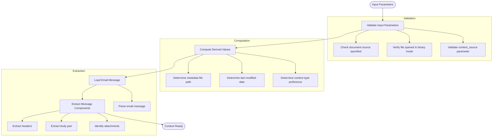
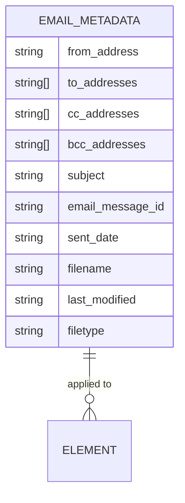
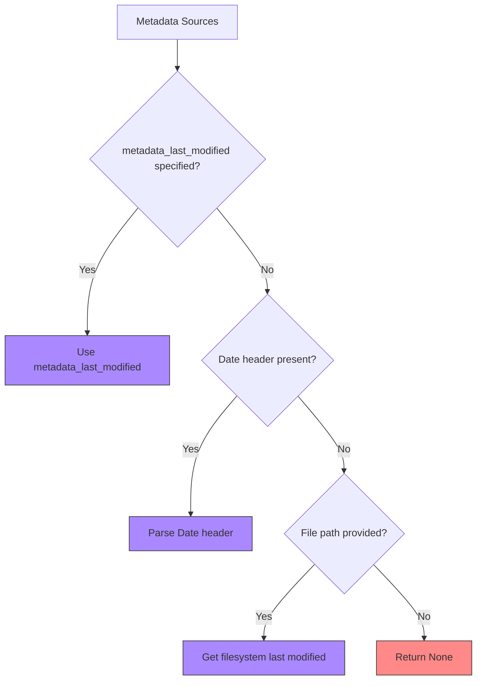
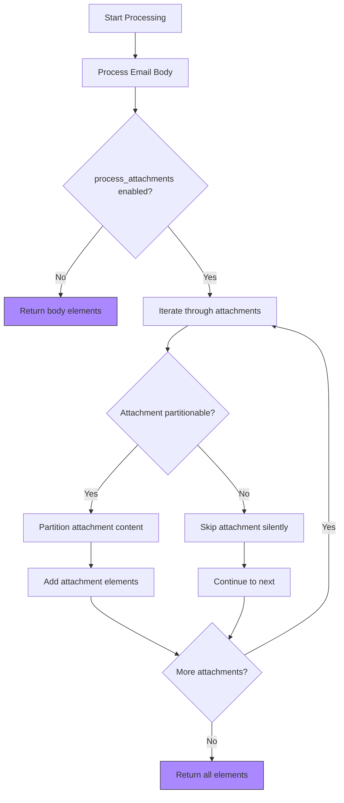
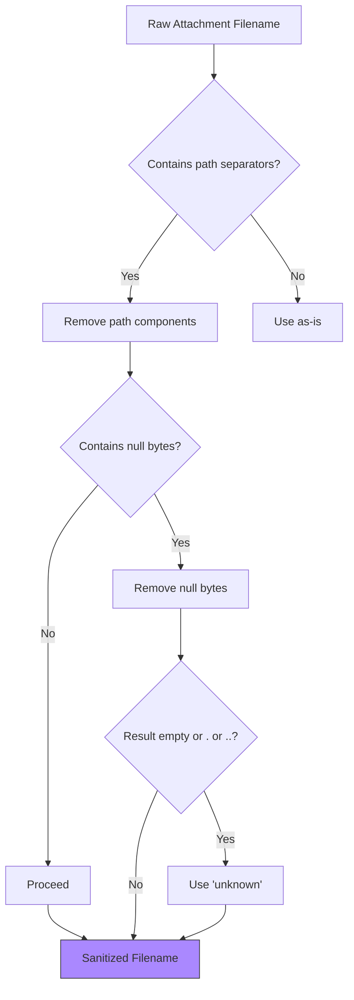
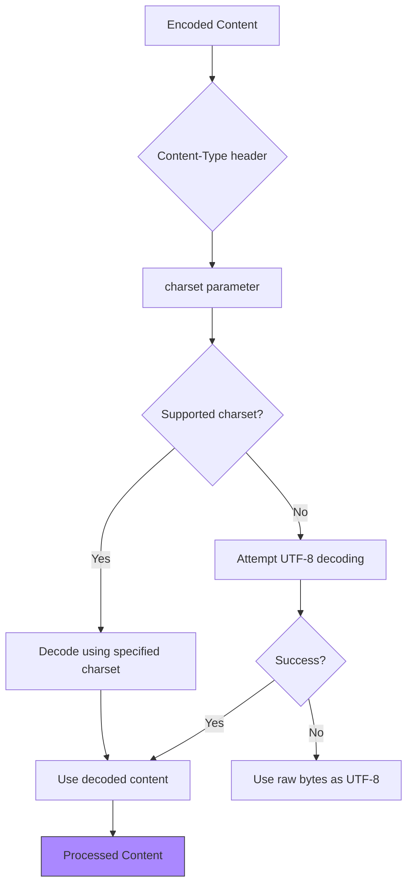
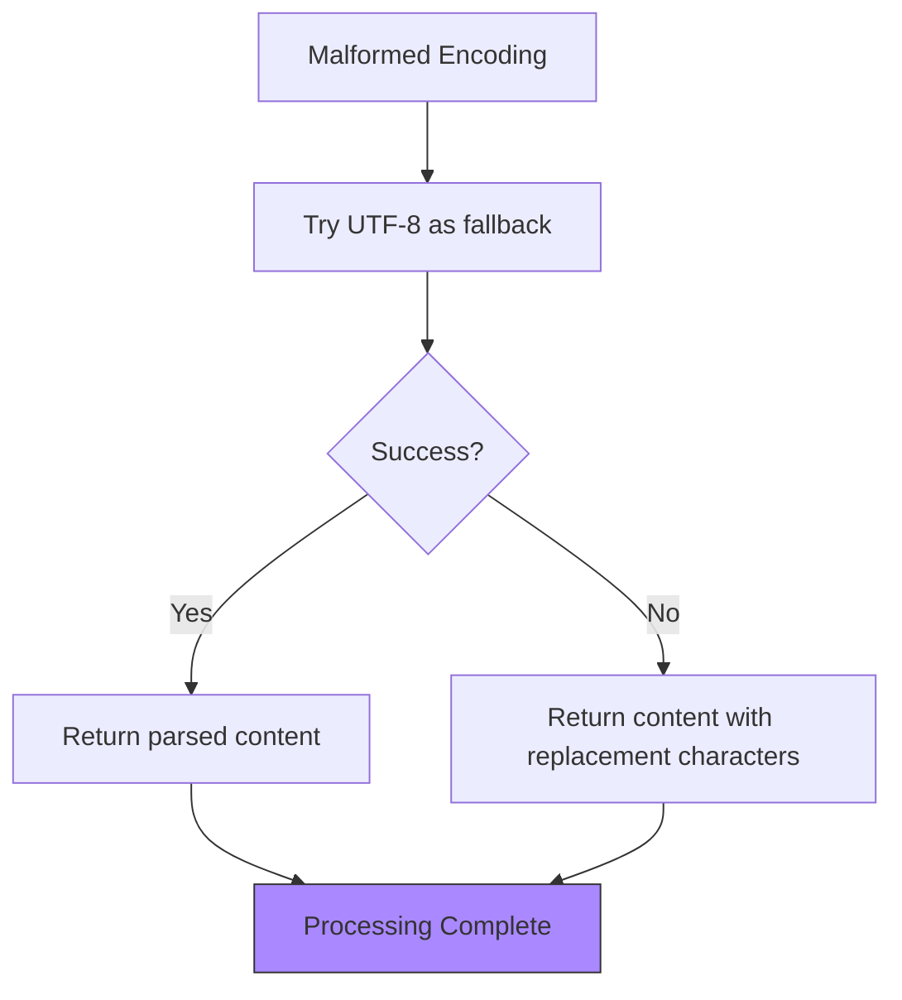

# Email Processing

<cite>
**Referenced Files in This Document**   
- [email.py](file://unstructured/partition/email.py)
- [msg.py](file://unstructured/partition/msg.py)
- [test_email.py](file://test_unstructured/partition/test_email.py)
- [test_msg.py](file://test_unstructured/partition/test_msg.py)
- [fake-email.eml](file://example-docs/eml/fake-email.eml)
- [fake-email-attachment.eml](file://example-docs/eml/fake-email-attachment.eml)
- [fake-email.msg](file://example-docs/fake-email.msg)
- [fake-email-multiple-attachments.msg](file://example-docs/fake-email-multiple-attachments.msg)
</cite>

## Table of Contents
1. [Introduction](#introduction)
2. [Email Format Support](#email-format-support)
3. [Core Processing Architecture](#core-processing-architecture)
4. [Header and Metadata Extraction](#header-and-metadata-extraction)
5. [Body Content Processing](#body-content-processing)
6. [Attachment Handling](#attachment-handling)
7. [Multipart Email Processing](#multipart-email-processing)
8. [Character Encoding and Transfer Encoding](#character-encoding-and-transfer-encoding)
9. [Performance Considerations](#performance-considerations)
10. [Common Issues and Troubleshooting](#common-issues-and-troubleshooting)

## Introduction

The email processing system in this library provides comprehensive functionality for parsing and extracting content from email messages in both .eml and .msg formats. The system is designed to handle various email structures, including multipart messages, different character encodings, and complex attachment scenarios. It extracts structured elements from email content while preserving metadata such as sender, recipient, subject, and date information.

The library uses specialized partitioners for each email format, with `partition_email()` for .eml files and `partition_msg()` for .msg files. Both functions return structured document elements that can be further processed or analyzed. The system handles both plain text and HTML email bodies, processes attachments, and manages various encoding schemes commonly found in email messages.

**Section sources**
- [email.py](file://unstructured/partition/email.py#L1-L436)
- [msg.py](file://unstructured/partition/msg.py#L1-L316)

## Email Format Support

The library supports two primary email formats: .eml (RFC 822/MIME) and .msg (Microsoft Outlook). Each format has its own dedicated partitioning function that handles the specific characteristics and structure of that format.

### EML Format Processing

The .eml format, based on RFC 822 and MIME standards, is processed using the `partition_email()` function. This function can handle various MIME structures including multipart messages with alternative text/plain and text/html versions, messages with attachments, and messages with complex header structures.



**Diagram sources**
- [email.py](file://unstructured/partition/email.py#L78-L340)

### MSG Format Processing

The .msg format, used by Microsoft Outlook, is processed using the `partition_msg()` function. This implementation uses the `oxmsg` library to parse the proprietary Outlook message format and extract its components.



**Diagram sources**
- [msg.py](file://unstructured/partition/msg.py#L58-L237)

## Core Processing Architecture

The email processing system follows a consistent architectural pattern across both format implementations, with a context class that encapsulates parsing options and state, and a partitioner class that performs the actual content extraction.

### Processing Context

The processing context classes (`EmailPartitioningContext` for .eml and `MsgPartitionerOptions` for .msg) are responsible for validating input parameters, computing derived values, and providing access to parsed email components. These contexts use lazy properties to defer expensive operations until they are actually needed.



**Diagram sources**
- [email.py](file://unstructured/partition/email.py#L78-L311)
- [msg.py](file://unstructured/partition/msg.py#L58-L176)

## Header and Metadata Extraction

The system extracts comprehensive metadata from email headers, including sender, recipient, subject, message ID, and date information. This metadata is attached to all document elements generated from the email content.

### Standard Header Fields

The following header fields are extracted and made available as metadata:



**Diagram sources**
- [email.py](file://unstructured/partition/email.py#L121-L272)
- [msg.py](file://unstructured/partition/msg.py#L78-L110)

### Metadata Processing

The metadata extraction process follows a specific priority order for determining values when multiple sources are available:

1. **Filename**: The `metadata_filename` parameter takes precedence, followed by the actual file path if provided
2. **Last Modified Date**: The system checks in this order: `metadata_last_modified` parameter, Date header in the email, filesystem last modified date
3. **Content Source**: For multipart emails, the system can prefer either text/html or text/plain content based on the `content_source` parameter



**Diagram sources**
- [email.py](file://unstructured/partition/email.py#L207-L230)
- [msg.py](file://unstructured/partition/msg.py#L133-L147)

## Body Content Processing

The system handles both plain text and HTML email bodies, with configurable preferences for which content type to use when both are available.

### Content Type Selection

When an email contains both text/plain and text/html versions of the body, the system uses the `content_source` parameter to determine which version to process:

```mermaid
flowchart TD
A[Email Message] --> B{Has multiple body parts?}
B --> |No| C[Process available body part]
B --> |Yes| D{content_source = "text/html"?}
D --> |Yes| E[Prefer HTML part]
D --> |No| F[Prefer plain text part]
E --> G{HTML part available?}
F --> H{Plain text part available?}
G --> |Yes| I[Process HTML part]
G --> |No| J[Process plain text part]
H --> |Yes| K[Process plain text part]
H --> |No| L[Process HTML part]
style I fill:#a8f,stroke:#333
style J fill:#a8f,stroke:#333
style K fill:#a8f,stroke:#333
style L fill:#a8f,stroke:#333
```

**Diagram sources**
- [email.py](file://unstructured/partition/email.py#L130-L155)
- [email.py](file://unstructured/partition/email.py#L341-L369)

### Delegate Processing

The actual content extraction is delegated to specialized partitioners based on the content type:

- **HTML content**: Processed using `partition_html()` function
- **Plain text content**: Processed using `partition_text()` function

Both delegate partitioners receive the appropriate metadata from the email context, ensuring that the extracted elements contain both the content and relevant email metadata.

**Section sources**
- [email.py](file://unstructured/partition/email.py#L341-L369)
- [msg.py](file://unstructured/partition/msg.py#L208-L235)

## Attachment Handling

The system provides comprehensive attachment processing capabilities, with the ability to extract and parse attachments when requested.

### Attachment Processing Workflow

When `process_attachments=True`, the system processes attachments in addition to the main email body:



**Diagram sources**
- [email.py](file://unstructured/partition/email.py#L330-L339)
- [msg.py](file://unstructured/partition/msg.py#L190-L202)

### Attachment Security

The system includes security measures to prevent path traversal attacks when processing attachment filenames:



**Diagram sources**
- [msg.py](file://unstructured/partition/msg.py#L277-L297)

## Multipart Email Processing

The system handles various multipart email structures, including multipart/alternative (for HTML and plain text versions) and multipart/mixed (for messages with attachments).

### Multipart Structure Analysis

The library correctly identifies and processes different multipart structures:

```mermaid
erDiagram
EMAIL {
string content_type
string boundary
}
MULTIPART_ALTERNATIVE {
EMAIL ||--o{ PART : "contains"
PART }|--|| TEXT_PLAIN : "alternative"
PART }|--|| TEXT_HTML : "alternative"
}
MULTIPART_MIXED {
EMAIL ||--o{ PART : "contains"
PART }|--|| TEXT_CONTENT : "main content"
PART }|--|| ATTACHMENT : "attachment"
}
TEXT_PLAIN {
string content_type "text/plain"
string charset
string content
}
TEXT_HTML {
string content_type "text/html"
string charset
string content
}
ATTACHMENT {
string content_type
string filename
string content_transfer_encoding
bytes content
}
```

**Diagram sources**
- [email.py](file://unstructured/partition/email.py#L130-L137)
- [test_email.py](file://test_unstructured/partition/test_email.py#L340-L367)

### Boundary Handling

The system correctly parses multipart messages using the boundary specified in the Content-Type header, extracting each part according to its content type and transfer encoding.

**Section sources**
- [email.py](file://unstructured/partition/email.py#L130-L137)
- [test_email.py](file://test_unstructured/partition/test_email.py#L340-L367)

## Character Encoding and Transfer Encoding

The system handles various character encodings and transfer encodings commonly found in email messages.

### Character Encoding Support

The library supports multiple character encodings, including:
- UTF-8
- UTF-16 (both LE and BE)
- Windows-1255
- ISO-8859-1
- US-ASCII



**Section sources**
- [email.py](file://unstructured/partition/email.py#L350-L352)
- [test_email.py](file://test_unstructured/partition/test_email.py#L104-L113)

### Transfer Encoding Handling

The system supports common transfer encodings:
- Base64
- Quoted-Printable
- 7bit
- 8bit

The email parser automatically decodes content based on the Content-Transfer-Encoding header.

**Section sources**
- [email.py](file://unstructured/partition/email.py#L350-L352)
- [test_email.py](file://test_unstructured/partition/test_email.py#L118-L123)

## Performance Considerations

When processing large volumes of emails, several performance considerations should be taken into account.

### Memory Usage

The system loads the entire email message into memory for parsing. For large emails or high-volume processing, this can impact memory usage significantly.

### Processing Options

To optimize performance, consider the following:

```mermaid
flowchart TD
A[Processing Options] --> B[process_attachments=False]
A --> C[content_source="text/plain"]
A --> D[Disable chunking if not needed]
A --> E[Process in batches]
B --> F[Reduces processing time]
C --> G[Avoids HTML parsing overhead]
D --> H[Reduces computation]
E --> I[Manages memory usage]
style F fill:#a8f,stroke:#333
style G fill:#a8f,stroke:#333
style H fill:#a8f,stroke:#333
style I fill:#a8f,stroke:#333
```

**Section sources**
- [email.py](file://unstructured/partition/email.py#L35-L58)
- [msg.py](file://unstructured/partition/msg.py#L25-L28)

## Common Issues and Troubleshooting

Several common issues may arise when processing emails, along with their solutions.

### Encoding Problems

When encountering encoding issues, the system attempts to handle them gracefully:



**Section sources**
- [test_email.py](file://test_unstructured/partition/test_email.py#L161-L164)

### HTML vs Plain Text

When deciding between HTML and plain text content, consider:

- **HTML content**: Preserves formatting but may contain embedded styles and scripts
- **Plain text content**: Simpler structure but loses formatting information

Use the `content_source` parameter to specify preference.

### Attachment Extraction Issues

Common attachment issues and solutions:

| Issue | Cause | Solution |
|------|------|----------|
| Attachments not processed | `process_attachments=False` | Set to `True` |
| Unsupported attachment types | Format not supported by unstructured | Check supported formats |
| Missing attachment filenames | Filename not specified in email | Attachment will be processed with "unknown" filename |

**Section sources**
- [email.py](file://unstructured/partition/email.py#L37-L58)
- [msg.py](file://unstructured/partition/msg.py#L25-L28)