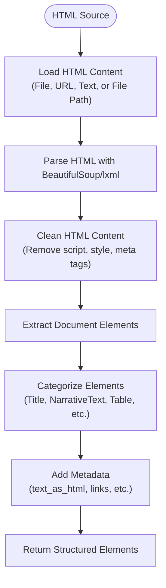
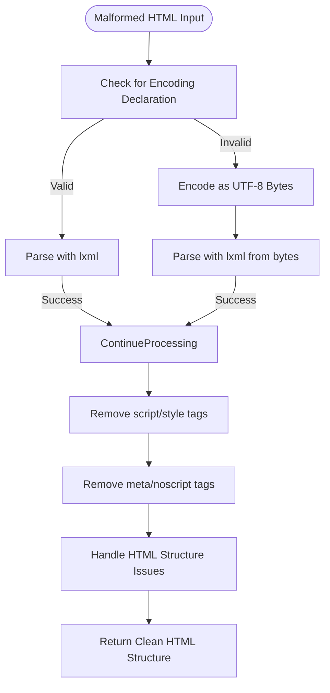
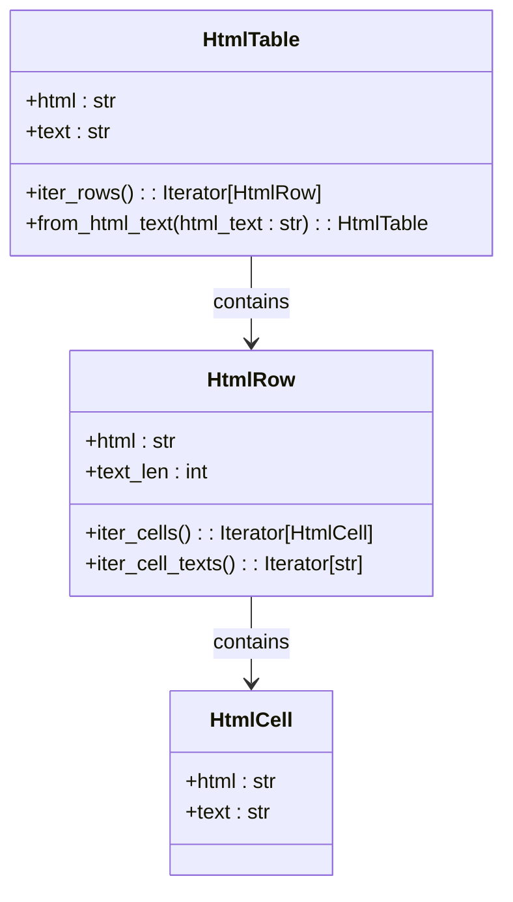
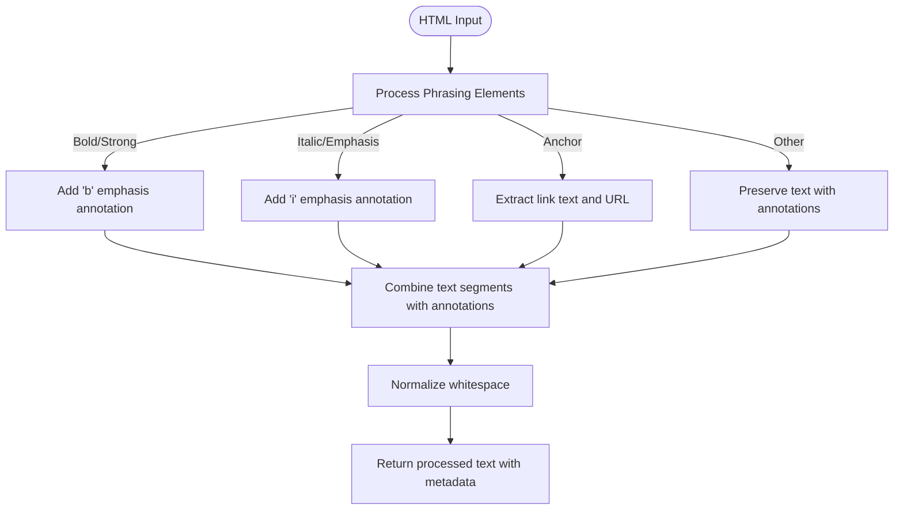
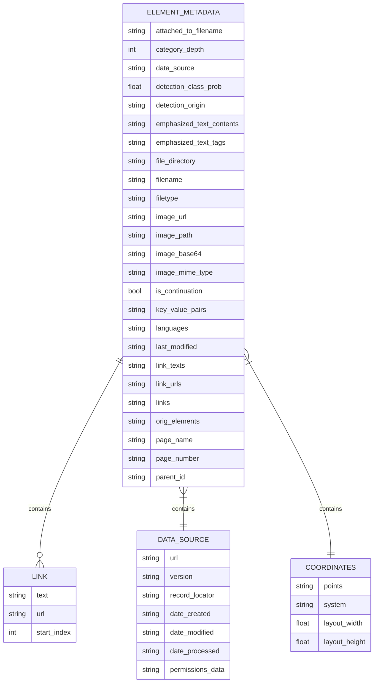
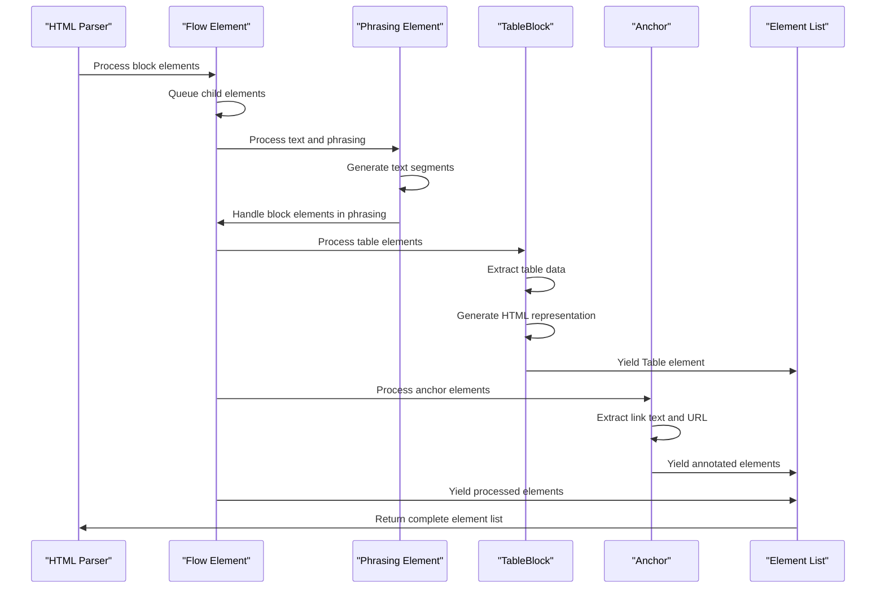
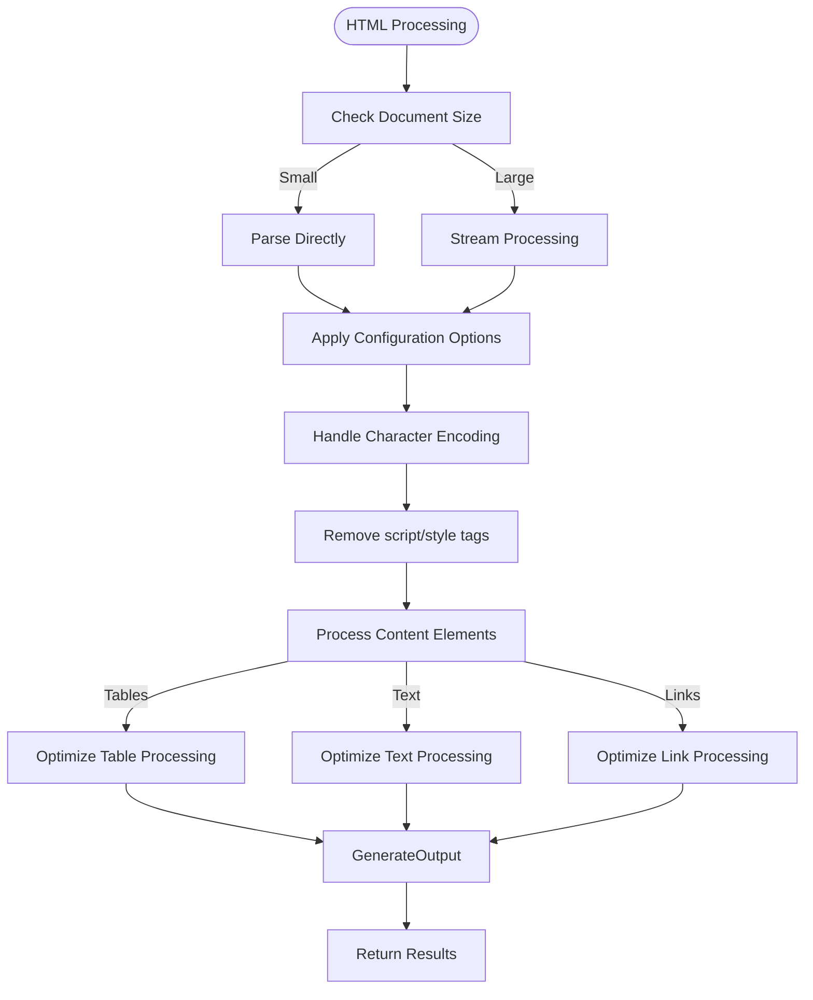

# HTML Processing

<cite>
**Referenced Files in This Document**   
- [partition.py](file://unstructured/partition/html/partition.py)
- [parser.py](file://unstructured/partition/html/parser.py)
- [html_table.py](file://unstructured/common/html_table.py)
- [elements.py](file://unstructured/documents/elements.py)
- [transformations.py](file://unstructured/partition/html/transformations.py)
- [fake-html-cp1252.html](file://example-docs/fake-html-cp1252.html)
- [test_partition.py](file://test_unstructured/partition/html/test_partition.py)
- [test_html_to_ontology_parsing.py](file://test_unstructured/partition/html/test_html_to_ontology_parsing.py)
</cite>

## Table of Contents
1. [Introduction](#introduction)
2. [HTML Parsing with BeautifulSoup](#html-parsing-with-beautifulsoup)
3. [Handling Malformed HTML](#handling-malformed-html)
4. [Table Extraction and HTML Structure Preservation](#table-extraction-and-html-structure-preservation)
5. [Handling Inline Styles and CSS Classes](#handling-inline-styles-and-css-classes)
6. [Metadata Extraction from HTML Meta Tags](#metadata-extraction-from-html-meta-tags)
7. [Processing Complex HTML Structures](#processing-complex-html-structures)
8. [Common Issues and Performance Considerations](#common-issues-and-performance-considerations)
9. [Conclusion](#conclusion)

## Introduction
The Unstructured library provides comprehensive HTML processing capabilities for extracting and structuring content from HTML documents. This document details how the library parses HTML using BeautifulSoup, handles malformed HTML, extracts tables while preserving structure, manages inline styles and CSS classes, and extracts metadata from HTML meta tags. The library is designed to handle complex HTML structures, dynamic content, and various encoding issues while maintaining performance for large HTML files.

## HTML Parsing with BeautifulSoup
The Unstructured library uses BeautifulSoup as its primary HTML parsing engine, integrated with lxml for efficient processing. The library's HTML parsing is implemented in the `partition_html` function, which serves as the main entry point for HTML document processing.

The parsing process begins by loading HTML content from various sources including file paths, file objects, text strings, or URLs. When processing HTML from a URL, the library uses the requests library to fetch the content and validates that the Content-Type header indicates text/html.



**Diagram sources**
- [partition.py](file://unstructured/partition/html/partition.py#L25-L43)
- [parser.py](file://unstructured/partition/html/parser.py#L75-L85)

**Section sources**
- [partition.py](file://unstructured/partition/html/partition.py#L25-L43)
- [parser.py](file://unstructured/partition/html/parser.py#L75-L85)

## Handling Malformed HTML
The Unstructured library is designed to handle malformed HTML gracefully, ensuring that parsing can continue even when encountering invalid HTML structures. The library employs several strategies to handle malformed HTML:

1. **Encoding Declaration Handling**: When lxml encounters a Unicode string with an XML encoding declaration, it raises a ValueError. The library handles this by catching the exception and re-parsing the HTML after UTF-8 encoding the string bytes.

```python
try:
    root = etree.fromstring(html_text, html_parser)
except ValueError:
    root = etree.fromstring(html_text.encode("utf-8"), html_parser)
```

2. **Malformed HTML Recovery**: The library uses html5lib parser to handle severely malformed HTML by first parsing it with html5lib (which is more forgiving) before processing with the main parser.

3. **Element Stripping**: The library automatically removes problematic HTML elements that could interfere with parsing, including script, style, meta, and noscript tags:

```python
etree.strip_elements(
    root, ["del", "link", "meta", "noscript", "script", "style"], with_tail=False
)
```

4. **Header and Footer Removal**: When requested, the library can strip header and footer elements to focus on the main content:

```python
if self._opts.skip_headers_and_footers:
    etree.strip_elements(root, ["header", "footer"], with_tail=False)
```

The library also handles various malformed HTML scenarios such as unclosed comments, missing closing angle brackets, improperly nested elements, and unclosed script tags by normalizing the HTML structure during parsing.



**Diagram sources**
- [partition.py](file://unstructured/partition/html/partition.py#L246-L255)
- [test_html_to_ontology_parsing.py](file://test_unstructured/partition/html/test_html_to_ontology_parsing.py#L504-L553)

**Section sources**
- [partition.py](file://unstructured/partition/html/partition.py#L246-L255)
- [test_html_to_ontology_parsing.py](file://test_unstructured/partition/html/test_html_to_ontology_parsing.py#L504-L553)

## Table Extraction and HTML Structure Preservation
The Unstructured library provides robust table extraction capabilities while preserving the original HTML structure. Table processing is handled by the `TableBlock` class in the parser, which extracts table data and preserves the HTML representation.

### Table Data Extraction
The library extracts table data by:
1. Identifying all table rows (tr elements) including those within thead, tbody, and tfoot sections
2. Extracting cell text from both td and th elements
3. Normalizing whitespace in cell content
4. Constructing a matrix of cell texts for the entire table

```python
trs = cast(list[etree._Element], self.xpath("./tr | ./thead/tr | ./tbody/tr | ./tfoot/tr"))

def iter_cell_texts(tr: etree._Element) -> Iterator[str]:
    tds = cast(list[etree._Element], tr.xpath("./td | ./th"))
    for td in tds:
        stripped_text_nodes = (t.strip() for t in td.itertext())
        yield " ".join(t for t in stripped_text_nodes if t)

table_data = [list(iter_cell_texts(tr)) for tr in trs]
```

### HTML Structure Preservation
The library preserves the original HTML structure through the `text_as_html` metadata field, which contains a compact representation of the table structure:

```python
html_table = htmlify_matrix_of_cell_texts(table_data)
table_text = " ".join(" ".join(t for t in row if t) for row in table_data).strip()

yield Table(table_text, metadata=ElementMetadata(text_as_html=html_table))
```

The `htmlify_matrix_of_cell_texts` function creates a minimal HTML representation of the table:

```python
def htmlify_matrix_of_cell_texts(matrix: Sequence[Sequence[str]]) -> str:
    def iter_trs(rows_of_cell_strs: Sequence[Sequence[str]]) -> Iterator[str]:
        for row_cell_strs in rows_of_cell_strs:
            if not row_cell_strs:
                continue
            yield f"<tr>{''.join(iter_tds(row_cell_strs))}</tr>"

    def iter_tds(row_cell_strs: Sequence[str]) -> Iterator[str]:
        for s in row_cell_strs:
            s = html.escape(s)
            s = "<br/>".join(s.split("\n"))
            cell_text = " ".join(s.split())
            yield f"<td>{cell_text}</td>" if cell_text else "<td/>"

    return f"<table>{''.join(iter_trs(matrix))}</table>" if matrix else ""
```

This approach ensures that the semantic structure of tables is preserved while minimizing character overhead.



**Diagram sources**
- [html_table.py](file://unstructured/common/html_table.py#L52-L166)
- [parser.py](file://unstructured/partition/html/parser.py#L510-L543)

**Section sources**
- [html_table.py](file://unstructured/common/html_table.py#L52-L166)
- [parser.py](file://unstructured/partition/html/parser.py#L510-L543)

## Handling Inline Styles and CSS Classes
The Unstructured library processes inline styles and CSS classes to extract meaningful content while preserving important formatting information. The library handles various phrasing elements that represent inline styling, such as bold, italic, and anchor tags.

### Phrasing Element Processing
The library uses a custom element class hierarchy to process phrasing elements. Each phrasing element type has a corresponding class that handles its specific processing:

```python
class Phrasing(etree.ElementBase):
    @property
    def is_phrasing(self) -> bool:
        return True

    def iter_text_segments(self, enclosing_emphasis: str = "") -> Iterator[TextSegment | Element]:
        inside_emphasis = self._inside_emphasis(enclosing_emphasis)
        yield from self._iter_text_segment(inside_emphasis)
        yield from self._iter_child_text_segments(inside_emphasis)
        yield from self._iter_tail_segment(enclosing_emphasis)
```

### Specific Phrasing Elements
The library handles specific phrasing elements as follows:

**Bold/Strong Text**: The `Bold` class adds emphasis annotations to text within bold elements:

```python
class Bold(Phrasing):
    def _inside_emphasis(self, enclosing_emphasis: str) -> str:
        return f"{enclosing_emphasis}b"
```

**Anchor Links**: The `Anchor` class processes links and adds link annotations to the metadata:

```python
class Anchor(Phrasing):
    def iter_text_segments(self, enclosing_emphasis: str = "") -> Iterator[TextSegment | Element]:
        q: deque[Phrase | Element] = deque(self._iter_phrases_and_elements(enclosing_emphasis))
        
        while q:
            x = q.popleft()
            if isinstance(x, Element):
                yield self._link_annotate_element(x)
                break
            else:
                if lts := self._link_text_segment(x):
                    yield lts
                    break
                else:
                    yield from x
        
        while q:
            x = q.popleft()
            if isinstance(x, Element):
                yield x
            else:
                yield from x
        
        yield from self._iter_tail_segment(enclosing_emphasis)
```

### CSS Class Processing
The library also processes CSS classes through the ontology parsing system, which maps CSS classes to specific element types:

```python
def extract_tag_and_ontology_class_from_tag(
    soup: Tag,
) -> tuple[str, Type[ontology.OntologyElement]]:
    # Scenario 1: Valid Ontology Element
    if soup.attrs.get("class"):
        html_tag, element_class = (
            soup.name,
            HTML_TAG_AND_CSS_NAME_TO_ELEMENT_TYPE_MAP.get((soup.name, soup.attrs["class"][0])),
        )
    
    # Scenario 2: CSS class correct, HTML tag incorrect
    if (
        not element_class
        and soup.attrs.get("class")
        and soup.attrs["class"][0] in CSS_CLASS_TO_ELEMENT_TYPE_MAP
    ):
        element_class = CSS_CLASS_TO_ELEMENT_TYPE_MAP.get(soup.attrs["class"][0])
        html_tag = element_class().allowed_tags[0]
```

This approach allows the library to interpret CSS classes as semantic indicators of content type, enhancing the accuracy of element categorization.



**Diagram sources**
- [parser.py](file://unstructured/partition/html/parser.py#L564-L795)
- [transformations.py](file://unstructured/partition/html/transformations.py#L393-L457)

**Section sources**
- [parser.py](file://unstructured/partition/html/parser.py#L564-L795)
- [transformations.py](file://unstructured/partition/html/transformations.py#L393-L457)

## Metadata Extraction from HTML Meta Tags
The Unstructured library extracts and preserves various metadata from HTML documents, including information from meta tags, file properties, and structural elements. The metadata is stored in the `ElementMetadata` class and attached to each extracted element.

### Meta Tag Processing
The library automatically removes meta tags during parsing as they are not considered part of the document content:

```python
etree.strip_elements(
    root, ["del", "link", "meta", "noscript", "script", "style"], with_tail=False
)
```

However, relevant metadata from meta tags is extracted and preserved in the element metadata when available.

### Element Metadata Structure
The `ElementMetadata` class contains numerous fields for storing different types of metadata:

```python
class ElementMetadata:
    attached_to_filename: Optional[str]
    category_depth: Optional[int]
    coordinates: Optional[CoordinatesMetadata]
    data_source: Optional[DataSourceMetadata]
    detection_class_prob: Optional[float]
    detection_origin: Optional[str]
    emphasized_text_contents: Optional[list[str]]
    emphasized_text_tags: Optional[list[str]]
    file_directory: Optional[str]
    filename: Optional[str]
    filetype: Optional[str]
    image_url: Optional[str]
    image_path: Optional[str]
    image_base64: Optional[str]
    image_mime_type: Optional[str]
    header_footer_type: Optional[str]
    is_continuation: Optional[bool]
    key_value_pairs: Optional[list[FormKeyValuePair]]
    languages: Optional[list[str]]
    last_modified: Optional[str]
    link_texts: Optional[list[str]]
    link_urls: Optional[list[str]]
    link_start_indexes: Optional[list[int]]
    links: Optional[list[Link]]
    orig_elements: Optional[list[Element]]
    page_name: Optional[str]
    page_number: Optional[int]
    parent_id: Optional[str]
```

### Specific Metadata Extraction
The library extracts specific metadata types:

**Link Metadata**: When processing anchor tags, the library extracts link text and URLs:

```python
def _link_annotate_element(self, element: Element) -> Element:
    link_text = element.text
    link_url = self.get("href")
    
    if not link_text or not link_url:
        return element
    
    element.metadata.link_texts = (element.metadata.link_texts or []) + [link_text]
    element.metadata.link_urls = (element.metadata.link_urls or []) + [link_url]
    
    return element
```

**Table Metadata**: For tables, the library preserves the original HTML structure in the `text_as_html` field:

```python
yield Table(table_text, metadata=ElementMetadata(text_as_html=html_table))
```

**File Metadata**: The library extracts file metadata such as filename, last modified date, and URL:

```python
@apply_metadata(FileType.HTML)
@add_chunking_strategy
def partition_html(
    filename: Optional[str] = None,
    *,
    file: Optional[IO[bytes]] = None,
    text: Optional[str] = None,
    encoding: Optional[str] = None,
    url: Optional[str] = None,
    headers: dict[str, str] = {},
    ssl_verify: bool = True,
    skip_headers_and_footers: bool = False,
    detection_origin: Optional[str] = None,
    **kwargs: Any,
) -> list[Element]:
```



**Diagram sources**
- [elements.py](file://unstructured/documents/elements.py#L149-L200)
- [common/metadata.py](file://unstructured/partition/common/metadata.py#L119-L243)

**Section sources**
- [elements.py](file://unstructured/documents/elements.py#L149-L200)
- [common/metadata.py](file://unstructured/partition/common/metadata.py#L119-L243)

## Processing Complex HTML Structures
The Unstructured library is designed to handle complex HTML structures, including nested tables, mixed content types, and documents with dynamic content. The library uses a recursive parsing approach to process complex structures while maintaining the document hierarchy.

### Recursive Parsing Architecture
The library's parsing architecture is based on custom lxml element classes that handle specific HTML elements. The base classes are `Flow` for block elements and `Phrasing` for inline elements:

```python
class Flow(etree.ElementBase):
    """Base and default class for elements that act like a div."""
    
    def iter_elements(self) -> Iterator[Element]:
        q: deque[Flow | Phrasing] = deque(self)
        
        yield from self._element_from_text_or_tail(self.text or "", q, self._ElementCls)
        
        while q:
            assert not q[0].is_phrasing
            block_item = cast(Flow, q.popleft())
            yield from block_item.iter_elements()
            yield from self._element_from_text_or_tail(block_item.tail or "", q)
```

### Handling Nested Structures
The library handles nested structures such as tables within tables by recursively processing content:

```python
class TableBlock(Flow):
    def iter_elements(self) -> Iterator[Table]:
        trs = cast(list[etree._Element], self.xpath("./tr | ./thead/tr | ./tbody/tr | ./tfoot/tr"))
        
        if not trs:
            return
        
        def iter_cell_texts(tr: etree._Element) -> Iterator[str]:
            tds = cast(list[etree._Element], tr.xpath("./td | ./th"))
            for td in tds:
                stripped_text_nodes = (t.strip() for t in td.itertext())
                yield " ".join(t for t in stripped_text_nodes if t)
        
        table_data = [list(iter_cell_texts(tr)) for tr in trs]
        html_table = htmlify_matrix_of_cell_texts(table_data)
        table_text = " ".join(" ".join(t for t in row if t) for row in table_data).strip()
        
        if table_text == "":
            return
        
        yield Table(table_text, metadata=ElementMetadata(text_as_html=html_table))
```

### Element Categorization
The library categorizes elements based on their content and structure:

```python
def derive_element_type_from_text(text: str) -> type[Element] | None:
    if is_bulleted_text(text):
        return ListItem
    if is_us_city_state_zip(text):
        return Address
    if is_email_address(text):
        return EmailAddress
    if is_possible_narrative_text(text):
        return NarrativeText
    return Text
```

### Complex Structure Examples
The library can handle various complex HTML structures:

**Tables with Headers and Footers**:
```python
def test_it_accommodates_column_heading_cells_enclosed_in_thead_tbody_and_tfoot_elements():
    html_text = (
        "<html>\n"
        "<body>\n"
        "  <table>\n"
        "    <thead>\n"
        "      <tr><th>Lorem</th><th>Ipsum</th></tr>\n"
        "    </thead>\n"
        "    <tbody>\n"
        "      <tr><th>Lorem ipsum</th><td>dolor sit amet nulla</td></tr>\n"
        "      <tr><th>Ut enim non</th><td>ad minim\nveniam quis</td></tr>\n"
        "    </tbody>\n"
        "    <tfoot>\n"
        "      <tr><th>Dolor</th><td>Equis</td></tr>\n"
        "    </tfoot>\n"
        "  </table>\n"
        "</body>\n"
        "</html>"
    )
```

**Documents with Mixed Content**:
The library processes documents containing a mix of headings, paragraphs, lists, tables, and other elements, maintaining the document structure and hierarchy.



**Diagram sources**
- [parser.py](file://unstructured/partition/html/parser.py#L338-L543)
- [test_partition.py](file://test_unstructured/partition/html/test_partition.py#L388-L426)

**Section sources**
- [parser.py](file://unstructured/partition/html/parser.py#L338-L543)
- [test_partition.py](file://test_unstructured/partition/html/test_partition.py#L388-L426)

## Common Issues and Performance Considerations
The Unstructured library addresses several common issues encountered when processing HTML documents and includes performance optimizations for handling large files.

### Common Issues

**Character Encoding**: The library handles various character encodings, including CP1252-specific characters:

```python
def test_partition_html_from_file_default_encoding(filename: str):
    with open(example_doc_path(filename), "rb") as f:
        elements = partition_html(file=f)
    
    assert len(elements) > 0
    if filename == "fake-html-lang-de.html":
        assert elements == EXPECTED_OUTPUT_LANGUAGE_DE
```

**Script Tags**: The library automatically removes script tags to prevent execution of JavaScript code and to focus on content:

```python
etree.strip_elements(
    root, ["del", "link", "meta", "noscript", "script", "style"], with_tail=False
)
```

**Empty Tables**: The library handles tables with no text content by not generating Table elements:

```python
def test_it_does_not_emit_a_Table_element_for_a_table_with_no_text():
    html_text = (
        "<html>\n"
        "<body>\n"
        "  <table>\n"
        "    <tr><td> </td><td> </td></tr>\n"
        "    <tr><td> </td><td> </td></tr>\n"
        "  </table>\n"
        "</body>\n"
        "</html>"
    )
    
    assert partition_html(text=html_text) == []
```

### Performance Considerations

**Memory Efficiency**: The library uses generators and iterators to process HTML content efficiently, minimizing memory usage:

```python
def iter_elements(self) -> Iterator[Element]:
    q: deque[Flow | Phrasing] = deque(self)
    
    yield from self._element_from_text_or_tail(self.text or "", q, self._ElementCls)
    
    while q:
        assert not q[0].is_phrasing
        block_item = cast(Flow, q.popleft())
        yield from block_item.iter_elements()
        yield from self._element_from_text_or_tail(block_item.tail or "", q)
```

**Large File Handling**: For large HTML files, the library processes content incrementally rather than loading everything into memory at once.

**Optimized HTML Processing**: The library uses lxml's efficient C-based implementation for parsing, which is significantly faster than pure Python parsers.

**Caching and Reuse**: The library uses lazy properties and caching to avoid redundant computations:

```python
@lazyproperty
def _element_accum(self) -> _ElementAccumulator:
    """Text-segment accumulator suitable for this block-element."""
    return _ElementAccumulator(self)
```

### Configuration Options
The library provides several configuration options to optimize processing:

```python
def partition_html(
    filename: Optional[str] = None,
    *,
    file: Optional[IO[bytes]] = None,
    text: Optional[str] = None,
    encoding: Optional[str] = None,
    url: Optional[str] = None,
    headers: dict[str, str] = {},
    ssl_verify: bool = True,
    skip_headers_and_footers: bool = False,
    detection_origin: Optional[str] = None,
    html_parser_version: Literal["v1", "v2"] = "v1",
    image_alt_mode: Optional[Literal["to_text"]] = "to_text",
    extract_image_block_to_payload: bool = False,
    extract_image_block_types: Optional[list[str]] = None,
    **kwargs: Any,
) -> list[Element]:
```

These options allow users to customize processing behavior based on their specific needs and performance requirements.



**Diagram sources**
- [partition.py](file://unstructured/partition/html/partition.py#L27-L43)
- [parser.py](file://unstructured/partition/html/parser.py#L235-L266)
- [test_partition.py](file://test_unstructured/partition/html/test_partition.py#L146-L181)

**Section sources**
- [partition.py](file://unstructured/partition/html/partition.py#L27-L43)
- [parser.py](file://unstructured/partition/html/parser.py#L235-L266)
- [test_partition.py](file://test_unstructured/partition/html/test_partition.py#L146-L181)

## Conclusion
The Unstructured library provides a comprehensive solution for HTML processing, offering robust parsing capabilities, effective handling of malformed HTML, accurate table extraction with structure preservation, and comprehensive metadata extraction. The library's architecture is designed to handle complex HTML structures while maintaining performance for large documents.

Key features include:
- BeautifulSoup and lxml integration for efficient HTML parsing
- Graceful handling of malformed HTML and encoding issues
- Preservation of table structure through the `text_as_html` metadata field
- Comprehensive metadata extraction from various HTML elements
- Support for complex document structures with nested elements
- Performance optimizations for processing large HTML files

The library's modular design and extensive configuration options make it suitable for a wide range of HTML processing tasks, from simple document parsing to complex data extraction workflows. By following the principles of content preservation and structural integrity, the Unstructured library provides reliable and consistent results across diverse HTML documents.