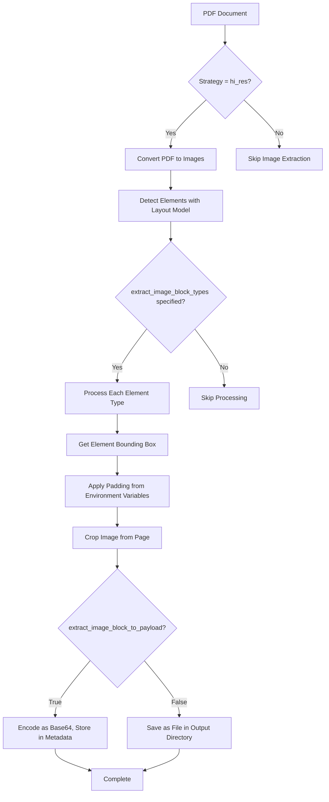
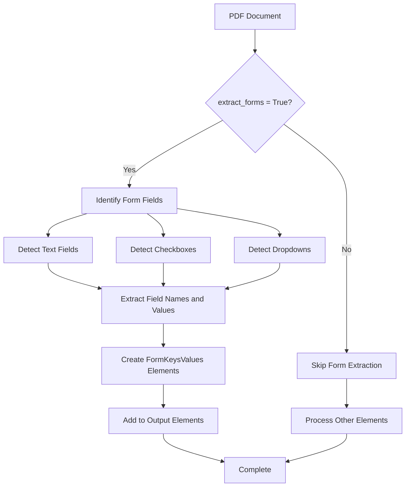
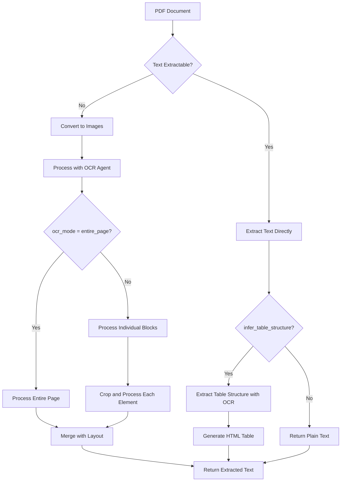
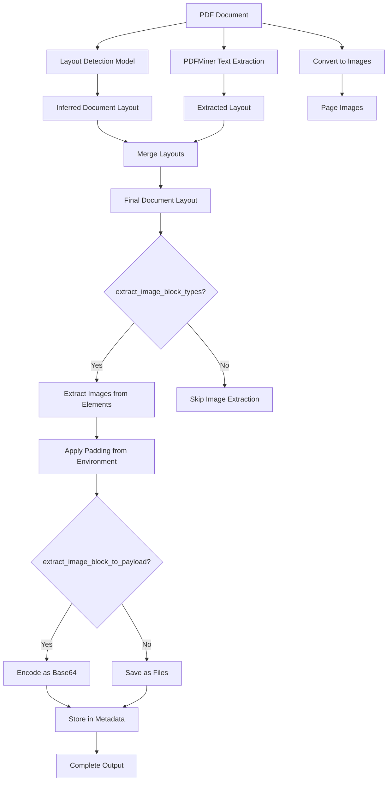

# Image and Form Field Extraction

<cite>
**Referenced Files in This Document**   
- [pdf.py](file://unstructured/partition/pdf.py)
- [pdf_image_utils.py](file://unstructured/partition/pdf_image/pdf_image_utils.py)
- [form_extraction.py](file://unstructured/partition/pdf_image/form_extraction.py)
- [ocr.py](file://unstructured/partition/pdf_image/ocr.py)
- [pdfminer_processing.py](file://unstructured/partition/pdf_image/pdfminer_processing.py)
- [config.py](file://unstructured/partition/utils/config.py)
</cite>

## Table of Contents
1. [Introduction](#introduction)
2. [Image Extraction from PDFs](#image-extraction-from-pdfs)
3. [Form Field Extraction](#form-field-extraction)
4. [OCR Processing](#ocr-processing)
5. [Configuration Options](#configuration-options)
6. [Integration with Layout Analysis](#integration-with-layout-analysis)
7. [Challenges and Best Practices](#challenges-and-best-practices)

## Introduction
This document provides comprehensive guidance on extracting images and form fields from PDF documents using the unstructured library. It covers the technical implementation details, configuration options, and best practices for handling various types of PDF content, including native PDF objects, scanned documents, and interactive forms. The document explains how images are detected and extracted, how form fields are processed, and how OCR is applied to extract text from image-only PDFs and scanned documents.

## Image Extraction from PDFs

The unstructured library provides robust capabilities for extracting images from PDF documents through the `partition_pdf` function with the `hi_res` strategy. The image extraction process involves several key components and parameters that control how images are detected, processed, and stored.

Image extraction is primarily controlled through three parameters: `extract_image_block_types`, `extract_image_block_output_dir`, and `extract_image_block_to_payload`. These parameters work together to determine which types of elements should have their images extracted, where the extracted images should be stored, and in what format they should be made available.

The `extract_image_block_types` parameter specifies which element types should have their images extracted. Common values include "Image" and "Table", allowing users to selectively extract images from specific document components. When this parameter is set, the system identifies elements of the specified types and processes their associated images.

Images can be stored in two ways: as files in a directory or as base64-encoded data within the element metadata. The `extract_image_block_output_dir` parameter specifies the directory where extracted images will be saved as files. If this parameter is not provided, images are saved in a default directory structure based on the working directory configuration. Alternatively, when `extract_image_block_to_payload` is set to `True`, images are encoded as base64 strings and stored directly in the element's metadata fields `image_base64` and `image_mime_type`. This approach is particularly useful for web-based applications or APIs where embedding image data directly in the payload is preferred.

The image extraction process involves converting the PDF pages to images at a specified DPI (dots per inch), typically 200 by default. The system then uses the bounding box coordinates of detected elements to crop the corresponding regions from the page images. During this process, padding can be applied around the bounding box using the `EXTRACT_IMAGE_BLOCK_CROP_HORIZONTAL_PAD` and `EXTRACT_IMAGE_BLOCK_CROP_VERTICAL_PAD` environment variables, which add extra pixels around the extracted region to ensure complete capture of the content.

For PNG images with transparency (RGBA mode), the system automatically converts them to RGB mode before saving, as JPEG format (the default output format) does not support transparency. This conversion ensures compatibility with various downstream applications that may not handle transparent images properly.

**Diagram sources**
- [pdf.py](file://unstructured/partition/pdf.py#L780-L818)
- [pdf_image_utils.py](file://unstructured/partition/pdf_image/pdf_image_utils.py#L120-L249)

**Section sources**
- [pdf.py](file://unstructured/partition/pdf.py#L137-L202)
- [pdf_image_utils.py](file://unstructured/partition/pdf_image/pdf_image_utils.py#L120-L249)

## Form Field Extraction

Form field extraction in the unstructured library is designed to process interactive PDF forms, including text fields, checkboxes, and dropdowns. This functionality is controlled by the `extract_forms` parameter in the `partition_pdf` function, which when set to `True`, enables the form extraction logic.

The form extraction process is implemented in the `form_extraction.py` module, which defines the `run_form_extraction` function. This function takes several parameters including the filename, file object, model name, elements, and a flag to skip table regions. However, the current implementation raises a `NotImplementedError` with the message "Form extraction not yet available," indicating that while the interface is defined, the actual form extraction functionality has not been implemented in the current version of the library.

Despite the current implementation status, the design pattern suggests that form extraction would integrate with the existing element processing pipeline. When `extract_forms` is enabled, the system would process the detected elements and identify form fields within the document. The results would be returned as `FormKeysValues` elements, which would be added to the output element list.

The `form_extraction_skip_tables` parameter provides control over whether form extraction should ignore regions designated as tables. This is useful in documents where tables might contain form-like structures that should not be processed as actual form fields. By default, this parameter is set to `True`, meaning table regions will be skipped during form extraction.

The form extraction process would likely leverage the layout detection model to identify form fields based on their visual appearance and positioning within the document. For text fields, the system would detect rectangular regions that are typically used for text input. For checkboxes, it would identify square or rectangular regions that may contain check marks or other indicators of selection state. Dropdowns would be identified by their characteristic triangle icon and associated text fields.

**Diagram sources**
- [pdf.py](file://unstructured/partition/pdf.py#L814-L853)
- [form_extraction.py](file://unstructured/partition/pdf_image/form_extraction.py#L8-L15)

**Section sources**
- [pdf.py](file://unstructured/partition/pdf.py#L202-L207)
- [form_extraction.py](file://unstructured/partition/pdf_image/form_extraction.py#L8-L15)

## OCR Processing

OCR (Optical Character Recognition) processing is a critical component of the unstructured library's ability to extract text from image-based PDFs and scanned documents. The OCR functionality is integrated into the `hi_res` partitioning strategy and can be configured through several parameters including `ocr_languages`, `ocr_agent`, and `table_ocr_agent`.

The OCR process is implemented in the `ocr.py` module, which contains functions for processing OCR data from both files and binary data. The main entry points are `process_file_with_ocr` and `process_data_with_ocr`, which handle the OCR processing for file paths and file-like objects respectively.

The OCR process begins by converting the PDF document into images using the `pdf2image` library. Each page is rendered as an image at a specified DPI (default is 200). These images are then processed by the OCR agent to extract text content. The system supports multiple OCR agents, with Tesseract being the default. The `ocr_agent` parameter allows users to specify which OCR engine to use, while `ocr_languages` specifies the languages present in the document for use in OCR processing.

Two OCR modes are supported: `entire_page` and `individual_blocks`. In `entire_page` mode, OCR processes the entire image page and merges the results with the layout detection output. In `individual_blocks` mode, OCR is performed on individual elements by cropping the image to the element's bounding box and processing only that region. This approach can be more efficient and accurate for documents with complex layouts.

For table extraction, a separate `table_ocr_agent` can be specified, allowing different OCR settings to be used for table content. When `infer_table_structure` is enabled, the system uses OCR to extract the table content and render it into an HTML string representation that preserves the table structure with rows and cells.

The OCR process also includes functionality for handling low-quality text extraction. When text cannot be reliably extracted from the PDF directly, the system falls back to OCR processing. The `cid_ratio` function helps identify text with poor extraction quality by calculating the ratio of unknown 'cid' characters to all characters in the text.

**Diagram sources**
- [pdf.py](file://unstructured/partition/pdf.py#L691-L704)
- [ocr.py](file://unstructured/partition/pdf_image/ocr.py#L104-L198)

**Section sources**
- [pdf.py](file://unstructured/partition/pdf.py#L131-L132)
- [ocr.py](file://unstructured/partition/pdf_image/ocr.py#L36-L285)

## Configuration Options

The unstructured library provides extensive configuration options for image and form field extraction through function parameters and environment variables. These options allow users to customize the extraction process to meet specific requirements and handle various document types and quality levels.

Key configuration parameters for image extraction include:
- `extract_image_block_types`: Specifies which element types should have images extracted (e.g., ["Image", "Table"])
- `extract_image_block_output_dir`: Specifies the directory where extracted images should be saved
- `extract_image_block_to_payload`: Determines whether images should be stored as base64-encoded data in the element metadata
- `pdf_image_dpi`: Controls the resolution at which PDF pages are converted to images (default: 200)

For form field extraction, the primary configuration options are:
- `extract_forms`: Enables or disables form extraction functionality
- `form_extraction_skip_tables`: Controls whether table regions should be skipped during form extraction

OCR processing can be configured with:
- `ocr_languages`: Specifies the languages present in the document for OCR processing
- `ocr_agent`: Specifies which OCR engine to use (default: Tesseract)
- `table_ocr_agent`: Specifies a different OCR agent for table content
- `ocr_mode`: Determines whether OCR should process entire pages or individual blocks

Environment variables provide additional configuration options that affect the extraction process:
- `IMAGE_CROP_PAD`: Adds extra pixels around identified element regions
- `TABLE_IMAGE_CROP_PAD`: Adds extra pixels around identified table regions
- `EXTRACT_IMAGE_BLOCK_CROP_HORIZONTAL_PAD` and `EXTRACT_IMAGE_BLOCK_CROP_VERTICAL_PAD`: Control padding around extracted image blocks
- `OCR_LAYOUT_SUBREGION_THRESHOLD`: Determines the threshold for considering an OCR region as a sub-region of a given block
- `TESSERACT_MIN_TEXT_HEIGHT` and `TESSERACT_MAX_TEXT_HEIGHT`: Control text height thresholds for Tesseract OCR processing

The `partition_pdf` function also includes parameters for controlling PDFMiner behavior, which is used for text extraction in the `fast` strategy:
- `pdfminer_line_margin`: Controls line merging based on relative line height
- `pdfminer_char_margin`: Controls character spacing for word detection
- `pdfminer_line_overlap`: Controls line overlap for line merging
- `pdfminer_word_margin`: Controls word spacing for word separation

These configuration options can be combined to create tailored extraction workflows for different document types and use cases. For example, a high-precision extraction for archival documents might use high DPI settings and extensive padding, while a high-throughput processing system might use lower DPI and minimal padding to optimize performance.

**Section sources**
- [pdf.py](file://unstructured/partition/pdf.py#L137-L219)
- [config.py](file://unstructured/partition/utils/config.py#L58-L175)

## Integration with Layout Analysis

The image extraction process is tightly integrated with the layout analysis pipeline in the unstructured library, particularly in the `hi_res` strategy. This integration ensures that images are extracted in the context of the document's overall structure and that the extracted images maintain their relationship to other document elements.

The layout analysis pipeline begins with the `partition_pdf_or_image` function, which determines the appropriate strategy based on document characteristics. For the `hi_res` strategy, the pipeline uses a layout detection model to identify document elements, then integrates this with text extracted directly from the PDF (when available) and OCR results.

The integration process involves several key steps:
1. **Layout Detection**: A machine learning model identifies document elements such as text blocks, images, tables, and figures
2. **Text Extraction**: PDFMiner extracts text directly from the PDF where possible
3. **OCR Processing**: OCR is applied to supplement or replace text extraction, particularly for scanned documents
4. **Layout Merging**: The detected layout, extracted text, and OCR results are merged into a unified document representation

The `merge_inferred_with_extracted_layout` function plays a crucial role in this integration, combining the layout detected by the machine learning model with text extracted by PDFMiner. This function handles various scenarios, such as when an inferred element is almost the same as an extracted element, or when an extracted element is a subregion of an inferred element.

For image extraction, the layout analysis provides the bounding box coordinates of image elements, which are then used to crop the corresponding regions from the page images. The `save_elements` function uses these coordinates, along with the page number and element type, to extract and save images according to the specified configuration.

The integration also handles special cases such as tables, where the layout analysis identifies table regions and the OCR process extracts the table structure. When `infer_table_structure` is enabled, the system generates an HTML representation of the table that preserves the row and column structure.

This tight integration between image extraction and layout analysis ensures that extracted images maintain their semantic meaning within the document context. For example, an image extracted from a figure caption will retain its relationship to the caption text, and a table image will be associated with its structured data representation.

**Diagram sources**
- [pdf.py](file://unstructured/partition/pdf.py#L644-L689)
- [pdfminer_processing.py](file://unstructured/partition/pdf_image/pdfminer_processing.py#L624-L680)

**Section sources**
- [pdf.py](file://unstructured/partition/pdf.py#L617-L783)
- [pdfminer_processing.py](file://unstructured/partition/pdf_image/pdfminer_processing.py#L624-L680)

## Challenges and Best Practices

Extracting images and form fields from PDFs presents several challenges that require careful consideration and appropriate strategies to overcome. Understanding these challenges and following best practices can significantly improve the quality and reliability of the extraction process.

### Image Quality and Resolution Challenges

One of the primary challenges in image extraction is dealing with varying image quality and resolution. Low-resolution scans can result in poor OCR accuracy and difficulty in detecting document elements. The unstructured library addresses this through several mechanisms:

- **DPI Configuration**: The `pdf_image_dpi` parameter allows users to control the resolution at which PDF pages are converted to images. Higher DPI values (e.g., 300-600) can improve OCR accuracy but increase processing time and file sizes.
- **Text Height Optimization**: The Tesseract OCR agent includes parameters like `TESSERACT_MIN_TEXT_HEIGHT` and `TESSERACT_MAX_TEXT_HEIGHT` that automatically adjust image scaling to optimize text recognition.
- **Padding Configuration**: Environment variables like `IMAGE_CROP_PAD` and `TABLE_IMAGE_CROP_PAD` allow adding extra pixels around extracted regions to ensure complete capture of content, particularly useful for images with borders or shadows.

Best practices for handling image quality include:
- Using higher DPI settings for documents with small text or complex layouts
- Applying appropriate padding to ensure complete capture of image content
- Testing different OCR agents and configurations for optimal results with specific document types

### File Size Management

Large PDF files with high-resolution images can result in significant processing overhead and storage requirements. Strategies for managing file sizes include:

- **Selective Extraction**: Using the `extract_image_block_types` parameter to extract only specific element types (e.g., tables but not images) reduces output size
- **Base64 vs. File Storage**: The `extract_image_block_to_payload` parameter allows choosing between embedding images in metadata (increasing JSON size) or saving them as separate files (increasing file count)
- **Compression**: Extracted images are saved in JPEG format by default, which provides good compression while maintaining quality

Best practices for file size management:
- Use file-based storage for large documents with many images
- Consider the trade-offs between embedded data (convenient for APIs) and separate files (better for large-scale processing)
- Monitor processing time and memory usage when extracting from large documents

### Handling Different Image Formats

The unstructured library supports various image formats through its integration with PIL (Python Imaging Library) and pdf2image. Key considerations include:

- **Transparency Handling**: PNG images with transparency (RGBA mode) are automatically converted to RGB mode when saved as JPEG, as JPEG does not support transparency
- **Format Detection**: The system detects image formats from the PDF and processes them appropriately
- **HEIC Support**: The library includes support for HEIC images through the pi_heif library

Best practices for format handling:
- Be aware of format conversion implications, particularly regarding transparency
- Test extraction with documents containing various image formats
- Consider the downstream requirements for image formats in your application

### Downstream Processing Considerations

Extracted images can be used for various downstream tasks, including document understanding and LLM (Large Language Model) processing. Best practices include:

- **Metadata Preservation**: Ensure that extracted images retain relevant metadata such as page number, position, and relationship to other elements
- **Consistent Naming**: Use predictable naming conventions for extracted image files to facilitate processing
- **Quality Assessment**: Implement quality checks on extracted images before using them in downstream applications
- **Error Handling**: Implement robust error handling for cases where image extraction fails

When using extracted images with LLMs, consider:
- Providing context about the image content in accompanying text
- Using base64 encoding for API-based LLM processing
- Optimizing image resolution for the specific LLM requirements

By understanding these challenges and following best practices, users can achieve reliable and high-quality image and form field extraction from PDF documents, enabling effective downstream processing and analysis.

**Section sources**
- [pdf_image_utils.py](file://unstructured/partition/pdf_image/pdf_image_utils.py#L190-L249)
- [config.py](file://unstructured/partition/utils/config.py#L58-L98)
- [pdf.py](file://unstructured/partition/pdf.py#L780-L818)