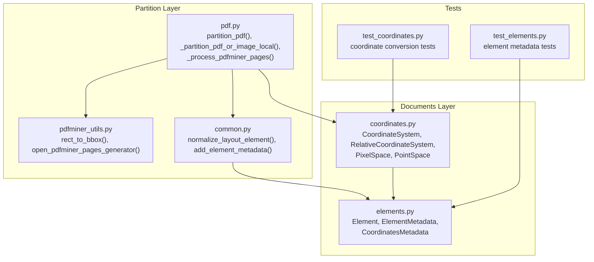
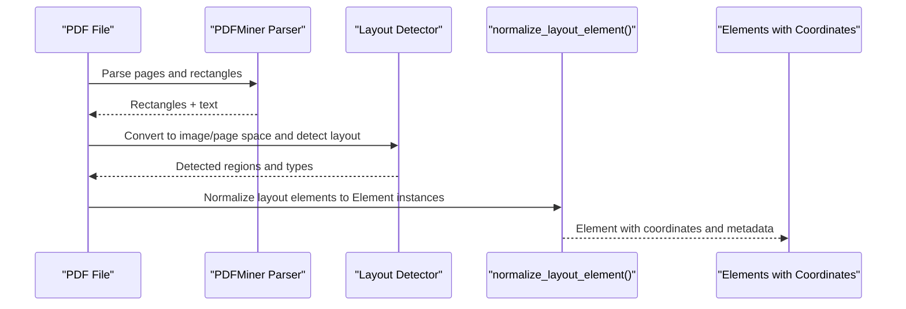
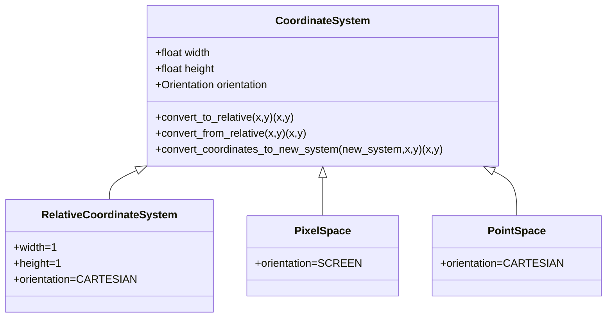
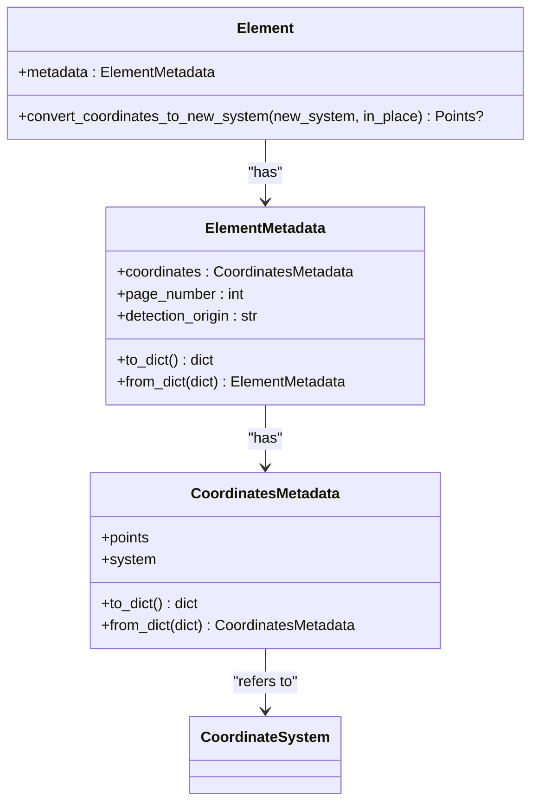
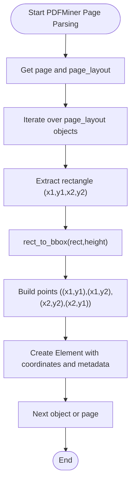
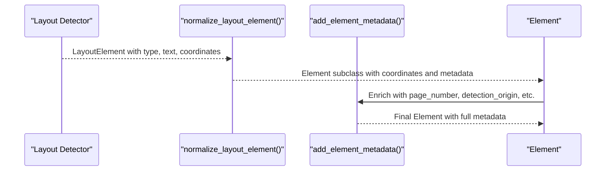
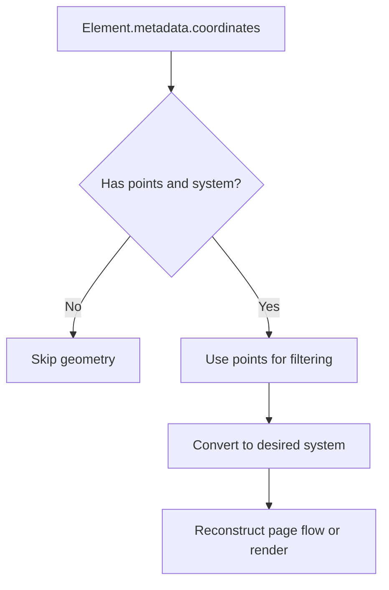
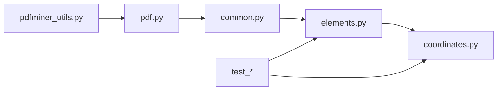

# Layout Analysis and Coordinate Systems

<cite>
**Referenced Files in This Document**
- [coordinates.py](file://unstructured/documents/coordinates.py)
- [elements.py](file://unstructured/documents/elements.py)
- [pdf.py](file://unstructured/partition/pdf.py)
- [pdfminer_utils.py](file://unstructured/partition/pdf_image/pdfminer_utils.py)
- [common.py](file://unstructured/partition/common/common.py)
- [test_coordinates.py](file://test_unstructured/documents/test_coordinates.py)
- [test_elements.py](file://test_unstructured/documents/test_elements.py)
- [embedded-images.pdf.json](file://test_unstructured/testfiles/staging/embedded-images.pdf.json)
- [Performance-Audit-Discussion.pdf.json](file://example-docs/test_evaluate_files/unstructured_output/Performance-Audit-Discussion.pdf.json)
</cite>

## Table of Contents
1. [Introduction](#introduction)
2. [Project Structure](#project-structure)
3. [Core Components](#core-components)
4. [Architecture Overview](#architecture-overview)
5. [Detailed Component Analysis](#detailed-component-analysis)
6. [Dependency Analysis](#dependency-analysis)
7. [Performance Considerations](#performance-considerations)
8. [Troubleshooting Guide](#troubleshooting-guide)
9. [Conclusion](#conclusion)
10. [Appendices](#appendices)

## Introduction
This document explains how layout analysis and coordinate systems are modeled and preserved during PDF processing in the repository. It covers:
- How spatial information is captured and represented across document partitioning strategies
- The coordinate systems used (points, pixels, relative) and how origins and orientations are handled
- How layout analysis is performed using machine learning models and how the resulting geometry is attached to output elements
- How to access and use coordinate metadata for filtering and document reconstruction
- Practical considerations for accuracy, scaling across resolutions, and multi-column layouts

## Project Structure
The layout and coordinate system logic spans several modules:
- Documents layer: coordinate abstractions and element metadata
- Partition layer: PDF processing strategies and element construction
- PDFMiner utilities: page parsing and bounding box conversions
- Tests: verification of coordinate conversions and element metadata

**Diagram sources**
- [coordinates.py](file://unstructured/documents/coordinates.py#L1-L114)
- [elements.py](file://unstructured/documents/elements.py#L54-L127)
- [pdf.py](file://unstructured/partition/pdf.py#L471-L555)
- [pdfminer_utils.py](file://unstructured/partition/pdf_image/pdfminer_utils.py#L61-L82)
- [common.py](file://unstructured/partition/common/common.py#L34-L125)
- [test_coordinates.py](file://test_unstructured/documents/test_coordinates.py#L37-L73)
- [test_elements.py](file://test_unstructured/documents/test_elements.py#L122-L190)

**Section sources**
- [coordinates.py](file://unstructured/documents/coordinates.py#L1-L114)
- [elements.py](file://unstructured/documents/elements.py#L54-L127)
- [pdf.py](file://unstructured/partition/pdf.py#L471-L555)
- [pdfminer_utils.py](file://unstructured/partition/pdf_image/pdfminer_utils.py#L61-L82)
- [common.py](file://unstructured/partition/common/common.py#L34-L125)
- [test_coordinates.py](file://test_unstructured/documents/test_coordinates.py#L37-L73)
- [test_elements.py](file://test_unstructured/documents/test_elements.py#L122-L190)

## Core Components
- CoordinateSystem and derived systems:
  - RelativeCoordinateSystem: normalized 0..1 scale
  - PixelSpace: image pixel coordinates with screen orientation (origin top-left)
  - PointSpace: PDF point coordinates with Cartesian orientation (origin bottom-left)
- Element and ElementMetadata:
  - CoordinatesMetadata holds points and the associated coordinate system
  - Element exposes convert_coordinates_to_new_system to transform geometry
- PDF processing:
  - Fast path uses PDFMiner to extract text and rectangles, converting to bounding boxes
  - Hi-res path uses layout detection models and merges with PDFMiner text extraction

**Section sources**
- [coordinates.py](file://unstructured/documents/coordinates.py#L1-L114)
- [elements.py](file://unstructured/documents/elements.py#L54-L127)
- [pdf.py](file://unstructured/partition/pdf.py#L471-L555)

## Architecture Overview
The system preserves spatial information by attaching a coordinate system and corner points to each element. During PDF processing:
- PDFMiner extracts raw rectangles and text; these are converted to bounding boxes with top-left origin
- Layout detection models infer regions and types; these are normalized into Element instances with coordinates
- Coordinates are kept in the original page space and can be converted to other systems when needed

**Diagram sources**
- [pdf.py](file://unstructured/partition/pdf.py#L471-L555)
- [pdfminer_utils.py](file://unstructured/partition/pdf_image/pdfminer_utils.py#L61-L82)
- [common.py](file://unstructured/partition/common/common.py#L34-L125)

## Detailed Component Analysis

### Coordinate Systems and Transformations
- Orientation and conversion:
  - Screen orientation (top-left origin) vs. Cartesian orientation (bottom-left origin)
  - Linear conversion between systems using width/height and orientation factors
  - RelativeCoordinateSystem normalizes coordinates to 0..1 scale
- Coordinate metadata:
  - Stored as points and system; both must be present
  - Serialized with layout_width and layout_height for downstream reconstruction

**Diagram sources**
- [coordinates.py](file://unstructured/documents/coordinates.py#L1-L114)

**Section sources**
- [coordinates.py](file://unstructured/documents/coordinates.py#L1-L114)
- [test_coordinates.py](file://test_unstructured/documents/test_coordinates.py#L37-L73)

### Element Geometry and Metadata
- CoordinatesMetadata encapsulates points and system; validated to prevent partial metadata
- Element.convert_coordinates_to_new_system transforms points in-place and updates the system
- ElementMetadata stores per-element metadata including coordinates, page number, and detection origin

**Diagram sources**
- [elements.py](file://unstructured/documents/elements.py#L54-L127)
- [elements.py](file://unstructured/documents/elements.py#L691-L731)

**Section sources**
- [elements.py](file://unstructured/documents/elements.py#L54-L127)
- [elements.py](file://unstructured/documents/elements.py#L691-L731)
- [test_elements.py](file://test_unstructured/documents/test_elements.py#L122-L190)

### PDFMiner Integration and Bounding Boxes
- rect_to_bbox converts PDF rectangle coordinates to a top-left origin bounding box using page height
- _process_pdfminer_pages iterates pages, extracts text and rectangles, and creates elements with coordinates in pixel space

**Diagram sources**
- [pdfminer_utils.py](file://unstructured/partition/pdf_image/pdfminer_utils.py#L61-L82)
- [pdf.py](file://unstructured/partition/pdf.py#L471-L555)

**Section sources**
- [pdfminer_utils.py](file://unstructured/partition/pdf_image/pdfminer_utils.py#L61-L82)
- [pdf.py](file://unstructured/partition/pdf.py#L471-L555)

### Layout Detection and Element Normalization
- normalize_layout_element maps layout element types to Element subclasses and attaches coordinates and metadata
- add_element_metadata enriches elements with page number, detection origin, and other metadata

**Diagram sources**
- [common.py](file://unstructured/partition/common/common.py#L34-L125)
- [common.py](file://unstructured/partition/common/common.py#L157-L200)

**Section sources**
- [common.py](file://unstructured/partition/common/common.py#L34-L125)
- [common.py](file://unstructured/partition/common/common.py#L157-L200)

### Accessing and Using Coordinate Metadata
- Access coordinates and system from Element.metadata.coordinates
- Convert between systems using Element.convert_coordinates_to_new_system
- Example JSON artifacts demonstrate coordinates stored as points with system and layout dimensions

**Diagram sources**
- [elements.py](file://unstructured/documents/elements.py#L691-L731)
- [embedded-images.pdf.json](file://test_unstructured/testfiles/staging/embedded-images.pdf.json#L44-L68)
- [Performance-Audit-Discussion.pdf.json](file://example-docs/test_evaluate_files/unstructured_output/Performance-Audit-Discussion.pdf.json#L41-L77)

**Section sources**
- [elements.py](file://unstructured/documents/elements.py#L691-L731)
- [embedded-images.pdf.json](file://test_unstructured/testfiles/staging/embedded-images.pdf.json#L44-L68)
- [Performance-Audit-Discussion.pdf.json](file://example-docs/test_evaluate_files/unstructured_output/Performance-Audit-Discussion.pdf.json#L41-L77)

## Dependency Analysis
- PDFMiner utilities depend on pdfminer layout primitives and convert rectangles to top-left-origin bounding boxes
- PDF partitioning depends on coordinate systems to attach pixel-space coordinates to elements
- Normalization depends on ElementMetadata and CoordinatesMetadata to build typed elements
- Tests validate coordinate conversions and element metadata serialization

**Diagram sources**
- [pdfminer_utils.py](file://unstructured/partition/pdf_image/pdfminer_utils.py#L61-L82)
- [pdf.py](file://unstructured/partition/pdf.py#L471-L555)
- [common.py](file://unstructured/partition/common/common.py#L34-L125)
- [elements.py](file://unstructured/documents/elements.py#L54-L127)
- [coordinates.py](file://unstructured/documents/coordinates.py#L1-L114)
- [test_coordinates.py](file://test_unstructured/documents/test_coordinates.py#L37-L73)
- [test_elements.py](file://test_unstructured/documents/test_elements.py#L122-L190)

**Section sources**
- [pdfminer_utils.py](file://unstructured/partition/pdf_image/pdfminer_utils.py#L61-L82)
- [pdf.py](file://unstructured/partition/pdf.py#L471-L555)
- [common.py](file://unstructured/partition/common/common.py#L34-L125)
- [elements.py](file://unstructured/documents/elements.py#L54-L127)
- [coordinates.py](file://unstructured/documents/coordinates.py#L1-L114)
- [test_coordinates.py](file://test_unstructured/documents/test_coordinates.py#L37-L73)
- [test_elements.py](file://test_unstructured/documents/test_elements.py#L122-L190)

## Performance Considerations
- Resolution and scaling:
  - PDFMiner rectangles are converted to top-left-origin bounding boxes using page height
  - When merging OCR and layout detection, ensure consistent page dimensions across sources
- Multi-column layouts:
  - Coordinates preserve spatial relationships; use y-coordinates and proximity to cluster content into columns
  - For skewed or rotated pages, consider relative coordinates to normalize layout before clustering
- Accuracy:
  - Validate coordinate conversions and ensure points remain within page bounds
  - Prefer normalized relative coordinates for cross-document comparisons

[No sources needed since this section provides general guidance]

## Troubleshooting Guide
- Coordinate conversion failures:
  - Verify both points and system are present in CoordinatesMetadata
  - Use Element.convert_coordinates_to_new_system with in_place=True to update geometry consistently
- Unexpected orientation:
  - Confirm whether the coordinate system uses screen (top-left origin) or Cartesian (bottom-left origin) orientation
  - Convert between systems explicitly when mixing sources
- Serialization issues:
  - Ensure layout_width and layout_height are included when serializing CoordinatesMetadata
  - Deserialize using CoordinatesMetadata.from_dict to restore system and points

**Section sources**
- [elements.py](file://unstructured/documents/elements.py#L54-L127)
- [elements.py](file://unstructured/documents/elements.py#L691-L731)
- [test_elements.py](file://test_unstructured/documents/test_elements.py#L186-L225)

## Conclusion
The repository preserves spatial information by attaching explicit coordinate metadata to elements and providing robust conversion utilities across coordinate systems. PDFMiner fast-path and layout detection hi-res-path both produce elements with reliable geometry, enabling downstream tasks such as filtering by position, reconstructing document flow, and visual analysis. Proper handling of orientation, resolution, and multi-column layouts ensures accurate and scalable document processing.

[No sources needed since this section summarizes without analyzing specific files]

## Appendices

### Practical Examples and Paths
- Converting coordinates between systems:
  - [Element.convert_coordinates_to_new_system](file://unstructured/documents/elements.py#L704-L731)
- Creating elements with coordinates from PDFMiner:
  - [PDFMiner bounding box conversion](file://unstructured/partition/pdf_image/pdfminer_utils.py#L61-L82)
  - [PDFMiner page processing loop](file://unstructured/partition/pdf.py#L471-L555)
- Normalizing layout elements:
  - [normalize_layout_element](file://unstructured/partition/common/common.py#L34-L125)
  - [add_element_metadata](file://unstructured/partition/common/common.py#L157-L200)
- Coordinate system classes:
  - [CoordinateSystem and derived types](file://unstructured/documents/coordinates.py#L1-L114)
- Test coverage:
  - [Coordinate conversion tests](file://test_unstructured/documents/test_coordinates.py#L37-L73)
  - [Element metadata tests](file://test_unstructured/documents/test_elements.py#L122-L190)