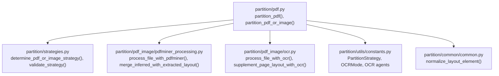
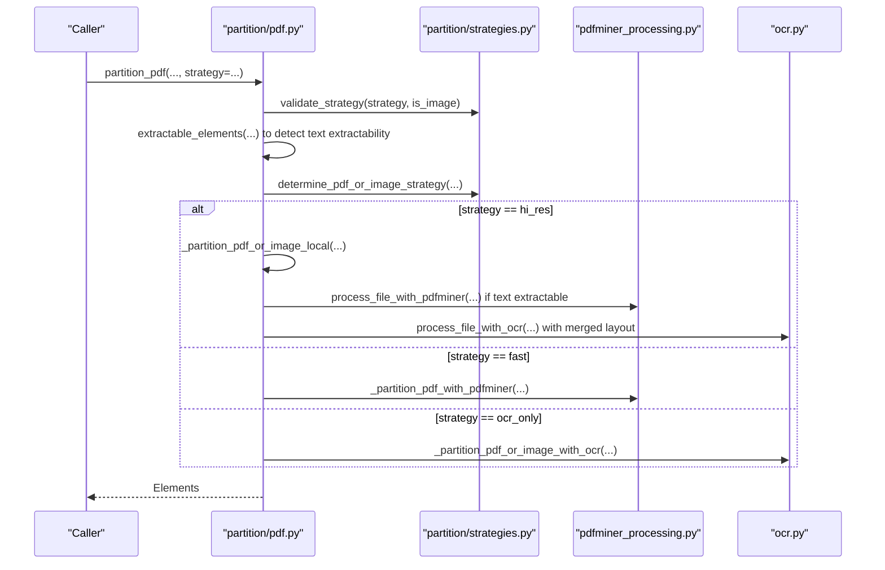
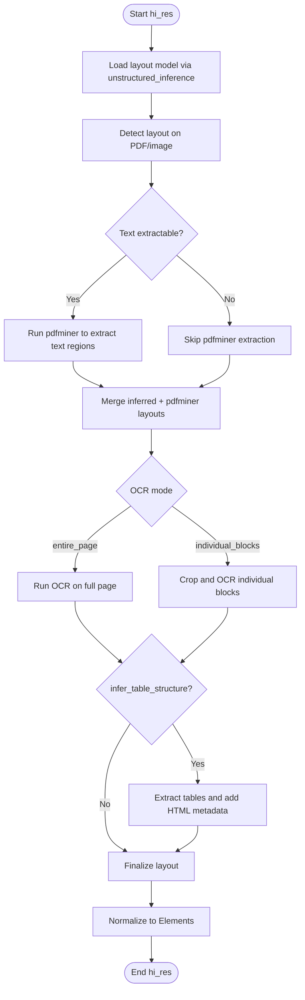
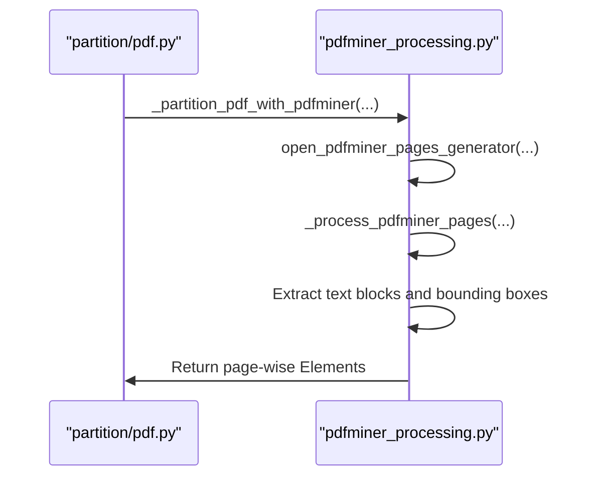
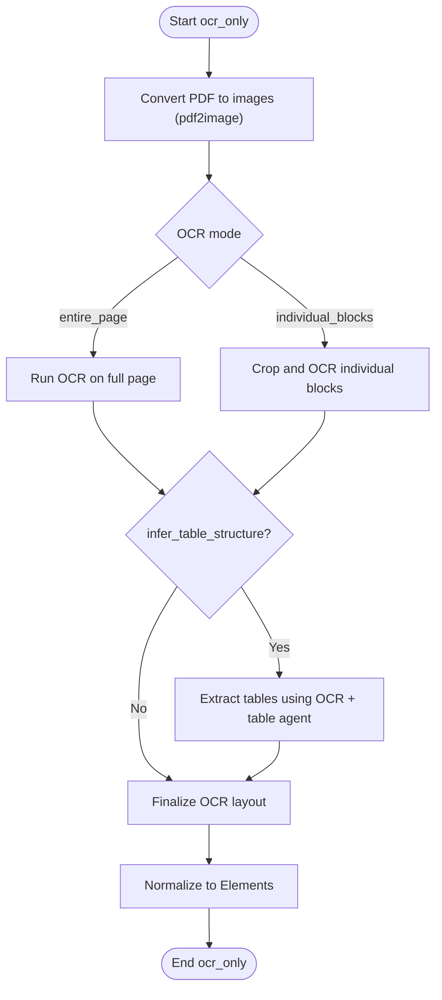
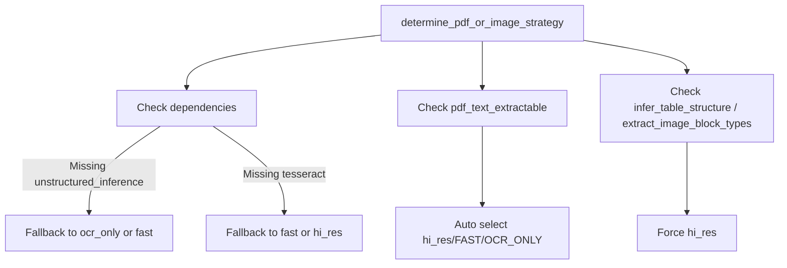

# PDF Processing Strategies

<cite>
**Referenced Files in This Document**
- [pdf.py](file://unstructured/partition/pdf.py)
- [strategies.py](file://unstructured/partition/strategies.py)
- [pdfminer_processing.py](file://unstructured/partition/pdf_image/pdfminer_processing.py)
- [ocr.py](file://unstructured/partition/pdf_image/ocr.py)
- [constants.py](file://unstructured/partition/utils/constants.py)
- [common.py](file://unstructured/partition/common/common.py)
- [test_strategies.py](file://test_unstructured/partition/test_strategies.py)
- [test_pdf.py](file://test_unstructured/partition/pdf_image/test_pdf.py)
</cite>

## Table of Contents
1. [Introduction](#introduction)
2. [Project Structure](#project-structure)
3. [Core Components](#core-components)
4. [Architecture Overview](#architecture-overview)
5. [Detailed Component Analysis](#detailed-component-analysis)
6. [Dependency Analysis](#dependency-analysis)
7. [Performance Considerations](#performance-considerations)
8. [Troubleshooting Guide](#troubleshooting-guide)
9. [Conclusion](#conclusion)
10. [Appendices](#appendices)

## Introduction
This document explains the three PDF processing strategies implemented in the repository: hi_res, fast, and ocr_only. It describes how each strategy is selected, invoked, and executed, including the underlying algorithms, data flows, and configuration parameters. It also provides guidance on when to use each strategy based on document type and use case, and outlines performance and memory characteristics derived from the codebase.

## Project Structure
The PDF processing pipeline is primarily implemented in the partition module with strategy selection and fallback logic in strategies.py. OCR and layout merging are handled in pdf_image submodules, while constants and element normalization live in utils and common.

**Diagram sources**
- [pdf.py](file://unstructured/partition/pdf.py#L251-L395)
- [strategies.py](file://unstructured/partition/strategies.py#L8-L110)
- [pdfminer_processing.py](file://unstructured/partition/pdf_image/pdfminer_processing.py#L40-L110)
- [ocr.py](file://unstructured/partition/pdf_image/ocr.py#L104-L205)
- [constants.py](file://unstructured/partition/utils/constants.py#L17-L43)
- [common.py](file://unstructured/partition/common/common.py#L34-L125)

**Section sources**
- [pdf.py](file://unstructured/partition/pdf.py#L251-L395)
- [strategies.py](file://unstructured/partition/strategies.py#L8-L110)

## Core Components
- Strategy selection and validation:
  - validate_strategy ensures the requested strategy is valid and compatible with the input type.
  - determine_pdf_or_image_strategy selects the effective strategy based on availability of dependencies and document characteristics (e.g., whether text is extractable, whether table structure or image extraction is requested).
- Strategy-specific execution:
  - hi_res: Uses unstructured_inference layout detection, merges with pdfminer-extracted text regions, and runs OCR to enrich text and optionally extract tables.
  - fast: Uses pdfminer to extract text directly from the PDF without layout detection.
  - ocr_only: Converts PDF to images and runs OCR to extract text; optionally uses pdfminer-extracted regions to improve OCR alignment.

Key configuration parameters:
- Strategy selection: strategy parameter (auto/fast/hi_res/ocr_only)
- Model loading: hi_res_model_name for layout model
- OCR agents: ocr_agent, table_ocr_agent
- OCR mode: OCRMode (entire_page or individual_blocks)
- PDFMiner tuning: line_margin, char_margin, line_overlap, word_margin
- Security and limits: password, pdf_hi_res_max_pages

**Section sources**
- [strategies.py](file://unstructured/partition/strategies.py#L8-L110)
- [constants.py](file://unstructured/partition/utils/constants.py#L17-L43)
- [pdf.py](file://unstructured/partition/pdf.py#L123-L248)

## Architecture Overview
The high-level flow for PDF partitioning:

**Diagram sources**
- [pdf.py](file://unstructured/partition/pdf.py#L251-L395)
- [strategies.py](file://unstructured/partition/strategies.py#L24-L85)
- [pdfminer_processing.py](file://unstructured/partition/pdf_image/pdfminer_processing.py#L40-L110)
- [ocr.py](file://unstructured/partition/pdf_image/ocr.py#L104-L205)

## Detailed Component Analysis

### Strategy: hi_res
- Purpose: High-quality layout-aware parsing with OCR enrichment. Best for native PDFs with complex layouts and for extracting tables and images.
- Decision logic:
  - If infer_table_structure or extract_image_block_types is set, hi_res is forced.
  - If pdfminer detects text extractable, hi_res is chosen; otherwise, fallback logic applies.
- Implementation highlights:
  - Loads a layout model via unstructured_inference and runs layout detection on the PDF or image.
  - Optionally runs pdfminer to extract text regions and merges them with inferred layout using merge_inferred_with_extracted_layout.
  - Runs OCR (entire_page or individual_blocks) to fill missing text and optionally extract tables.
  - Converts final layout to Elements with coordinate metadata and normalized types.
- Key functions and flows:
  - _partition_pdf_or_image_local orchestrates layout detection, pdfminer extraction, merging, and OCR.
  - merge_inferred_with_extracted_layout aligns inferred and pdfminer-extracted regions.
  - supplement_page_layout_with_ocr handles OCR modes and table extraction.
  - document_to_element_list converts the final layout to Elements.

**Diagram sources**
- [pdf.py](file://unstructured/partition/pdf.py#L586-L800)
- [pdfminer_processing.py](file://unstructured/partition/pdf_image/pdfminer_processing.py#L624-L712)
- [ocr.py](file://unstructured/partition/pdf_image/ocr.py#L206-L286)
- [common.py](file://unstructured/partition/common/common.py#L34-L125)

**Section sources**
- [pdf.py](file://unstructured/partition/pdf.py#L586-L800)
- [pdfminer_processing.py](file://unstructured/partition/pdf_image/pdfminer_processing.py#L624-L712)
- [ocr.py](file://unstructured/partition/pdf_image/ocr.py#L206-L286)
- [common.py](file://unstructured/partition/common/common.py#L34-L125)

### Strategy: fast
- Purpose: Fast text extraction directly from PDF using pdfminer without layout detection.
- Decision logic:
  - If strategy is FAST, it is enforced regardless of text extractability.
  - For images, FAST is not allowed.
- Implementation highlights:
  - Uses _partition_pdf_with_pdfminer to iterate pages and extract text blocks with bounding boxes.
  - Builds Elements with coordinate metadata and links derived from PDF annotations.
  - Applies cleaning and combining of adjacent text elements.
- Key functions and flows:
  - _partition_pdf_with_pdfminer opens pages and processes each page layout.
  - _process_pdfminer_pages extracts text snippets, cleans whitespace, and creates Elements.
  - get_links_in_element and get_uris map URIs to text regions.

**Diagram sources**
- [pdf.py](file://unstructured/partition/pdf.py#L398-L469)
- [pdf.py](file://unstructured/partition/pdf.py#L471-L556)
- [pdfminer_processing.py](file://unstructured/partition/pdf_image/pdfminer_processing.py#L40-L110)

**Section sources**
- [pdf.py](file://unstructured/partition/pdf.py#L398-L556)
- [pdfminer_processing.py](file://unstructured/partition/pdf_image/pdfminer_processing.py#L40-L110)

### Strategy: ocr_only
- Purpose: OCR-based extraction for scanned or protected PDFs where native text is not extractable.
- Decision logic:
  - If strategy is OCR_ONLY, it is enforced.
  - If dependencies are missing, fallback logic chooses FAST or hi_res.
- Implementation highlights:
  - Converts PDF to images (pdf2image) and runs OCR on each page.
  - Supports entire_page OCR and individual_blocks OCR modes.
  - Optionally extracts tables using OCR results and a table extraction agent.
- Key functions and flows:
  - process_file_with_ocr orchestrates image conversion and per-page OCR.
  - supplement_page_layout_with_ocr performs OCR and table extraction.
  - get_table_tokens prepares OCR tokens for table extraction.

**Diagram sources**
- [ocr.py](file://unstructured/partition/pdf_image/ocr.py#L104-L205)
- [ocr.py](file://unstructured/partition/pdf_image/ocr.py#L206-L286)

**Section sources**
- [ocr.py](file://unstructured/partition/pdf_image/ocr.py#L104-L205)
- [ocr.py](file://unstructured/partition/pdf_image/ocr.py#L206-L286)

## Dependency Analysis
- Strategy selection depends on:
  - Available dependencies: unstructured_inference and unstructured_pytesseract.
  - Document characteristics: whether text is extractable via pdfminer.
  - Feature flags: infer_table_structure, extract_image_block_types.
- Fallback behavior:
  - hi_res fallback to ocr_only if unstructured_inference is missing; otherwise to fast.
  - ocr_only fallback to fast if tesseract is missing and pdfminer text is extractable; otherwise to hi_res.
- Constants and agents:
  - PartitionStrategy enumerates supported strategies.
  - OCRMode defines OCR modes.
  - OCR agent modules are configured via whitelisted module names.

**Diagram sources**
- [strategies.py](file://unstructured/partition/strategies.py#L24-L110)
- [constants.py](file://unstructured/partition/utils/constants.py#L17-L43)

**Section sources**
- [strategies.py](file://unstructured/partition/strategies.py#L24-L110)
- [constants.py](file://unstructured/partition/utils/constants.py#L17-L43)

## Performance Considerations
- hi_res:
  - Uses layout detection and OCR; generally slower but higher quality for complex layouts and tables.
  - Memory usage influenced by pdf_image_dpi and page count; layout merging and OCR add overhead.
  - Thresholds and vectorized merging reduce redundant computation but still allocate matrices proportional to element counts.
- fast:
  - Fastest for native PDFs with extractable text; minimal overhead.
  - Memory usage scales linearly with number of text blocks.
- ocr_only:
  - Slower than fast due to image conversion and OCR; memory usage dominated by image conversion and OCR processing.
  - OCR zoom and confidence filtering adjust performance; excessive zoom can increase processing time.

[No sources needed since this section provides general guidance]

## Troubleshooting Guide
- Strategy validation errors:
  - Using FAST with images raises a ValueError.
  - Passing an invalid strategy raises a ValueError.
- Missing dependencies:
  - hi_res requires unstructured_inference; fallback to ocr_only or fast occurs if unavailable.
  - ocr_only requires tesseract; fallback to fast or hi_res occurs if unavailable.
- Copy-protected or non-extractable PDFs:
  - If pdfminer reports no extractable text, hi_res falls back to ocr_only.
- Page count limits:
  - hi_res enforces a maximum page limit; exceeding it raises a PageCountExceededError.

**Section sources**
- [strategies.py](file://unstructured/partition/strategies.py#L8-L85)
- [pdf.py](file://unstructured/partition/pdf.py#L572-L584)
- [test_strategies.py](file://test_unstructured/partition/test_strategies.py#L23-L31)
- [test_pdf.py](file://test_unstructured/partition/pdf_image/test_pdf.py#L674-L709)

## Conclusion
- Use hi_res for native PDFs requiring layout-aware parsing, tables, and images; it combines layout detection, pdfminer text extraction, and OCR.
- Use fast for native PDFs with extractable text when speed is critical.
- Use ocr_only for scanned or protected PDFs where native text extraction fails.
- Strategy selection is automatic when strategy=auto, guided by text extractability and feature flags, with robust fallbacks.

[No sources needed since this section summarizes without analyzing specific files]

## Appendices

### How to Invoke Each Strategy
- hi_res:
  - Call partition_pdf with strategy="hi_res" and optional parameters like hi_res_model_name, infer_table_structure, extract_image_block_types, ocr_agent, table_ocr_agent.
  - Example invocation path: [partition_pdf](file://unstructured/partition/pdf.py#L123-L248)
- fast:
  - Call partition_pdf with strategy="fast".
  - Example invocation path: [partition_pdf](file://unstructured/partition/pdf.py#L123-L248)
- ocr_only:
  - Call partition_pdf with strategy="ocr_only".
  - Example invocation path: [partition_pdf](file://unstructured/partition/pdf.py#L123-L248)

### Configuration Parameters
- Strategy selection:
  - strategy: "auto" | "fast" | "hi_res" | "ocr_only"
- Model loading:
  - hi_res_model_name: layout model name for unstructured_inference
- OCR:
  - ocr_agent: module path for OCR engine
  - table_ocr_agent: module path for table OCR engine
  - OCRMode: "entire_page" | "individual_blocks"
- PDFMiner tuning:
  - pdfminer_line_margin, pdfminer_char_margin, pdfminer_line_overlap, pdfminer_word_margin
- Security and limits:
  - password, pdf_hi_res_max_pages

**Section sources**
- [constants.py](file://unstructured/partition/utils/constants.py#L17-L43)
- [pdf.py](file://unstructured/partition/pdf.py#L123-L248)