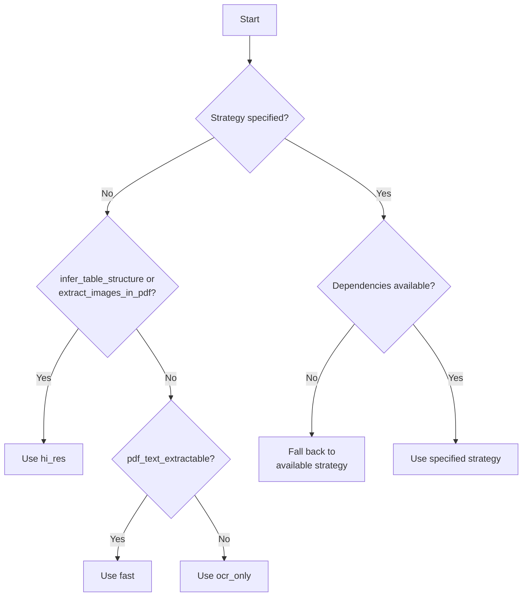
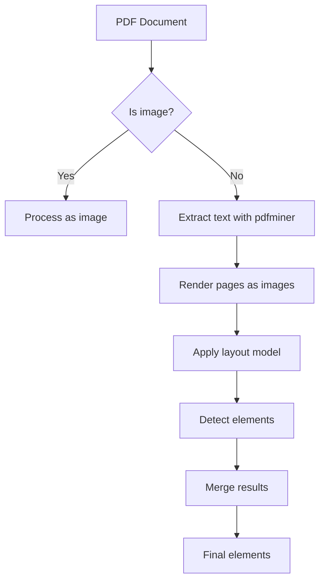
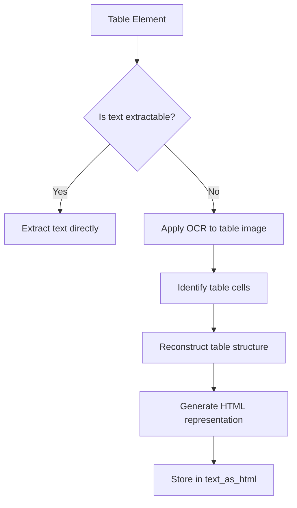

# PDF Processing

<cite>
**Referenced Files in This Document**   
- [pdf.py](file://unstructured/partition/pdf.py)
- [strategies.py](file://unstructured/partition/strategies.py)
- [pdfminer_utils.py](file://unstructured/partition/pdf_image/pdfminer_utils.py)
- [pdfminer_processing.py](file://unstructured/partition/pdf_image/pdfminer_processing.py)
- [pdf_image_utils.py](file://unstructured/partition/pdf_image/pdf_image_utils.py)
- [form_extraction.py](file://unstructured/partition/pdf_image/form_extraction.py)
</cite>

## Table of Contents
1. [Introduction](#introduction)
2. [PDF Processing Strategies](#pdf-processing-strategies)
3. [Layout Analysis](#layout-analysis)
4. [Table Extraction](#table-extraction)
5. [Image and Form Field Extraction](#image-and-form-field-extraction)
6. [Configuration Options](#configuration-options)
7. [Performance Considerations](#performance-considerations)
8. [Troubleshooting](#troubleshooting)

## Introduction
The PDF processing system provides comprehensive capabilities for extracting structured content from PDF documents. It supports multiple processing strategies to handle different types of PDFs, from text-based documents to scanned images. The system combines layout analysis, optical character recognition (OCR), and advanced table detection to extract meaningful elements while preserving document structure. This documentation explains the three main processing strategies (hi_res, fast, ocr_only), layout analysis using pdfminer and layout models, table extraction techniques, and various configuration options for optimizing PDF processing.

## PDF Processing Strategies

The PDF processing system implements three primary strategies for extracting content from PDF documents: hi_res, fast, and ocr_only. Each strategy is designed for different types of PDFs and use cases, balancing accuracy, speed, and feature extraction capabilities.

### hi_res Strategy
The hi_res strategy uses a layout detection model to identify document elements with high precision. This approach combines machine learning-based object detection with text extraction to preserve the document's visual structure. The hi_res strategy is particularly effective for complex layouts, multi-column documents, and documents with tables and images. It uses the unstructured_inference library to detect layout elements such as titles, paragraphs, tables, and figures. When infer_table_structure is enabled, the hi_res strategy can reconstruct table structures with their original formatting.

**Section sources**
- [pdf.py](file://unstructured/partition/pdf.py#L125-L248)
- [strategies.py](file://unstructured/partition/strategies.py#L24-L84)

### fast Strategy
The fast strategy extracts text directly from the PDF using pdfminer, bypassing the more computationally intensive layout analysis. This approach is significantly faster than hi_res but may not preserve complex document structures as accurately. The fast strategy works best with text-based PDFs that have clean, extractable text content. It processes the document by analyzing the PDF's internal text objects and reconstructing the reading order based on their positions.

**Section sources**
- [pdf.py](file://unstructured/partition/pdf.py#L875-L897)
- [pdfminer_utils.py](file://unstructured/partition/pdf_image/pdfminer_utils.py#L84-L128)

### ocr_only Strategy
The ocr_only strategy uses optical character recognition to extract text from PDFs, treating each page as an image. This approach is essential for scanned documents or PDFs with non-extractable text. The system converts each PDF page to an image and then applies OCR to recognize the text content. This strategy ensures text extraction even when the PDF contains only image-based content, though it is typically slower than the other strategies due to the image processing and OCR steps.

**Section sources**
- [pdf.py](file://unstructured/partition/pdf.py#L900-L947)
- [pdf_image_utils.py](file://unstructured/partition/pdf_image/pdf_image_utils.py#L399-L434)

### Strategy Selection Logic
The system automatically determines the appropriate strategy based on document characteristics and user configuration. When auto strategy is selected, the system evaluates whether the PDF text is extractable and whether features like table structure inference or image extraction are requested. The determine_pdf_or_image_strategy function implements this logic, falling back to alternative strategies when required dependencies are not available.

**Diagram sources**
- [strategies.py](file://unstructured/partition/strategies.py#L24-L110)
- [pdf.py](file://unstructured/partition/pdf.py#L319-L326)

## Layout Analysis

The layout analysis system combines pdfminer with machine learning-based layout models to accurately identify and extract document elements. This hybrid approach leverages the strengths of both rule-based text extraction and deep learning-based object detection.

### pdfminer Integration
The system uses pdfminer to extract text and basic layout information from PDFs. The pdfminer library analyzes the PDF's internal structure to identify text objects, images, and annotations. The implementation in pdfminer_utils.py provides a robust interface to pdfminer, including error handling for corrupted PDFs and coordinate system conversion. The rect_to_bbox function converts PDF coordinates to a standard coordinate system where the origin is at the top-left corner of the page.

**Section sources**
- [pdfminer_utils.py](file://unstructured/partition/pdf_image/pdfminer_utils.py#L61-L82)
- [pdf.py](file://unstructured/partition/pdf.py#L422-L468)

### Layout Model Processing
The hi_res strategy employs a machine learning model to detect document layout elements. The system uses the unstructured_inference library to identify elements such as titles, paragraphs, tables, and figures. The layout detection model is applied to rendered page images, producing bounding boxes and element classifications. This approach is particularly effective for documents with complex layouts that cannot be accurately parsed using text extraction alone.

**Diagram sources**
- [pdf.py](file://unstructured/partition/pdf.py#L587-L872)
- [pdfminer_processing.py](file://unstructured/partition/pdf_image/pdfminer_processing.py#L624-L680)

### Merging Extracted and Inferred Layouts
The system combines text extracted by pdfminer with elements detected by the layout model. The merge_inferred_with_extracted_layout function implements a sophisticated merging algorithm that resolves conflicts between the two sources. The algorithm considers factors such as bounding box overlap, element type, and confidence scores to produce a unified layout. This hybrid approach ensures that text content is preserved while maintaining the document's visual structure.

**Section sources**
- [pdfminer_processing.py](file://unstructured/partition/pdf_image/pdfminer_processing.py#L624-L680)
- [pdf.py](file://unstructured/partition/pdf.py#L685-L689)

## Table Extraction

The table extraction system provides advanced capabilities for detecting and reconstructing tables from PDF documents. It supports both simple table detection and full table structure inference.

### Table Structure Inference
When infer_table_structure is enabled, the system reconstructs tables with their original formatting, preserving rows, columns, and cell boundaries. The implementation converts table content into HTML format, allowing applications to render tables with their original appearance. This feature is particularly valuable for financial documents, scientific papers, and reports with complex tabular data.

**Section sources**
- [pdf.py](file://unstructured/partition/pdf.py#L130-L131)
- [chunking/base.py](file://unstructured/chunking/base.py#L720-L750)

### OCR-Based Table Processing
For tables in scanned documents or images, the system uses OCR to extract text content. The OCR process identifies text within table cells and reconstructs the table structure based on spatial relationships. The system can use different OCR agents (such as Tesseract or PaddleOCR) for general text and table-specific OCR, allowing optimization for different document types and languages.

**Diagram sources**
- [pdf.py](file://unstructured/partition/pdf.py#L696-L704)
- [pdf_image_utils.py](file://unstructured/partition/pdf_image/pdf_image_utils.py#L399-L434)

### Table Evaluation
The system includes comprehensive testing for table extraction accuracy. Test cases validate the system's ability to handle various table formats, including tables with merged cells, nested tables, and complex borders. The evaluation metrics measure both text accuracy and structural fidelity, ensuring that extracted tables faithfully represent the original content.

**Section sources**
- [test_table_structure.py](file://test_unstructured/metrics/test_table_structure.py#L42-L88)
- [test_table_structure.py](file://test_unstructured/metrics/test_table_structure.py#L500-L544)

## Image and Form Field Extraction

The system provides robust capabilities for extracting images and form fields from PDF documents, supporting various output formats and storage options.

### Image Extraction
The system can extract images from PDFs and save them to disk or embed them in the output. The extract_image_block_types parameter specifies which element types to extract (e.g., "Image", "Table"). Images can be saved to a specified directory or encoded as base64 data in the element metadata. The extract_image_block_to_payload parameter controls whether images are stored as file paths or embedded in the payload.

**Section sources**
- [pdf.py](file://unstructured/partition/pdf.py#L137-L140)
- [pdf_image_utils.py](file://unstructured/partition/pdf_image/pdf_image_utils.py#L120-L231)

### Form Field Extraction
The system includes experimental support for form field extraction. The run_form_extraction function is designed to identify and extract form fields from PDFs, adding FormKeysValues elements to the output. Currently, this functionality is not fully implemented, but the interface is in place for future development. The form_extraction_skip_tables parameter controls whether form extraction should ignore regions designated as tables.

**Section sources**
- [form_extraction.py](file://unstructured/partition/pdf_image/form_extraction.py#L8-L15)
- [pdf.py](file://unstructured/partition/pdf.py#L142-L143)

### Element Type Validation
The system validates and normalizes element types specified for extraction. The check_element_types_to_extract function ensures that requested element types match available types, providing case-insensitive matching and appropriate warnings for unrecognized types. This validation prevents errors due to typos or incorrect capitalization in configuration.

**Section sources**
- [pdf_image_utils.py](file://unstructured/partition/pdf_image/pdf_image_utils.py#L233-L257)
- [test_pdf_image_utils.py](file://test_unstructured/partition/pdf_image/test_pdf_image_utils.py#L200-L244)

## Configuration Options

The PDF processing system offers numerous configuration options to customize behavior for specific use cases and document types.

### Text Extraction Parameters
The system provides fine-grained control over text extraction behavior through pdfminer parameters:
- pdfminer_line_margin: Controls how close lines must be to be considered part of the same paragraph
- pdfminer_char_margin: Determines when characters are considered part of the same line
- pdfminer_line_overlap: Specifies overlap threshold for characters on the same line
- pdfminer_word_margin: Controls when characters are considered separate words

These parameters allow tuning the text extraction process for different document layouts and font sizes.

**Section sources**
- [pdf.py](file://unstructured/partition/pdf.py#L145-L149)
- [pdfminer_utils.py](file://unstructured/partition/pdf_image/pdfminer_utils.py#L16-L21)

### Language Support
The system supports multiple languages for both text extraction and OCR. The languages parameter specifies which languages are present in the document, enabling appropriate processing and OCR configuration. Language codes should follow ISO 639-2 standards (e.g., "eng" for English, "spa" for Spanish). The system automatically configures OCR engines based on the specified languages.

**Section sources**
- [pdf.py](file://unstructured/partition/pdf.py#L132-L133)
- [common/lang.py](file://unstructured/partition/common/lang.py#L52-L55)

### Output Configuration
Various parameters control the output format and additional processing:
- include_page_breaks: Adds PageBreak elements between pages
- starting_page_number: Sets the starting page number for metadata
- detect_language_per_element: Attempts to detect language for each element individually
- metadata_last_modified: Specifies the last modified date for the document

These options provide flexibility in how the extracted content is structured and annotated.

**Section sources**
- [pdf.py](file://unstructured/partition/pdf.py#L128-L134)
- [pdf.py](file://unstructured/partition/pdf.py#L144-L145)

## Performance Considerations

The system includes several features and best practices for optimizing performance, especially when processing large PDFs or batches of documents.

### Memory Management
The system processes PDFs in chunks to manage memory usage effectively. The convert_pdf_to_images function processes pages in small batches, preventing excessive memory consumption for large documents. This chunked processing is particularly important for high-resolution PDFs or documents with many images.

**Section sources**
- [pdf_image_utils.py](file://unstructured/partition/pdf_image/pdf_image_utils.py#L399-L434)
- [pdf.py](file://unstructured/partition/pdf.py#L933-L935)

### Processing Trade-offs
Each processing strategy represents a trade-off between speed, accuracy, and feature extraction:
- fast: Fastest processing, suitable for simple text extraction
- hi_res: Balanced approach, preserves document structure with moderate performance impact
- ocr_only: Most resource-intensive, necessary for scanned documents

For large-scale processing, consider using the fast strategy for text-based documents and reserving hi_res and ocr_only for documents requiring advanced features.

### Caching and Reuse
The system can benefit from caching intermediate results, such as rendered page images or layout analysis results. While not explicitly implemented in the core code, applications can implement caching strategies to avoid redundant processing when the same PDF is processed multiple times with similar configurations.

## Troubleshooting

Common issues and their solutions when processing PDFs with this system.

### Text Extraction Accuracy
For documents with poor text extraction quality:
1. Try the hi_res strategy, which often produces better results for complex layouts
2. Adjust pdfminer parameters (char_margin, word_margin) for documents with unusual spacing
3. Use ocr_only for scanned documents or PDFs with non-extractable text
4. Ensure appropriate languages are specified for multilingual documents

### Handling Scanned Documents
Scanned documents require special consideration:
1. Use ocr_only strategy or ensure hi_res is selected
2. Verify OCR dependencies are installed (e.g., unstructured_pytesseract)
3. Consider image quality - poor scans may require preprocessing
4. For bilingual documents, specify all relevant languages

### Performance Issues with Large PDFs
For large PDFs experiencing performance issues:
1. Use the fast strategy if document structure preservation is not critical
2. Process documents in smaller batches
3. Monitor memory usage and adjust chunk sizes if necessary
4. Consider preprocessing large PDFs to split them into smaller files

### Missing Content
If content appears to be missing from the output:
1. Verify the PDF is not password-protected or has copy restrictions
2. Check that extract_image_block_types includes the desired element types
3. Ensure infer_table_structure is enabled for tables that should preserve structure
4. Review log output for warnings about skipped content or processing errors

**Section sources**
- [pdf.py](file://unstructured/partition/pdf.py#L572-L584)
- [pdf.py](file://unstructured/partition/pdf.py#L315-L318)
- [strategies.py](file://unstructured/partition/strategies.py#L48-L56)