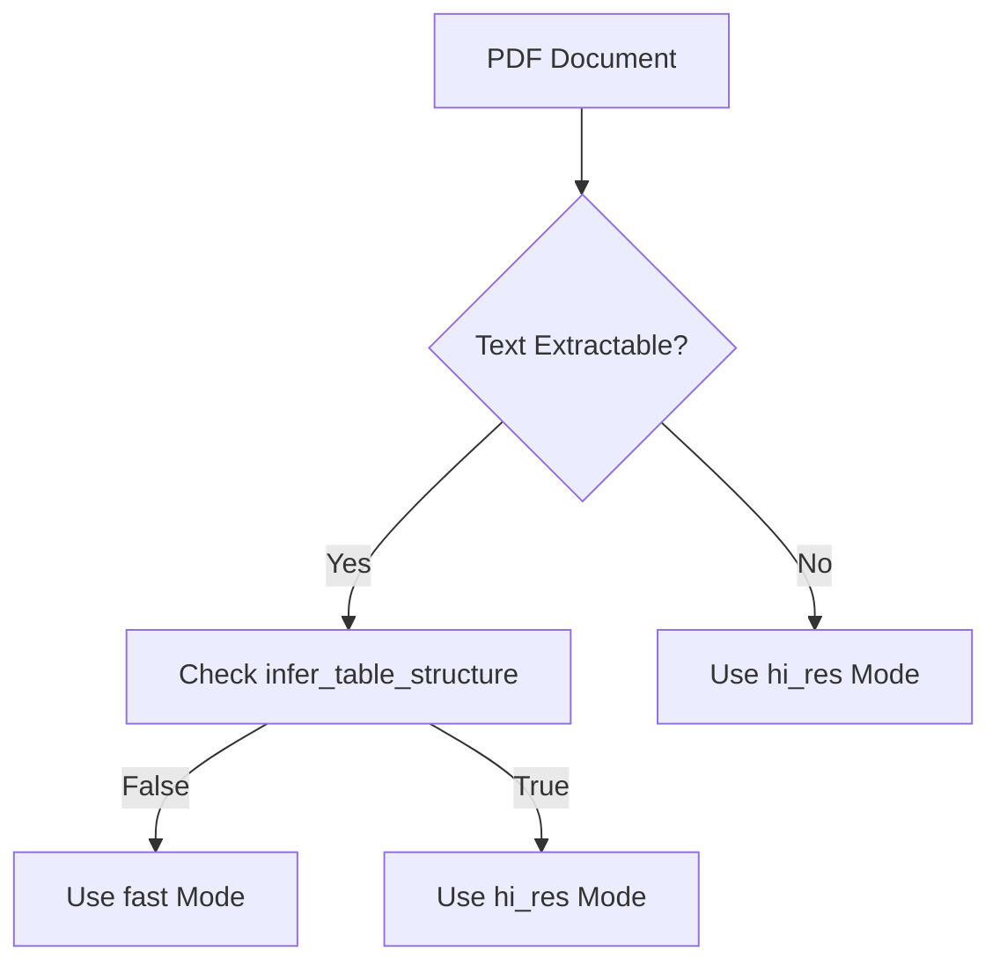
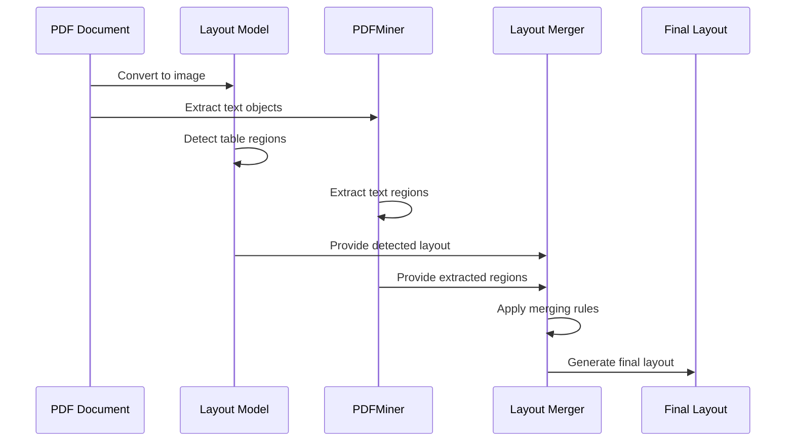
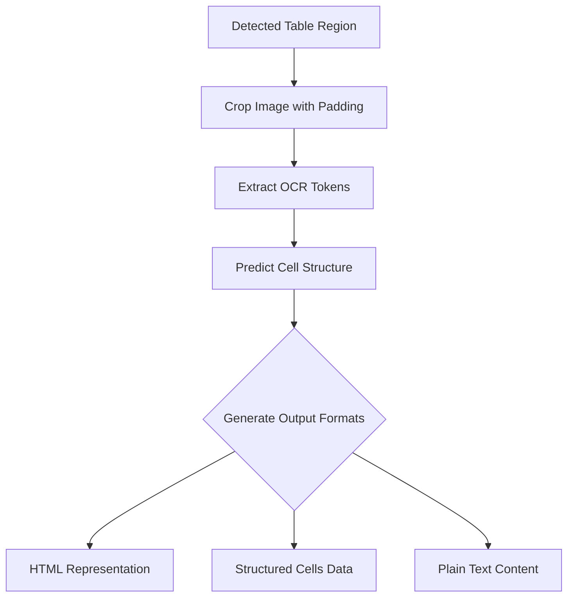
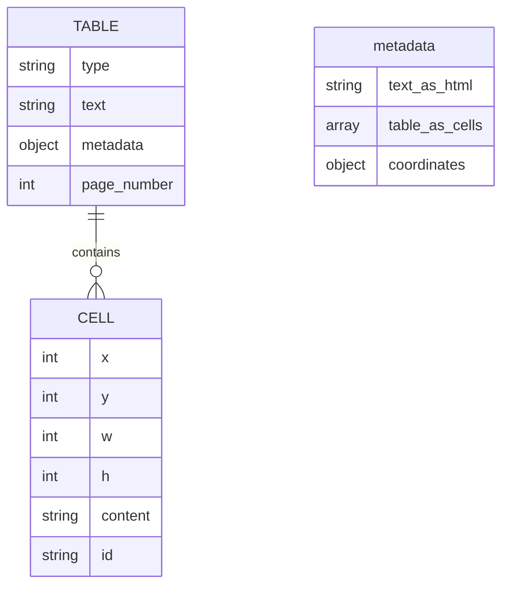

# Table Extraction in PDFs

<cite>
**Referenced Files in This Document**   
- [pdf.py](file://unstructured/partition/pdf.py)
- [pdfminer_processing.py](file://unstructured/partition/pdf_image/pdfminer_processing.py)
- [ocr.py](file://unstructured/partition/pdf_image/ocr.py)
- [html_table.py](file://unstructured/common/html_table.py)
- [table_extraction.py](file://unstructured/metrics/table/table_extraction.py)
- [table_structure.py](file://unstructured/metrics/table_structure.py)
- [2022-financial-statements-p11.pdf.json](file://example-docs/test_evaluate_files/unstructured_output_table_structure/2022-financial-statements-p11.pdf.json)
- [IRS-2023-Form-1095-A.pdf.json](file://example-docs/test_evaluate_files/gold_standard_table_structure/IRS-2023-Form-1095-A.pdf.json)
</cite>

## Table of Contents
1. [Introduction](#introduction)
2. [Table Structure Inference Modes](#table-structure-inference-modes)
3. [Layout Analysis and Table Detection](#layout-analysis-and-table-detection)
4. [Table Cell Detection and Structure](#table-cell-detection-and-structure)
5. [Output Formats and Data Representation](#output-formats-and-data-representation)
6. [Configuration and Performance](#configuration-and-performance)
7. [Metadata Preservation](#metadata-preservation)
8. [Common Challenges](#common-challenges)
9. [Examples](#examples)
10. [Conclusion](#conclusion)

## Introduction
The unstructured library provides comprehensive table extraction capabilities from PDF documents through a sophisticated pipeline that combines layout analysis, optical character recognition (OCR), and table structure inference. This documentation details the technical implementation of table extraction, focusing on the two primary modes (hi_res and fast), the infer_table_structure parameter, and the complete process from table detection to structured output generation.

**Section sources**
- [pdf.py](file://unstructured/partition/pdf.py#L1-L1290)

## Table Structure Inference Modes

### hi_res Mode
The hi_res mode employs a deep learning-based layout detection model to identify document elements, including tables. This approach uses the UnstructuredTableTransformerModel to analyze the document structure at a high resolution. The process involves:

1. Converting the PDF to images at a specified DPI (default 200)
2. Applying a layout detection model to identify table regions
3. Using OCR to extract text content from table cells
4. Inferring table structure including rows, columns, and merged cells

When infer_table_structure is set to True, the system generates an HTML representation of the table structure in the text_as_html metadata field, preserving the complete table hierarchy.

### fast Mode
The fast mode extracts text directly from the PDF using PDFMiner without OCR processing. This approach is significantly faster but has limitations:

- Cannot extract text from scanned documents
- May struggle with complex layouts
- Limited table structure inference capabilities
- Text extraction relies on the PDF's internal text objects

The fast mode is automatically selected when the PDF contains extractable text and no table structure inference is required.

### Mode Selection Strategy
The system uses an auto strategy by default, which determines the optimal approach based on document characteristics:
- Documents with extractable text use fast mode when possible
- Scanned documents or those requiring table structure inference use hi_res mode
- The decision is made based on text extractability and configuration parameters



**Diagram sources **
- [pdf.py](file://unstructured/partition/pdf.py#L1-L1290)

**Section sources**
- [pdf.py](file://unstructured/partition/pdf.py#L1-L1290)

## Layout Analysis and Table Detection

### Layout Analysis Pipeline
The table detection process begins with layout analysis using a combination of techniques:

1. **Object Detection**: A deep learning model identifies potential table regions in the document
2. **PDFMiner Extraction**: Extracts text and layout information from the PDF structure
3. **Merging Results**: Combines detected layout elements with extracted text regions

The system uses the merge_inferred_with_extracted_layout function to integrate results from both sources, applying rules to resolve conflicts and ensure accurate element positioning.

### Detection Rules
Several rules govern the merging process:
- Full-page extracted images are ignored
- Inferred boxes that are almost identical to extracted image boxes are removed
- Extracted text regions that match inferred regions are merged
- Subregions are handled according to specific threshold values

These rules ensure that the final layout accurately represents the document structure while minimizing duplication.

### Coordinate Systems
The system maintains coordinate information throughout the processing pipeline:
- PixelSpace coordinates for image-based processing
- Page-relative coordinates for document elements
- Bounding box information preserved in metadata

This allows for accurate positioning of table elements and facilitates downstream processing that requires spatial information.



**Diagram sources **
- [pdf.py](file://unstructured/partition/pdf.py#L1-L1290)
- [pdfminer_processing.py](file://unstructured/partition/pdf_image/pdfminer_processing.py#L1-L1099)

**Section sources**
- [pdf.py](file://unstructured/partition/pdf.py#L1-L1290)
- [pdfminer_processing.py](file://unstructured/partition/pdf_image/pdfminer_processing.py#L1-L1099)

## Table Cell Detection and Structure

### Cell Detection Process
The table structure inference process involves several steps:

1. **Table Region Cropping**: Each detected table region is cropped from the page image
2. **OCR Token Generation**: OCR is applied to extract text tokens with bounding box information
3. **Structure Prediction**: The table transformer model predicts cell structure
4. **HTML Generation**: Predicted structure is converted to HTML format

The get_table_tokens function extracts OCR tokens from the table region, which are then used by the table agent to predict the cell structure.

### Merged Cell Handling
The system handles merged cells through the following approach:
- Rowspan and colspan attributes in HTML output
- Coordinate-based detection of cell spans
- Proper indexing of cells in the structure

When cells are merged across rows or columns, the system preserves this information in both the HTML representation and the structured data format.

### Structure Inference Algorithm
The table structure inference algorithm:
1. Processes each table element individually
2. Applies padding to ensure complete cell capture
3. Uses the table transformer model with OCR tokens
4. Generates structured output in multiple formats

The algorithm is designed to handle various table complexities, including nested tables, irregular layouts, and mixed content types.



**Diagram sources **
- [ocr.py](file://unstructured/partition/pdf_image/ocr.py#L1-L493)
- [table_structure.py](file://unstructured/metrics/table_structure.py#L1-L49)

**Section sources**
- [ocr.py](file://unstructured/partition/pdf_image/ocr.py#L1-L493)
- [table_structure.py](file://unstructured/metrics/table_structure.py#L1-L49)

## Output Formats and Data Representation

### JSON Structure
Table elements are represented in JSON format with the following structure:
- type: "Table" to identify table elements
- text: Plain text content of the table
- metadata: Additional information including:
  - text_as_html: HTML representation of table structure
  - table_as_cells: Structured cell data with coordinates
  - coordinates: Bounding box information
  - page_number: Source page

### HTML Representation
When infer_table_structure is enabled, tables include an HTML representation in the text_as_html field:
- Uses standard HTML table tags (table, tr, td, th)
- Preserves rowspan and colspan attributes
- Minimizes whitespace for compact representation
- Escapes special characters

The HTML is generated using the htmlify_matrix_of_cell_texts function, which converts a matrix of cell texts into a compact HTML table.

### Structured Cell Data
The table_as_cells field contains structured information about each cell:
- x, y: Column and row indices
- w, h: Width and height (for merged cells)
- content: Cell text content
- id: Unique identifier

This format enables precise reconstruction of the table structure and facilitates data analysis.

### Data Conversion
The system provides utilities to convert between formats:
- HTML to structured cell data
- Structured cell data to HTML
- Both formats to plain text

These conversions ensure flexibility in how table data is consumed and processed downstream.



**Diagram sources **
- [html_table.py](file://unstructured/common/html_table.py#L1-L166)
- [table_extraction.py](file://unstructured/metrics/table/table_extraction.py#L1-L289)
- [2022-financial-statements-p11.pdf.json](file://example-docs/test_evaluate_files/unstructured_output_table_structure/2022-financial-statements-p11.pdf.json)

**Section sources**
- [html_table.py](file://unstructured/common/html_table.py#L1-L166)
- [table_extraction.py](file://unstructured/metrics/table/table_extraction.py#L1-L289)
- [2022-financial-statements-p11.pdf.json](file://example-docs/test_evaluate_files/unstructured_output_table_structure/2022-financial-statements-p11.pdf.json)

## Configuration and Performance

### Key Parameters
The table extraction process can be configured through several parameters:

**infer_table_structure**: Controls whether table structure is inferred
- True: Enables HTML and structured cell output
- False: Only extracts plain text content
- Default: False

**strategy**: Determines the extraction approach
- "hi_res": High-resolution layout analysis with OCR
- "fast": Direct text extraction from PDF
- "auto": Automatic selection based on document characteristics
- "ocr_only": OCR-based extraction only

**hi_res_model_name**: Specifies the layout detection model
- Default: Model specified in UNSTRUCTURED_HI_RES_MODEL_NAME environment variable
- Can be overridden for specific use cases

**ocr_languages**: Specifies languages for OCR processing
- Default: "eng" (English)
- Multiple languages can be specified for multilingual documents

### Performance Considerations
The choice of mode significantly impacts performance:

**hi_res Mode**
- Higher accuracy for complex layouts
- Slower processing due to image conversion and OCR
- Higher memory usage
- Better handling of scanned documents

**fast Mode**
- Significantly faster processing
- Lower memory footprint
- Limited to text-based PDFs
- Less accurate for complex table structures

### Optimization Strategies
To balance accuracy and performance:

1. Use fast mode for simple, text-based documents
2. Enable hi_res mode only when necessary
3. Limit processing to specific pages when possible
4. Adjust DPI settings for image conversion
5. Pre-filter documents to determine appropriate strategy

The system automatically optimizes by using fast mode when text is extractable and hi_res mode only when required for table structure inference or scanned documents.

**Section sources**
- [pdf.py](file://unstructured/partition/pdf.py#L1-L1290)

## Metadata Preservation

### Coordinate Information
The system preserves detailed coordinate information for all table elements:

**Bounding Box Data**
- x1, y1: Top-left coordinates
- x2, y2: Bottom-right coordinates
- Points: Array of four corner points
- System: Coordinate system (PixelSpace)

**Page Context**
- page_number: Source page number
- layout_width: Page width in pixels
- layout_height: Page height in pixels

This information enables precise positioning of tables within the original document context.

### Additional Metadata
Tables include comprehensive metadata:

**Detection Information**
- detection_class_prob: Confidence score for table detection
- detection_origin: Source of detection (layout model or PDFMiner)
- parent_id: Reference to parent document element

**Document Context**
- filename: Source document name
- last_modified: Document modification date
- filetype: Document MIME type
- languages: Detected languages

**Processing Information**
- text_as_html: HTML representation of table
- table_as_cells: Structured cell data
- coordinates: Spatial information

### Downstream Processing
The preserved metadata enables various downstream applications:

**Document Reconstruction**
- Reconstruct original document layout
- Maintain spatial relationships between elements
- Preserve formatting and positioning

**Data Analysis**
- Extract tables with positional context
- Analyze table relationships within documents
- Perform spatial queries on document elements

**Quality Assurance**
- Validate extraction accuracy
- Compare against ground truth
- Measure structural fidelity

The comprehensive metadata ensures that table extraction results can be effectively used in various applications requiring both content and structural information.

**Section sources**
- [2022-financial-statements-p11.pdf.json](file://example-docs/test_evaluate_files/unstructured_output_table_structure/2022-financial-statements-p11.pdf.json)
- [IRS-2023-Form-1095-A.pdf.json](file://example-docs/test_evaluate_files/gold_standard_table_structure/IRS-2023-Form-1095-A.pdf.json)

## Common Challenges

### Nested Tables
Nested tables present significant challenges for extraction systems. The current implementation handles nested tables by:

1. Detecting the outer table structure
2. Processing each cell for potential inner tables
3. Preserving the hierarchical relationship

However, complex nesting can lead to:
- Misidentification of table boundaries
- Incorrect cell merging
- Loss of structural hierarchy

### Complex Layouts
Documents with complex layouts may exhibit:
- Irregular table structures
- Non-standard cell merging
- Mixed content types within cells
- Overlapping elements

These complexities can result in:
- Incomplete table extraction
- Incorrect cell boundaries
- Loss of formatting information

### Formatting Preservation
Preserving original formatting remains challenging due to:
- Variations in font styles and sizes
- Color and background information
- Alignment and spacing
- Borders and grid lines

The current system focuses on structural accuracy rather than visual fidelity, which may not meet requirements for applications needing exact visual reproduction.

### Performance vs. Accuracy Trade-offs
The system must balance:
- Processing speed and resource usage
- Structural accuracy and completeness
- Handling of edge cases
- Robustness across document types

This balance is managed through configurable parameters and automatic strategy selection, but may require manual tuning for specific document collections.

**Section sources**
- [pdf.py](file://unstructured/partition/pdf.py#L1-L1290)
- [ocr.py](file://unstructured/partition/pdf_image/ocr.py#L1-L493)

## Examples

### Financial Statements Example
The 2022-financial-statements-p11.pdf document demonstrates a complex financial table extraction:

```json
{
  "type": "Table",
  "text": "Assets Usable currencies Other currencies Credit outstanding Total currencies SDR holdings Investments Gold holdings Property, plant and equipment and intangible assets Net assets under retirement benefit plans Other assets Total assets",
  "metadata": {
    "table_as_cells": [
      {"x": 0, "y": 0, "w": 1, "h": 1, "content": "Assets"},
      {"x": 0, "y": 1, "w": 1, "h": 1, "content": "Usable currencies"},
      {"x": 0, "y": 2, "w": 1, "h": 1, "content": "Other currencies"},
      {"x": 0, "y": 3, "w": 1, "h": 1, "content": "Credit outstanding"},
      {"x": 0, "y": 4, "w": 1, "h": 1, "content": "Total currencies"},
      {"x": 0, "y": 5, "w": 1, "h": 1, "content": "SDR holdings"},
      {"x": 0, "y": 6, "w": 1, "h": 1, "content": "Investments"},
      {"x": 0, "y": 7, "w": 1, "h": 1, "content": "Gold holdings"},
      {"x": 0, "y": 8, "w": 1, "h": 1, "content": "Property, plant and equipment and intangible assets"},
      {"x": 0, "y": 9, "w": 1, "h": 1, "content": "Net assets under retirement benefit plans"},
      {"x": 0, "y": 10, "w": 1, "h": 1, "content": "Other assets"},
      {"x": 0, "y": 11, "w": 1, "h": 1, "content": "Total assets"}
    ],
    "text_as_html": "<table><tr><td>Assets</td></tr><tr><td>Usable currencies</td></tr><tr><td>Other currencies</td></tr><tr><td>Credit outstanding</td></tr><tr><td>Total currencies</td></tr><tr><td>SDR holdings</td></tr><tr><td>Investments</td></tr><tr><td>Gold holdings</td></tr><tr><td>Property, plant and equipment and intangible assets</td></tr><tr><td>Net assets under retirement benefit plans</td></tr><tr><td>Other assets</td></tr><tr><td>Total assets</td></tr></table>"
  }
}
```

### Tax Form Example
The IRS-2023-Form-1095-A.pdf document shows a structured form with table elements:

```json
{
  "type": "Table",
  "text": "A. Covered individual name 16 17 18",
  "metadata": {
    "table_as_cells": [
      {"x": 1, "y": 0, "w": 1, "h": 1, "content": "A. Covered individual name"},
      {"x": 0, "y": 1, "w": 1, "h": 1, "content": "16"},
      {"x": 0, "y": 2, "w": 1, "h": 1, "content": "17"},
      {"x": 0, "y": 3, "w": 1, "h": 1, "content": "18"}
    ]
  }
}
```

These examples illustrate the system's ability to extract both complex financial data and structured form information, preserving both the content and structural relationships within tables.

**Section sources**
- [2022-financial-statements-p11.pdf.json](file://example-docs/test_evaluate_files/unstructured_output_table_structure/2022-financial-statements-p11.pdf.json)
- [IRS-2023-Form-1095-A.pdf.json](file://example-docs/test_evaluate_files/gold_standard_table_structure/IRS-2023-Form-1095-A.pdf.json)

## Conclusion
The table extraction system in the unstructured library provides a robust solution for extracting tables from PDF documents through a sophisticated pipeline combining layout analysis, OCR, and structure inference. The dual-mode approach (hi_res and fast) allows users to balance accuracy and performance based on their specific requirements.

Key features include:
- Accurate table detection using deep learning models
- Comprehensive structure inference with HTML and structured output
- Preservation of coordinate and metadata information
- Flexible configuration options for different use cases
- Support for complex layouts and merged cells

The system excels at extracting both simple and complex tables while preserving structural relationships and contextual information. For optimal results, users should carefully select the appropriate mode and configuration parameters based on their document characteristics and accuracy requirements.

Future improvements could focus on better handling of nested tables, enhanced formatting preservation, and improved performance for large document collections.

**Section sources**
- [pdf.py](file://unstructured/partition/pdf.py#L1-L1290)
- [ocr.py](file://unstructured/partition/pdf_image/ocr.py#L1-L493)
- [html_table.py](file://unstructured/common/html_table.py#L1-L166)