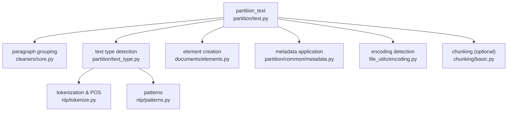
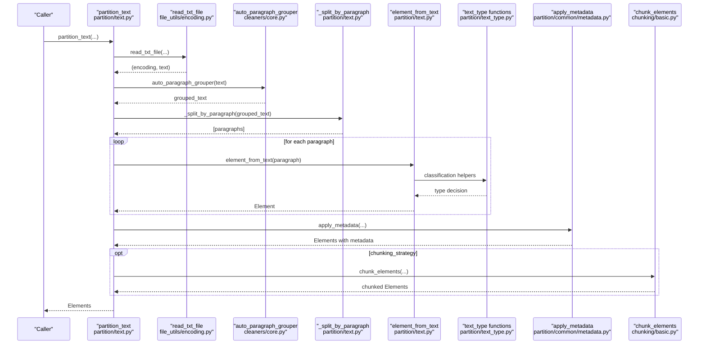
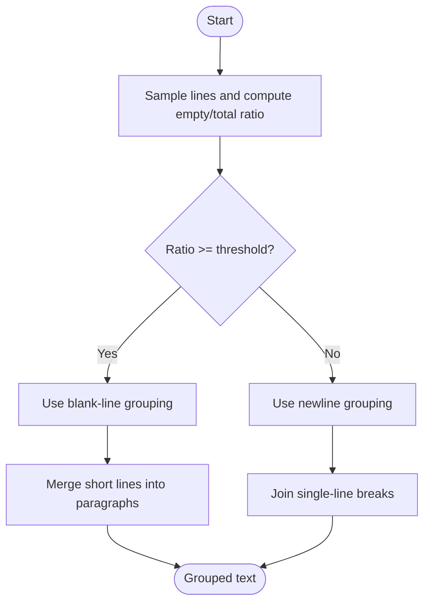
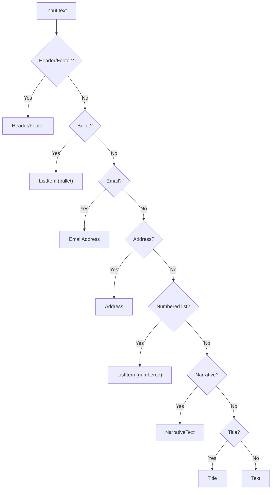
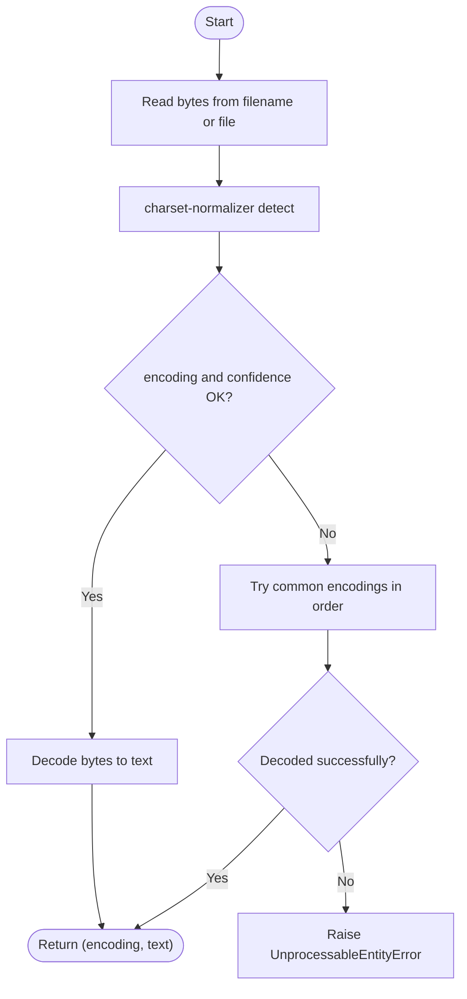
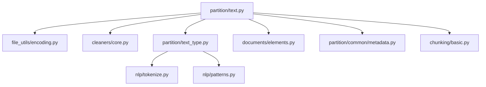

# Text Processing

<cite>
**Referenced Files in This Document**
- [text.py](file://unstructured/partition/text.py)
- [text_type.py](file://unstructured/partition/text_type.py)
- [encoding.py](file://unstructured/file_utils/encoding.py)
- [patterns.py](file://unstructured/nlp/patterns.py)
- [core.py](file://unstructured/cleaners/core.py)
- [tokenize.py](file://unstructured/nlp/tokenize.py)
- [elements.py](file://unstructured/documents/elements.py)
- [metadata.py](file://unstructured/partition/common/metadata.py)
- [basic.py](file://unstructured/chunking/basic.py)
- [fake-text.txt](file://example-docs/fake-text.txt)
- [UDHR_first_article_all.txt](file://example-docs/language-docs/UDHR_first_article_all.txt)
- [test_text.py](file://test_unstructured/partition/test_text.py)
- [test_encoding.py](file://test_unstructured/file_utils/test_encoding.py)
</cite>

## Table of Contents
1. [Introduction](#introduction)
2. [Project Structure](#project-structure)
3. [Core Components](#core-components)
4. [Architecture Overview](#architecture-overview)
5. [Detailed Component Analysis](#detailed-component-analysis)
6. [Dependency Analysis](#dependency-analysis)
7. [Performance Considerations](#performance-considerations)
8. [Troubleshooting Guide](#troubleshooting-guide)
9. [Conclusion](#conclusion)
10. [Appendices](#appendices)

## Introduction
This document explains how the library processes plain text files, classifying text elements into categories such as Title, NarrativeText, ListItem, Address, EmailAddress, Header, and Footer. It covers:
- Paragraph splitting and grouping algorithms
- Text type detection logic
- Encoding detection and handling
- Metadata extraction for plain text files
- Examples for processing files with different structures and mixed languages
- Edge cases such as incorrect paragraph breaks, encoding problems, and preserving original formatting
- Optimization tips for large text files

## Project Structure
The text processing pipeline centers around the text partitioner, text type classifiers, paragraph grouping utilities, encoding detection, and metadata application. The following diagram shows the main modules involved in text processing.

**Diagram sources**
- [text.py](file://unstructured/partition/text.py#L40-L108)
- [core.py](file://unstructured/cleaners/core.py#L137-L185)
- [text_type.py](file://unstructured/partition/text_type.py#L27-L163)
- [tokenize.py](file://unstructured/nlp/tokenize.py#L50-L72)
- [patterns.py](file://unstructured/nlp/patterns.py#L70-L90)
- [elements.py](file://unstructured/documents/elements.py#L600-L760)
- [metadata.py](file://unstructured/partition/common/metadata.py#L119-L244)
- [encoding.py](file://unstructured/file_utils/encoding.py#L62-L116)
- [basic.py](file://unstructured/chunking/basic.py#L24-L92)

**Section sources**
- [text.py](file://unstructured/partition/text.py#L40-L108)
- [core.py](file://unstructured/cleaners/core.py#L137-L185)
- [text_type.py](file://unstructured/partition/text_type.py#L27-L163)
- [elements.py](file://unstructured/documents/elements.py#L600-L760)
- [metadata.py](file://unstructured/partition/common/metadata.py#L119-L244)
- [encoding.py](file://unstructured/file_utils/encoding.py#L62-L116)
- [basic.py](file://unstructured/chunking/basic.py#L24-L92)

## Core Components
- Partitioner for plain text: reads text from filename, file-like object, or string; detects encoding; groups paragraphs; classifies text into element types; attaches metadata; optionally chunks.
- Text type classifiers: determine whether a segment is Title, NarrativeText, ListItem, Address, EmailAddress, Header, Footer, or generic Text.
- Paragraph grouping utilities: merge broken lines into coherent paragraphs and normalize spacing.
- Encoding detection: robust detection with fallbacks and safe error handling.
- Metadata application: attach filename, last-modified, filetype, URL, language, and hierarchy.
- Chunking: optional post-processing to split elements into fixed-size chunks.

**Section sources**
- [text.py](file://unstructured/partition/text.py#L40-L108)
- [text_type.py](file://unstructured/partition/text_type.py#L27-L163)
- [core.py](file://unstructured/cleaners/core.py#L137-L185)
- [encoding.py](file://unstructured/file_utils/encoding.py#L62-L116)
- [metadata.py](file://unstructured/partition/common/metadata.py#L119-L244)
- [basic.py](file://unstructured/chunking/basic.py#L24-L92)

## Architecture Overview
The text partitioning flow is:

**Diagram sources**
- [text.py](file://unstructured/partition/text.py#L40-L108)
- [encoding.py](file://unstructured/file_utils/encoding.py#L118-L151)
- [core.py](file://unstructured/cleaners/core.py#L234-L266)
- [text_type.py](file://unstructured/partition/text_type.py#L27-L163)
- [metadata.py](file://unstructured/partition/common/metadata.py#L119-L244)
- [basic.py](file://unstructured/chunking/basic.py#L24-L92)

## Detailed Component Analysis

### Text Partitioner (partition_text)
Responsibilities:
- Accepts filename, file-like object, or raw text string
- Validates exactly one input source
- Reads and decodes text with explicit encoding or automatic detection
- Applies paragraph grouping (auto or custom)
- Splits into paragraphs using a regex pattern
- Classifies each paragraph into an Element subtype
- Attaches metadata (filename, last_modified, filetype, detection_origin)
- Optionally applies chunking strategy

Key behaviors:
- Paragraph grouping uses a heuristic that chooses between newline-based and blank-line-based grouping based on line density.
- Paragraph splitting uses a newline pattern that preserves bullet points and blank lines appropriately.
- Element classification considers header/footer positions, bullets, email addresses, US city/state/zip, numbered lists, narrative text, and titles.

**Section sources**
- [text.py](file://unstructured/partition/text.py#L40-L108)
- [text.py](file://unstructured/partition/text.py#L111-L167)
- [text.py](file://unstructured/partition/text.py#L214-L217)

### Paragraph Grouping and Splitting
- Auto paragraph grouper: counts empty lines vs. total lines in a sample; if the ratio of empty lines is above a threshold, uses blank-line grouping; otherwise uses newline grouping.
- Blank-line grouping: splits on double newlines and merges short lines into coherent segments.
- Newline grouping: preserves single-line breaks and reconstructs paragraphs.
- Splitting: uses a paragraph pattern that accounts for bullets and blank lines.

**Diagram sources**
- [core.py](file://unstructured/cleaners/core.py#L234-L266)
- [core.py](file://unstructured/cleaners/core.py#L137-L185)
- [patterns.py](file://unstructured/nlp/patterns.py#L70-L90)

**Section sources**
- [core.py](file://unstructured/cleaners/core.py#L137-L185)
- [core.py](file://unstructured/cleaners/core.py#L234-L266)
- [patterns.py](file://unstructured/nlp/patterns.py#L70-L90)

### Text Type Classification
Classification logic:
- Header/Footer detection: uses vertical position thresholds relative to coordinate system height.
- Bulleted lists: matches unicode bullet patterns and strips bullets.
- Numbered lists: matches numeric/alphanumeric enumeration patterns.
- Addresses: matches US city/state/zip patterns.
- Email addresses: matches email patterns.
- Titles: checks word count, punctuation, non-alphabetic ratio, sentence count, and language checks.
- Narrative text: checks capitalization ratio, non-alphabetic ratio, sentence count, presence of verbs, and language checks.

**Diagram sources**
- [text.py](file://unstructured/partition/text.py#L111-L167)
- [text_type.py](file://unstructured/partition/text_type.py#L27-L163)
- [patterns.py](file://unstructured/nlp/patterns.py#L36-L64)
- [patterns.py](file://unstructured/nlp/patterns.py#L147-L150)

**Section sources**
- [text.py](file://unstructured/partition/text.py#L111-L167)
- [text_type.py](file://unstructured/partition/text_type.py#L27-L163)

### Encoding Detection and Handling
- Uses charset-normalizer to detect encoding and confidence.
- Falls back to a curated list of common encodings if detection confidence is low or fails.
- Validates encoding strings and formats them consistently.
- Raises a safe error type for encoding failures to avoid logging large content.

**Diagram sources**
- [encoding.py](file://unstructured/file_utils/encoding.py#L62-L116)
- [encoding.py](file://unstructured/file_utils/encoding.py#L118-L151)

**Section sources**
- [encoding.py](file://unstructured/file_utils/encoding.py#L62-L116)
- [encoding.py](file://unstructured/file_utils/encoding.py#L118-L151)
- [test_encoding.py](file://test_unstructured/file_utils/test_encoding.py#L1-L72)

### Metadata Extraction for Plain Text
- Last modified timestamp is attached when a filename is provided.
- Filetype is set to text/plain by default and can be overridden.
- Filename and directory are parsed and attached; metadata_filename overrides filename.
- Languages are detected per element or globally; language checks can be toggled.
- Parent-child hierarchy is computed based on element categories and depths.

**Section sources**
- [metadata.py](file://unstructured/partition/common/metadata.py#L21-L34)
- [metadata.py](file://unstructured/partition/common/metadata.py#L119-L244)
- [text.py](file://unstructured/partition/text.py#L90-L108)

### Examples and Edge Cases

- Basic processing of a plain text file:
  - Use partition_text with a filename or file-like object. The function reads the file, detects encoding, groups paragraphs, classifies elements, and attaches metadata.
  - Example file: [fake-text.txt](file://example-docs/fake-text.txt#L1-L10)

- Mixed-language documents:
  - The partitioner supports mixed languages and can detect languages per element or globally. Tests demonstrate multi-language detection and language overrides.
  - Example file: [UDHR_first_article_all.txt](file://example-docs/language-docs/UDHR_first_article_all.txt#L1-L200)

- Incorrect paragraph breaks:
  - Use paragraph_grouper to merge broken lines. The default auto_paragraph_grouper chooses grouping strategy based on line density.

- Encoding problems:
  - If an explicit encoding is wrong, the function raises a decoding error. If no encoding is provided, charset-normalizer attempts detection with fallbacks.

- Preserving original formatting:
  - The partitioner preserves bullet points and addresses as typed. Extra whitespace and punctuation can be normalized via cleaners if desired.

- Chunking large outputs:
  - After partitioning, apply chunk_elements to split elements into fixed-size chunks with optional overlap.

**Section sources**
- [test_text.py](file://test_unstructured/partition/test_text.py#L1-L120)
- [test_text.py](file://test_unstructured/partition/test_text.py#L222-L239)
- [test_text.py](file://test_unstructured/partition/test_text.py#L371-L447)
- [UDHR_first_article_all.txt](file://example-docs/language-docs/UDHR_first_article_all.txt#L1-L200)

## Dependency Analysis
The following diagram shows key dependencies among modules involved in text processing.

**Diagram sources**
- [text.py](file://unstructured/partition/text.py#L40-L108)
- [encoding.py](file://unstructured/file_utils/encoding.py#L62-L116)
- [core.py](file://unstructured/cleaners/core.py#L137-L185)
- [text_type.py](file://unstructured/partition/text_type.py#L27-L163)
- [tokenize.py](file://unstructured/nlp/tokenize.py#L50-L72)
- [patterns.py](file://unstructured/nlp/patterns.py#L70-L90)
- [elements.py](file://unstructured/documents/elements.py#L600-L760)
- [metadata.py](file://unstructured/partition/common/metadata.py#L119-L244)
- [basic.py](file://unstructured/chunking/basic.py#L24-L92)

**Section sources**
- [text.py](file://unstructured/partition/text.py#L40-L108)
- [text_type.py](file://unstructured/partition/text_type.py#L27-L163)
- [core.py](file://unstructured/cleaners/core.py#L137-L185)
- [encoding.py](file://unstructured/file_utils/encoding.py#L62-L116)
- [elements.py](file://unstructured/documents/elements.py#L600-L760)
- [metadata.py](file://unstructured/partition/common/metadata.py#L119-L244)
- [basic.py](file://unstructured/chunking/basic.py#L24-L92)

## Performance Considerations
- Tokenization and POS tagging are cached to reduce overhead.
- Paragraph grouping uses a bounded sample to compute ratios, avoiding scanning entire large files unnecessarily.
- Chunking strategies can combine small pre-chunks and split oversized elements to fit window sizes efficiently.
- For very large files, consider:
  - Using chunking to process in fixed-size windows
  - Disabling expensive language checks if not needed
  - Providing an explicit encoding to bypass detection
  - Streaming reads when possible (file-like objects)

[No sources needed since this section provides general guidance]

## Troubleshooting Guide
Common issues and resolutions:
- Incorrect paragraph breaks:
  - Provide a custom paragraph_grouper or rely on auto_paragraph_grouper.
  - Use group_broken_paragraphs to merge short lines into coherent paragraphs.

- Encoding problems:
  - Explicitly set encoding if the file uses a non-UTF-8 encoding.
  - If detection fails, the system tries common encodings and raises a safe error if all fail.

- Mixed languages:
  - Enable detect_language_per_element to get per-element language detection.
  - Override languages via the languages parameter.

- Large files:
  - Use chunking to split outputs into manageable chunks.
  - Disable language checks or reduce granularity for speed.

**Section sources**
- [test_text.py](file://test_unstructured/partition/test_text.py#L222-L239)
- [test_encoding.py](file://test_unstructured/file_utils/test_encoding.py#L1-L72)
- [text_type.py](file://unstructured/partition/text_type.py#L27-L163)
- [basic.py](file://unstructured/chunking/basic.py#L24-L92)

## Conclusion
The text processing pipeline provides robust classification of plain text into semantic elements, reliable paragraph grouping, and safe encoding detection. With optional chunking and metadata enrichment, it supports diverse document structures and mixed-language scenarios. For large-scale processing, leverage chunking, caching, and explicit encoding hints to optimize performance.

[No sources needed since this section summarizes without analyzing specific files]

## Appendices

### API Summary: partition_text
- Inputs:
  - filename: path to a file
  - file: file-like object (bytes)
  - text: raw string
  - encoding: optional encoding hint
  - paragraph_grouper: callable or False/None
  - detection_origin: metadata marker
  - chunking_strategy: optional strategy name
- Outputs: list of Element objects with metadata

Behavior highlights:
- Exactly one of filename/file/text must be provided
- Automatic encoding detection with fallbacks
- Paragraph grouping and splitting
- Element classification and metadata attachment
- Optional chunking

**Section sources**
- [text.py](file://unstructured/partition/text.py#L40-L108)
- [encoding.py](file://unstructured/file_utils/encoding.py#L118-L151)
- [core.py](file://unstructured/cleaners/core.py#L234-L266)
- [text_type.py](file://unstructured/partition/text_type.py#L27-L163)
- [metadata.py](file://unstructured/partition/common/metadata.py#L119-L244)
- [basic.py](file://unstructured/chunking/basic.py#L24-L92)