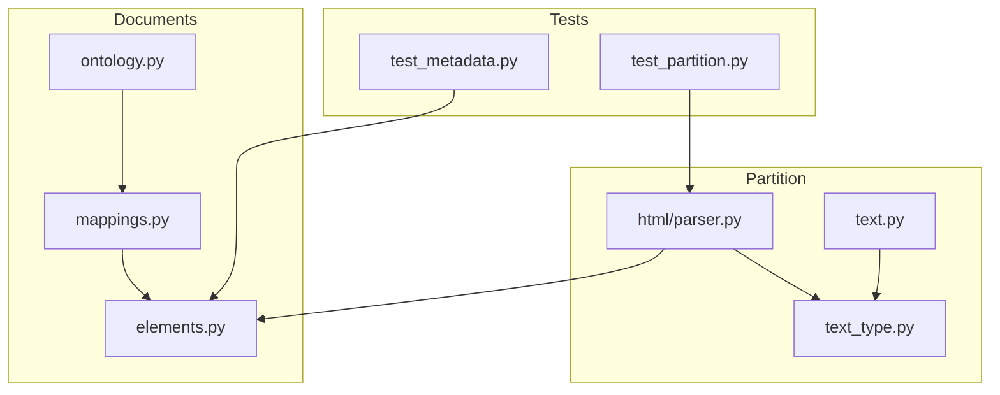
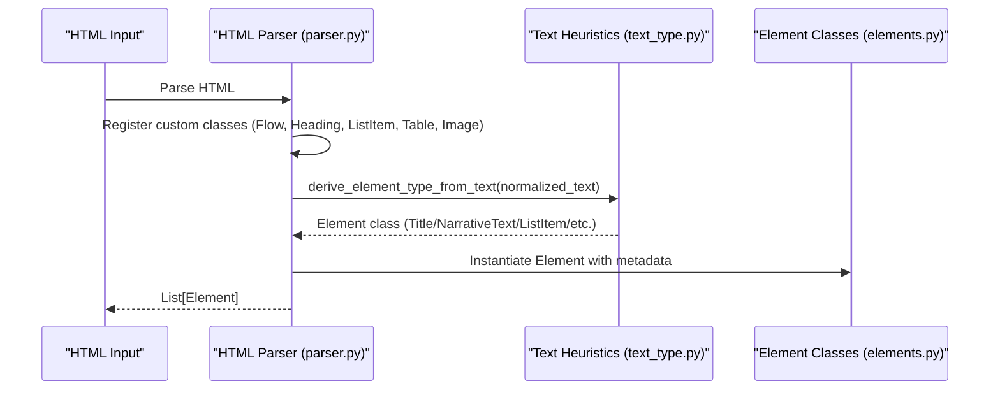
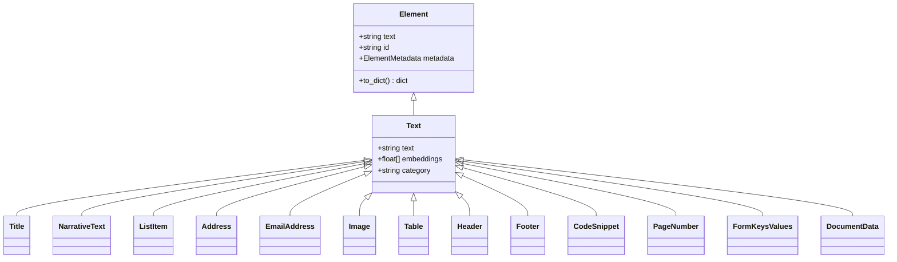
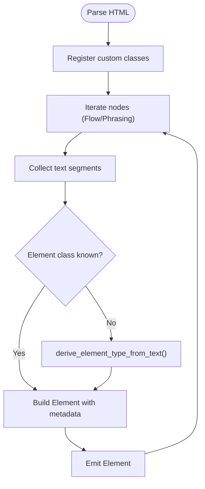
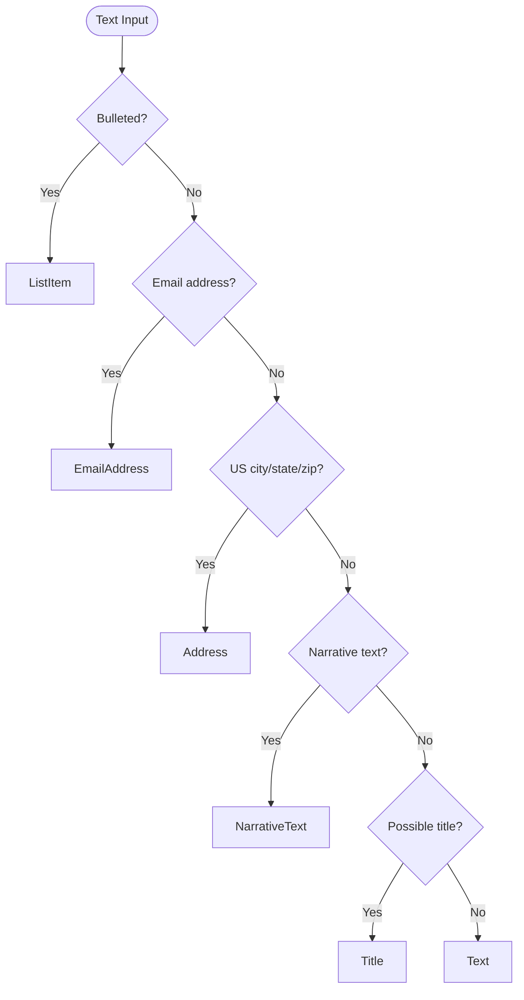
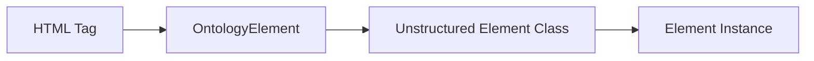
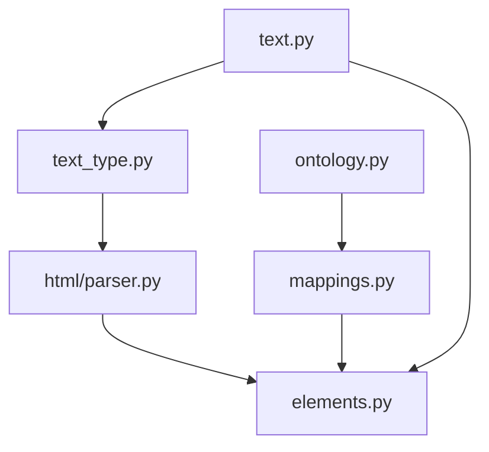

# Element Types and Classification

<cite>
**Referenced Files in This Document**
- [elements.py](file://unstructured/documents/elements.py)
- [ontology.py](file://unstructured/documents/ontology.py)
- [mappings.py](file://unstructured/documents/mappings.py)
- [parser.py](file://unstructured/partition/html/parser.py)
- [text_type.py](file://unstructured/partition/text_type.py)
- [text.py](file://unstructured/partition/text.py)
- [test_partition.py](file://test_unstructured/partition/html/test_partition.py)
- [test_metadata.py](file://test_unstructured/partition/common/test_metadata.py)
</cite>

## Table of Contents
1. [Introduction](#introduction)
2. [Project Structure](#project-structure)
3. [Core Components](#core-components)
4. [Architecture Overview](#architecture-overview)
5. [Detailed Component Analysis](#detailed-component-analysis)
6. [Dependency Analysis](#dependency-analysis)
7. [Performance Considerations](#performance-considerations)
8. [Troubleshooting Guide](#troubleshooting-guide)
9. [Conclusion](#conclusion)

## Introduction
This document describes the data model for document element types and the classification logic used to identify and categorize elements during processing. It focuses on the hierarchy of element classes (Text, Title, ListItem, Table, Image, and structural elements), field definitions, data types, and relationships among element types. It also explains how elements are classified from raw text and HTML, including edge cases and guidance for handling ambiguous content, and discusses performance implications of element creation and storage.

## Project Structure
The element model and classification logic are implemented across several modules:
- Element definitions and categories: unstructured/documents/elements.py
- Ontology model and HTML-tag mapping: unstructured/documents/ontology.py and unstructured/documents/mappings.py
- HTML parsing and element derivation: unstructured/partition/html/parser.py
- Text classification heuristics: unstructured/partition/text_type.py
- Text partitioning and coordinate-based classification: unstructured/partition/text.py
- Tests validating element classification and parent-child relationships: test_unstructured/*/

**Diagram sources**
- [elements.py](file://unstructured/documents/elements.py#L600-L1067)
- [ontology.py](file://unstructured/documents/ontology.py#L1-L623)
- [mappings.py](file://unstructured/documents/mappings.py#L1-L196)
- [parser.py](file://unstructured/partition/html/parser.py#L1-L1015)
- [text_type.py](file://unstructured/partition/text_type.py#L1-L322)
- [text.py](file://unstructured/partition/text.py#L1-L217)
- [test_partition.py](file://test_unstructured/partition/html/test_partition.py#L1425-L1499)
- [test_metadata.py](file://test_unstructured/partition/common/test_metadata.py#L151-L173)

**Section sources**
- [elements.py](file://unstructured/documents/elements.py#L600-L1067)
- [ontology.py](file://unstructured/documents/ontology.py#L1-L623)
- [mappings.py](file://unstructured/documents/mappings.py#L1-L196)
- [parser.py](file://unstructured/partition/html/parser.py#L1-L1015)
- [text_type.py](file://unstructured/partition/text_type.py#L1-L322)
- [text.py](file://unstructured/partition/text.py#L1-L217)
- [test_partition.py](file://test_unstructured/partition/html/test_partition.py#L1425-L1499)
- [test_metadata.py](file://test_unstructured/partition/common/test_metadata.py#L151-L173)

## Core Components
- Element base class and metadata: Defines the Element abstraction, metadata fields, coordinate systems, and ID management.
- Text-derived element types: Title, NarrativeText, ListItem, Address, EmailAddress, Image, Table, Header, Footer, CodeSnippet, PageNumber, FormKeysValues, DocumentData, and specialized variants.
- HTML-to-ontology mapping: Bridges HTML tags to an intermediate OntologyElement model and maps to concrete Element classes.
- Classification logic: Heuristics for determining element types from text and HTML parsing rules.

Key responsibilities:
- Element: Base class with text, category, metadata, and ID handling.
- ElementMetadata: Rich metadata including coordinates, links, languages, page numbers, and parent relationships.
- ElementType: Enumerated categories used for mapping and classification.
- Text-derived classes: Specialized categories for text, lists, tables, images, headers, footers, and more.
- HTML parser: Converts HTML into Element instances using custom lxml classes and derives types from text and tags.
- Text classification: Uses linguistic and pattern-based heuristics to classify text segments.

**Section sources**
- [elements.py](file://unstructured/documents/elements.py#L600-L1067)
- [parser.py](file://unstructured/partition/html/parser.py#L1-L1015)
- [text_type.py](file://unstructured/partition/text_type.py#L1-L322)
- [text.py](file://unstructured/partition/text.py#L1-L217)

## Architecture Overview
The system converts raw document content into a structured set of Element instances. The flow depends on the input format:
- HTML: Parsed by a custom lxml pipeline that assigns Element classes based on tags and text heuristics.
- Plain text: Partitioned into paragraphs and classified using text heuristics and positional cues.

**Diagram sources**
- [parser.py](file://unstructured/partition/html/parser.py#L900-L1015)
- [text_type.py](file://unstructured/partition/text_type.py#L1-L322)
- [elements.py](file://unstructured/documents/elements.py#L600-L1067)

## Detailed Component Analysis

### Element Hierarchy and Categories
The element hierarchy centers around the Element base class and a set of Text-derived categories. The ElementType enum defines categories used for mapping and classification.

- Element: Base class with lazy ID generation, metadata, and conversion to dict.
- Text: Base for textual content; carries category and optional embeddings.
- Derived categories: Title, NarrativeText, ListItem, Address, EmailAddress, Image, Table, Header, Footer, CodeSnippet, PageNumber, FormKeysValues, DocumentData.

Relationships:
- All Text-derived classes inherit from Text and set a category string.
- ElementType enum values are mapped to concrete classes via TYPE_TO_TEXT_ELEMENT_MAP.

**Diagram sources**
- [elements.py](file://unstructured/documents/elements.py#L600-L1067)

**Section sources**
- [elements.py](file://unstructured/documents/elements.py#L600-L1067)

### Element Fields and Data Types
ElementMetadata fields include:
- Coordinates: Points and coordinate system; validated as a pair or both absent.
- Links: Lists of link dictionaries with text, URL, and start index.
- Languages: List of detected languages.
- Page number and page name.
- Parent ID for hierarchical relationships.
- Data source metadata (URL, timestamps, permissions).
- Key-value pairs for form extraction.
- Flags for detection origin and chunking behavior.

Serialization:
- to_dict() excludes debug fields and serializes subobjects (coordinates, data_source).
- from_dict() reconstructs subobjects and handles base64-encoded orig_elements.

**Section sources**
- [elements.py](file://unstructured/documents/elements.py#L149-L418)

### HTML Parsing and Element Derivation
The HTML parser registers custom lxml classes for block and phrasing elements. It:
- Normalizes whitespace and consolidates text segments.
- Derives element classes from text heuristics when tags do not imply a specific class.
- Emits elements with metadata including emphasized text tags and link URLs.

Key behaviors:
- Heading tags (h1–h6) produce Title elements with category depth based on tag level.
- List tags (ul, ol, li) produce ListItem elements; bullets are stripped and normalized.
- Table tags produce Table elements; empty tables are skipped.
- Image tags produce Image elements with MIME type, base64 data, or URL.
- Removed elements (e.g., nav, hr, form) are skipped.

**Diagram sources**
- [parser.py](file://unstructured/partition/html/parser.py#L338-L544)
- [parser.py](file://unstructured/partition/html/parser.py#L900-L918)

**Section sources**
- [parser.py](file://unstructured/partition/html/parser.py#L1-L1015)

### Text Classification Heuristics
Text classification uses linguistic and pattern-based checks:
- Bullet detection: Unicode bullet markers indicate ListItem.
- Email address detection: Regex-based pattern matching.
- US city/state/zip detection: Pattern-based matcher.
- Narrative text: Checks sentence count, verb presence, alpha ratios, and capitalization thresholds.
- Title: Word count limits, non-alpha thresholds, and sentence count constraints.

Positional classification for plain text:
- Header/footer detection based on vertical position within the page coordinate system.

**Diagram sources**
- [text_type.py](file://unstructured/partition/text_type.py#L1-L322)
- [text.py](file://unstructured/partition/text.py#L111-L167)

**Section sources**
- [text_type.py](file://unstructured/partition/text_type.py#L1-L322)
- [text.py](file://unstructured/partition/text.py#L1-L217)

### Ontology Mapping and HTML Tag Classification
The OntologyElement model defines semantic categories and allowed HTML tags. The mapping module:
- Maps HTML tags to OntologyElement classes.
- Maps OntologyElement classes to concrete Element classes.
- Provides CSS class and tag-to-element mappings for conversion and validation.

**Diagram sources**
- [ontology.py](file://unstructured/documents/ontology.py#L1-L623)
- [mappings.py](file://unstructured/documents/mappings.py#L1-L196)

**Section sources**
- [ontology.py](file://unstructured/documents/ontology.py#L1-L623)
- [mappings.py](file://unstructured/documents/mappings.py#L1-L196)

### Examples of Document Structures and Element Types
- Headings: h1–h6 → Title with category depth reflecting nesting level.
- Lists: ul/ol/li → ListItem; bullets stripped and normalized.
- Tables: table/thead/tbody/tr/th/td → Table; empty tables skipped.
- Images: img → Image with MIME type and base64 or URL metadata.
- Paragraphs: p → derived via text heuristics (NarrativeText or Text).
- Links: a → annotated with link texts and URLs.

Validation examples:
- HTML tests confirm that h1–h6 produce Title elements and that list bullets produce ListItem elements.
- Empty tables and whitespace-only content are handled gracefully.

**Section sources**
- [test_partition.py](file://test_unstructured/partition/html/test_partition.py#L424-L470)
- [test_partition.py](file://test_unstructured/partition/html/test_partition.py#L545-L584)
- [test_partition.py](file://test_unstructured/partition/html/test_partition.py#L692-L737)
- [test_partition.py](file://test_unstructured/partition/html/test_partition.py#L854-L890)
- [test_partition.py](file://test_unstructured/partition/html/test_partition.py#L1425-L1499)

### Edge Cases and Ambiguity Handling
Common edge cases:
- Empty or whitespace-only content: Skipped by the parser and text partitioner.
- Single-character bullets: Treated as ListItem only if text is a bullet; otherwise skipped.
- Nested block items inside phrasing: Handled by emitting separate elements for each block.
- Malformed HTML: Robust parsing with fallbacks; removed elements are ignored.
- Positional classification: Headers and footers are inferred from vertical position; ambiguous positions fall back to Text.

Guidance:
- Normalize whitespace and strip bullets before classification.
- Prefer explicit tag classes (h1–h6, li, table, img) for reliable classification.
- Use metadata fields (page_number, parent_id) to resolve hierarchical ambiguities.

**Section sources**
- [parser.py](file://unstructured/partition/html/parser.py#L338-L544)
- [text.py](file://unstructured/partition/text.py#L111-L167)
- [test_partition.py](file://test_unstructured/partition/html/test_partition.py#L1460-L1499)

## Dependency Analysis
The classification pipeline depends on:
- Text heuristics (text_type.py) for deriving element types from text.
- HTML parser (parser.py) for tag-based classification and text normalization.
- Element classes (elements.py) for concrete categories and metadata.
- Ontology and mappings (ontology.py, mappings.py) for HTML-to-ontology-to-element conversions.

**Diagram sources**
- [text_type.py](file://unstructured/partition/text_type.py#L1-L322)
- [parser.py](file://unstructured/partition/html/parser.py#L1-L1015)
- [elements.py](file://unstructured/documents/elements.py#L600-L1067)
- [ontology.py](file://unstructured/documents/ontology.py#L1-L623)
- [mappings.py](file://unstructured/documents/mappings.py#L1-L196)
- [text.py](file://unstructured/partition/text.py#L1-L217)

**Section sources**
- [text_type.py](file://unstructured/partition/text_type.py#L1-L322)
- [parser.py](file://unstructured/partition/html/parser.py#L1-L1015)
- [elements.py](file://unstructured/documents/elements.py#L600-L1067)
- [ontology.py](file://unstructured/documents/ontology.py#L1-L623)
- [mappings.py](file://unstructured/documents/mappings.py#L1-L196)
- [text.py](file://unstructured/partition/text.py#L1-L217)

## Performance Considerations
- Element creation cost:
  - Text normalization and classification involve regex and NLP checks; caching or memoization can reduce repeated computations.
  - Large documents with many tables or images incur higher processing time due to HTML traversal and metadata assembly.
- Storage:
  - ElementMetadata.to_dict() serializes subobjects and omits empty lists/dicts; consider enabling debug metadata only when needed.
  - Embeddings increase memory footprint; disable unless required.
- Chunking:
  - Composite elements are formed by merging sequential elements; ensure chunk sizes balance accuracy and performance.
- Coordinate system conversions:
  - Converting coordinates between systems is linear in the number of points; minimize repeated conversions.

[No sources needed since this section provides general guidance]

## Troubleshooting Guide
Common issues and resolutions:
- Unexpected element types:
  - Verify text heuristics thresholds (capitalization, alpha ratios) and adjust environment variables controlling classification.
  - Inspect HTML tags and ensure they are recognized by the parser.
- Missing parent-child relationships:
  - Confirm metadata.parent_id is set correctly; tests demonstrate expected parent-child ordering for titles and list items.
- Empty or malformed HTML:
  - Empty content yields no elements; malformed HTML is handled by the parser’s robustness.
- Positional misclassification:
  - Adjust header/footer thresholds or provide explicit tags for headers/footers.

**Section sources**
- [test_metadata.py](file://test_unstructured/partition/common/test_metadata.py#L151-L173)
- [test_partition.py](file://test_unstructured/partition/html/test_partition.py#L1425-L1499)

## Conclusion
The element model provides a robust, extensible foundation for representing document content across formats. Classification relies on a combination of HTML tag semantics, text heuristics, and positional cues. The design emphasizes clear categories, rich metadata, and test-driven validation. By tuning heuristics and leveraging the provided mappings, developers can achieve accurate and performant element extraction tailored to diverse document types.