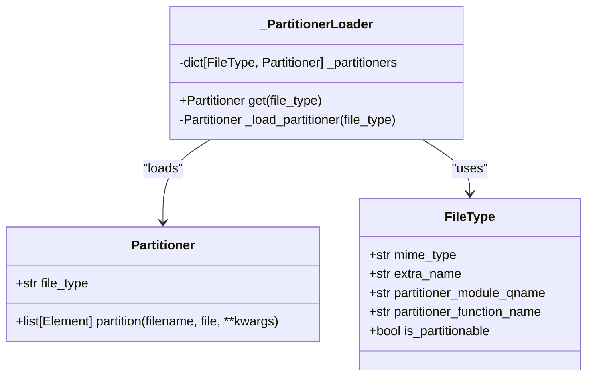
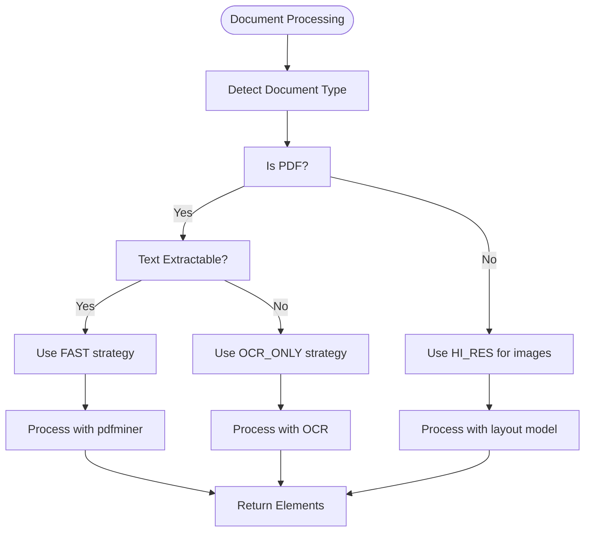
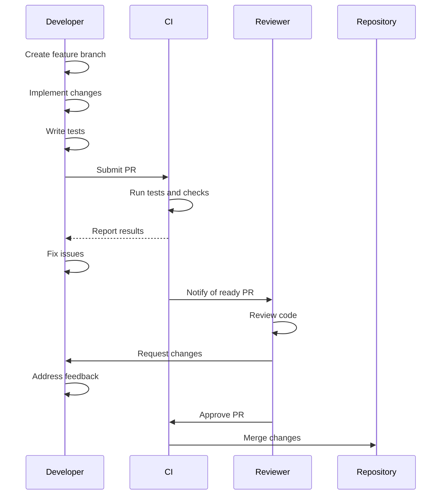
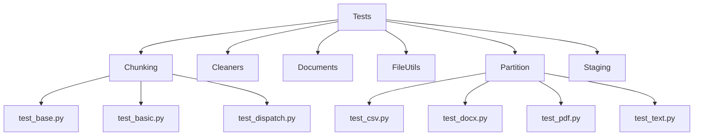

# Extending unstructured

<cite>
**Referenced Files in This Document**   
- [partition/auto.py](file://unstructured/partition/auto.py)
- [partition/strategies.py](file://unstructured/partition/strategies.py)
- [partition/utils/config.py](file://unstructured/partition/utils/config.py)
- [partition/utils/constants.py](file://unstructured/partition/utils/constants.py)
- [file_utils/filetype.py](file://unstructured/file_utils/filetype.py)
- [documents/elements.py](file://unstructured/documents/elements.py)
- [partition/pdf.py](file://unstructured/partition/pdf.py)
- [partition/text.py](file://unstructured/partition/text.py)
- [CHANGELOG.md](file://CHANGELOG.md)
- [CONTRIBUTING.md](file://CONTRIBUTING.md)
- [README.md](file://README.md)
</cite>

## Table of Contents
1. [Introduction](#introduction)
2. [Plugin System and Custom Partitioner Development](#plugin-system-and-custom-partitioner-development)
3. [Configuration System](#configuration-system)
4. [Extending Functionality Examples](#extending-functionality-examples)
5. [Contribution Guidelines and Code Review Process](#contribution-guidelines-and-code-review-process)
6. [Testing Requirements](#testing-requirements)
7. [Maintaining Backward Compatibility](#maintaining-backward-compatibility)
8. [Release Process and Versioning Strategy](#release-process-and-versioning-strategy)
9. [Conclusion](#conclusion)

## Introduction

The `unstructured` library provides open-source components for ingesting and pre-processing unstructured data such as images and text documents. This document details how to extend the library's functionality through plugins, custom partitioners, and configuration options. The extension points allow developers to add new element types, processing strategies, and document formats while maintaining compatibility with the existing ecosystem.

**Section sources**
- [README.md](file://README.md#L36-L40)

## Plugin System and Custom Partitioner Development

The `unstructured` library supports a plugin system that allows developers to extend its document processing capabilities. The core of this system is the `partition` function, which automatically detects file types and routes them to appropriate partitioning functions.

### Dynamic Partitioner Registration

Developers can register custom partitioners for new or existing file types using the `register_partitioner` function. This allows the library to handle new document formats without modifying core code. The partitioner registration system was introduced in version 0.16.24 and enables dynamic file type handling.



**Diagram sources**
- [partition/auto.py](file://unstructured/partition/auto.py#L333-L384)
- [file_utils/filetype.py](file://unstructured/file_utils/filetype.py)

### Custom Partitioner Implementation

To create a custom partitioner, developers must implement a function that returns a list of `Element` objects. The partitioner should follow the same interface as existing partitioners, accepting parameters like `filename`, `file`, and keyword arguments for configuration.

The partitioning process involves several key components:
- File type detection using libmagic and extension-based fallback
- Content extraction and element creation
- Metadata assignment and post-processing
- Element sorting and organization

Custom partitioners can be registered for both new file types and existing ones to override default behavior. This allows for specialized processing of common formats like PDF, HTML, or text documents.

**Section sources**
- [partition/auto.py](file://unstructured/partition/auto.py#L30-L293)
- [file_utils/filetype.py](file://unstructured/file_utils/filetype.py#L153-L760)

## Configuration System

The `unstructured` library provides a comprehensive configuration system that allows users to customize processing behavior through environment variables and function parameters.

### Environment-Based Configuration

Configuration options are managed through the `ENVConfig` class, which reads values from environment variables. This allows for runtime configuration without code changes. Key configuration parameters include:

```mermaid
erDiagram
CONFIG ||--o{ ENV_VAR : "maps to"
CONFIG {
string name
string description
string default_value
string type
}
ENV_VAR {
string name
string value
string source
}
CONFIG ||--o{ "OCR Configuration" : contains
CONFIG ||--o{ "Image Processing" : contains
CONFIG ||--o{ "PDF Processing" : contains
"OCR Configuration" }|-- ENV_VAR : "TESSERACT_MIN_TEXT_HEIGHT"
"OCR Configuration" }|-- ENV_VAR : "TESSERACT_MAX_TEXT_HEIGHT"
"OCR Configuration" }|-- ENV_VAR : "OCR_AGENT"
"Image Processing" }|-- ENV_VAR : "IMAGE_CROP_PAD"
"Image Processing" }|-- ENV_VAR : "TABLE_IMAGE_CROP_PAD"
"PDF Processing" }|-- ENV_VAR : "PDF_ANNOTATION_THRESHOLD"
```

**Diagram sources**
- [partition/utils/config.py](file://unstructured/partition/utils/config.py#L25-L233)

### Strategy Configuration

The library supports multiple processing strategies that can be configured based on document type and requirements:

- **AUTO**: Automatically selects the most appropriate strategy
- **FAST**: Extracts text directly from PDFs without layout analysis
- **OCR_ONLY**: Uses OCR to extract text from images and non-extractable PDFs
- **HI_RES**: Uses a layout detection model for detailed element identification

The strategy selection is controlled by the `PartitionStrategy` enum and can be influenced by document characteristics and configuration settings.



**Diagram sources**
- [partition/strategies.py](file://unstructured/partition/strategies.py#L8-L110)
- [partition/pdf.py](file://unstructured/partition/pdf.py#L287-L327)

## Extending Functionality Examples

### Adding New Element Types

Developers can extend the library by adding new element types to the `ElementType` class. This involves defining a new constant and ensuring proper handling in processing pipelines.

```python
class ElementType:
    # ... existing types
    CUSTOM_ELEMENT = "CustomElement"
    SPECIAL_CONTENT = "SpecialContent"
```

When adding new element types, consider the following:
- Ensure the type name is descriptive and follows existing naming conventions
- Update documentation to include the new type
- Add appropriate processing logic in partitioners
- Consider how the type interacts with chunking and other post-processing steps

### Custom Processing Strategies

Custom processing strategies can be implemented by creating new partitioner functions that follow the standard interface. These can be registered dynamically using the plugin system.

For example, a custom strategy for processing scientific documents might include:
- Special handling of mathematical formulas
- Enhanced table structure detection
- Domain-specific element classification
- Custom metadata extraction

The strategy would be implemented as a partitioner function and registered for specific file types or content patterns.

**Section sources**
- [documents/elements.py](file://unstructured/documents/elements.py#L601-L660)
- [partition/strategies.py](file://unstructured/partition/strategies.py#L24-L84)

## Contribution Guidelines and Code Review Process

### Pull Request Workflow

Contributions to the `unstructured` library follow a structured process to ensure code quality and maintainability. The contribution workflow is documented in the `CONTRIBUTING.md` file and includes the following steps:

1. Fork the repository and create a feature branch
2. Implement changes following coding best practices
3. Write comprehensive tests for new functionality
4. Update documentation and changelog
5. Submit a pull request with a detailed description



**Diagram sources**
- [CONTRIBUTING.md](file://CONTRIBUTING.md#L18-L54)

### Code Review Checklist

The code review process follows a comprehensive checklist to ensure all contributions meet quality standards:

- [ ] All new classes, functions, and methods have docstrings
- [ ] Type hints are provided for all new functions and methods
- [ ] Associated tests are included for new functionality
- [ ] CHANGELOG.md and __version__.py are updated for core changes
- [ ] Dependencies are properly managed in .in files
- [ ] Tests pass locally with `make test`
- [ ] Code formatting and linting checks pass with `make check`

Pull request titles should follow conventional commit standards, and descriptions should provide sufficient detail for reviewers to understand the changes. For complex changes, include testing recommendations to help reviewers verify the implementation.

**Section sources**
- [CONTRIBUTING.md](file://CONTRIBUTING.md#L22-L54)

## Testing Requirements

### Test Coverage

All contributions must include comprehensive tests to ensure functionality and prevent regressions. The testing requirements include:

- Unit tests for all new functions and methods
- Integration tests for new features
- Edge case testing for robustness
- Performance testing for critical paths

The test suite is organized by functionality, with separate directories for different components:



**Diagram sources**
- [test_unstructured](file://test_unstructured)

### Testing Best Practices

When writing tests for the `unstructured` library, follow these best practices:

1. Use descriptive test names that clearly indicate what is being tested
2. Test one thing per test function
3. Use parameterized tests for multiple input variations
4. Include both positive and negative test cases
5. Mock external dependencies when appropriate
6. Ensure tests are deterministic and repeatable

The testing framework uses pytest with fixtures for common test setup. Test data is stored in the `example-docs` directory and should be representative of real-world documents.

**Section sources**
- [CONTRIBUTING.md](file://CONTRIBUTING.md#L37-L38)
- [test_unstructured](file://test_unstructured)

## Maintaining Backward Compatibility

### Versioning Strategy

The `unstructured` library follows semantic versioning to manage backward compatibility:

- **Major version**: Breaking changes to the API
- **Minor version**: New functionality in a backward-compatible manner
- **Patch version**: Backward-compatible bug fixes

When making changes that could affect backward compatibility, consider the following guidelines:

- Deprecate functionality before removing it
- Provide migration paths for deprecated features
- Maintain support for previous major versions for a reasonable period
- Document breaking changes clearly in the changelog

### Deprecation Process

The deprecation process for the `unstructured` library involves several steps:

1. Mark the functionality as deprecated with a warning
2. Document the deprecation and provide alternatives
3. Maintain the functionality for at least one major version
4. Remove the functionality in a subsequent major release

For example, the `pdf_infer_table_structure` parameter was deprecated in favor of `skip_infer_table_types`, with a warning message guiding users to the new parameter.


**Diagram sources**
- [CHANGELOG.md](file://CHANGELOG.md#L144-L147)
- [partition/auto.py](file://unstructured/partition/auto.py#L145-L148)

## Release Process and Versioning Strategy

### Release Cycle

The `unstructured` library follows a regular release cycle with version numbers following semantic versioning principles. The release process includes:

- Regular minor releases with new features and improvements
- Patch releases for critical bug fixes
- Major releases for breaking changes
- Pre-release versions for testing new functionality

The changelog documents all changes in each release, categorized as enhancements, features, and fixes. This provides transparency about what has changed and helps users understand the impact of upgrading.

### Version Management

Version management is handled through the `__version__.py` file and `CHANGELOG.md`. When making changes that affect the core code, both files should be updated:

- Increment the version number according to semantic versioning
- Add an entry to the changelog with a clear description of changes
- Categorize changes as enhancements, features, or fixes
- Include references to related issues or pull requests when applicable

The versioning strategy ensures that users can predict the impact of upgrades and plan accordingly. Major version changes indicate breaking changes, while minor and patch versions are backward compatible.

**Section sources**
- [CHANGELOG.md](file://CHANGELOG.md)
- [CONTRIBUTING.md](file://CONTRIBUTING.md#L28-L29)

## Conclusion

The `unstructured` library provides a flexible and extensible framework for processing unstructured data. Through its plugin system, configuration options, and well-defined extension points, developers can customize and enhance its functionality to meet specific requirements. By following the contribution guidelines, testing requirements, and backward compatibility practices, the community can ensure the library continues to evolve while maintaining stability and reliability.

The combination of automatic file type detection, multiple processing strategies, and comprehensive configuration options makes `unstructured` a powerful tool for document processing pipelines. Whether adding new element types, implementing custom partitioners, or configuring processing behavior, the extension mechanisms provide the flexibility needed for diverse use cases.