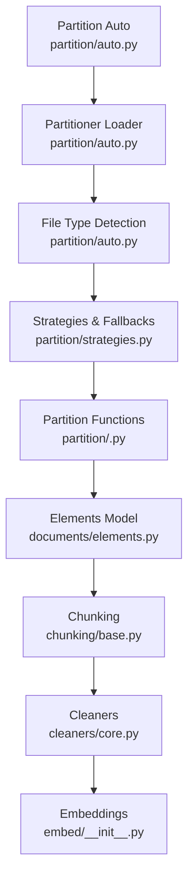
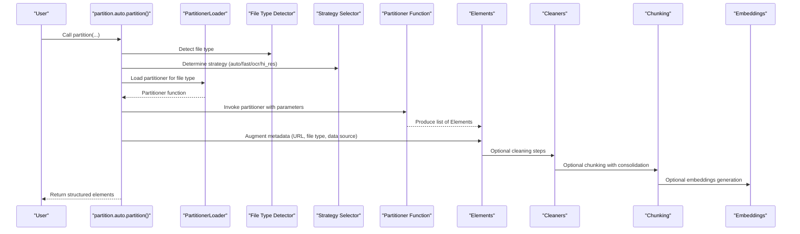
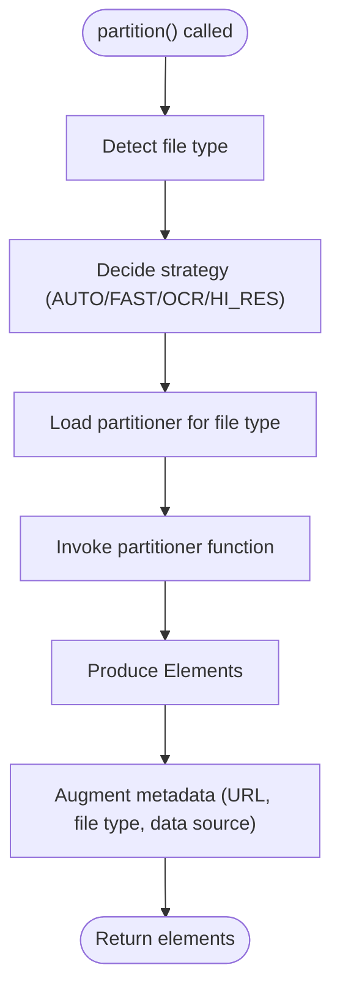
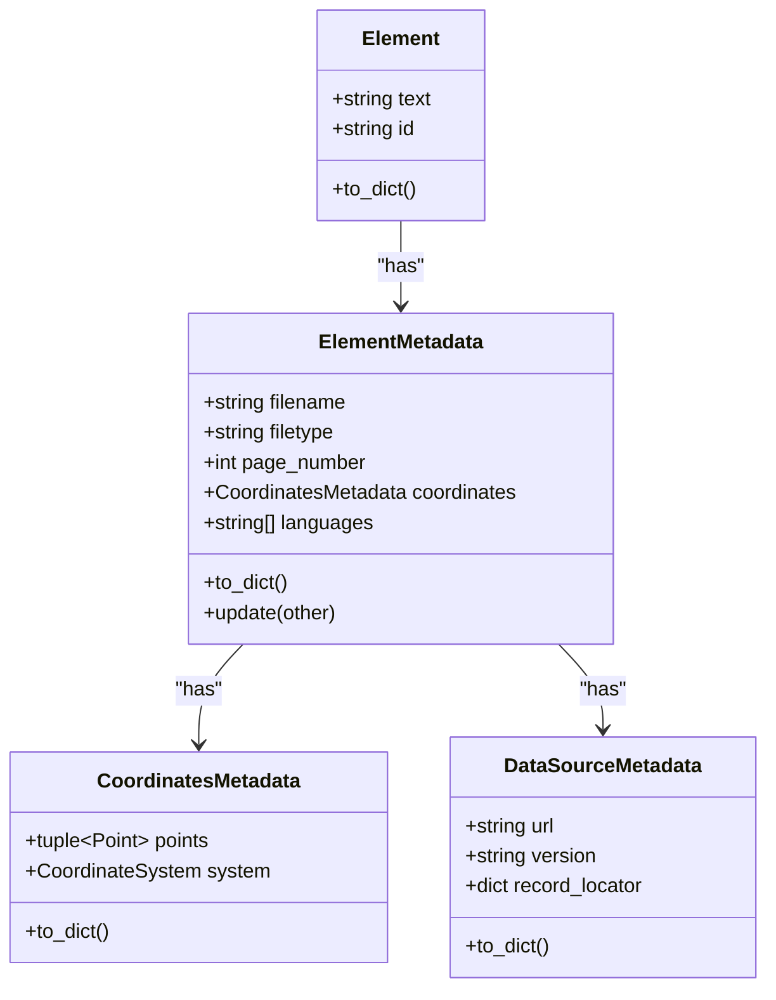
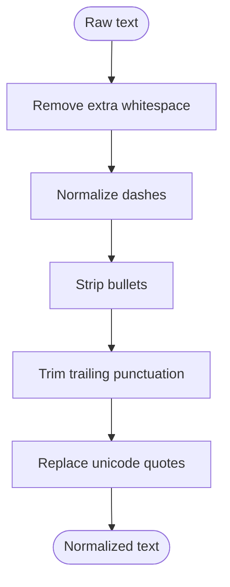
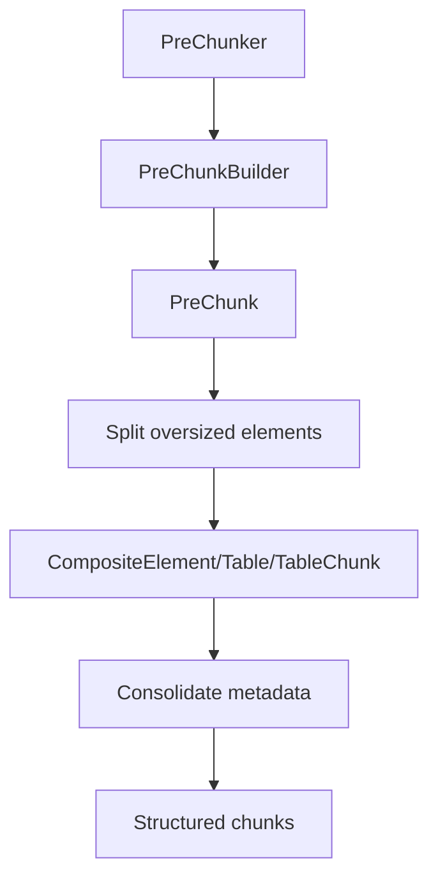
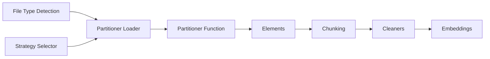

# Introduction

<cite>
**Referenced Files in This Document**
- [README.md](file://README.md)
- [unstructured/__init__.py](file://unstructured/__init__.py)
- [unstructured/partition/auto.py](file://unstructured/partition/auto.py)
- [unstructured/partition/strategies.py](file://unstructured/partition/strategies.py)
- [unstructured/partition/utils/constants.py](file://unstructured/partition/utils/constants.py)
- [unstructured/documents/elements.py](file://unstructured/documents/elements.py)
- [unstructured/cleaners/core.py](file://unstructured/cleaners/core.py)
- [unstructured/chunking/base.py](file://unstructured/chunking/base.py)
- [unstructured/documents/mappings.py](file://unstructured/documents/mappings.py)
- [unstructured/embed/__init__.py](file://unstructured/embed/__init__.py)
- [scripts/performance/README.md](file://scripts/performance/README.md)
- [example-docs/README.md](file://example-docs/README.md)
</cite>

## Table of Contents
1. [Introduction](#introduction)
2. [Project Structure](#project-structure)
3. [Core Components](#core-components)
4. [Architecture Overview](#architecture-overview)
5. [Detailed Component Analysis](#detailed-component-analysis)
6. [Dependency Analysis](#dependency-analysis)
7. [Performance Considerations](#performance-considerations)
8. [Troubleshooting Guide](#troubleshooting-guide)
9. [Conclusion](#conclusion)
10. [Appendices](#appendices)

## Introduction
The unstructured library is a Python framework designed to transform unstructured documents (PDFs, HTML, Word, Excel, images, emails, and more) into structured elements suitable for downstream AI/ML workflows. Its purpose is to streamline ingestion and preprocessing so that LLMs and embedding systems can reliably consume document content with minimal friction.

Key goals:
- Normalize heterogeneous document formats into a unified, typed element model.
- Provide robust strategies for partitioning, classification, and metadata enrichment.
- Offer a modular, extensible architecture that adapts to diverse file formats and processing needs.
- Enable practical use cases such as data preprocessing for AI/ML, content migration, and document analysis.

## Project Structure
At a high level, the library organizes functionality into cohesive modules:
- Partitioning: Detects file types and routes to specialized partitioners (PDF, image, text, HTML, etc.), with strategy selection and fallback logic.
- Elements: Defines the canonical element model and metadata schema used across the pipeline.
- Cleaning: Provides text normalization utilities to prepare raw text for downstream tasks.
- Chunking: Implements strategies to split elements into manageable chunks for embedding and retrieval.
- Embeddings: Integrates with external providers for vector embeddings.
- Utilities: Constants, strategies, and helpers for environment configuration and runtime decisions.

**Diagram sources**
- [unstructured/partition/auto.py](file://unstructured/partition/auto.py#L30-L294)
- [unstructured/partition/strategies.py](file://unstructured/partition/strategies.py#L1-L110)
- [unstructured/documents/elements.py](file://unstructured/documents/elements.py#L662-L761)
- [unstructured/chunking/base.py](file://unstructured/chunking/base.py#L1-L120)
- [unstructured/cleaners/core.py](file://unstructured/cleaners/core.py#L1-L120)
- [unstructured/embed/__init__.py](file://unstructured/embed/__init__.py#L1-L28)

**Section sources**
- [README.md](file://README.md#L36-L120)
- [unstructured/__init__.py](file://unstructured/__init__.py#L1-L5)

## Core Components
- Partitioning and Strategy Selection
  - Automatic routing based on detected file type.
  - Strategy selection for PDFs/images with fallback logic when dependencies are missing.
  - Augmentation of element metadata (URL, file type, data source).
- Elements and Metadata
  - Canonical Element base class with typed subclasses for text, tables, images, lists, and more.
  - Rich metadata model capturing coordinates, provenance, language, page info, and more.
- Cleaning
  - Utilities to normalize whitespace, bullets, quotes, punctuation, and MIME encodings.
- Chunking
  - Options to control chunk size, overlap, separators, and semantic boundaries.
  - Consolidation strategies for metadata across chunks.
- Embeddings
  - Provider integrations for generating embeddings from structured elements.

Practical example references:
- Basic partitioning via the auto entry point.
- Strategy selection and fallback behavior.
- Element creation and metadata augmentation.

**Section sources**
- [unstructured/partition/auto.py](file://unstructured/partition/auto.py#L30-L294)
- [unstructured/partition/strategies.py](file://unstructured/partition/strategies.py#L1-L110)
- [unstructured/documents/elements.py](file://unstructured/documents/elements.py#L662-L761)
- [unstructured/cleaners/core.py](file://unstructured/cleaners/core.py#L1-L120)
- [unstructured/chunking/base.py](file://unstructured/chunking/base.py#L54-L214)
- [unstructured/embed/__init__.py](file://unstructured/embed/__init__.py#L1-L28)

## Architecture Overview
The system follows a modular design with a strategy pattern for handling diverse file formats:
- Partitioner loader dynamically resolves the correct partitioner based on file type.
- Strategies determine whether to use fast extraction, OCR-only, or high-resolution layout analysis.
- Elements are produced consistently regardless of input format, enabling downstream processing.
- Cleaners and chunkers operate on the element stream to refine and segment content.
- Embeddings integrate to produce vectors for retrieval and RAG.

**Diagram sources**
- [unstructured/partition/auto.py](file://unstructured/partition/auto.py#L30-L294)
- [unstructured/partition/strategies.py](file://unstructured/partition/strategies.py#L1-L110)
- [unstructured/documents/elements.py](file://unstructured/documents/elements.py#L662-L761)
- [unstructured/cleaners/core.py](file://unstructured/cleaners/core.py#L1-L120)
- [unstructured/chunking/base.py](file://unstructured/chunking/base.py#L54-L214)
- [unstructured/embed/__init__.py](file://unstructured/embed/__init__.py#L1-L28)

## Detailed Component Analysis

### Partitioning and Strategy Pattern
- Automatic routing: The auto entry point detects file type and loads the appropriate partitioner, forwarding parameters like strategy, language, and OCR settings.
- Strategy selection: For PDFs and images, the system chooses among AUTO, FAST, OCR_ONLY, and HI_RES, with fallbacks when dependencies are unavailable.
- Metadata augmentation: Adds URL, content type, and data source metadata to each element.

**Diagram sources**
- [unstructured/partition/auto.py](file://unstructured/partition/auto.py#L30-L294)
- [unstructured/partition/strategies.py](file://unstructured/partition/strategies.py#L1-L110)

**Section sources**
- [unstructured/partition/auto.py](file://unstructured/partition/auto.py#L30-L294)
- [unstructured/partition/strategies.py](file://unstructured/partition/strategies.py#L1-L110)
- [unstructured/partition/utils/constants.py](file://unstructured/partition/utils/constants.py#L17-L22)

### Elements and Metadata Model
- Element base class defines a consistent interface for all content types, including text, tables, images, lists, and composite structures.
- ElementMetadata captures rich provenance and context (coordinates, page numbers, languages, links, etc.).
- Consolidation strategies define how metadata is aggregated across chunks.

**Diagram sources**
- [unstructured/documents/elements.py](file://unstructured/documents/elements.py#L150-L210)
- [unstructured/documents/elements.py](file://unstructured/documents/elements.py#L30-L120)
- [unstructured/documents/elements.py](file://unstructured/documents/elements.py#L662-L761)

**Section sources**
- [unstructured/documents/elements.py](file://unstructured/documents/elements.py#L150-L210)
- [unstructured/documents/elements.py](file://unstructured/documents/elements.py#L30-L120)
- [unstructured/documents/elements.py](file://unstructured/documents/elements.py#L662-L761)

### Cleaning Pipeline
- Normalization utilities address common issues: extra whitespace, bullets, quotes, punctuation, MIME encodings, and prefix/postfix patterns.
- Index adjustment helpers preserve alignment between cleaned text and original positions for downstream highlighting or offsets.

**Diagram sources**
- [unstructured/cleaners/core.py](file://unstructured/cleaners/core.py#L1-L120)
- [unstructured/cleaners/core.py](file://unstructured/cleaners/core.py#L326-L482)

**Section sources**
- [unstructured/cleaners/core.py](file://unstructured/cleaners/core.py#L1-L120)
- [unstructured/cleaners/core.py](file://unstructured/cleaners/core.py#L326-L482)

### Chunking and Consolidation
- ChunkingOptions controls chunk size, overlap, separators, and semantic boundaries.
- PreChunker groups elements into pre-chunks respecting boundaries and size limits.
- Consolidation strategies aggregate metadata across chunks for coherent downstream consumption.

**Diagram sources**
- [unstructured/chunking/base.py](file://unstructured/chunking/base.py#L54-L214)
- [unstructured/chunking/base.py](file://unstructured/chunking/base.py#L243-L371)
- [unstructured/chunking/base.py](file://unstructured/chunking/base.py#L429-L520)
- [unstructured/chunking/base.py](file://unstructured/chunking/base.py#L526-L688)

**Section sources**
- [unstructured/chunking/base.py](file://unstructured/chunking/base.py#L54-L214)
- [unstructured/chunking/base.py](file://unstructured/chunking/base.py#L243-L371)
- [unstructured/chunking/base.py](file://unstructured/chunking/base.py#L429-L520)
- [unstructured/chunking/base.py](file://unstructured/chunking/base.py#L526-L688)

### Embeddings Integration
- Provider mappings connect to external embedding services (OpenAI, HuggingFace, AWS Bedrock, etc.).
- Enables vectorization of structured elements for retrieval and RAG pipelines.

**Section sources**
- [unstructured/embed/__init__.py](file://unstructured/embed/__init__.py#L1-L28)

## Dependency Analysis
- Partitioner loader depends on file type detection and environment availability to resolve the correct partitioner.
- Strategy selection depends on installed OCR and inference libraries, with graceful fallbacks.
- Elements depend on metadata and coordinate systems for spatial and contextual information.
- Chunking depends on element metadata consolidation strategies and HTML/table rendering for synchronized text and structure.
- Embeddings depend on provider availability and credentials.

**Diagram sources**
- [unstructured/partition/auto.py](file://unstructured/partition/auto.py#L30-L294)
- [unstructured/partition/strategies.py](file://unstructured/partition/strategies.py#L1-L110)
- [unstructured/documents/elements.py](file://unstructured/documents/elements.py#L662-L761)
- [unstructured/chunking/base.py](file://unstructured/chunking/base.py#L54-L214)
- [unstructured/cleaners/core.py](file://unstructured/cleaners/core.py#L1-L120)
- [unstructured/embed/__init__.py](file://unstructured/embed/__init__.py#L1-L28)

**Section sources**
- [unstructured/partition/auto.py](file://unstructured/partition/auto.py#L30-L294)
- [unstructured/partition/strategies.py](file://unstructured/partition/strategies.py#L1-L110)
- [unstructured/documents/elements.py](file://unstructured/documents/elements.py#L662-L761)
- [unstructured/chunking/base.py](file://unstructured/chunking/base.py#L54-L214)
- [unstructured/cleaners/core.py](file://unstructured/cleaners/core.py#L1-L120)
- [unstructured/embed/__init__.py](file://unstructured/embed/__init__.py#L1-L28)

## Performance Considerations
- Strategy selection impacts performance and accuracy. Prefer FAST for text-extractable PDFs; use HI_RES for scanned or protected PDFs requiring OCR.
- Chunk size and overlap influence downstream latency and recall; tune ChunkingOptions for your workload.
- Cleaning and chunking add CPU overhead; batch processing and caching can improve throughput.
- Embedding generation is compute-intensive; consider batching and provider quotas.

Practical guidance:
- Use the performance scripts to benchmark and profile partitioning on representative documents.
- Monitor resource usage and adjust chunk sizes and strategies accordingly.

**Section sources**
- [scripts/performance/README.md](file://scripts/performance/README.md#L1-L46)
- [unstructured/partition/strategies.py](file://unstructured/partition/strategies.py#L1-L110)
- [unstructured/chunking/base.py](file://unstructured/chunking/base.py#L54-L214)

## Troubleshooting Guide
Common setup and runtime issues:
- Missing dependencies for specific file types: The partitioner loader raises clear ImportError messages indicating which extras to install.
- Unsupported file formats: UnsupportedFileFormatError is raised when a file type is not partitionable.
- Strategy fallbacks: When required libraries are missing, the system falls back to alternatives (e.g., OCR_ONLY to FAST, HI_RES to OCR_ONLY or FAST).
- Environment configuration: Some behaviors are controlled by environment variables (e.g., debug metadata toggles).

Initial setup tips:
- Install extras for the document types you need (e.g., docx, pptx, pdf-image).
- Ensure system dependencies are available (libmagic, poppler, tesseract, libreoffice, pandoc).
- Validate your environment using the provided scripts and example documents.

**Section sources**
- [unstructured/partition/auto.py](file://unstructured/partition/auto.py#L333-L384)
- [unstructured/partition/strategies.py](file://unstructured/partition/strategies.py#L1-L110)
- [unstructured/partition/utils/constants.py](file://unstructured/partition/utils/constants.py#L44-L44)
- [README.md](file://README.md#L105-L159)
- [example-docs/README.md](file://example-docs/README.md#L1-L24)

## Conclusion
The unstructured library provides a robust, modular foundation for converting unstructured documents into structured, enriched elements ready for LLM workflows. Its strategy-driven partitioning, rich element model, and integrated cleaning, chunking, and embedding capabilities make it adaptable to diverse use cases—from AI/ML data preparation to content migration and document analysis. By leveraging the documented components and troubleshooting guidance, teams can confidently scale document processing pipelines while maintaining quality and performance.

## Appendices

### Practical Examples
- Basic partitioning with automatic file-type detection and strategy selection.
- Strategy selection and fallback behavior for PDFs and images.
- Element creation and metadata augmentation.
- Cleaning and chunking workflows.

References:
- [README.md](file://README.md#L188-L235)
- [unstructured/partition/auto.py](file://unstructured/partition/auto.py#L30-L294)
- [unstructured/partition/strategies.py](file://unstructured/partition/strategies.py#L1-L110)
- [unstructured/cleaners/core.py](file://unstructured/cleaners/core.py#L1-L120)
- [unstructured/chunking/base.py](file://unstructured/chunking/base.py#L54-L214)