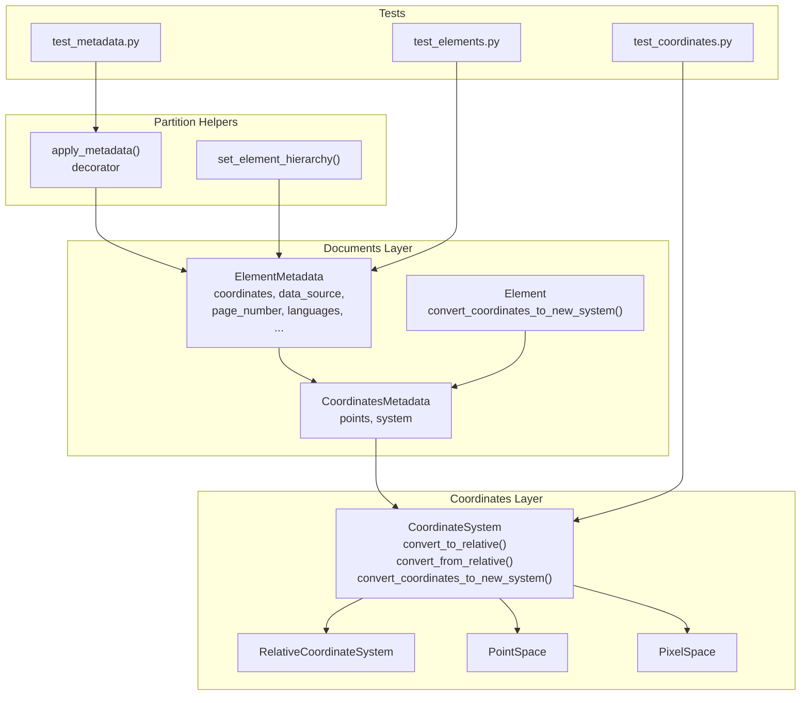
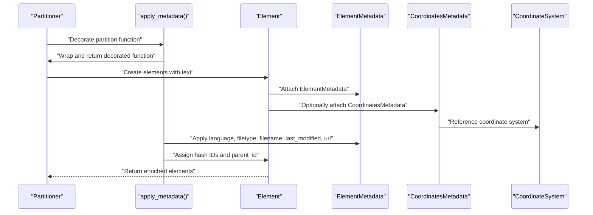
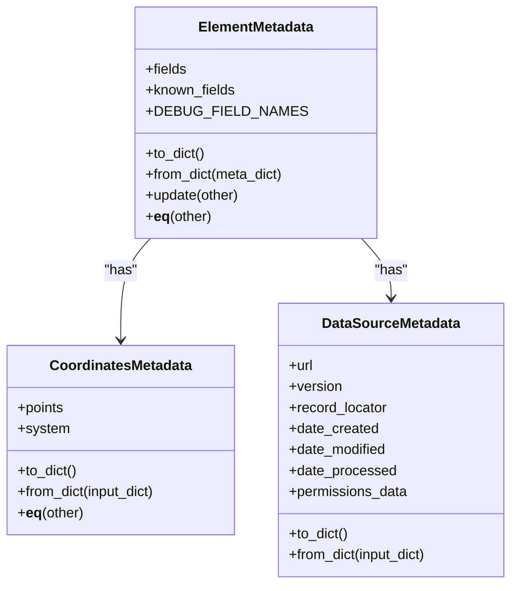
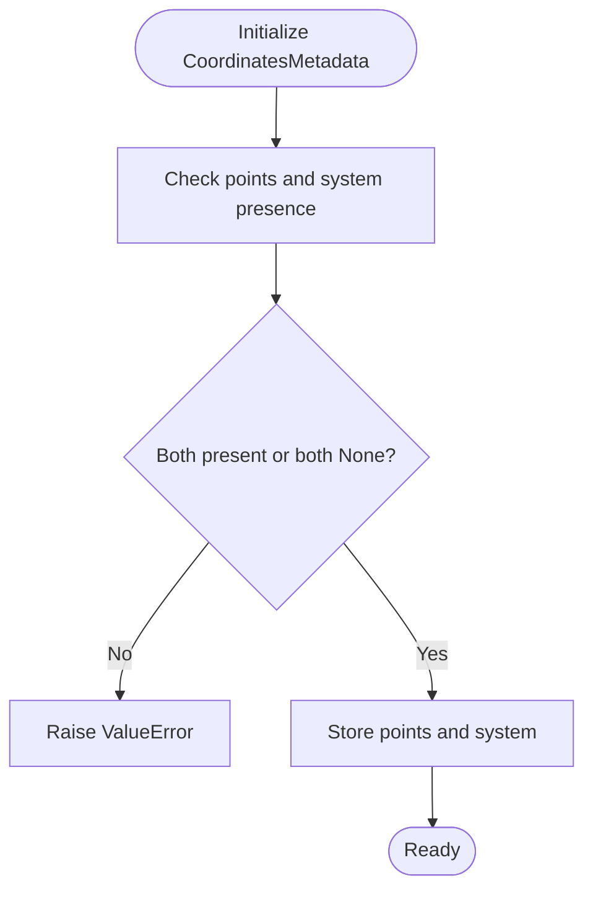
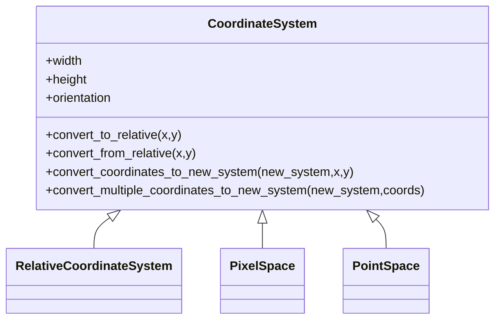
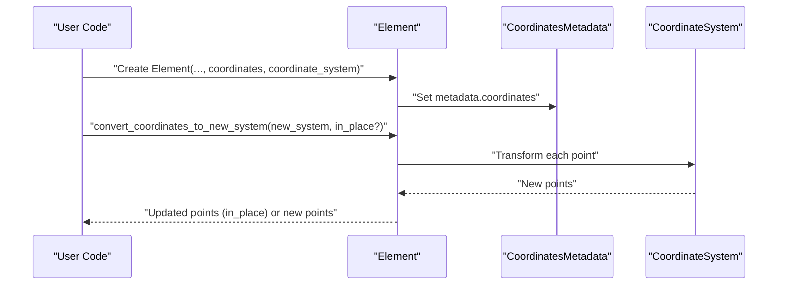
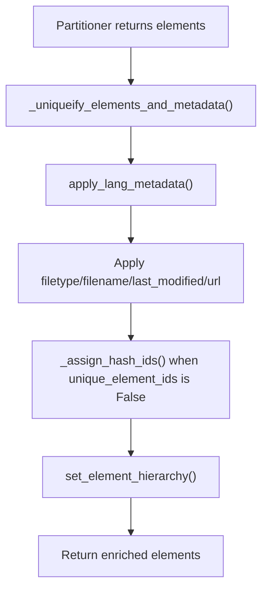
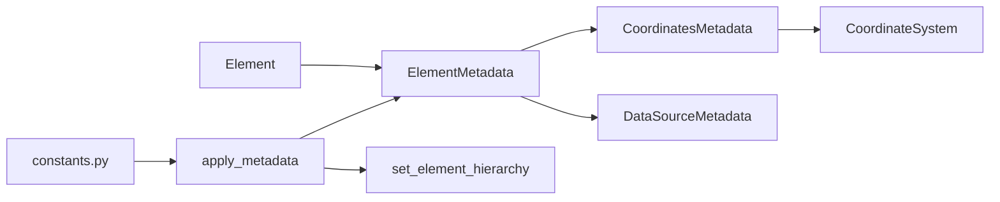

# Metadata and Coordinate Systems

<cite>
**Referenced Files in This Document**
- [elements.py](file://unstructured/documents/elements.py)
- [coordinates.py](file://unstructured/documents/coordinates.py)
- [metadata.py](file://unstructured/partition/common/metadata.py)
- [test_elements.py](file://test_unstructured/documents/test_elements.py)
- [test_coordinates.py](file://test_unstructured/documents/test_coordinates.py)
- [test_metadata.py](file://test_unstructured/partition/common/test_metadata.py)
- [constants.py](file://unstructured/partition/utils/constants.py)
</cite>

## Table of Contents
1. [Introduction](#introduction)
2. [Project Structure](#project-structure)
3. [Core Components](#core-components)
4. [Architecture Overview](#architecture-overview)
5. [Detailed Component Analysis](#detailed-component-analysis)
6. [Dependency Analysis](#dependency-analysis)
7. [Performance Considerations](#performance-considerations)
8. [Troubleshooting Guide](#troubleshooting-guide)
9. [Conclusion](#conclusion)

## Introduction
This document provides comprehensive data model documentation for metadata and coordinate systems in the repository. It focuses on:
- The ElementMetadata structure and its fields for file source, page numbers, coordinates, and language information
- The coordinate system implementation for spatial tracking of elements within documents
- DataSourceMetadata for tracking origin information
- Examples of how metadata is preserved across processing stages
- Data validation rules and business logic for metadata enrichment
- Performance considerations for storing and accessing coordinate data, especially in large documents

## Project Structure
The metadata and coordinate system functionality spans several modules:
- Documents layer: ElementMetadata, CoordinatesMetadata, and Element classes
- Coordinates layer: CoordinateSystem and related implementations
- Partition helpers: metadata enrichment and post-processing
- Tests: validation of metadata equality, serialization/deserialization, and coordinate conversions

**Diagram sources**
- [elements.py](file://unstructured/documents/elements.py#L149-L762)
- [coordinates.py](file://unstructured/documents/coordinates.py#L1-L114)
- [metadata.py](file://unstructured/partition/common/metadata.py#L119-L244)
- [test_elements.py](file://test_unstructured/documents/test_elements.py#L447-L666)
- [test_coordinates.py](file://test_unstructured/documents/test_coordinates.py#L1-L74)
- [test_metadata.py](file://test_unstructured/partition/common/test_metadata.py#L210-L460)

**Section sources**
- [elements.py](file://unstructured/documents/elements.py#L149-L762)
- [coordinates.py](file://unstructured/documents/coordinates.py#L1-L114)
- [metadata.py](file://unstructured/partition/common/metadata.py#L119-L244)
- [test_elements.py](file://test_unstructured/documents/test_elements.py#L447-L666)
- [test_coordinates.py](file://test_unstructured/documents/test_coordinates.py#L1-L74)
- [test_metadata.py](file://test_unstructured/partition/common/test_metadata.py#L210-L460)

## Core Components
- ElementMetadata: A dynamic metadata container with known fields for file source, page numbers, coordinates, languages, and more. It supports sparse serialization, equality comparison, and update semantics.
- CoordinatesMetadata: Encapsulates spatial geometry with a tuple of points and a coordinate system reference. It enforces that points and system are either both present or both absent.
- DataSourceMetadata: Captures origin information such as URL, version, record locator, and timestamps.
- Element: The document element that holds text and metadata. It provides conversion utilities for coordinates across systems.

Key responsibilities:
- Preserve and propagate metadata across processing stages
- Enforce validation rules for coordinate metadata
- Provide robust serialization/deserialization for metadata
- Support cross-system coordinate transformations

**Section sources**
- [elements.py](file://unstructured/documents/elements.py#L149-L762)
- [coordinates.py](file://unstructured/documents/coordinates.py#L1-L114)
- [metadata.py](file://unstructured/partition/common/metadata.py#L119-L244)

## Architecture Overview
The metadata and coordinate system architecture integrates:
- ElementMetadata and CoordinatesMetadata as first-class citizens of Element
- CoordinateSystem family for spatial transformations
- apply_metadata decorator to enrich metadata consistently across partitioners
- set_element_hierarchy to establish parent-child relationships among elements

**Diagram sources**
- [metadata.py](file://unstructured/partition/common/metadata.py#L119-L244)
- [elements.py](file://unstructured/documents/elements.py#L662-L762)

## Detailed Component Analysis

### ElementMetadata
ElementMetadata is a dynamic container with:
- Known fields for file source, page numbers, coordinates, languages, and more
- Sparse serialization to JSON-compatible dictionaries
- Equality semantics based on field snapshots
- Update semantics that merge fields from another instance
- Debug field gating controlled by environment configuration

Validation and business logic:
- Equality ignores debug fields and only compares populated fields
- Update merges known and ad-hoc fields; debug fields are excluded from updates
- Serialization excludes debug fields and empty containers
- Deserialization reconstructs sub-object types (coordinates, data_source) and handles special fields like orig_elements and key_value_pairs

Preservation across stages:
- Elements are deep-copied to prevent shared-state mutations
- Language metadata is applied per-element or globally depending on configuration
- Filetype, filename, last_modified, and url are applied based on arguments or decorator configuration
- Hash IDs are deterministically assigned when UUIDs are not desired

**Diagram sources**
- [elements.py](file://unstructured/documents/elements.py#L149-L418)

**Section sources**
- [elements.py](file://unstructured/documents/elements.py#L149-L418)
- [test_elements.py](file://test_unstructured/documents/test_elements.py#L447-L666)

### CoordinatesMetadata
CoordinatesMetadata encapsulates:
- points: a tuple of 2D points
- system: a CoordinateSystem reference

Validation rules:
- Points and system must coexist; a ValueError is raised if only one is provided
- Equality compares both points and system references

Serialization/deserialization:
- to_dict includes points, system class name, and layout dimensions
- from_dict reconstructs points and system using a type map and layout dimensions

**Diagram sources**
- [elements.py](file://unstructured/documents/elements.py#L55-L127)

**Section sources**
- [elements.py](file://unstructured/documents/elements.py#L55-L127)

### DataSourceMetadata
DataSourceMetadata captures origin information:
- url, version, record_locator, date_created, date_modified, date_processed, permissions_data
- Supports sparse serialization and reconstruction from dictionaries

Use cases:
- Track provenance for elements originating from external sources
- Enable downstream systems to attribute and audit element origins

**Section sources**
- [elements.py](file://unstructured/documents/elements.py#L30-L53)

### CoordinateSystem Family
CoordinateSystem defines a finite coordinate plane with width, height, and orientation. It provides:
- convert_to_relative: transform absolute coordinates to relative (0..1) coordinates
- convert_from_relative: transform relative coordinates to absolute coordinates
- convert_coordinates_to_new_system: convert a point between two systems
- convert_multiple_coordinates_to_new_system: batch conversion

Specializations:
- RelativeCoordinateSystem: width=1, height=1, orientation=CARTESIAN
- PixelSpace: orientation=SCREEN (origin top-left)
- PointSpace: orientation=CARTESIAN (origin bottom-left)

**Diagram sources**
- [coordinates.py](file://unstructured/documents/coordinates.py#L1-L114)

**Section sources**
- [coordinates.py](file://unstructured/documents/coordinates.py#L1-L114)
- [test_coordinates.py](file://test_unstructured/documents/test_coordinates.py#L1-L74)

### Element and Coordinate Conversion
Element integrates metadata and coordinates:
- Construction accepts coordinates and a coordinate system, assigning them to metadata
- Provides convert_coordinates_to_new_system to transform points in-place or return new points

**Diagram sources**
- [elements.py](file://unstructured/documents/elements.py#L662-L762)
- [coordinates.py](file://unstructured/documents/coordinates.py#L39-L114)

**Section sources**
- [elements.py](file://unstructured/documents/elements.py#L662-L762)
- [test_elements.py](file://test_unstructured/documents/test_elements.py#L122-L157)

### Metadata Enrichment and Validation
The apply_metadata decorator orchestrates enrichment:
- Ensures unique element and metadata instances
- Applies language metadata per-element or globally
- Sets filetype, filename, last_modified, and url based on arguments or decorator configuration
- Assigns hash IDs deterministically when UUIDs are not desired
- Establishes parent_id relationships using set_element_hierarchy

Validation rules:
- Unique elements and metadata instances to prevent shared-state mutations
- Deterministic hash IDs for reproducibility
- Parent-child hierarchy based on category and depth rules
- Environment-controlled debug metadata inclusion

**Diagram sources**
- [metadata.py](file://unstructured/partition/common/metadata.py#L119-L244)

**Section sources**
- [metadata.py](file://unstructured/partition/common/metadata.py#L119-L244)
- [test_metadata.py](file://test_unstructured/partition/common/test_metadata.py#L210-L460)

## Dependency Analysis
- ElementMetadata depends on CoordinatesMetadata and DataSourceMetadata for sub-object fields
- Element composes ElementMetadata and delegates coordinate conversion to CoordinatesMetadata
- CoordinatesMetadata depends on CoordinateSystem for system-specific conversions
- apply_metadata depends on language detection helpers and hierarchy assignment logic
- Constants influence debug metadata inclusion and language code mappings

**Diagram sources**
- [elements.py](file://unstructured/documents/elements.py#L149-L762)
- [coordinates.py](file://unstructured/documents/coordinates.py#L1-L114)
- [metadata.py](file://unstructured/partition/common/metadata.py#L119-L244)
- [constants.py](file://unstructured/partition/utils/constants.py#L44-L44)

**Section sources**
- [elements.py](file://unstructured/documents/elements.py#L149-L762)
- [coordinates.py](file://unstructured/documents/coordinates.py#L1-L114)
- [metadata.py](file://unstructured/partition/common/metadata.py#L119-L244)
- [constants.py](file://unstructured/partition/utils/constants.py#L44-L44)

## Performance Considerations
- Coordinate storage and conversions:
  - Points are tuples of floats; conversions are O(n) per element where n is the number of points
  - Batch conversion via convert_multiple_coordinates_to_new_system minimizes repeated overhead
  - Prefer RelativeCoordinateSystem for normalized storage and reduce precision loss during conversions
- Metadata serialization:
  - Sparse serialization avoids serializing None-valued fields and empty containers
  - Sub-object serialization (coordinates, data_source) adds minimal overhead
- Deterministic IDs:
  - Hash-based IDs are deterministic and stable across runs, reducing cache misses and enabling consistent indexing
- Large documents:
  - Group elements by page to minimize cross-page coordinate conversions
  - Reuse coordinate systems when possible to avoid redundant conversions
  - Consider caching coordinate transformations for frequently accessed layouts

[No sources needed since this section provides general guidance]

## Troubleshooting Guide
Common issues and resolutions:
- CoordinatesMetadata validation errors:
  - Symptom: ValueError when points and system are mismatched
  - Resolution: Ensure both points and system are provided together or both None
  - Reference: [elements.py](file://unstructured/documents/elements.py#L62-L69)
- Metadata equality mismatches:
  - Symptom: Equality differs due to debug fields or missing fields
  - Resolution: Use known_fields snapshot and avoid debug fields in comparisons
  - Reference: [elements.py](file://unstructured/documents/elements.py#L302-L327)
- Serialization anomalies:
  - Symptom: Unexpected fields in JSON output
  - Resolution: Confirm debug metadata inclusion and empty container filtering
  - Reference: [elements.py](file://unstructured/documents/elements.py#L386-L418)
- Coordinate conversion inconsistencies:
  - Symptom: Incorrect transformations between systems
  - Resolution: Verify orientation and layout dimensions; use tests as reference
  - References: [coordinates.py](file://unstructured/documents/coordinates.py#L39-L114), [test_coordinates.py](file://test_unstructured/documents/test_coordinates.py#L1-L74)
- Metadata enrichment not applied:
  - Symptom: Missing languages, filetype, filename, last_modified, or url
  - Resolution: Ensure decorator is applied and arguments are passed correctly
  - Reference: [metadata.py](file://unstructured/partition/common/metadata.py#L119-L244)

**Section sources**
- [elements.py](file://unstructured/documents/elements.py#L62-L69)
- [elements.py](file://unstructured/documents/elements.py#L302-L418)
- [coordinates.py](file://unstructured/documents/coordinates.py#L39-L114)
- [test_coordinates.py](file://test_unstructured/documents/test_coordinates.py#L1-L74)
- [metadata.py](file://unstructured/partition/common/metadata.py#L119-L244)

## Conclusion
The metadata and coordinate system design provides a robust foundation for spatially-aware document processing:
- ElementMetadata offers flexible, sparse, and safe metadata handling
- CoordinatesMetadata enforces strong validation for coordinate integrity
- DataSourceMetadata tracks provenance effectively
- apply_metadata ensures consistent enrichment across partitioners
- CoordinateSystem family enables reliable transformations across diverse document formats

Adhering to the validation rules and leveraging the provided utilities will help maintain correctness and performance, especially in large-scale document processing scenarios.