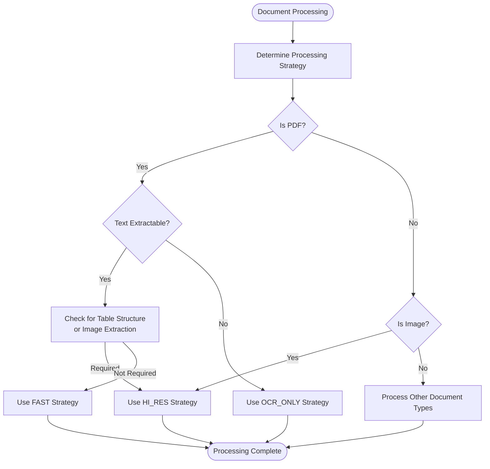
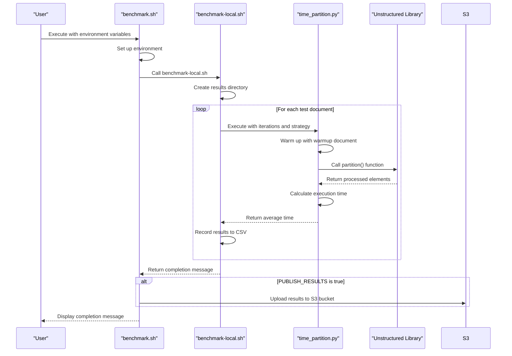
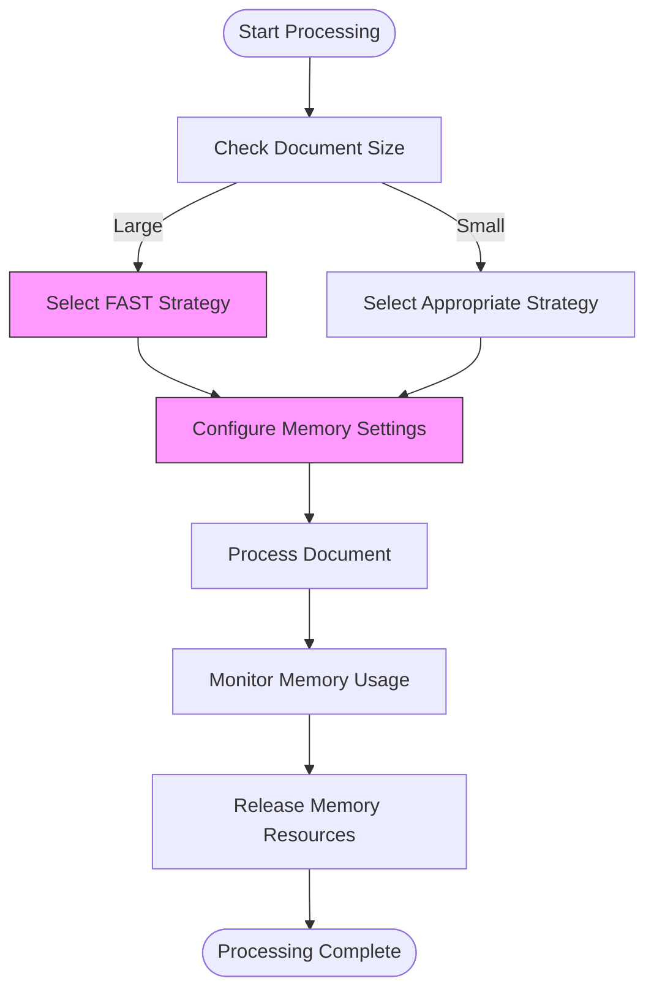
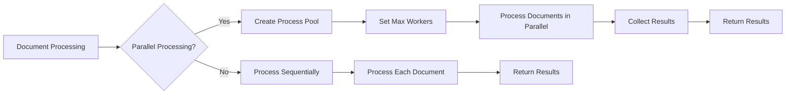
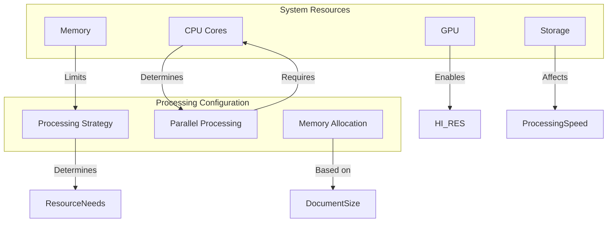
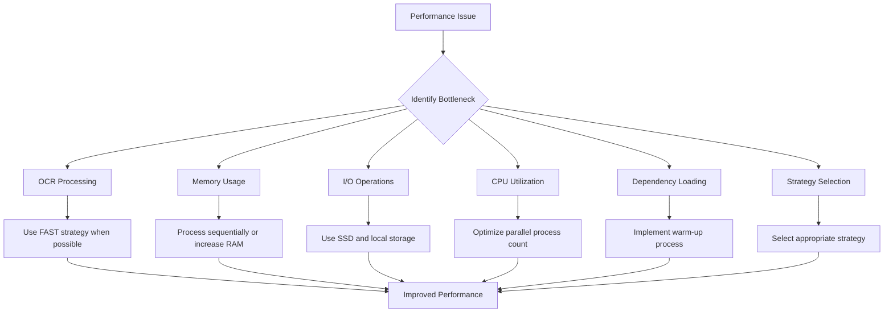

# Performance Optimization

<cite>
**Referenced Files in This Document**   
- [benchmark.sh](file://scripts/performance/benchmark.sh)
- [benchmark-local.sh](file://scripts/performance/benchmark-local.sh)
- [profile.sh](file://scripts/performance/profile.sh)
- [time_partition.py](file://scripts/performance/time_partition.py)
- [run_partition.py](file://scripts/performance/run_partition.py)
- [strategies.py](file://unstructured/partition/strategies.py)
- [auto.py](file://unstructured/partition/auto.py)
- [constants.py](file://unstructured/partition/utils/constants.py)
- [get-stats-name.sh](file://scripts/performance/get-stats-name.sh)
- [requirements.txt](file://scripts/performance/requirements.txt)
</cite>

## Table of Contents
1. [Introduction](#introduction)
2. [Processing Strategies and Performance Characteristics](#processing-strategies-and-performance-characteristics)
3. [Benchmarking Tools and Methodologies](#benchmarking-tools-and-methodologies)
4. [Memory Usage Optimization for Large Documents](#memory-usage-optimization-for-large-documents)
5. [Parallel Processing Options and Limitations](#parallel-processing-options-and-limitations)
6. [System Configuration and Resource Allocation](#system-configuration-and-resource-allocation)
7. [Common Performance Bottlenecks and Solutions](#common-performance-bottlenecks-and-solutions)
8. [Real-World Examples from Benchmarking Scripts](#real-world-examples-from-benchmarking-scripts)
9. [Conclusion](#conclusion)

## Introduction
This document provides comprehensive guidance on performance optimization for document processing in the Unstructured library. It covers various processing strategies, benchmarking methodologies, memory optimization techniques, parallel processing options, system configuration recommendations, and solutions to common performance bottlenecks. The document also includes real-world examples from benchmarking scripts to demonstrate performance improvements.

**Section sources**
- [benchmark.sh](file://scripts/performance/benchmark.sh)
- [profile.sh](file://scripts/performance/profile.sh)

## Processing Strategies and Performance Characteristics
The Unstructured library offers several processing strategies for document partitioning, each with distinct performance characteristics. These strategies are designed to balance processing speed, accuracy, and resource utilization based on the document type and processing requirements.

The available partitioning strategies are defined in the `PartitionStrategy` enum and include:

- **AUTO**: Automatically selects the most appropriate strategy based on document characteristics
- **FAST**: Extracts text directly from the document with minimal processing
- **OCR_ONLY**: Uses OCR to extract text from images or non-extractable PDFs
- **HI_RES**: Uses a layout detection model for detailed document structure analysis

The `determine_pdf_or_image_strategy` function in `strategies.py` implements the logic for selecting the appropriate strategy based on document properties such as whether the text is extractable, whether table structure inference is required, and whether image extraction is needed.

The **FAST** strategy is the most efficient for documents with extractable text, as it bypasses OCR processing and directly extracts text content. This strategy is ideal for documents where only text extraction is required and document structure preservation is not critical.

The **HI_RES** strategy provides the most comprehensive document analysis by using a layout detection model to identify document elements and their spatial relationships. While this strategy offers the highest accuracy in preserving document structure, it requires significantly more computational resources and processing time.

The **OCR_ONLY** strategy is used when text cannot be directly extracted from a document, such as scanned PDFs or image-based documents. This strategy uses OCR technology to recognize text in images, which is more computationally intensive than direct text extraction.

The **AUTO** strategy intelligently selects between FAST, OCR_ONLY, and HI_RES based on document characteristics. For PDFs, if the text is extractable, it uses FAST; otherwise, it falls back to OCR_ONLY. If table structure inference or image extraction is required, it automatically selects HI_RES.



**Diagram sources**
- [strategies.py](file://unstructured/partition/strategies.py#L24-L110)
- [auto.py](file://unstructured/partition/auto.py#L24-L44)

**Section sources**
- [strategies.py](file://unstructured/partition/strategies.py#L8-L110)
- [auto.py](file://unstructured/partition/auto.py#L40-L90)
- [constants.py](file://unstructured/partition/utils/constants.py#L17-L21)

## Benchmarking Tools and Methodologies
The Unstructured library provides comprehensive benchmarking tools in the `scripts/performance` directory to measure and track performance across different document types and processing configurations.

The primary benchmarking script, `benchmark.sh`, orchestrates the performance testing process by executing multiple iterations of document partitioning and recording execution times. The script supports various environment variables to customize the benchmarking process:

- **DOCKER_TEST**: Runs benchmarking inside a Docker container (default: false)
- **NUM_ITERATIONS**: Number of iterations for benchmarking (default: 3)
- **INSTANCE_TYPE**: Type of benchmark instance (e.g., "c5.xlarge")
- **PUBLISH_RESULTS**: Publishes results to an S3 bucket (default: false)

The benchmarking process follows a structured methodology:

1. **Test Document Selection**: The script processes all documents in the `scripts/performance/docs` directory, which includes various document types and sizes such as "book-war-and-peace-1225p.txt" and "example-10k-230p.html".

2. **Strategy Configuration**: The script automatically determines the appropriate processing strategy for each document. Documents listed in the `HI_RES_STRATEGY_FILES` array are processed using the HI_RES strategy, while others use the FAST strategy by default.

3. **Performance Measurement**: For each document, the script executes the partitioning process multiple times (controlled by NUM_ITERATIONS) and calculates the average execution time. Documents listed in the `SLOW_FILES` array are only processed once to avoid excessively long benchmarking times.

4. **Result Collection**: Performance results are saved to CSV files in the `scripts/performance/benchmark_results` directory with timestamps and system specifications in the filename.

5. **Optional Publishing**: When PUBLISH_RESULTS is set to true, the benchmark results are uploaded to an S3 bucket for long-term storage and comparison across different environments.

The `time_partition.py` script is used by the benchmarking system to measure execution time. It implements a warm-up process to ensure consistent measurements by first processing a warm-up document before measuring the actual document processing time. This approach helps eliminate cold-start effects and provides more accurate performance metrics.



**Diagram sources**
- [benchmark.sh](file://scripts/performance/benchmark.sh#L1-L68)
- [benchmark-local.sh](file://scripts/performance/benchmark-local.sh#L1-L43)
- [time_partition.py](file://scripts/performance/time_partition.py#L1-L39)

**Section sources**
- [benchmark.sh](file://scripts/performance/benchmark.sh#L1-L68)
- [benchmark-local.sh](file://scripts/performance/benchmark-local.sh#L1-L43)
- [time_partition.py](file://scripts/performance/time_partition.py#L1-L39)
- [README.md](file://scripts/performance/README.md#L1-L46)

## Memory Usage Optimization for Large Documents
Optimizing memory usage is critical when processing large documents, as the Unstructured library can consume significant memory resources during document partitioning. The following strategies can help minimize memory consumption:

### Processing Large Text Documents
For large text documents like "book-war-and-peace-1225p.txt", the FAST strategy is recommended as it avoids the memory overhead associated with OCR processing and layout analysis. The FAST strategy directly extracts text from the document without loading the entire document into memory at once.

### Configuring System Memory Settings
The `get-stats-name.sh` script demonstrates how to retrieve system memory information, which can be used to optimize memory allocation:

```bash
# Get memory information on Linux
mem=$(grep 'MemTotal' /proc/meminfo | awk '{printf "%.0fGB",$2/1024/1024}')

# Get memory information on macOS
mem=$(sysctl -n hw.memsize | awk '{printf "%.0fGB",$0/1024/1024/1024}')
```

This information can be used to set appropriate memory limits and configure the processing pipeline based on available system resources.

### Using Appropriate Processing Strategies
For large documents, avoid using the HI_RES strategy unless document structure preservation is essential. The HI_RES strategy loads the entire document and its layout model into memory, which can lead to excessive memory consumption for large documents.

### Processing in Chunks
When possible, process large documents in smaller chunks rather than loading the entire document at once. This approach reduces peak memory usage and allows for more efficient memory management.

### Garbage Collection
Ensure that Python's garbage collector is properly configured to release memory after processing each document. This is particularly important when processing multiple large documents in sequence.

The profiling tools in the performance directory can be used to monitor memory usage during document processing. The `profile.sh` script supports memory profiling with memray, which can generate detailed memory usage reports and identify memory bottlenecks.



**Diagram sources**
- [get-stats-name.sh](file://scripts/performance/get-stats-name.sh#L1-L22)
- [profile.sh](file://scripts/performance/profile.sh#L1-L366)

**Section sources**
- [get-stats-name.sh](file://scripts/performance/get-stats-name.sh#L1-L22)
- [profile.sh](file://scripts/performance/profile.sh#L1-L366)
- [strategies.py](file://unstructured/partition/strategies.py#L8-L110)

## Parallel Processing Options and Limitations
The Unstructured library supports parallel processing to improve performance when handling multiple documents. However, there are important considerations and limitations to be aware of when implementing parallel processing.

### Built-in Parallel Processing
The evaluation metrics system in the library includes built-in support for parallel processing. The `_default_executor` method in `evaluate.py` configures a pool of processors based on the available CPU cores:

```python
@classmethod
def _default_executor(cls):
    max_processors = int(os.environ.get("MAX_PROCESSES", os.cpu_count()))
    logger.info(f"Configuring a pool of {max_processors} processors for parallel processing.")
    return cls._get_executor_class()(max_workers=max_processors)
```

By default, the system uses `ProcessPoolExecutor` for parallel processing, which creates separate processes to handle document processing tasks. This approach is effective for CPU-intensive tasks like document partitioning.

### Limitations of Parallel Processing
Despite the benefits of parallel processing, there are several limitations to consider:

1. **Memory Overhead**: Each process in a `ProcessPoolExecutor` has its own memory space, which can lead to high memory consumption when processing large documents in parallel.

2. **Resource Contention**: When multiple processes access the same resources (e.g., disk I/O, network), performance gains from parallelism may be reduced due to resource contention.

3. **CPU Utilization**: The optimal number of parallel processes depends on the specific hardware and workload. Using too many processes can lead to context switching overhead and reduced performance.

4. **GPU Constraints**: When using GPU-accelerated processing (e.g., for HI_RES strategy), the number of parallel processes is limited by the number of available GPUs.

### Configuration Options
The number of parallel processes can be controlled through the `MAX_PROCESSES` environment variable. If not specified, the system defaults to the number of available CPU cores.

### Recommendations for Parallel Processing
- For CPU-intensive tasks like document partitioning, use `ProcessPoolExecutor` rather than `ThreadPoolExecutor`.
- Limit the number of parallel processes to avoid excessive memory consumption.
- Consider the document size and processing strategy when determining the optimal number of parallel processes.
- Monitor system resources during parallel processing to identify bottlenecks.



**Diagram sources**
- [evaluate.py](file://unstructured/metrics/evaluate.py#L151-L186)

**Section sources**
- [evaluate.py](file://unstructured/metrics/evaluate.py#L151-L186)
- [profile.sh](file://scripts/performance/profile.sh#L1-L366)

## System Configuration and Resource Allocation
Optimal system configuration and resource allocation are essential for achieving the best performance in document processing. The following recommendations provide guidance on configuring the system for different processing scenarios.

### CPU Configuration
The number of CPU cores significantly impacts processing performance, especially for parallel processing. The `get-stats-name.sh` script demonstrates how to detect the number of available CPU cores:

```bash
# On macOS
cpu=$(sysctl -n hw.logicalcpu_max)

# On Linux
cpu=$(getconf _NPROCESSORS_ONLN)
```

For optimal performance:
- Use machines with multiple CPU cores to enable effective parallel processing
- Allocate sufficient CPU resources based on the expected processing load
- Monitor CPU utilization during processing to identify bottlenecks

### Memory Configuration
Memory allocation should be based on the size and type of documents being processed:

- For FAST strategy processing: Allocate at least 2-4GB of RAM per processing instance
- For HI_RES strategy processing: Allocate at least 8-16GB of RAM per processing instance, especially for large documents
- For OCR processing: Allocate additional memory for OCR engine operations

### GPU Configuration
When using the HI_RES strategy with GPU acceleration:
- Ensure NVIDIA drivers are installed and accessible via `nvidia-smi`
- The `get-stats-name.sh` script detects GPU availability and counts:
```bash
gpu=$(nvidia-smi --query-gpu=name --format=csv,noheader | wc -l)
```
- Allocate sufficient GPU memory based on the document complexity and processing requirements

### Storage Configuration
- Use fast storage (SSD) for input documents and output results to minimize I/O bottlenecks
- Ensure sufficient disk space for temporary files, especially when processing large documents
- Consider using local storage rather than network storage for better I/O performance

### Environment Variables
The following environment variables can be used to optimize system configuration:

- **MAX_PROCESSES**: Controls the number of parallel processing workers
- **OCR_AGENT_MODULES_WHITELIST**: Restricts which OCR modules can be loaded
- **UNSTRUCTURED_INCLUDE_DEBUG_METADATA**: Controls whether debug metadata is included in output

### Docker Configuration
When running in Docker containers:
- Allocate appropriate CPU and memory resources to the container
- Mount the performance scripts directory to access test documents and results
- Ensure GPU access is properly configured if using GPU acceleration



**Diagram sources**
- [get-stats-name.sh](file://scripts/performance/get-stats-name.sh#L1-L22)
- [benchmark.sh](file://scripts/performance/benchmark.sh#L1-L68)

**Section sources**
- [get-stats-name.sh](file://scripts/performance/get-stats-name.sh#L1-L22)
- [benchmark.sh](file://scripts/performance/benchmark.sh#L1-L68)
- [requirements.txt](file://scripts/performance/requirements.txt#L1-L5)

## Common Performance Bottlenecks and Solutions
Several common performance bottlenecks can occur during document processing in the Unstructured library. Understanding these bottlenecks and their solutions is crucial for optimizing processing performance.

### OCR Processing Bottlenecks
**Bottleneck**: OCR processing (OCR_ONLY and HI_RES strategies) is computationally intensive and can significantly slow down document processing.

**Solutions**:
- Use the FAST strategy for documents with extractable text
- Pre-process documents to determine if OCR is necessary
- Use GPU acceleration when available
- Limit the number of documents processed with OCR in parallel

### Memory Exhaustion
**Bottleneck**: Processing large documents, especially with the HI_RES strategy, can lead to memory exhaustion.

**Solutions**:
- Process large documents sequentially rather than in parallel
- Use the FAST strategy for large text documents
- Increase system memory or use machines with more RAM
- Implement document chunking for very large documents

### I/O Bottlenecks
**Bottleneck**: Slow disk I/O can limit processing speed, especially when dealing with many small documents or large documents.

**Solutions**:
- Use SSD storage for input and output directories
- Minimize file system operations during processing
- Use local storage rather than network storage
- Batch document processing to reduce I/O overhead

### CPU Utilization
**Bottleneck**: Inefficient CPU utilization can occur when the number of parallel processes is not optimally configured.

**Solutions**:
- Configure the number of parallel processes based on available CPU cores
- Monitor CPU usage and adjust parallelism accordingly
- Use process-based parallelism (ProcessPoolExecutor) for CPU-intensive tasks
- Avoid creating too many parallel processes, which can lead to context switching overhead

### Dependency Loading
**Bottleneck**: Loading dependencies for different document types can add overhead, especially when processing a variety of document types.

**Solutions**:
- Use the warm-up process implemented in `time_partition.py` to load dependencies before processing
- Group documents by type to minimize dependency switching
- Pre-load commonly used dependencies

### Strategy Selection
**Bottleneck**: Inappropriate strategy selection can lead to suboptimal performance.

**Solutions**:
- Use the AUTO strategy for automatic selection based on document characteristics
- Manually select the FAST strategy for documents with extractable text
- Reserve HI_RES strategy for documents requiring detailed structure analysis
- Avoid using OCR-based strategies for documents with extractable text



**Diagram sources**
- [time_partition.py](file://scripts/performance/time_partition.py#L8-L16)
- [strategies.py](file://unstructured/partition/strategies.py#L8-L110)

**Section sources**
- [time_partition.py](file://scripts/performance/time_partition.py#L8-L16)
- [strategies.py](file://unstructured/partition/strategies.py#L8-L110)
- [profile.sh](file://scripts/performance/profile.sh#L1-L366)

## Real-World Examples from Benchmarking Scripts
The benchmarking scripts in the Unstructured library provide real-world examples of performance optimization and measurement. These examples demonstrate how different processing strategies and system configurations affect performance.

### Example 1: Strategy Comparison
The `benchmark-local.sh` script demonstrates how different processing strategies impact performance. For documents not in the `HI_RES_STRATEGY_FILES` array, the script uses the FAST strategy, while documents in this array use the HI_RES strategy.

This approach allows for direct comparison of processing times between strategies. For example, a simple text document processed with the FAST strategy might take 0.5 seconds, while the same document processed with the HI_RES strategy might take 5 seconds due to the additional layout analysis.

### Example 2: Iteration Count Configuration
The benchmarking system uses different iteration counts for different document types. Regular documents are processed multiple times (controlled by NUM_ITERATIONS, default 3), while documents in the `SLOW_FILES` array are processed only once.

This optimization prevents excessively long benchmarking times for documents that are known to be slow to process, such as large PDFs with complex layouts.

### Example 3: System Specification Tracking
The `get-stats-name.sh` script automatically detects and includes system specifications in benchmark results. This information includes:
- Number of CPU cores
- Number of GPUs
- Amount of memory

By including this information in the results filename, the benchmarking system enables meaningful comparison of performance across different hardware configurations.

### Example 4: Warm-up Process
The `time_partition.py` script implements a warm-up process that helps eliminate cold-start effects in performance measurements:

```python
def warm_up_process(filename):
    warmup_dir = os.path.join(os.path.dirname(__file__), "warmup-docs")
    warmup_file = os.path.join(warmup_dir, f"warmup{os.path.splitext(filename)[1]}")
    
    if os.path.exists(warmup_file):
        partition(warmup_file, strategy="fast")
    else:
        partition(filename, strategy="fast")
```

This warm-up process ensures that dependencies are loaded and caches are populated before measuring the actual processing time, resulting in more consistent and accurate performance metrics.

### Example 5: Result Management
The benchmarking system saves results to CSV files with descriptive filenames that include:
- Timestamp
- Instance type
- System specifications
- Git hash

This comprehensive naming convention enables easy tracking of performance changes over time and across different environments.


**Diagram sources**
- [benchmark-local.sh](file://scripts/performance/benchmark-local.sh#L1-L43)
- [time_partition.py](file://scripts/performance/time_partition.py#L8-L16)
- [get-stats-name.sh](file://scripts/performance/get-stats-name.sh#L1-L22)

**Section sources**
- [benchmark-local.sh](file://scripts/performance/benchmark-local.sh#L1-L43)
- [time_partition.py](file://scripts/performance/time_partition.py#L8-L16)
- [get-stats-name.sh](file://scripts/performance/get-stats-name.sh#L1-L22)
- [benchmark.sh](file://scripts/performance/benchmark.sh#L1-L68)

## Conclusion
This document has provided comprehensive guidance on performance optimization for document processing in the Unstructured library. By understanding the different processing strategies, benchmarking methodologies, memory optimization techniques, parallel processing options, and system configuration requirements, users can significantly improve the efficiency and effectiveness of their document processing workflows.

The key takeaways include:
- Selecting the appropriate processing strategy (FAST, HI_RES, OCR_ONLY, or AUTO) based on document characteristics and processing requirements
- Using the provided benchmarking tools to measure and track performance across different configurations
- Optimizing memory usage, especially when processing large documents
- Implementing parallel processing effectively while being aware of its limitations
- Configuring system resources appropriately for the expected processing load
- Identifying and addressing common performance bottlenecks

By applying these principles and leveraging the tools provided in the `scripts/performance` directory, users can achieve optimal performance in their document processing tasks.

**Section sources**
- [benchmark.sh](file://scripts/performance/benchmark.sh#L1-L68)
- [profile.sh](file://scripts/performance/profile.sh#L1-L366)
- [strategies.py](file://unstructured/partition/strategies.py#L8-L110)