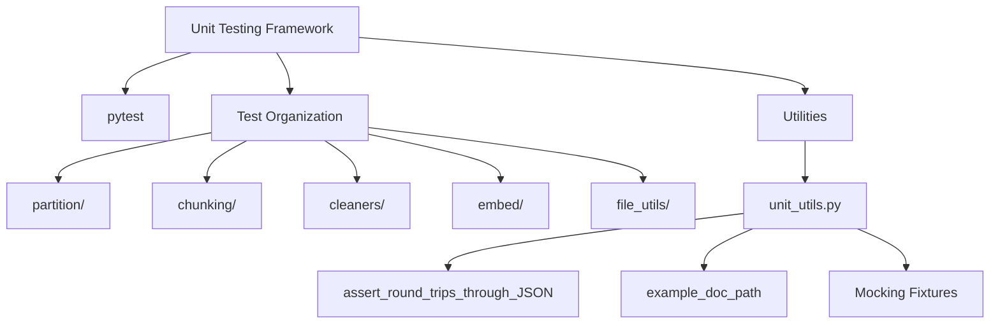
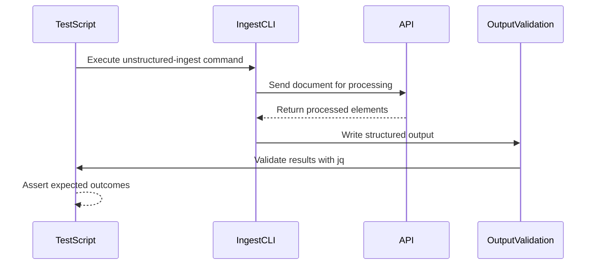
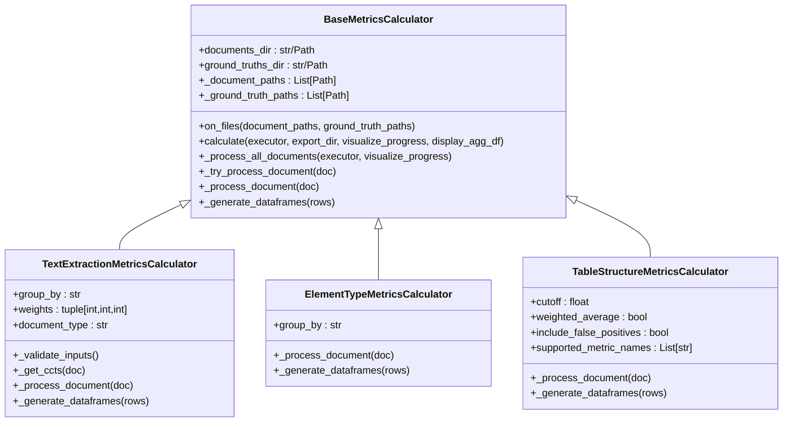
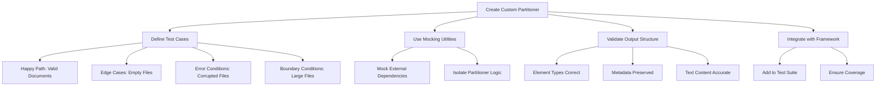
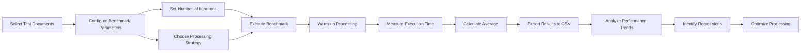

# Testing and Validation

<cite>
**Referenced Files in This Document**   
- [unit_utils.py](file://test_unstructured/unit_utils.py)
- [evaluate.py](file://unstructured/metrics/evaluate.py)
- [test_evaluate.py](file://test_unstructured/metrics/test_evaluate.py)
- [test_utils.py](file://test_unstructured/test_utils.py)
- [conftest.py](file://test_unstructured/partition/conftest.py)
- [benchmark-local.sh](file://scripts/performance/benchmark-local.sh)
- [time_partition.py](file://scripts/performance/time_partition.py)
- [against-api.sh](file://test_unstructured_ingest/src/against-api.sh)
- [evaluation-metrics.sh](file://test_unstructured_ingest/evaluation-metrics.sh)
- [example-docs](file://example-docs)
</cite>

## Table of Contents
1. [Introduction](#introduction)
2. [Unit Test Structure and Coverage](#unit-test-structure-and-coverage)
3. [Integration Test Framework](#integration-test-framework)
4. [Evaluation Metrics System](#evaluation-metrics-system)
5. [Writing Tests for Custom Partitioners or Extensions](#writing-tests-for-custom-partitioners-or-extensions)
6. [Test Data Management](#test-data-management)
7. [Troubleshooting Test Failures](#troubleshooting-test-failures)
8. [Performance Benchmarking and Quality Assurance](#performance-benchmarking-and-quality-assurance)

## Introduction
The unstructured library employs a comprehensive testing and validation framework to ensure high-quality document processing across various file formats. This documentation provides an in-depth analysis of the testing infrastructure, covering unit tests, integration tests, evaluation metrics, test data management, and performance benchmarking. The framework is designed to validate core components, assess processing quality, and support the development of custom extensions while maintaining rigorous quality assurance standards.

## Unit Test Structure and Coverage

The unstructured library implements a robust unit testing framework using pytest, with comprehensive coverage of core components. The test suite is organized by functional areas within the `test_unstructured` directory, with dedicated test modules for partitioning, chunking, cleaning, embedding, and other key functionalities.

The unit testing framework provides extensive utilities in `unit_utils.py` that simplify test creation and maintenance. These utilities include functions for asserting JSON round-tripping, assigning hash IDs to elements, resolving paths to example documents, and various mocking fixtures that enable isolated component testing. The mocking utilities support class, function, method, property, and initializer mocking, allowing for comprehensive unit testing without external dependencies.

Core components are tested at the module level, with each partitioner (e.g., PDF, DOCX, HTML) having dedicated test files that validate parsing accuracy, metadata extraction, and element identification. The test coverage extends to edge cases, error handling, and boundary conditions to ensure robustness across diverse document types and structures.

**Diagram sources**
- [unit_utils.py](file://test_unstructured/unit_utils.py#L1-L264)

**Section sources**
- [unit_utils.py](file://test_unstructured/unit_utils.py#L1-L264)
- [test_utils.py](file://test_unstructured/test_utils.py#L1-L334)

## Integration Test Framework

The integration test framework validates end-to-end processing workflows, ensuring that components work together as expected when handling real documents. The framework is implemented through shell scripts in the `test_unstructured_ingest/src/` directory, with `against-api.sh` serving as a representative example of the integration testing approach.

Integration tests validate the complete ingestion pipeline, from document input through partitioning, metadata extraction, and output generation. The tests verify that partition arguments are correctly passed to the API, that metadata is properly excluded or included based on configuration, and that chunking strategies are applied as expected. The framework also validates specialized processing features like table structure inference in PDFs.

The integration tests are designed to be executed against the actual API endpoint when credentials are available, with graceful skipping when the UNS_API_KEY environment variable is not set. This approach enables continuous validation of the production interface while accommodating development environments where API access may not be available.

**Diagram sources**
- [against-api.sh](file://test_unstructured_ingest/src/against-api.sh#L1-L53)

**Section sources**
- [against-api.sh](file://test_unstructured_ingest/src/against-api.sh#L1-L53)

## Evaluation Metrics System

The evaluation metrics system provides quantitative assessment of processing quality across multiple dimensions, including text extraction accuracy, element type classification, and table structure preservation. The system is implemented in `unstructured/metrics/evaluate.py` and consists of specialized metrics calculators that inherit from a common `BaseMetricsCalculator` class.

The metrics system includes three primary calculators:
- `TextExtractionMetricsCalculator`: Measures text accuracy and percent missing text using Levenshtein distance
- `ElementTypeMetricsCalculator`: Evaluates element type frequency accuracy between processed output and ground truth
- `TableStructureMetricsCalculator`: Assesses table detection recall, precision, F1 score, and structural accuracy

Each calculator processes documents in parallel using Python's concurrent.futures module, with configurable executor types (thread or process pools). The system generates both per-document metrics and aggregated results, with options for grouping by document type or connector source. Results are exported in TSV format for easy analysis and comparison.

**Diagram sources**
- [evaluate.py](file://unstructured/metrics/evaluate.py#L64-L800)

**Section sources**
- [evaluate.py](file://unstructured/metrics/evaluate.py#L64-L800)
- [test_evaluate.py](file://test_unstructured/metrics/test_evaluate.py#L1-L200)

## Writing Tests for Custom Partitioners or Extensions

When developing custom partitioners or extensions for the unstructured library, developers should follow the established testing patterns to ensure compatibility and reliability. The framework provides several utilities and fixtures that simplify the creation of comprehensive tests for new components.

Key considerations for writing tests for custom partitioners include:
1. Using the mocking utilities from `unit_utils.py` to isolate the partitioner from external dependencies
2. Creating test fixtures that validate both successful processing and appropriate error handling
3. Testing with a variety of document types and edge cases to ensure robustness
4. Validating that metadata is correctly extracted and preserved
5. Ensuring that the partitioner's output conforms to the expected element structure

The `conftest.py` file in the partition module demonstrates how to create fixtures for mocking external services like OCR agents. This approach allows testing the partitioner's logic without requiring actual OCR processing, significantly improving test speed and reliability.

**Diagram sources**
- [conftest.py](file://test_unstructured/partition/conftest.py#L1-L19)

**Section sources**
- [conftest.py](file://test_unstructured/partition/conftest.py#L1-L19)
- [unit_utils.py](file://test_unstructured/unit_utils.py#L1-L264)

## Test Data Management

The unstructured library employs a systematic approach to test data management, using example documents stored in the `example-docs` directory as the primary test corpus. This directory contains a diverse collection of documents in various formats, including PDF, DOCX, HTML, CSV, and others, representing real-world use cases and edge cases.

The test data is organized to support different testing scenarios:
- Basic functionality testing with simple documents
- Complex structure testing with documents containing tables, images, and mixed content
- Language-specific testing with multilingual documents
- Edge case testing with malformed or incomplete files

The framework also includes gold standard outputs in the `test_unstructured_ingest/expected-structured-output` directory, which serve as reference results for validation. These expected outputs are used in integration tests to verify that processing results match the expected structure and content.

For evaluation metrics, the system uses specialized test data in the `example-docs/test_evaluate_files` directory, which contains both unstructured output and gold standard references for text extraction, element type classification, and table structure assessment.

**Section sources**
- [example-docs](file://example-docs)
- [test_unstructured_ingest/expected-structured-output](file://test_unstructured_ingest/expected-structured-output)

## Troubleshooting Test Failures

When encountering test failures in the unstructured library, developers should follow a systematic troubleshooting approach:

1. **Examine the failure context**: Determine whether the failure occurs in unit tests, integration tests, or evaluation metrics, as the diagnostic approach differs for each.

2. **Check dependencies**: Verify that all required dependencies are installed and accessible, particularly for tests involving external services like OCR or API endpoints.

3. **Review test data**: Ensure that the test documents and expected outputs are correctly formatted and accessible. The `example_doc_path` utility can help verify document locations.

4. **Analyze error messages**: Pay close attention to stack traces and error messages, which often indicate the specific component or assertion that failed.

5. **Use debugging utilities**: Leverage the mocking and logging utilities provided by the framework to isolate and diagnose issues.

6. **Validate environment**: Ensure that environment variables (like UNS_API_KEY) are properly set when required for integration tests.

Common issues include:
- Missing test documents or incorrect paths
- Version incompatibilities between dependencies
- API authentication failures
- Changes in document structure that affect parsing
- Resource limitations (memory, processing power) for large documents

The framework's modular design allows for targeted testing of specific components, making it easier to isolate and resolve issues.

**Section sources**
- [test_utils.py](file://test_unstructured/test_utils.py#L1-L334)
- [unit_utils.py](file://test_unstructured/unit_utils.py#L1-L264)

## Performance Benchmarking and Quality Assurance

The unstructured library includes a comprehensive performance benchmarking framework to ensure processing efficiency and quality. The benchmarking system is implemented in the `scripts/performance/` directory, with `benchmark-local.sh` and `time_partition.py` providing the core functionality.

The benchmarking process measures execution time for document processing across multiple iterations, with different strategies (fast, hi_res) and document types. The framework includes warm-up processing to account for initialization overhead and provides average execution times that can be compared across different environments and configurations.

Key quality assurance practices include:
- Automated testing across the full test corpus
- Continuous integration with regular test execution
- Performance regression detection through benchmark comparisons
- Code coverage analysis to identify untested areas
- Static analysis and linting to maintain code quality

The benchmarking results are exported in CSV format for analysis and tracking over time, enabling the team to monitor performance trends and identify potential regressions.

**Diagram sources**
- [benchmark-local.sh](file://scripts/performance/benchmark-local.sh#L1-L43)
- [time_partition.py](file://scripts/performance/time_partition.py#L1-L39)

**Section sources**
- [benchmark-local.sh](file://scripts/performance/benchmark-local.sh#L1-L43)
- [time_partition.py](file://scripts/performance/time_partition.py#L1-L39)