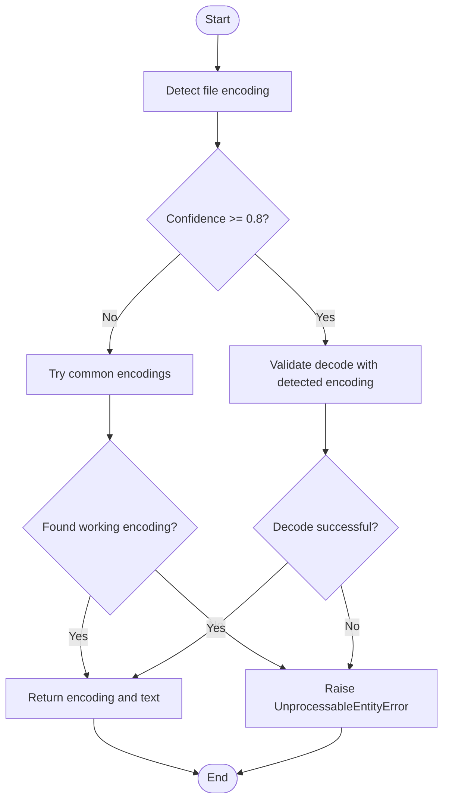
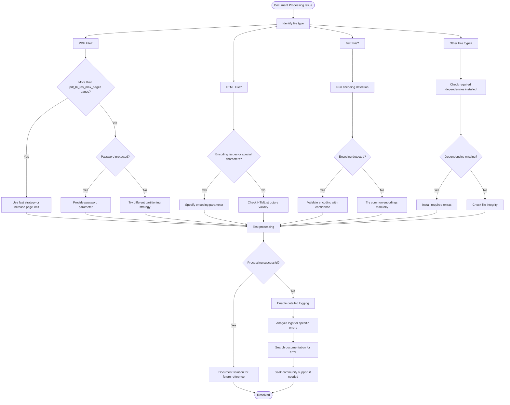

# Troubleshooting

<cite>
**Referenced Files in This Document**   
- [setup.py](file://setup.py)
- [requirements/base.txt](file://requirements/base.txt)
- [requirements/dev.txt](file://requirements/dev.txt)
- [unstructured/errors.py](file://unstructured/errors.py)
- [unstructured/logger.py](file://unstructured/logger.py)
- [unstructured/partition/auto.py](file://unstructured/partition/auto.py)
- [unstructured/partition/pdf.py](file://unstructured/partition/pdf.py)
- [unstructured/file_utils/encoding.py](file://unstructured/file_utils/encoding.py)
- [example-docs/fake-html.html](file://example-docs/fake-html.html)
- [example-docs/fake-html-cp1252.html](file://example-docs/fake-html-cp1252.html)
- [example-docs/umlauts-non-utf8.md](file://example-docs/umlauts-non-utf8.md)
- [test_unstructured/file_utils/test_encoding.py](file://test_unstructured/file_utils/test_encoding.py)
</cite>

## Table of Contents
1. [Introduction](#introduction)
2. [Common Error Messages and Root Causes](#common-error-messages-and-root-causes)
3. [File Type-Specific Issues](#file-type-specific-issues)
4. [Installation and Dependency Problems](#installation-and-dependency-problems)
5. [Performance and Memory Errors](#performance-and-memory-errors)
6. [Diagnostic Techniques for Processing Failures](#diagnostic-techniques-for-processing-failures)
7. [Encoding and Language Challenges](#encoding-and-language-challenges)
8. [Decision Tree for Systematic Problem Solving](#decision-tree-for-systematic-problem-solving)
9. [Conclusion](#conclusion)

## Introduction
This troubleshooting guide provides comprehensive solutions for common issues encountered when using the unstructured library. The guide covers error messages, file type-specific problems, installation challenges, performance issues, encoding difficulties, and diagnostic techniques. It also includes a decision tree for systematic problem solving to help users quickly identify and resolve issues.

**Section sources**
- [unstructured/logger.py](file://unstructured/logger.py#L1-L25)

## Common Error Messages and Root Causes

### PageCountExceededError
This error occurs when the number of pages in a PDF document exceeds the maximum allowed limit for high-resolution processing.

```python
class PageCountExceededError(ValueError):
    """Error raised, when number of pages exceeds pdf_hi_res_max_pages limit."""

    def __init__(self, document_pages: int, pdf_hi_res_max_pages: int):
        self.document_pages = document_pages
        self.pdf_hi_res_max_pages = pdf_hi_res_max_pages
        self.message = (
            f"Maximum number of PDF file pages exceeded - "
            f"pages={document_pages}, maximum={pdf_hi_res_max_pages}."
        )
        super().__init__(self.message)
```

**Root Cause**: The document has more pages than the configured `pdf_hi_res_max_pages` limit.

**Solution**: Either reduce the number of pages in the document or increase the `pdf_hi_res_max_pages` parameter.

### UnprocessableEntityError
This error is raised when a file cannot be processed due to invalid format or encoding issues.

```python
class UnprocessableEntityError(Exception):
    """Error raised when a file is not valid."""
```

**Root Cause**: The file may be corrupted, in an unsupported format, or have encoding issues that prevent proper processing.

**Solution**: Verify the file integrity, check if the file format is supported, and ensure proper encoding.

### ImportError for Missing Dependencies
When attempting to process certain file types, you may encounter import errors if required dependencies are not installed.

```python
raise ImportError(
    f"{file_type.partitioner_function_name}() is not available because one or"
    f" more dependencies are not installed. Use:"
    f' pip install "unstructured[{file_type.extra_name}]" (including quotes)'
    f" to install the required dependencies",
)
```

**Root Cause**: The required extra dependencies for processing specific file types are not installed.

**Solution**: Install the required dependencies using the suggested pip command with the appropriate extra name.

**Section sources**
- [unstructured/errors.py](file://unstructured/errors.py#L1-L16)
- [unstructured/partition/auto.py](file://unstructured/partition/auto.py#L373-L378)

## File Type-Specific Issues

### Corrupted PDFs
PDF files may be corrupted or have extraction issues that prevent proper processing.

**Symptoms**:
- PDF text extraction fails
- Empty or incomplete element extraction
- Page count detection issues

**Root Causes**:
- Password-protected PDFs without proper password parameter
- Corrupted file structure
- Text extraction limitations in certain PDFs

**Solutions**:
1. Use the `password` parameter when processing password-protected PDFs
2. Try different partitioning strategies (hi_res, ocr_only, fast)
3. Check if the PDF can be opened in standard PDF viewers

### Malformed HTML
HTML files with encoding issues or malformed structure can cause processing problems.

**Examples from test files**:
- `fake-html-cp1252.html` contains CP1252-encoded characters
- `umlauts-non-utf8.md` contains non-UTF8 encoded umlauts

**Root Causes**:
- Incorrect character encoding
- Missing DOCTYPE declarations
- Improperly nested tags

**Solutions**:
1. Specify the correct encoding using the `encoding` parameter
2. Use encoding detection to automatically determine the correct encoding
3. Pre-process HTML files to fix structural issues

### Language-Specific HTML Documents
HTML documents with specific language attributes may require special handling.

**Example**:
```html
<h3 class="l_titel">Jahresabschluss zum Geschäftsjahr vom 01.01.2020 bis zum 31.12.2020</h3>
```

**Issue**: German text with umlauts and special characters.

**Solution**: Ensure proper encoding detection and specify language parameters when processing.

**Section sources**
- [example-docs/fake-html.html](file://example-docs/fake-html.html#L1-L36)
- [example-docs/fake-html-cp1252.html](file://example-docs/fake-html-cp1252.html#L1-L20)
- [example-docs/fake-html-lang-de.html](file://example-docs/fake-html-lang-de.html#L1-L1)
- [example-docs/umlauts-non-utf8.md](file://example-docs/umlauts-non-utf8.md#L1-L6)

## Installation and Dependency Problems

### Missing Extra Dependencies
The unstructured library uses a modular dependency system where certain file type support requires additional packages.

**Root Cause**: The base installation only includes core dependencies, while file type-specific functionality requires extra packages.

**Dependency Structure**:
- Base requirements in `requirements/base.txt`
- Extra requirements for specific file types (csv, docx, pdf, etc.)
- Development requirements in `requirements/dev.txt`

**Solutions**:
1. Install specific extras: `pip install "unstructured[csv,docx,pdf]"`
2. Install all document type support: `pip install "unstructured[all-docs]"`
3. Check the setup.py file for available extra options

### Platform-Specific Installation Issues
Different platforms may have specific requirements or limitations.

**Windows Considerations**:
- Ensure Python 3.10+ is installed
- Install Microsoft Visual C++ Build Tools if compiling from source
- Handle path separators correctly in file operations

**Linux/Mac Considerations**:
- Install system dependencies for PDF and image processing
- Ensure proper permissions for temporary file creation
- Handle case-sensitive file systems appropriately

**Section sources**
- [setup.py](file://setup.py#L28-L130)
- [requirements/base.txt](file://requirements/base.txt#L1-L155)
- [requirements/dev.txt](file://requirements/dev.txt#L1-L61)

## Performance and Memory Errors

### Large Document Processing
Processing large documents can lead to memory exhaustion or long processing times.

**Symptoms**:
- High memory usage
- Long processing times
- Out-of-memory errors

**Solutions**:
1. Use appropriate partitioning strategies:
   - `fast` strategy for text-extractable PDFs
   - `ocr_only` for image-based documents
   - `hi_res` for complex layout analysis
2. Process documents in chunks rather than all at once
3. Monitor memory usage and adjust processing parameters accordingly

### PDF Page Limit Exceeded
The library has a default limit on the number of pages that can be processed with high-resolution analysis.

**Error Message**:
```
Maximum number of PDF file pages exceeded - pages={document_pages}, maximum={pdf_hi_res_max_pages}.
```

**Solution**:
- Increase the `pdf_hi_res_max_pages` parameter
- Use the `fast` strategy for large documents
- Split large PDFs into smaller files before processing

**Section sources**
- [unstructured/partition/pdf.py](file://unstructured/partition/pdf.py#L572-L584)

## Diagnostic Techniques for Processing Failures

### Logging and Debugging
The unstructured library provides comprehensive logging capabilities to help diagnose issues.

**Logger Configuration**:
```python
logger = logging.getLogger("unstructured")
trace_logger = logging.getLogger("unstructured.trace")
```

**Diagnostic Steps**:
1. Enable detailed logging to capture processing steps
2. Check for warning messages that indicate potential issues
3. Use the trace logger for detailed operation tracking

### Encoding Detection and Validation
Proper encoding detection is crucial for processing text files correctly.

**Encoding Detection Process**:
1. Use charset_normalizer to detect encoding with confidence score
2. If confidence is below threshold (0.8), try common encodings
3. Validate encoding by attempting to decode the file

**Validation Functions**:
- `detect_file_encoding()`: Detects file encoding with fallback mechanism
- `validate_encoding()`: Checks if an encoding string is valid
- `read_txt_file()`: Reads text files with proper encoding handling

**Error Handling**:
- Uses `UnprocessableEntityError` instead of `UnicodeDecodeError` to avoid logging entire file content
- Prevents memory bloat by not storing large file data in exception objects



**Diagram sources**
- [unstructured/file_utils/encoding.py](file://unstructured/file_utils/encoding.py#L62-L115)

**Section sources**
- [unstructured/file_utils/encoding.py](file://unstructured/file_utils/encoding.py#L1-L151)
- [test_unstructured/file_utils/test_encoding.py](file://test_unstructured/file_utils/test_encoding.py#L1-L72)

## Encoding and Language Challenges

### Character Encoding Issues
Different character encodings can cause text processing problems.

**Common Encodings**:
- UTF-8 (most common)
- ISO-8859-1 (Latin-1)
- CP1252 (Windows Western)
- Shift-JIS (Japanese)
- GB18030 (Chinese)

**Handling Special Characters**:
- German umlauts (ä, ö, ü)
- French accents (é, è, ê)
- Spanish tildes (ñ)
- Currency symbols (€, £, ¥)

### Language Detection and Processing
The library supports multiple languages but requires proper configuration.

**Language Parameters**:
- `languages`: List of languages present in the document
- `detect_language_per_element`: Detect language for each element separately
- `ocr_languages`: Languages for OCR processing

**Requirements**:
- Install appropriate Tesseract language packs for OCR
- Use `langdetect` for automatic language detection
- Specify languages explicitly when processing multilingual documents

**Section sources**
- [unstructured/file_utils/encoding.py](file://unstructured/file_utils/encoding.py#L11-L32)
- [unstructured/partition/auto.py](file://unstructured/partition/auto.py#L94-L98)

## Decision Tree for Systematic Problem Solving



**Diagram sources**
- [unstructured/partition/auto.py](file://unstructured/partition/auto.py#L30-L139)
- [unstructured/partition/pdf.py](file://unstructured/partition/pdf.py#L126-L150)
- [unstructured/file_utils/encoding.py](file://unstructured/file_utils/encoding.py#L62-L115)

## Conclusion
This troubleshooting guide provides comprehensive solutions for common issues with the unstructured library. By understanding the error messages, file type-specific challenges, installation requirements, performance considerations, and diagnostic techniques, users can effectively resolve processing issues. The decision tree offers a systematic approach to problem solving, helping users quickly identify and address problems. Remember to consult the logging output for detailed information about processing failures and to verify that all required dependencies are properly installed for your specific use case.